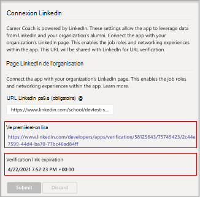

# Acheter, configurer et activer des Conseiller d’orientation pour Microsoft Teams

Conseiller d’orientation est une Microsoft Teams pour l’éducation de formation optimisée par LinkedIn qui fournit des conseils personnalisés aux étudiants des niveaux supérieurs pour qu’ils naviguent dans leur carrière. Conseiller d’orientation offre aux établissements d’enseignement une solution de carrière unifiée qui permet aux étudiants de découvrir leur carrière, de développer leurs compétences réelles et de développer leur réseau au même endroit.

## Langues prise en charge

Conseiller d’orientation langues sont localisées dans les langues suivantes :

- Chinois (simplifié, Chine de mer)
- Chinois (traditionnel, Taïwan)
- Anglais (É.U.)
- Anglais (Royaume-Uni)
- Français (Canada)
- Français (France)
- Allemand (Deutschland)
- Japonais (Japon)
- Portugais (Brésil)
- Espagnol (Espagne)
- Espagnol (Mexique)

En savoir plus sur [Conseiller d’orientation.](https://aka.ms/career-coach)

> [!NOTE]
> Utilisez les meilleures pratiques et les conseils utiles de ce guide pour activer les fonctionnalités de Conseiller d’orientation pour les étudiants, enseignants et membres du personnel. Consultez [l’article du guide de planification](https://support.microsoft.com/office/c5d0b934-bfcf-4fe7-8a85-ba7bbb1b6ad4) rapide.

## Examiner les conditions requises

Pour activer Conseiller d’orientation de votre établissement d’enseignement, examinez ce dont vous avez besoin pour rendre l’application opérationnel.

**Configuration technique requise**

- Office 365 client avec Azure Active Directory

- Microsoft Teams

- Connexions de compte LinkedIn dans Azure Active Directory

**Licences**

- Enseignants

- Étudiants

> [!NOTE]
> Une Conseiller d’orientation pour les enseignants doit être attribuée à l’administrateur informatique qui finalie la configuration.

**Données et fichiers de votre établissement d’enseignement**

- Données du catalogue de cours

- Champs d’étude proposés

- Page LinkedIn de l’établissement d’enseignement

- Abonnement Learning Campus LinkedIn (préféré)

## Acheter les licences Conseiller d’orientation licences d’utilisation

Conseiller d’orientation est disponible dans le monde entier (à l’exception de la Chine et de la Russie) pour les établissements d’enseignement supérieur qualifiés sous la forme d’une licence de module add-on via Enrollment for Education Solutions (EES), les fournisseurs de services Cloud (CSP) et Centre d’administration Microsoft 365 (web direct). En tant qu’Microsoft Teams, les clients doivent avoir Microsoft 365 A3/A5 ou Office 365 A1/A3/A5 pour acheter la licence de Conseiller d’orientation logiciels.

### Attribuer des licences d’application aux utilisateurs

Pour obtenir des instructions détaillées, voir [Attribuer des licences aux utilisateurs.](/microsoft-365/admin/manage/assign-licenses-to-users)

### Activer les connexions de compte LinkedIn

Conseiller d’orientation **nécessite** que les utilisateurs de votre établissement d’enseignement ont la possibilité de connecter leur compte Microsoft 365 à leur compte LinkedIn, qui est facilité dans les Conseiller d’orientation

1. Connectez-vous [au Centre d’administration Azure AD](https://aad.portal.azure.com/) avec un compte administrateur global pour l’organisation Azure AD.

2. Sélectionnez **Utilisateurs.**

3. Dans la page **Utilisateurs,** sélectionnez **Paramètres utilisateur.**

4. Sous les connexions de compte **LinkedIn,** autorisez les utilisateurs à connecter leurs comptes pour accéder à leurs connexions LinkedIn au sein de certaines applications Microsoft. Aucune donnée n’est partagée tant que les utilisateurs n’ont pas accepté de connecter leur compte.

   - Sélectionnez **Oui** pour activer le service pour tous les utilisateurs de votre établissement d’enseignement

   - Selected **group** to enable the service for only a group of selected users in your educational institution

   - Sélectionnez **Non pour** retirer le consentement de tous les utilisateurs de votre établissement d’enseignement

Découvrez comment intégrer [des connexions de compte LinkedIn dans Azure Active Directory](/azure/active-directory/enterprise-users/linkedin-integration)

## Configurer des Conseiller d’orientation dans le Centre Teams’administration

En utilisant les paramètres d’administration du Microsoft Teams d’administration, vous pouvez configurer Conseiller d’orientation pour votre établissement d’enseignement et l’activer pour les utilisateurs.

**Éléments à prendre en compte**

- Les sections suivantes doivent être complètes avant que Conseiller d’orientation puisse être utilisé - Marque et préférences, LinkedIn
- Les formats CSV pour le catalogue de cours et le champ d’étude ont les formats requis et une taille maximale de 18 Mo.

- Si vous voyez le Conseiller d’orientation « Une mise en service est en cours de Conseiller d’orientation pour une utilisation prochaine » dans l’application Conseiller d’orientation les sections requises n’ont pas été terminées.

- Sur les pages de paramètres avec des champs obligatoires, si les champs ne sont pas achevés, la page ne sera pas soumission
  - Les utilisateurs ne voient pas de message d’avertissement, la page n’est tout simplement pas envoyé

## Accéder aux paramètres Conseiller d’orientation’application de messagerie

Utilisez la [page Gérer les applications](/microsoftteams/manage-apps) pour afficher les Teams dans le catalogue d’applications de votre établissement d’enseignement.

1. Connectez-vous au **Teams d’administration.**

2. Dans la barre de navigation gauche, **sélectionnez Teams**  >  **applications Gérer les applications.**  

    > [!NOTE]
    > Vous devez être un administrateur global ou un Teams de service pour accéder à la page.

3. Recherchez des **Conseiller d’orientation.**  

4. Sélectionnez **Conseiller d’orientation,** puis **sélectionnez Paramètres.**  

    

### Configurer les paramètres Conseiller d’orientation’application de messagerie

Conseiller d’orientation cinq catégories de configuration :

- [Marque et préférences](#brand-and-preferences)

- [Connexion LinkedIn](#linkedin-connection)

- [Catalogue de cours](#course-catalog)

- [Champs d’étude](#fields-of-study)

- [Personnalisation](#customization)

> [!NOTE]
> La marque et les préférences, la configuration de  LinkedIn, le catalogue de cours et les champs d’étude sont requis pour activer efficacement l’application pour les étudiants, les enseignants et le personnel.

#### Marque et préférences

Définissez le nom, le logo et la langue par défaut de votre établissement d’enseignement sur la page des paramètres de marque et de préférences.

> [!NOTE]
> Cette section est obligatoire. La Conseiller d’orientation ne peut pas être activée sans la marque et les préférences soumises.

##### Icône établissement d’enseignement

L’icône d’un établissement d’enseignement est utilisée dans tout Conseiller d’orientation pour identifier le contenu propre à votre établissement d’enseignement, les ressources du catalogue de cours dans l’application et la section expériences réelles du tableau de bord. Pour ce faire, il est préférable d’avoir la mise en forme la plus à jour :

- A transparent PNG
- Proportions de 1:1
- Taille maximale de 64 px x 64 px.

##### Miniature établissement d’enseignement

L’icône d’un établissement d’enseignement sera utilisée pour les ressources du catalogue de cours dans l’application lorsqu’une image spécifique n’est pas disponible pour un cours. Pour ce faire, il est préférable d’avoir la mise en forme la plus à jour :

- A PNG
- Proportions de 16:9
- Taille maximale de 360 px x 200 px.

#### Connexion LinkedIn

La configuration de LinkedIn se connecte Conseiller d’orientation aux données publiques liées à LinkedIn.

> [!NOTE]
> Il s’agit d’une section Conseiller d’orientation ne peut pas être activée sans la connexion à la page LinkedIn vérifiée.

##### Ajouter et confirmer la page LinkedIn

Déterminez la page LinkedIn de l’établissement d’enseignement. Recherchez la page LinkedIn en recherchant sur LinkedIn ou en vous connectant avec un membre du personnel des services de carrière afin de déterminer la page à utiliser.  
  
1. Connectez-vous au **Teams d’administration.**

1. Sélectionnez **Teams applications Gérer** les applications  >    >  **Conseiller d’orientation**  >  **connexion LinkedIn.**

2. Recherchez la page LinkedIn en recherchant sur LinkedIn et en sélectionnant Filtre scolaire. Ou communiquez avec un membre du personnel des services de carrière pour déterminer la page d’établissement LinkedIn correcte à utiliser. [Identification des pages LinkedIn](https://www.linkedin.com/help/linkedin/answer/40133/differences-between-a-linkedin-page-for-a-school-and-company?lang=en)

    

3. Ajoutez l’URL de la page de l’établissement LinkedIn. L’URL doit être une page scolaire et non une page d’entreprise et elle est généralement mise en forme en tant que `https://www.linkedin.com/school/willow-university/` .

   

4. Sélectionnez **Envoyer.**

5. Si l’soumis est correctement envoyé, la page est mise à jour pour afficher le lien de vérification **et** la **date d’expiration du lien de vérification.** Le lien de vérification expire après 30 jours.

     

6. Copiez le lien de vérification et partagez-le avec l’administrateur de la page LinkedIn de votre établissement d’enseignement. En savoir plus sur le rôle d’administrateur de la page LinkedIn sur la [documentation d’administration de la page LinkedIn.](https://www.linkedin.com/help/linkedin/answer/102672)

7. L’administrateur principal de la page LinkedIn utilisera le lien de vérification unique pour Conseiller d’orientation la page de votre établissement scolaire. [Documentation supplémentaire sur la vérification de la page LinkedIn.](https://www.linkedin.com/help/linkedin/answer/102672)

> [!NOTE]
> La vérification par le super administrateur de la page LinkedIn est requise pour terminer la connexion LinkedIn pour Conseiller d’orientation.

   

#### Catalogue de cours

Le catalogue de cours représente les cours et les cours proposés aux étudiants par votre établissement d’enseignement.

> [!NOTE]
> Il s’agit d’une section obligatoire . Conseiller d’orientation ne peut pas être activé sans un catalogue de cours.

Ces cours sont utilisés au sein de l’application dans deux zones :

- Les cours sont renvoyés dans le cadre des ressources d’apprentissage.  

- Les données méta des cours et des cours, telles que les descriptions, permettent aux étudiants d’identifier leurs compétences lorsqu’ils téléchargent une transcription.  

Pour créer le catalogue de cours, créez une liste de tous les cours qui ont été appris dans votre établissement d’enseignement et téléchargez-le dans un fichier CSV. L’application est dessine à partir du catalogue de cours pour identifier les compétences d’un étudiant à partir de sa transcription et pour suggérer des cours à prendre.

##### Mise en forme et schéma des documents du catalogue de cours

Le document doit être au format CSV avec une taille maximale de 18 Mo. Le document doit contenir le titre du **cours,** **l’ID** du cours et **l’URL du cours requis.** L’inclure dans les champs recommandés améliore l’expérience pour les étudiants en renvoyant de meilleurs résultats de recherche et une identification de compétence.

> [!NOTE]
> Commencez avec l’exemple de document [du catalogue de]( https://aka.ms/career-coach/docs/it-admins/sample-catalog) cours pour commencer.

Le tableau suivant répertorie les éléments à inclure dans le catalogue des cours :

| Nom             | Statut      | Type   | Description                                                                    |
|------------------|-------------|--------|--------------------------------------------------------------------------------|
| courseId         | Obligatoire    | chaîne | Généralement, l’ID du cours (indique généralement ce qui est généré dans la transcription). |
| titre            | Obligatoire    | chaîne | Généralement le titre du cours.                                                      |
| sourceLink       | Obligatoire    | URL    | Lien vers la page du cours.                                               |
| description      | Recommandation | chaîne | Texte d’introduction au cours.                                              |
| language         | Recommandation | chaîne | Langue du cours. Utilisez des codes de langue standard.                           |
| format           | Recommandation | chaîne | Mode d’enseignement (en ligne, vidéo, en personne).                              |
| thumbnailLink    | Recommandation | URL    | Lien miniature vers l’image du cours.                                            |
| thumbnailAltText | Recommandation | chaîne | Texte de alt sur l’accessibilité de l’image                                           |
| educationLevel   | Recommandation | chaîne | Niveau étude, par exemple. Cycle/diplômé.                                       |
| rubriques           | Recommandation | chaîne | Rubriques ou balises associées aux compétences apprises dans les cours.          |

##### Ajouter le catalogue de cours

1. Connectez-vous au **Teams d’administration.**

1. Sélectionnez **Teams applications Gérer les** applications &gt;  &gt; **Conseiller d’orientation** &gt; **Paramètres** &gt; **catalogue de cours.**  

2. Télécharger cours au format CSV avec les colonnes requises : courseId, titre, sourceLink. Chaque ligne doit inclure des données pour chacune des colonnes requises.

L’inclure dans les champs recommandés améliore l’expérience pour les étudiants en renvoyant de meilleurs résultats de recherche et une identification de compétence.

4. Sélectionnez **Envoyer.**

   

#### Champs d’étude

Les champs d’étude sont synonymes de domaines d’intérêt majeurs, de diplômes et d’études principales. Ces titres sont référencés par les étudiants lorsqu’ils commencent à utiliser l’application et commencent à définir leur profil personnalisé.

> [!NOTE]
> Il s’agit d’une section Conseiller d’orientation ne peut pas être activée sans liste de champs d’étude.

Ajoutez tous les champs d’étude disponibles aux étudiants tels que Ingénierie, Anglais, Entreprise, etc. La liste de champs permet aux étudiants de découvrir des champs d’étude qui peuvent les intéresser et d’ajouter leur zone de focus à leur profil.

> [!NOTE]
> Commencez par le [champ d’exemple du](https://aka.ms/career-coach/docs/it-admins/sample-fieldsofstudy) document d’étude.

Le tableau suivant indique les éléments à inclure dans les champs d’étude :

| Nom          | Statut   | Type   | Description                    |
|---------------|----------|--------|--------------------------------|
| fieldsOfStudy | Obligatoire | chaîne | Nom du champ d’étude |

##### Ajouter les champs de l’étude

1. Connectez-vous au **Teams d’administration.**
1. Sélectionnez **Teams applications Gérer** les applications &gt;  &gt; **Conseiller d’orientation** &gt; **Paramètres** &gt; **d’étude.**  

2. Télécharger d’étude au format CSV.

3. Sélectionnez **Envoyer.**

#### Personnalisation

Conseiller d’orientation pouvez personnaliser pour être unique dans votre établissement d’enseignement. La personnalisation prend en charge l’ajout d’expériences au tableau de bord. Il est recommandé d’ajouter des liens vers des offres d’emploi, des événements, des services de carrière, des événements professionnels, des clubs d’étudiants et d’autres ressources qui permettent aux étudiants d’acquérir une expérience réelle.

##### Ajouter des expériences personnalisées

1. Connectez-vous au **Teams d’administration.**

1. Sélectionnez **Teams applications Gérer** les applications &gt;  &gt; **Conseiller d’orientation**  >  **Paramètres** &gt; **personnalisation.**

2. Ajoutez chaque URL, un titre et une courte description.  
  
3. Sélectionnez **Envoyer.**

## Rendre Conseiller d’orientation disponibles pour votre organisation

À présent que Conseiller d’orientation a été configuré pour votre organisation. Suivez ces étapes pour vous assurer que Conseiller d’orientation est disponible pour l’organisation dans Microsoft Teams.

### Activer l’application

Une fois la configuration terminée, activez l’application pour les étudiants et les utilisateurs titulaires d’une licence afin qu’ils ont accès Conseiller d’orientation.  
  
> [!NOTE]
> Vous devez avoir des autorisations de rôle d Teams global ou d’administrateur.

1. Connectez-vous au **Teams d’administration.**

1. Sélectionnez **Teams applications Gérer** les applications &gt;  &gt; **Conseiller d’orientation.**

2. Déplacez le basculement Statut sur **Autorisé.**  

  > [!NOTE]
  > Autorisé signifie que l’application est disponible pour les utilisateurs de votre établissement d’enseignement. Bloqué signifie que l’application n’est pas disponible pour les étudiants.

### Ajouter des Conseiller d’orientation en tant qu’application installée

> [!NOTE]
> Cette étape permet de s’assurer 1) Conseiller d’orientation est correctement configuré pour votre organisation 2) que les étudiants trouvent Conseiller d’orientation.

1. Connectez-vous au **Teams d’administration.**

2. Sélectionnez **Teams stratégies de configuration** des &gt; **applications** &gt; *Votre stratégie.*

3. Sous Applications installées, sélectionnez Ajouter des applications.

4. Dans le volet Ajouter des applications installées, recherchez les applications que vous voulez installer automatiquement pour les utilisateurs lorsqu’ils démarrent une Teams. Vous pouvez également filtrer les applications par stratégie d’autorisation d’application. Lorsque vous avez choisi votre liste d’applications, sélectionnez Ajouter.

### Épingler l’application

L’épinglage Conseiller d’orientation rendre l’application plus accessible et visible pour les étudiants.

1. Connectez-vous au **Teams d’administration.**

2. Sélectionnez **Teams stratégies de configuration** des &gt; **applications** &gt; *Votre stratégie.*

3. Sous **Applications épinglées,** **sélectionnez Ajouter des applications.**

4. Recherchez des **Conseiller d’orientation,** puis sélectionnez **Ajouter.**

5. Choisissez l’ordre d’apparition de l’application, puis sélectionnez **Enregistrer.**

> [!NOTE]
> Les étudiants seront avertis dans un Microsoft Teams’Conseiller d’orientation ont été épinglés.

Pour plus [d’informations,](/microsoftteams/teams-app-setup-policies) référez-vous à Gérer les stratégies de configuration d’application dans Microsoft.

## Ressources

Les ressources suivantes vous aideront à planifier votre Conseiller d’orientation’application.

- [Bienvenue dans Microsoft Teams](Teams-overview.md)

- [Comment déployer Teams](get-started-with-teams-resources-for-org-wide-rollout.md?tabs=SmallBusiness)

- [Présentation des équipes et des canaux dans Microsoft Teams](teams-channels-overview.md)

- [Gestion des applications dans Microsoft Teams Centre d’administration](manage-apps.md)

- [Kit d’orientation virtuelle en ligne](https://www.microsoft.com/education/remote-learning/virtual-orientation)

- [Limites et spécification des canaux Teams clients](limits-specifications-teams.md)

- [Formation pour les administrateurs sur Microsoft Teams](ITAdmin-readiness.md)

- [Résolution des problèmes de Teams](/microsoftteams/troubleshoot/teams-welcome)

- [Gérer les stratégies d’autorisation d’application dans Microsoft Teams](teams-app-permission-policies.md)
