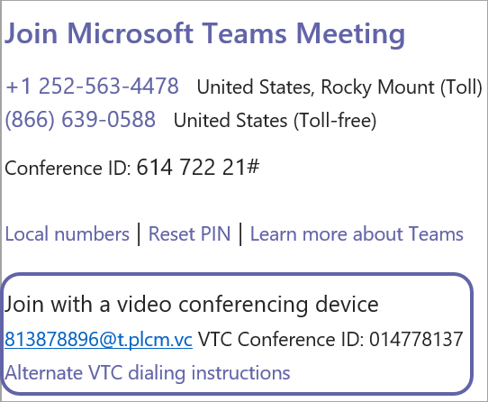

# Mise en place de l’interopérabilité de la vidéo cloud de Microsoft TeamsSet up Cloud Video Interop for Microsoft Teams

Une fois que vous avez choisi votre ou vos partenaires [Cloud Video Interop,](cloud-video-interop.md)vous devez planifier votre déploiement, configurer avec les détails de mise en service et la clé de client partenaire, et donner votre consentement à l’application d’interop vidéo dans votre organisation.After you have [chosen your Cloud Video Interop partner(s)](cloud-video-interop.md), you will need to plan your deployment, get set up with provisioning details and partner tenant key, and consent to the video interop app in your organization. Le diagramme suivant décrit le processus.The following diagram outlines the process. 

## PlanPlan

Pour [plus d’informations sur l’Microsoft Teams](cloud-video-interop.md) d’identification d’un partenaire ou partenaire à utiliser dans votre organisation, voir Cloud Video Interop.See [Cloud Video Interop for Microsoft Teams](cloud-video-interop.md) for information about identifying a partner or partners to use in your organization. 

Pour planifier l’enablement à l’échelle de l’utilisateur, des concurrents/des sites :To plan for user based/concurrent/site wide enablement: 

- Sélectionner un modèle de déploiement/hébergé pour votre utilisationPick a deployment model/hosted model for your use
- Sélectionnez le plan de licences idéal pour votre organisation.Select the license plan ideal for your organization. 
- La capacité des VMs est que vous hébergez votre infrastructure vidéo.Plan for capacity of VMs is you are hosting your video infrastructure.

## ConfigurationConfigure 

Pour configurer Cloud Video Interop, suivez ces étapes.To configure Cloud Video Interop, follow these steps. 

1. Obtenez des informations de configuration auprès du partenaire/partenaire que vous avez choisi (clé client, appIds, etc.).Obtain configuration info from the partner/partners you have chosen (tenant key, appIds…). Vous pouvez utiliser un ou plusieurs partenaires d’interop vidéo dans votre organisationYou can use one or more video interop partners in your organization 

2. Assurez-vous que votre réseau est correctement configuré.Ensure that your network is configured correctly. Configurez votre pare-feu vidéo basé sur les normes pour le travers de réseau de périmètre à prendre en charge.Configure your standards-based video firewall for perimeter network traversal to support. Par exemple :For example: 
    - Cisco VCS-eCisco VCS-e                  
    - Polycom RPADPolycom RPAD

3. Configurez des salles intégrées avec Exchange et OTD.Configure integrated rooms with exchange and OTD. Dans la plupart des cas, un relais supplémentaire doit être configuré dans votre environnement.In most cases, additional relay would need to be set up and configured in your environment.

## ApprovisionnementProvision
 
La clé client sera l’appel sortant vers le service partenaire.The tenant key will be the dial out to the partner service. Dans l’exemple suivant, 813878896@t.plcm.vc est la clé client.In the following example, 813878896@t.plcm.vc is the tenant key. 

 

Vous devrez exécuter les cmdlets suivantes pour mettre en service la clé client et permettre également à certains utilisateurs ou à l’ensemble de votre organisation de créer des réunions avec des coordonnées d’interop vidéo.You will need to execute the following cmdlets to provision the tenant key, and also enable select users or your whole organization to create meetings with video interop coordinates.

 
- **[Get-CsTeamsVideoInteropServicepolicy](/powershell/module/skype/get-csteamsvideointeropservicepolicy):** Microsoft fournit des stratégies prédécoupées pour chacun de nos partenaires pris en charge qui vous permettent de désigner le ou les partenaires à utiliser pour interop vidéo cloud.**[Get-CsTeamsVideoInteropServicepolicy](/powershell/module/skype/get-csteamsvideointeropservicepolicy):** Microsoft provides pre-constructed policies for each of our supported partners that allow you to designate which partner(s) to use for cloud video interop.

    Cette cmdlet vous permet d’identifier les stratégies pré-construite que vous pouvez utiliser dans votre organisation.This cmdlet allows you to identify the pre-constructed policies that you can use in your organization. Vous pouvez affecter cette stratégie à un ou plusieurs de vos utilisateurs en tirant parti de l'Grant-CsTeamsVideoInteropServicePolicy cmdlet.You can assign this policy to one or more of your users leveraging the Grant-CsTeamsVideoInteropServicePolicy cmdlet.
 
- **[Grant-CsTeamsVideoInteropServicePolicy](/powershell/module/skype/grant-csteamsvideointeropservicepolicy):** LGrant-CsTeamsVideoInteropServicePolicy cmdlet vous permet d’affecter une stratégie précont enfantin à utiliser dans votre organisation ou d’affecter la stratégie à des utilisateurs spécifiques.**[Grant-CsTeamsVideoInteropServicePolicy](/powershell/module/skype/grant-csteamsvideointeropservicepolicy):** The Grant-CsTeamsVideoInteropServicePolicy cmdlet allows you to assign a pre-constructed policy for use in your organization or assign the policy to specific users.
 
- **[New-CsVideoInteropServiceProvider](/powershell/module/skype/new-csvideointeropserviceprovider):** Utilisez le New-CsVideoInteropServiceProvider pour spécifier des informations sur un partenaire CVI pris en charge que votre organisation souhaite utiliser.**[New-CsVideoInteropServiceProvider](/powershell/module/skype/new-csvideointeropserviceprovider):** Use the New-CsVideoInteropServiceProvider to specify information about a supported CVI partner your organization would like to use.
 
- **[Set-CsVideoInteropServiceProvider](/powershell/module/skype/set-csvideointeropserviceprovider):** Utilisez le Set-CsVideoInteropServiceProvider pour mettre à jour les informations sur un partenaire CVI pris en charge par votre organisation.**[Set-CsVideoInteropServiceProvider](/powershell/module/skype/set-csvideointeropserviceprovider):** Use the Set-CsVideoInteropServiceProvider to update information about a supported CVI partner your organization uses.
 
- **[Get-CsVideoInteropServiceProvider](/powershell/module/skype/get-csvideointeropserviceprovider):** Obtenez tous les fournisseurs configurés pour une utilisation au sein de l’organisation.**[Get-CsVideoInteropServiceProvider](/powershell/module/skype/get-csvideointeropserviceprovider):** Get all of the providers that have been configured for use within the organization.
 
- **[Remove-CsVideoInteropServiceProvider](/powershell/module/skype/remove-csvideointeropserviceprovider):** Utilisez Remove-CsVideoInteropServiceProvider pour supprimer toutes les informations de fournisseur concernant un fournisseur que votre organisation n’utilise plus.**[Remove-CsVideoInteropServiceProvider](/powershell/module/skype/remove-csvideointeropserviceprovider):** Use Remove-CsVideoInteropServiceProvider to remove all provider information about a provider that your organization no longer uses.  
 
## ConsentementConsent

Vous devrez fournir l’autorisation d’autoriser les périphériques de téléconférence vidéo (VCS) à rejoindre les réunions de votre organisation via le service partenaire.You will need to provide permission consent for the video teleconferencing devices (VTCs) to join your organizations meetings via the partner service. Ce lien d’accord sera également fourni par votre partenaire.This consent link will also be provided by your partner.  
 
Une fois ces étapes terminées, les utilisateurs activés individuellement via l’cmdlet Grant ci-dessus, ou tous les utilisateurs de l’organisation si le client est activé, auront des coordonnées VTC dans toutes les réunions Teams qu’ils ont prévues.When these steps are complete, the users who are individually enabled via the Grant cmdlet above, or all of the users in the organization if the tenant is enabled, will have VTC coordinates in all the Teams meetings that they schedule. N’importe quel VTC peut participer à ces réunions via ces coordonnées.Any VTC can join these meetings via those coordinates.

|NomName|Courte description des autorisations d’applicationApplication Permission Short Description| DescriptionDescription|
|--|--|---|
|Calls.JoinGroupCall.AllCalls.JoinGroupCall.All|Rejoindre des appels de groupe et des réunions en tant qu’application (aperçu)Join Group Calls and Meetings as an app (preview)|Permet à l’application de participer à des appels de groupe et à des réunions programmées dans votre organisation, sans qu’un utilisateur ne soit inscrit.Allows the app to join group calls and scheduled meetings in your organization, without a signed-in user.  L’application sera jointe avec les privilèges d’un utilisateur de l’annuaire pour les réunions dans votre client.The app will be joined with the privileges of a directory user to meetings in your tenant.|
|Calls.JoinGroupCallasGuest.AllCalls.JoinGroupCallasGuest.All|Rejoindre des appels de groupe et des réunions en tant qu’utilisateur invité (prévisualisation)Join Group Calls and Meetings as a guest user (preview)|Permet à l’application de participer de manière anonyme à des appels de groupe et à des réunions programmées dans votre organisation, sans qu’un utilisateur ne soit inscrit.Allows the app to anonymously join group calls and scheduled meetings in your organization, without a signed-in user.  L’application sera jointe en tant qu’invité aux réunions dans votre client.The app will be joined as a guest to meetings in your tenant.|
|Calls.AccessMedia.AllCalls.AccessMedia.All|Accéder aux flux multimédias dans un appel en tant qu’application (aperçu)Access media streams in a call as an app (preview)|Permet à l’application d’accéder directement aux flux multimédias dans un appel, sans utilisateur inscrit.Allows the app to get direct access to media streams in a call, without a signed-in user.|
|OnlineMeetings.Read.AllOnlineMeetings.Read.All|Lire les détails de la réunion en ligne (aperçu)Read Online Meeting details (preview)|Permet à l’application de lire les détails de la réunion en ligne dans votre organisation, sans utilisateur inscrit.Allows the app to read Online Meeting details in your organization, without a signed-in user.|

## PlanifierSchedule

Ensuite, planifier Teams réunion avec les coordonnées d’interopation vidéo.Next, schedule Teams meeting with video interop coordinates. L’utilisateur activé peut planifier des réunions d’équipe via :The enabled user can schedule teams meetings via:
- [Teams Le add-in de réunion pour OutlookTeams Meeting add-in for Outlook](teams-add-in-for-outlook.md)
- Teams bureau et mobile clientTeams client desktop and mobile

## RejoindreJoin

Vous pouvez participer Teams réunions avec vos appareils VTC des façons suivantes :You can join Teams meetings with your VTC devices in the following ways:
 
- IVR (Réponse vocale interactive)IVR (Interactive voice Response)
    - Vous pouvez appeler les IVR du partenaire à l’aide de la tenantkey@domain.You can dial in to the partner's IVR using the tenantkey@domain. 
    - Une fois que vous êtes dans l’IVR partenaire, vous êtes invité à entrer le VTC conferenceId, qui vous connecte ensuite à la Teams partenaire.Once you are in the partner IVR, you will be prompted to enter the VTC conferenceId, which will then connect you to the Teams meeting.
- Numérotation directeDirect dial
    - Vous pouvez appeler directement la réunion Teams sans interagir avec les IVR du partenaire à l’aide de la fonctionnalité de numérotation directe utilisant la chaîne complète de clés client. VTC ConferenceId@domain.You can directly dial into the Teams meeting without interacting with the partner’s IVR by using the direct dial feature using the full string of tenantkey.VTC ConferenceId@domain.
- Numérotation à une pressionOne-touch dial
    - Si vous avez une salle de numérotation Teams intégrée, vous pouvez utiliser les fonctionnalités de numérotation à une pression offertes par votre partenaire (sans avoir à taper de chaîne de numérotation).If you have an integrated Teams room, you can use the one-touch dial capabilities offered by your partner (without needing to type any dial string).

Enfin, engagez-vous Teams vos réunions en utilisant l’audio, la vidéo et le partage de contenu.Finally, engage with Teams users in your meetings using audio, video, and content sharing.