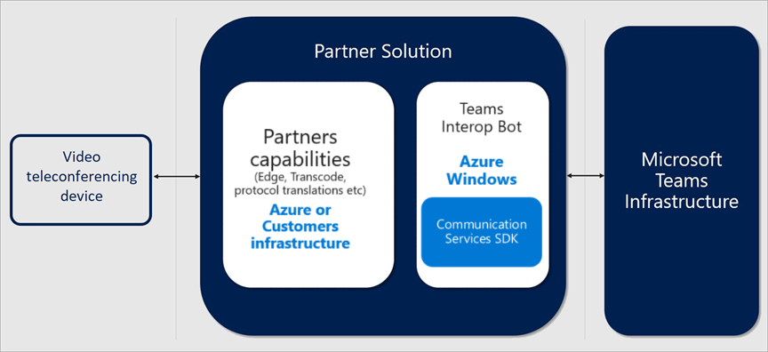

# Interopérabilité de la vidéo cloud de Microsoft TeamsCloud Video Interop for Microsoft Teams

Le Cloud Video Interop (CVI) est une solution tierce qualifiée par Microsoft qui permet d’accéder à des salles de réunion ou des appareils vidéo personnels (VTCs) tiers pour participer à des réunions dans Microsoft Teams.Cloud Video Interop (CVI) is a Microsoft Qualified third-party solution that enables third-party meeting rooms (telepresence) and personal video devices (VTCs) to join Microsoft Teams meetings.
 
Grâce à Microsoft Teams, vous bénéficiez d’une collaboration sur le contenu en ligne riche dans les réunions qui incluent l’audio, la vidéo et le partage de contenu.With Microsoft Teams, you get rich online content collaboration in meetings that include audio, video, and content sharing. Cela peut être apprécié par le biais du client de bureau et Web, ainsi que par le biais de nombreux appareils partenaires qui s’intègrent en mode natif avec Microsoft Teams.This can be enjoyed through the desktop and web client, as well as through many partner devices that integrate natively with Microsoft Teams. En revanche, de nombreux clients ont déjà investi dans des périphériques de communication vidéo et de visioconférence personnels, ce qui peut être coûteux à mettre à niveau.However, many customers have already invested in video teleconferencing and personal video communication devices, which can be expensive to upgrade. La technologie Cloud Video Interop fournit une solution simple, qui vous permet de continuer à utiliser vos solutions actuelles tant que vous n’êtes pas prêt à effectuer la mise à niveau.Cloud Video Interop provides an easy solution, allowing you to keep using your existing solutions until you are ready to upgrade.

Avec la fonction d’interopérabilité de la vidéo Cloud, Microsoft teams permet à tous les participants de bénéficier d’une interface de réunion native pour tous les participants :With Cloud Video Interop, Microsoft Teams delivers a native meeting experience for all participants – in meeting rooms or inside of Teams clients.

### Est-ce que Cloud Video Interop pour moi ?Is Cloud Video Interop for me?

La technologie Cloud Video Interop fournit un service intermédiaire lors d’une transition vers une solution Microsoft teams native complète, utilisant des points de terminaison Teams.Cloud Video Interop provides an intermediate service while you transition to a full native Microsoft Teams Solution, using Teams endpoints. Le service fourni doit faire partie de votre chemin de migration.The service provided should be part of your migration path.

L’interopérabilité de la vidéo Cloud est destiné aux clients qui remplissent les critères suivants :Cloud Video Interop is intended for customers who meet the following criteria:

- Déploiement de systèmes de salle de réunion et de déploiement de périphériques vidéo personnels (50 périphériques) qui ne sont pas qualifiés pour une intégration directe avec Microsoft teamsHave a large deployment of meeting room devices and personal video devices deployment (50+ devices) that are not qualified for direct integration with Microsoft Teams
- Sont prises en charge par l’un de nos partenaires d’interopérabilité Cloud VideoAre supported by one of our Cloud Video Interop partners
- Vous souhaitez conserver la valeur de leur investissement dans ses appareils de salle de réunion actuels et périphériques vidéo personnels lors de la migration vers une solution Microsoft teams NativeWant to retain the value of their investment in their current meeting room devices and personal video devices during the migration to a native Microsoft Teams solution

Même si la technologie Cloud Video Interop fournit une solution de grande qualité, nous encourageons nos clients à consulter les solutions de réunion natives de nos équipes, telles que les systèmes de salle de réunion, pour le long terme.While Cloud Video Interop provides a great intermediate solution, we encourage our customers to look into our native Teams Meeting solutions, such as Teams Room Systems, for the long term. 

### Office 365 secteur public et services tiersOffice 365 US Government and third-party services

Office 365 offre la possibilité d’intégrer des applications tierces dans les sites SharePoint Online, Skype entreprise, équipes et applications Office incluses dans les applications Microsoft 365 pour les entreprises (par exemple, Word, Excel, PowerPoint et Outlook) et Outlook Web App.Office 365 provides the ability to integrate third-party applications into SharePoint Online sites, Skype for Business, Teams, Office applications included in Microsoft 365 Apps for enterprise (such as Word, Excel, PowerPoint, and Outlook), and Outlook Web App. Par ailleurs, Office 365 prend en charge l’intégration avec des fournisseurs de services tiers.In addition, Office 365 supports integration with third-party service providers. Ces services et applications tiers peuvent impliquer le stockage, la transmission et le traitement des données client de votre organisation sur des systèmes tiers situés en dehors de l’infrastructure 365 d’Office et ne sont donc pas soumis aux engagements en matière de conformité et de protection des données d’Office 365.These third-party applications and services might involve storing, transmitting, and processing your organization's customer data on third-party systems that are outside of the Office 365 infrastructure and therefore are not covered by the Office 365 compliance and data protection commitments. **Nous vous recommandons de consulter les déclarations de confidentialité et de conformité fournies par les tiers lors de l’évaluation de l’utilisation appropriée de ces services pour votre organisation.****It is recommended that you review the privacy and compliance statements provided by the third parties when assessing the appropriate use of these services for your organization.**

### Partenaires certifiés pour Microsoft teamsPartners Certified for Microsoft Teams

Les partenaires suivants disposent de solutions d’interopérabilité vidéo pour Microsoft Teams.The following partners have video interop solutions for Microsoft Teams. Votre entreprise est susceptible de travailler avec n’importe quelle combinaison de ces partenaires au sein de votre entreprise.Your company may choose to work with any combination of these partners within your enterprise. 

|PartenairePartner|Solution de partenariatPartner solution|
|----|---|
| | <a href="https://aka.ms/PolycomRealConnect" target="_blank">Service RealConnect Polycom</a><a href="https://aka.ms/PolycomRealConnect" target="_blank">Polycom RealConnect Service</a> |
|| <a href="https://aka.ms/PexipInfinity" target="_blank">PEXIP Infinity pour Microsoft teams</a><a href="https://aka.ms/PexipInfinity" target="_blank">Pexip Infinity for Microsoft Teams</a> | 
|| <a href="https://aka.ms/BluejeansGateway" target="_blank">Passerelle BlueJeans pour Microsoft teams</a><a href="https://aka.ms/BluejeansGateway" target="_blank">BlueJeans Gateway for Microsoft Teams</a> |
||<a href="https://aka.ms/CiscoCVI" target="_blank">Intégration vidéo de Cisco Webex pour Microsoft teams</a><a href="https://aka.ms/CiscoCVI" target="_blank">Cisco Webex Video Integration for Microsoft Teams</a>|

### Vue d’ensemble de l’interopérabilité Cloud VideoCloud Video Interop overview

L’interopérabilité de la vidéo Cloud est un service tiers offert par nos partenaires pour assurer l’interopérabilité entre les solutions de conférence vidéo existantes et les solutions de périphériques vidéo personnels en local et Microsoft Teams.Cloud Video Interop is a third-party service that is offered by our partners to provide interoperability between existing video conferencing and personal video device solutions on premises, and Microsoft Teams.

Les solutions proposées par nos partenaires sont composées de composants qui peuvent être déployés entièrement sur le Cloud ou partiellement ou entièrement sur site.The solutions offered by our partners consist of components that can be deployed either fully cloud based or partially/fully on premises. 
     
Le diagramme suivant illustre l’architecture de haut niveau de nos solutions de partenariat.The following diagram shows the high-level architecture of our partner solutions.

## Déploiement de l’interopérabilité Cloud VideoDeploy Cloud Video Interop

Lors du déploiement d’une solution d’interopérabilité Cloud Video, il est important de comprendre que vous déployez une solution de partenariat.When deploying a Cloud Video Interop solution, it's important to understand that you are deploying a partner solution. Le diagramme suivant décrit les étapes générales nécessaires pour déployer la technologie Cloud.The general steps you should take to deploy Cloud Video Interop are listed in the following diagram.

### PlanPlan

Pendant la phase du plan, vous devez identifier les appareils que vous ne devez pas remplacer par un appareil teams natif et Rechercher un partenaire d’interopérabilité Cloud qui peut prendre en charge ces appareils.During the plan phase, you should identify the devices that you will not replace with a native Teams device, and find a Cloud Video Interop partner that can support these devices.  

Il est également important de savoir que vous aurez besoin d’une licence pour chaque utilisateur qui planifie les réunions dans lesquelles vous voulez qu’un périphérique compatible avec la vidéo Cloud puisse y accéder.It's also important to understand that you will need a license for each user who will schedule meetings in which you want a Cloud Video Interop-enabled device to join. Notez qu’il est possible d’obtenir exactement les exigences de licence du partenaire Cloud Video Interop.Note that exact licensing requirements can be obtained from the Cloud Video Interop partner. Assurez-vous qu’il est clair avant de commencer votre déploiement.Ensure that this is clear before you start your deployment.

### ConfigurationConfigure

Le partenaire que vous avez choisi pour votre déploiement CVI vous fournira un document de déploiement complet composé de toutes les étapes nécessaires au déploiement réussi au sein de votre organisation.The partner that you have chosen for your CVI deployment will provide you with a full deployment document that consists of all the steps needed to deploy successfully within your organization. Cela inclut les ports de pare-feu et les plages d’adresses IP, les modifications de configuration pour vos appareils et d’autres paramètres qui doivent changer.This will include firewall ports and IP ranges, configuration changes for your devices, and other settings that need to change.

### OctroiProvision  

Pendant la phase de mise en service, vous attribuerez des licences aux utilisateurs appropriés conformément au Guide de configuration du partenaire.During the provision phase, you will assign licenses to the appropriate users according to the partner configuration guide. Vous devrez également suivre le processus de consentement d’Azure pour proposer au partenaire l’accès à votre environnement d’équipes.You will also need to go through the Azure Consent process to provide the partner access to your Teams environment. Pour plus d’informations sur le processus de consentement d’Azure, voir [autorisations et consentement dans le point de terminaison de la plateforme d’identité Microsoft](https://docs.microsoft.com/azure/active-directory/develop/v2-permissions-and-consent) .See [Permissions and consent in the Microsoft identity platform endpoint](https://docs.microsoft.com/azure/active-directory/develop/v2-permissions-and-consent) for more information about the Azure consent process.

### HoraireSchedule

Lorsqu’un utilisateur est activé pour l’interopérabilité de la vidéo Cloud, toute réunion planifiée à l’aide du complément réunion teams pour Outlook ou du client teams disposera des informations supplémentaires appropriées automatiquement ajoutées à la réunion Teams, afin que les appareils compatibles avec la vidéo Cloud puissent participer à ces réunions.After a user is enabled for Cloud Video Interop, any meeting scheduled using either the Teams Meeting Add-in for Outlook or the Teams Client will have the appropriate additional information automatically added into the Teams meeting so that Cloud Video Interop-compatible devices can join these meetings.

### RejoindreJoin

En fonction de la solution de partenariat, il existe plusieurs façons de participer à une réunion Cloud Video Interop.Depending on the partner solution, there are several ways to join a Cloud Video Interop-enabled meeting. Les scénarios exacts de participation à une réunion seront fournis par votre partenaire Cloud Video Interop.Exact meeting join scenarios will be provided by your Cloud Video Interop partner. Nous avons classé quelques exemples ci-dessous :We've listed some examples below:

- IVR (réponse vocale interactive)IVR (Interactive Voice Response) 
  - Vous pouvez vous connecter à l’IVR du partenaire à l’aide du tenantkey@domain.You can dial in to the partner's IVR using the tenantkey@domain.
  - Lorsque vous vous trouvez dans l’IVR du partenaire, vous êtes invité à entrer le conferenceId VTC, qui vous connecte ensuite à la réunion Teams.When you are in the partner IVR, you will be prompted to enter the VTC conferenceId, which will then connect you to the Teams meeting.
- Numérotation directeDirect dial 
  - Vous pouvez directement composer le numéro de la réunion teams sans interagir avec l’IVR du partenaire à l’aide de la fonction de numérotation directe, en utilisant la chaîne complète de tenantkey. VTC ConferenceId@domain.You can directly dial in to the Teams meeting without interacting with the partner's IVR by using the direct dial feature, using the full string of tenantkey.VTC ConferenceId@domain.
- Numérotation en un clicOne-touch dial 
  - Si vous avez une salle d’équipe intégrée, vous pouvez utiliser les fonctionnalités de numérotation à l’aide de votre partenaire (sans avoir à taper une chaîne de numérotation).If you have an integrated Teams room, you can use the one-touch dial capabilities offered by your partner (without needing to type any dial string).

## Gérer l’interopérabilité Cloud VideoManage Cloud Video Interop

Après le déploiement de l’interopérabilité de la vidéo Cloud, vous pouvez gérer les appareils à l’aide des solutions fournies par nos partenaires.After Cloud Video Interop is deployed, you can manage the devices using the solutions provided by our partners. Chaque partenaire vous fournira une interface d’administration qui inclura la gestion des licences et des appareils.Each partner will provide you with an administrative interface that will include both license and device management. 

La création de rapports est également disponible directement à partir de l’interface d’administration du partenaire.Reporting is also available directly from the partner administrative interface. Pour en savoir plus sur les fonctionnalités de création de rapports, contactez le partenaire de votre choix.For more information on reporting capabilities, contact the partner of your choice. 

### Résolution des problèmes liés à l’interopérabilité Cloud VideoTroubleshooting Cloud Video Interop

La technologie Cloud Video Interop est un service fourni par les partenaires.Cloud Video Interop is a partner-provided service. Si vous rencontrez des problèmes, la première étape consiste à connecter un appareil sur lequel le client teams a été installé et à le connecter au même segment que le périphérique Cloud Video Interop qui cause des problèmes.If you are experiencing issues, the first step is to connect a device that has the Teams Client installed and connect it to the same segment as the Cloud Video Interop device that is causing problems. 

Si teams fonctionne correctement sur ce segment et que vous avez également suivi toutes les instructions de mise en réseau et de configuration fournies par le partenaire, vous devez contacter ce dernier pour résoudre les problèmes.If Teams functions correctly on this segment, and you have also followed all the networking and configuration guidelines the partner has provided, you will need to contact the partner for further troubleshooting. 

## PowerShell pour l’interopérabilité vidéo CloudPowerShell for Cloud Video Interop

Les applets de commande PowerShell suivantes sont disponibles pour vous pour (partiellement) automatiser le déploiement d’interopérabilité de la vidéo Cloud.The following PowerShell cmdlets are available for you to (partially) automate the Cloud Video Interop deployment.

- **Get-CsTeamsVideoInteropServicepolicy**: Microsoft fournit des stratégies préconçues pour chacun de nos partenaires pris en charge, qui vous permettent de désigner le ou les partenaires à utiliser pour l’interopérabilité de la vidéo Cloud.**Get-CsTeamsVideoInteropServicepolicy**: Microsoft provides pre-constructed policies for each of our supported partners that allow you to designate which partner(s) to use for Cloud Video Interop. Cette applet de connexion vous permet d’identifier les politiques prédéfinies que vous pouvez utiliser au sein de votre organisation.This cmdlet allows you to identify the pre-constructed policies that you can use in your organization. Vous pouvez affecter cette stratégie à un ou plusieurs de vos utilisateurs en tirant parti de l’applet de Grant-CsTeamsVideoInteropServicePolicy.You can assign this policy to one or more of your users by leveraging the Grant-CsTeamsVideoInteropServicePolicy cmdlet.
- **Grant-CsTeamsVideoInteropServicePolicy**: cette applet de connexion vous permet d’assigner une stratégie préconçue pour une utilisation au sein de votre organisation ou d’affecter la stratégie à des utilisateurs spécifiques.**Grant-CsTeamsVideoInteropServicePolicy**: This cmdlet allows you to assign a pre-constructed policy for use in your organization or assign the policy to specific users.
- **New-CsVideoInteropServiceProvider**: cette applet de cmdlet permet de spécifier des informations sur un partenaire CVI pris en charge que votre organisation souhaite utiliser.**New-CsVideoInteropServiceProvider**: Use this cmdlet to specify information about a supported CVI partner that your organization would like to use.
- **Set-CsVideoInteropServiceProvider**: utilisez cette applet de cmdlet pour mettre à jour des informations sur un partenaire CVI pris en charge utilisé par votre organisation.**Set-CsVideoInteropServiceProvider**: Use this cmdlet to update information about a supported CVI partner that your organization uses.
- **Get-CsVideoInteropServiceProvider**: utilisez cette applet de cmdlet pour obtenir tous les fournisseurs configurés pour une utilisation au sein de l’organisation.**Get-CsVideoInteropServiceProvider**: Use this cmdlet to get all of the providers that have been configured for use within the organization.
- **Remove-CsVideoInteropServiceProvider**: cette applet de passe permet de supprimer toutes les informations de fournisseur relatives à un fournisseur que votre organisation n’utilise plus.**Remove-CsVideoInteropServiceProvider**: Use this cmdlet to remove all provider information about a provider that your organization no longer uses.
