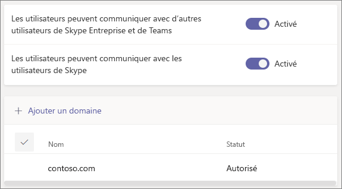

# Utiliser l’accès invité et l’accès externe pour collaborer avec des personnes extérieures à votre organisation

Cet article décrit deux des options permettant de collaborer avec des contacts extérieurs à votre organisation :

- **Accès externe** : type de fédération qui permet aux utilisateurs de rechercher, d’appeler des personnes d’autres organisations, puis de discuter avec elles. Vous ne pouvez pas ajouter ces personnes à une équipe, sauf en tant qu’invitées.
- **Accès invité** : l’accès invité vous permet d’inviter des personnes extérieures à votre organisation à rejoindre une équipe. Les personnes invitées obtiennent un compte invité dans Azure Active Directory.

Pour obtenir une vue d’ensemble complète de la collaboration externe dans Microsoft 365, consultez [Vue d’ensemble des options de collaboration externe dans Microsoft 365](/microsoft-365/enterprise/external-guest-access).

## Accès externe (réunions et conversation externes)

Configurez l’accès externe si vous avez besoin de rechercher, d’appeler, de discuter, puis de configurer des réunions avec des personnes extérieures à votre organisation qui utilisent Teams, Skype Entreprise (en ligne ou en local) ou Skype. 

Par défaut, l'accès externe est activé pour tous les domaines. Vous pouvez restreindre l’accès externe en autorisant ou en bloquant des domaines spécifiques, ou en le désactivant.

L’accès externe est disponible pour les locataires suivants :
- Comptes d’entreprise gérés
     - Entre commercial uniquement
     - Entre GCC uniquement
     - Entre GCC High uniquement
     - Entre DOD uniquement
- Comptes non gérés (personnels)
     - Entre les comptes Commerciaux et Personnels uniquement
- interopérabilité Skype Entreprise
     - Entre et entre commercial, GCC, GCC High et DoD
- Skype Interop
     - Entre Commercial et Skype uniquement

Si vous souhaitez configurer l’accès externe, veuillez consulter la rubrique [Gérer l'accès externe](manage-external-access.md). 

>[!NOTE]
> Les licences [Microsoft Teams gratuit (classique)](https://support.microsoft.com/office/welcome-to-microsoft-teams-free-classic-6d79a648-6913-4696-9237-ed13de64ae3c) ne prennent pas en charge l’accès externe.

## Accès invité

L’accès invité permet d’ajouter une personne extérieure à votre organisation à une équipe, dans laquelle elle peut discuter, appeler, rencontrer des participants, puis collaborer sur des fichiers. Les invités peuvent bénéficier de presque toutes les mêmes fonctionnalités Teams que les membres d’équipe natifs. Pour plus d’informations, voir [Expérience des invités dans Teams.](guest-experience.md)

Les invités sont ajoutés à Azure Active Directory de votre organisation en tant qu’utilisateurs B2B Collaboration et doivent se connecter à Teams à l’aide de leur compte invité. En d’autres termes, ils devront sans doute se déconnecter de leurs propres organisations pour se connecter à la vôtre.

L’accès invité est disponible pour les locataires suivants :

- Dans et entre Commercial et GCC
- Entre GCC High uniquement
- Entre DOD uniquement

Si vous souhaitez configurer l’accès invité pour Teams, veuillez consulter la rubrique [Collaborer avec des invités au sein d’une équipe](/microsoft-365/solutions/collaborate-as-team).

## Comparer l’accès externe et l’accès invité

Les tableaux suivants montrent les différences entre l’utilisation de l’accès externe (fédération) et les invités. Dans les deux cas, vos utilisateurs identifient les personnes extérieures à votre organisation comme externes.

### Actions réalisables par vos utilisateurs

| Vos utilisateurs peuvent | Utilisateurs de l’accès externe | Invités |
|---------|-----------------------|--------------------|
| Converser avec une personne d’une autre organisation | Oui | Oui |
| Appeler une personne d’une autre organisation | Oui | Oui |
| Voir si une personne d’une autre organisation est disponible pour un appel ou une conversation | Oui | Oui 1 |
| Rechercher des personnes d’autres organisations | Oui 2 | Non |
| Partager des fichiers | Non | Oui |
| Consulter le message d’absence du bureau d’une personne d’une autre organisation | Non | Oui |
| Bloquer une personne d’une autre organisation  | Non | Oui |
| Utiliser les @mentions | Oui3 | Oui |

### Actions réalisables par les personnes extérieures à votre organisation

| Les personnes extérieures à votre organisation peuvent | Utilisateurs de l’accès externe | Invités |
|---------|-----------------------|--------------------|
| Accéder aux ressources Teams | Non | Oui |
| Être ajoutées à une conversation de groupe | Oui | Oui |
| Être invitées à une réunion | Oui | Oui |
| Passer des appels privés | Oui | Oui5 |
| Afficher le numéro de téléphone des participants à la réunion rendez-vous | Non4 | Oui |
| Utiliser la vidéo sur IP | Oui | Oui5 |
| Utiliser le partage d’écran | Oui3 | Oui5 |
| Utiliser la réunion instantanée | Non | Oui5 |
| Modifier des messages envoyés | Oui3 | Oui5 |
| Supprimer des messages envoyés | Oui3 | Oui5 |
| Utiliser Giphy dans la conversation | Oui3 | Oui5 |
| Utiliser des mèmes dans la conversation | Oui3 | Oui5 |
| Utiliser des autocollants dans la conversation | Oui3 | Oui5 |
| La présence s’affiche. | Oui | Oui |
| Utiliser les @mentions | Oui3 | Oui |

 

1 À condition que l’utilisateur ait été ajouté en tant qu’invité et qu’il soit connecté avec le compte invité. 
2 Uniquement par adresse e-mail ou SIP (Session Initiation Protocol). 
3 Fonction prise en charge pour la conversation 1:1 entre utilisateurs Teams uniquement de deux organisations différentes.  
4 By default, external participants can't see the phone numbers of dialed-in participants. If you want to maintain the privacy of these phone numbers, select **Tones** for **Entry/exit announcement type** (this prevents the numbers from being read out by Teams). To learn more, read [Turn on or off entry and exit announcements for meetings in Microsoft Teams](turn-on-or-off-entry-and-exit-announcements-for-meetings-in-teams.md).  
5 Fonction autorisée par défaut, mais l’administrateur Teams peut la désactiver

## Voir aussi

[Accès externe dans Teams](manage-external-access.md)

[Accès invité dans Teams](guest-access.md)
