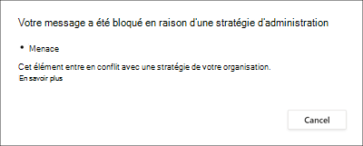

# Conformité des communications avec Microsoft Teams

Microsoft Purview Communication Compliance est une solution à risque interne dans Microsoft 365 qui permet de réduire les risques de communication en vous aidant à détecter, capturer et agir sur des messages inappropriés dans votre organisation.

Pour Microsoft Teams, la conformité des communications permet d’identifier les [types de contenu inapproprié suivants](/microsoft-365/compliance/communication-compliance-feature-reference) dans les canaux Teams, les canaux de Teams privés ou dans les conversations de groupe et 1:1 :

- Langage offensant, profane et harcelant
- Images adultes, racées et gory
- Partage d’informations sensibles

Pour plus d’informations sur la conformité des communications et la configuration des stratégies pour votre organisation, consultez [En savoir plus sur la conformité des communications](/microsoft-365/compliance/communication-compliance).

## Comment utiliser la conformité des communications dans Microsoft Teams

La conformité des communications et les Microsoft Teams sont étroitement intégrées et peuvent aider à réduire les risques de communication au sein de votre organisation. Une fois que vous avez configuré vos premières stratégies de conformité des communications, vous pouvez gérer activement les messages et le contenu Microsoft Teams inappropriés qui sont automatiquement signalés dans les alertes.

### Prise en main

La prise en main de la conformité des communications dans Microsoft Teams commence par [la planification](/microsoft-365/compliance/communication-compliance-plan) et la création de stratégies prédéfinies ou personnalisées pour identifier les activités utilisateur inappropriées dans les canaux Teams ou dans les groupes 1:1. N’oubliez pas que vous devez [configurer](/microsoft-365/compliance/communication-compliance-configure) certaines autorisations et conditions préalables de base dans le cadre du processus de configuration.

Teams administrateurs peuvent configurer des stratégies de conformité des communications aux niveaux suivants :

- **Niveau utilisateur** : les stratégies de ce niveau s’appliquent à un utilisateur Teams individuel ou peuvent être appliquées à tous les utilisateurs Teams de votre organisation. Ces stratégies couvrent les messages que ces utilisateurs peuvent envoyer dans des conversations de groupe ou 1:1. Les communications de conversation pour les utilisateurs sont automatiquement surveillées sur toutes les Microsoft Teams où les utilisateurs sont membres.
- **Teams niveau** : les stratégies à ce niveau s’appliquent à un canal Microsoft Teams, y compris un canal privé. Ces stratégies couvrent uniquement les messages envoyés dans le canal Teams.

### Signaler une préoccupation dans Microsoft Teams

>[!NOTE]
>Les messages signalés par l’utilisateur commenceront à être disponibles pour les organisations sous licence pour [la conformité des communications](/microsoft-365/compliance/communication-compliance-configure#subscriptions-and-licensing) et les Microsoft Teams à compter de mai 2022. Cette fonctionnalité doit être disponible pour toutes les organisations sous licence d’ici le 31 août 2022.

L’option *Signaler une préoccupation* dans Teams messages est activée par défaut et peut être contrôlée via Teams stratégies de messagerie dans le [centre d’administration Teams](/microsoftteams/manage-teams-in-modern-portal). Cela permet aux utilisateurs de votre organisation d’envoyer des messages inappropriés pour révision par les réviseurs de conformité des communications pour la stratégie. Pour plus d’informations sur les messages signalés par l’utilisateur dans la conformité des communications, consultez [Stratégies de conformité des communications](/microsoft-365/compliance/communication-compliance-policies#user-reported-messages-policy).

Après avoir envoyé le message pour révision, l’utilisateur reçoit une confirmation de l’envoi dans Microsoft Teams. Les autres participants à la conversation ne voient pas cette notification.

Les utilisateurs de votre organisation obtiennent automatiquement la stratégie globale, sauf si vous créez et affectez une stratégie personnalisée. Modifiez les paramètres de la stratégie globale ou créez et affectez une ou plusieurs stratégies personnalisées pour activer ou désactiver cette fonctionnalité. Pour plus d’informations, consultez [Gérer les stratégies de messagerie dans Teams](/microsoftteams/messaging-policies-in-teams).

### Agir sur les messages inappropriés dans Microsoft Teams

Une fois que vous avez configuré vos stratégies et reçu des alertes de conformité des communications pour Microsoft Teams messages, il est temps que les réviseurs de conformité de votre organisation agissent sur ces messages. Cela inclut également les messages signalés par l’utilisateur s’ils sont activés pour votre organisation. Les réviseurs peuvent aider à protéger votre organisation en examinant les alertes de conformité des communications et en supprimant les messages marqués d’indicateurs dans Microsoft Teams.

Les messages et le contenu supprimés sont remplacés par des notifications pour les visionneuses expliquant que le message ou le contenu a été supprimé et quelle stratégie est applicable à la suppression. L’expéditeur du message ou du contenu supprimé est également averti de l’état de suppression et fourni avec le contenu du message d’origine pour le contexte relatif à sa suppression. L’expéditeur peut également afficher la condition de stratégie spécifique qui s’applique à la suppression du message.

Exemple de conseil de stratégie vu par l’expéditeur :

Exemple de notification de stratégie vue par l’expéditeur :

Exemple de conseil de stratégie vu par le destinataire :

