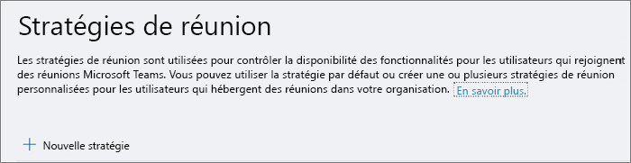

Configurer le partage du bureau dans Microsoft Teams
============================================

Le partage de bureau permet aux utilisateurs de présenter un écran ou une application pendant une réunion ou une conversation. Les administrateurs peuvent configurer le partage d’écran dans Microsoft teams pour permettre aux utilisateurs de partager tout l’écran, une application ou un fichier. Vous pouvez permettre aux utilisateurs de donner ou de demander le contrôle, d’autoriser le partage PowerPoint, d’ajouter un tableau blanc et de permettre des notes partagées. Vous pouvez également configurer la possibilité pour les utilisateurs anonymes ou externes d’exiger le contrôle de l’écran partagé.

Pour configurer le partage d’écran, vous devez créer une nouvelle stratégie de réunion, puis l’affecter aux utilisateurs que vous voulez gérer.

**Dans le centre d’administration Microsoft teams**

1. Sélectionnez **** > **stratégies de réunion**pour les réunions.

    

2. Dans la page stratégies de la **réunion** , sélectionnez **nouvelle stratégie**.

    

3. Donnez un titre unique à votre politique et entrez une brève description.

4. Sous **partage de contenu**, choisissez un **mode de partage d’écran** dans la liste déroulante :

   - **Tout l’écran** : permet aux utilisateurs de partager leur bureau entier.
   - **Application unique** -permet aux utilisateurs de limiter le partage d’écran à une seule application active.
   - **Désactivé** -désactive le partage d’écran.

    

5. Activer ou désactiver les paramètres suivants :

    - **Permettre à un participant de donner ou demander le contrôle** – permet aux membres de l’équipe de donner ou demander le contrôle de l’application ou du Bureau du présentateur.
    - **Autoriser un participant externe à céder ou demander le contrôle** – permet aux invités et aux utilisateurs externes d’octroyer le contrôle du bureau ou de l’application du présentateur.
    - **Autoriser le partage PowerPoint** -permet aux utilisateurs de créer des réunions permettant de télécharger et de partager des présentations PowerPoint.
    - **Autoriser le tableau blanc** : permet aux utilisateurs de partager un tableau blanc.
    - **Autoriser les notes partagées** : permet aux utilisateurs de prendre des notes partagées.

6. Cliquez sur **Enregistrer**.

## Utiliser PowerShell pour configurer le bureau partagé

Vous pouvez également utiliser l’applet de commande [Set-CsTeamsMeetingPolicy](https://docs.microsoft.com/en-us/powershell/module/skype/set-csteamsmeetingpolicy?view=skype-ps) pour contrôler le partage de bureau. Définissez les paramètres suivants :

- Description
- ScreenSharingMode
- AllowParticipantGiveRequestControl
- AllowExternalParticipantGiveRequestControl
- AllowPowerPointSharing
- AllowWhiteboard
- AllowSharedNotes

[En savoir plus sur l’utilisation de l’applet de passe csTeamsMeetingPolicy](https://docs.microsoft.com/en-us/powershell/module/skype/set-csteamsmeetingpolicy?view=skype-ps).

