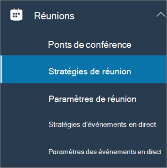

Configurer le partage du bureau dans Microsoft TeamsConfigure desktop sharing in Microsoft Teams
============================================

Le partage de bureau permet aux utilisateurs d'afficher un écran ou une application pendant une réunion ou une conversation.Desktop sharing lets users present a screen or app during a meeting or chat. Les administrateurs peuvent configurer le partage d’écran dans Microsoft Teams pour autoriser les utilisateurs à partager l'ensemble d'un écran, d'une application ou d'un fichier.Admins can configure screen sharing in Microsoft Teams to let users share an entire screen, an app, or a file. Vous pouvez permettre aux utilisateurs d’attribuer ou de demander le contrôle, d'autoriser le partage PowerPoint, d'ajouter un tableau blanc et d'autoriser les notes partagées.You can let users give or request control, allow PowerPoint sharing, add a whiteboard, and allow shared notes. Vous pouvez également préciser si les utilisateurs anonymes ou externes peuvent demander le contrôle de l’écran partagé.You can also configure whether anonymous or external users can request control of the shared screen. Les participants externes aux réunions Teams peuvent être classés comme suit :External participants in Teams meetings can be categorized as follows:

- Utilisateur anonymeAnonymous user
- Utilisateurs invitésGuest users
- Utilisateur B2BB2B user
- Utilisateur fédéréFederated user

Pour configurer le partage d’écran, vous créez une stratégie de réunion, puis vous l’attribuez aux utilisateurs que vous souhaitez gérer.To configure screen sharing, you create a new meetings policy and then assign it to the users you want to manage.

**Dans le [Centre d’administration Microsoft Teams](https://admin.teams.microsoft.com/)****In the [Microsoft Teams admin center](https://admin.teams.microsoft.com/)**

1. Sélectionnez **Réunions** > **Stratégies de réunion**.Select **Meetings** > **Meeting policies**.

    

2. Sur la page **Stratégies de réunion**, sélectionnez **Ajouter**.On the **Meeting policies** page, select **Add**.

    

3. Donnez un titre unique à votre stratégie, puis entrez une brève description.Give your policy a unique title and enter a brief description.

4. Sous le **Partage de contenu**, choisissez un **Mode de partage d’écran** dans la liste déroulante :Under **Content sharing**, choose a **Screen sharing mode** from the drop-down list:

   - **Écran complet** : permet au utilisateurs de partager la totalité de leur bureau.**Entire screen** – lets users share their entire desktop.
   - **Application Unique** : permet aux utilisateurs de limiter le partage d’écran à une seule application active.**Single application** – lets users limit screen sharing to a single active application.
   - **Désactivé** : désactive le partage d’écran.**Disabled** – Turns off screen sharing.

    

  > [!Note]
  > Vous ne pouvez pas activer la stratégie d’appel pour que les utilisateurs utilisent le partage d’écran à partir de la conversation.You don't have to enable the calling policy in order for users to use screen share from chat. Toutefois, leur audio est désactivé jusqu’à ce qu’ils activent le son eux-mêmes.However, their audio is turned off until they unmute themselves. En outre, l’utilisateur partageant l’écran peut cliquer sur **Ajouter l’audio** pour activer l’audio.In addition, the user sharing the screen can click **Add Audio** to enable audio. Si la stratégie d’appel est désactivée, les utilisateurs ne pourront pas ajouter l’audio au partage d’écran à partir de la session de conversation.If the calling policy is disabled, users won't be able to add audio to the screen share from a chat session.

5. Activer ou désactiver les paramètres suivants :Turn the following settings on or off:

    - **Autoriser un participant à donner ou demander le contrôle** : permet aux membres de l’équipe de donner ou de demander le contrôle du bureau ou de l'application du présentateur.**Allow a participant to give or request control** – lets members of the team give or request control of the presenter's desktop or application.
    - **Autoriser un participant externe à donner ou demander le contrôle** – Il s’agit d’une stratégie par utilisateur.**Allow an external participant to give or request control** – This is a per-user policy. Le fait qu’une organisation ait cette définition pour un utilisateur ne contrôle pas ce que les participants externes peuvent effectuer, quel que soit l’organisateur de la réunion.Whether an organization has this set for a user doesn't control what external participants can do, regardless of what the meeting organizer has set. Ce paramètre détermine si les participants externes peuvent bénéficier d’un contrôle ou demander le contrôle de l’écran du destinataire, en fonction de ce que le partage a défini dans les stratégies de réunion de leur organisation.This parameter controls whether external participants can be given control or request control of the sharer's screen, depending on what the sharer has set within their organization's meeting policies.
    - **Autoriser le partage de PowerPoint** : permet aux utilisateurs de créer des réunions autorisant le téléchargement et le partage de présentations PowerPoint.**Allow PowerPoint sharing** - lets users create meetings that allow PowerPoint presentations to be uploaded and shared.
    - **Autoriser le tableau blanc** : permet aux utilisateurs de partager un tableau blanc.**Allow whiteboard** – lets users share a whiteboard.
    - **Autoriser les notes partagées** : permet aux utilisateurs de prendre des notes partagées.**Allow shared notes** – lets users take shared notes.

6. Cliquez sur **Enregistrer**.Click **Save**.

## Utiliser PowerShell pour configurer le bureau partagéUse PowerShell to configure shared desktop

Vous pouvez également utiliser l’applet de commande [CsTeamsMeetingPolicy](https://docs.microsoft.com/powershell/module/skype/set-csteamsmeetingpolicy?view=skype-ps) pour contrôler le partage de Bureau.You can also use the [Set-CsTeamsMeetingPolicy](https://docs.microsoft.com/powershell/module/skype/set-csteamsmeetingpolicy?view=skype-ps) cmdlet to control desktop sharing. Définissez les paramètres suivants :Set the following parameters:

- DescriptionDescription
- ScreenSharingModeScreenSharingMode
- AllowPrivateCallingAllowPrivateCalling
- AllowParticipantGiveRequestControlAllowParticipantGiveRequestControl
- AllowExternalParticipantGiveRequestControlAllowExternalParticipantGiveRequestControl
- AllowPowerPointSharingAllowPowerPointSharing
- AllowWhiteboardAllowWhiteboard
- AllowSharedNotesAllowSharedNotes

[En savoir plus sur l’utilisation de l'applet de commande csTeamsMeetingPolicy](https://docs.microsoft.com/powershell/module/skype/set-csteamsmeetingpolicy?view=skype-ps).[Learn more about using the csTeamsMeetingPolicy cmdlet](https://docs.microsoft.com/powershell/module/skype/set-csteamsmeetingpolicy?view=skype-ps).
