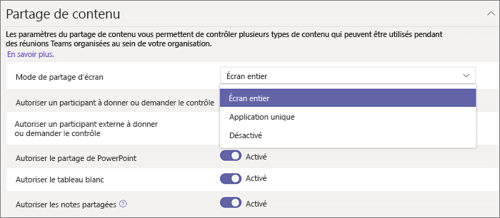

# Configurer le partage du bureau dans Microsoft Teams

Le partage de bureau permet aux utilisateurs d'afficher un écran ou une application pendant une réunion ou une conversation. Les administrateurs peuvent configurer le partage d’écran dans Microsoft Teams pour autoriser les utilisateurs à partager l'ensemble d'un écran, d'une application ou d'un fichier. Vous pouvez permettre aux utilisateurs d’attribuer ou de demander le contrôle, d'autoriser le partage PowerPoint, d'ajouter un tableau blanc et d'autoriser les notes partagées. Vous pouvez également configurer si les participants anonymes ou externes peuvent demander le contrôle de l’écran partagé. Les participants externes aux réunions Teams peuvent être classés comme suit :

- Participant anonyme
- Invités
- Utilisateurs de l’accès externe

Pour configurer le partage d’écran, vous créez une stratégie de réunion, puis vous l’attribuez aux utilisateurs que vous souhaitez gérer.

**Dans le [Centre d’administration Microsoft Teams](https://admin.teams.microsoft.com/)**

1. Sélectionnez **Réunions** > **Stratégies de réunion**.

    

2. Sur la page **Stratégies de réunion**, sélectionnez **Ajouter**.

    

3. Donnez un titre unique à votre stratégie, puis entrez une brève description.

4. Sous le **Partage de contenu**, choisissez un **Mode de partage d’écran** dans la liste déroulante :

   - **Écran complet** : permet au utilisateurs de partager la totalité de leur bureau.
   - **Application Unique** : permet aux utilisateurs de limiter le partage d’écran à une seule application active.
   - **Désactivé** : désactive le partage d’écran.

    

  > [!Note]
  > Vous ne pouvez pas activer la stratégie d’appel pour que les utilisateurs utilisent le partage d’écran à partir de la conversation. Toutefois, leur audio est désactivé jusqu’à ce qu’ils activent le son eux-mêmes. En outre, l’utilisateur partageant l’écran peut cliquer sur **Ajouter l’audio** pour activer l’audio. Si la stratégie d’appel est désactivée, les utilisateurs ne pourront pas ajouter l’audio au partage d’écran à partir de la session de conversation.

5. Activer ou désactiver les paramètres suivants :

    - **Autoriser un participant à donner ou demander le contrôle** : permet aux membres de l’équipe de donner ou de demander le contrôle du bureau ou de l'application du présentateur.
    - **Autoriser un participant externe à donner ou demander le contrôle** – Il s’agit d’une stratégie par utilisateur. Le fait qu’une organisation ait cette définition pour un utilisateur ne contrôle pas ce que les participants externes peuvent effectuer, quel que soit l’organisateur de la réunion. Ce paramètre détermine si les participants externes peuvent bénéficier d’un contrôle ou demander le contrôle de l’écran du destinataire, en fonction de ce que le partage a défini dans les stratégies de réunion de leur organisation.
    - **Autoriser le partage de PowerPoint** : permet aux utilisateurs de créer des réunions autorisant le téléchargement et le partage de présentations PowerPoint.
    - **Autoriser le tableau blanc** : permet aux utilisateurs de partager un tableau blanc.
    - **Autoriser les notes partagées** : permet aux utilisateurs de prendre des notes partagées.

6. Cliquez sur **Enregistrer**.

## Utiliser PowerShell pour configurer le bureau partagé

Vous pouvez également utiliser l’applet de commande [CsTeamsMeetingPolicy](/powershell/module/skype/set-csteamsmeetingpolicy) pour contrôler le partage de Bureau.

- Description
- ScreenSharingMode
- AllowPrivateCalling
- AllowParticipantGiveRequestControl
- AllowExternalParticipantGiveRequestControl
- AllowPowerPointSharing
- AllowWhiteboard
- AllowSharedNotes

[En savoir plus sur l’utilisation de l'applet de commande csTeamsMeetingPolicy](/powershell/module/skype/set-csteamsmeetingpolicy).