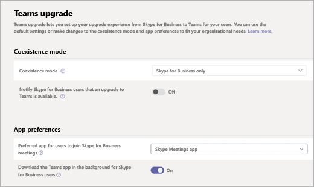

# Configurer l’application Réunions Skype pour qu’elle fonctionne avec Teams

Une fois qu’un utilisateur a été mis à niveau vers Microsoft Teams, les administrateurs peuvent utiliser le Centre d’administration Microsoft Teams pour spécifier l’application préférée que les utilisateurs utiliseront pour participer à Skype Entreprise réunions.

Pour spécifier l’application Skype pour réunions comme application préférée :

1. Se connecter au centre d’administration de Microsoft Teams.
2. Dans le volet gauche, sous **Teams**, sélectionnez **Les paramètres de mise à niveau de Teams**.
3. Dans la page mise à niveau de Teams, sous **Préférences d’application**, sélectionnez **l’application Réunions Skype** dans l’application **Préférée pour que les utilisateurs rejoignent Skype Entreprise liste déroulante des réunions**.

    

## Limitations connues

Les utilisateurs qui utilisent l’application Réunions Skype avec Teams sont soumis aux limitations suivantes :

- Les utilisateurs n’ont pas la possibilité de modifier leur appareil vidéo.
- Une fois qu’un utilisateur a été mis à niveau vers Teams, si l’utilisateur participe à une réunion à l’aide de l’application Réunions Skype et reçoit ensuite un appel sur Teams, la réunion dans l’application Réunions Skype n’est pas mise en attente. Au lieu de cela, l’utilisateur est connecté aux deux appels.

## Plus d’informations

- [Qu’est-ce que l’application Réunions Skype (Application Web Skype Entreprise)](https://support.office.microsoft.com/article/what-is-skype-meetings-app-skype-for-business-web-app-1ff3d412-718a-4982-8ff2-a4992608cdb5)
- [Configuration réseau minimale requise pour l’application Réunions Skype](/previous-versions/office/communications/mt845808(v=ocs.16))
