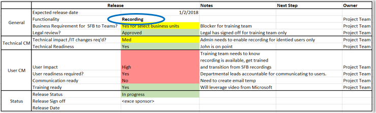

# Utilisation efficace Microsoft Teams

Cet article fait partie de la phase d’excellence opérationnelle de votre parcours de mise à niveau, qui commence dès que vous avez terminé la mise à niveau d’Skype Entreprise vers Teams.

Les technologies innovent à un rythme inédit. Rester à jour et activer un environnement d’espace de travail moderne est devenu une norme de fonctionnement des organisations. À mesure Microsoft Teams, Microsoft 365 et la vision intelligente de communication de Microsoft continuent de se développer, disposer d’un plan opérationnel permet de s’assurer que votre organisation est opérationnelle pour le succès à long terme. Un plan opérationnel optimal inclut une surveillance de votre environnement pour l’état d’santé et la qualité, une dynamique continue pour optimiser l’adoption et la planification de nouvelles fonctionnalités qui continueront d’être disponibles en ligne au fil du temps.

## Surveiller l’état et la qualité du réseau

L’état de votre réseau affecte l’expérience utilisateur. Lorsqu’un utilisateur a une expérience médiocre (par exemple, le décalage ou la chute d’appel lorsque vous rejoignez une réunion), il met en corrélation cela avec la technologie elle-même, ce qui leur donne l’impression que la technologie ne fonctionne pas et qui ouvre la porte pour les applications non pris en compte. La mise en œuvre d’un plan de surveillance et d’atténuation de l’état du réseau permettra de garantir une expérience utilisateur positive en plus de réduire les appels sur votre support technique. Pour plus d’informations, consultez :

- [Exploiter votre service](upgrade-operate-my-service.md)
- [Surveiller et améliorer la qualité des appels](monitor-call-quality-qos.md)
- [Améliorer votre service](upgrade-enhance-my-service.md)

## Stimuler la dynamique et l’adoption des utilisateurs

Pour réaliser un bénéfice maximal et des résultats d’entreprise avec Teams résultats, les utilisateurs doivent réellement l’utiliser. Toutefois, l’enthousiasme initial a tendance à décliner et les utilisateurs revenir facilement aux anciennes méthodes de travail. Encouragez l’adoption par les utilisateurs et favorisez l Teams les utilisateurs avec un plan d’adoption continu, qui peut inclure :

- S’inscrire des pairs champions pour aider à réduire et encourager d’autres utilisateurs.
- Consulter le guide [Microsoft 365'adoption pour](https://go.microsoft.com/fwlink/?linkid=859045) obtenir des conseils sur la participation et la conduite de l’adoption.
- Tirer parti du [Kit Teams réussite des](https://aka.ms/TeamsCustomerSuccess) clients pour améliorer la connaissance et le partage des meilleures pratiques.
- Mise en œuvre d’une stratégie d’adoption formelle et de [gestion des changements](http://www.successwithteams.com/) pour soutenir la croissance de l’adoption.

## Préparer la nouvelle fonctionnalité

Le cycle de vie d’une technologie donnée a changé de cycle de croissance dynamique. Cela signifie que les feuilles Teams et Microsoft 365 feuilles de route continueront d’être mises en place, de nouvelles fonctionnalités s’éclairageant à une cadence régulière. L’établissement d’un cycle de changement au sein de votre organisation vous permettra de vous assurer que vous êtes prêt à gérer des améliorations continuelles de la collaboration et à apporter une valeur maximale. Cela peut inclure :

- Surveiller la feuille Teams [feuille de route.](https://products.office.com/business/office-365-roadmap?filters=microsoft%20teams)
- Implémentez un formulaire de planification des changements (comme illustré ci-dessous) pour préparer et implémenter de nouvelles fonctionnalités. N’oubliez pas d’inclure des activités de préparation technique et utilisateur.

