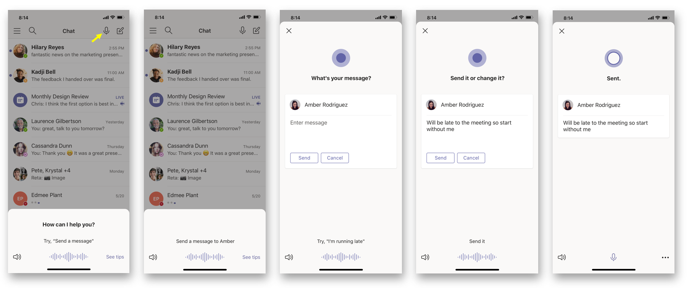

# <a name="cortana-voice-assistance-in-teams"></a><span data-ttu-id="8e29e-103">Assistance vocale Cortana dans Teams</span><span class="sxs-lookup"><span data-stu-id="8e29e-103">Cortana voice assistance in Teams</span></span>

> [!Note]
> <span data-ttu-id="8e29e-104">L'assistance vocale Cortana est prise en charge dans les applications mobiles Microsoft Teams pour iOS et Android, et Microsoft Teams s'affiche pour les utilisateurs aux États-Unis, au Royaume-Uni, au Canada, en Inde et en Australie.</span><span class="sxs-lookup"><span data-stu-id="8e29e-104">Cortana voice assistance is supported in Microsoft Teams mobile apps for iOS and Android and Microsoft Teams displays for users in the United States, United Kingdom, Canada, India, and Australia.</span></span>  <span data-ttu-id="8e29e-105">Les salles Microsoft Teams sur Windows sont uniquement pris en charge pour les utilisateurs aux États-Unis.</span><span class="sxs-lookup"><span data-stu-id="8e29e-105">Microsoft Teams Rooms on Windows is only supported for users in the United States.</span></span> <span data-ttu-id="8e29e-106">L'assistance vocale Cortana n'est actuellement pas disponible pour les clients GCC, GCC-High, DoD et EDU.</span><span class="sxs-lookup"><span data-stu-id="8e29e-106">Cortana voice assistance isn't currently available for GCC, GCC-High, DoD, EDU tenants.</span></span> <span data-ttu-id="8e29e-107">Une extension vers d'autres langues et régions sera mise en place dans le cadre des prochaines publication.</span><span class="sxs-lookup"><span data-stu-id="8e29e-107">Expansion to additional languages and regions will happen as part of future releases.</span></span>

> [!Note]
> <span data-ttu-id="8e29e-108">L'assistance vocale Cortana dans les salles Microsoft Teams est disponible sous Aperçu.</span><span class="sxs-lookup"><span data-stu-id="8e29e-108">Cortana voice assistance in Microsoft  Teams  Rooms is released under Preview.</span></span> <span data-ttu-id="8e29e-109">Dans sa version d'aperçu, Cortana est prise en charge uniquement aux États-Unis avec la langue EN-US sur les appareils qui ont connecté des micros Microphones Microphones.</span><span class="sxs-lookup"><span data-stu-id="8e29e-109">In its preview release, Cortana is supported only in the US with language EN-US on devices that have connected Rally microphones.</span></span>

<span data-ttu-id="8e29e-110">L'assistance vocale Cortana dans l'application mobile Teams, dans les salles Microsoft Teams sur Windows et sur les périphériques d'affichage de Microsoft Teams permet aux utilisateurs de Microsoft 365 Entreprise de simplifier la communication, la collaboration et les tâches liées aux réunions à l'aide d'un langage naturel parlé.</span><span class="sxs-lookup"><span data-stu-id="8e29e-110">Cortana voice assistance in the Teams mobile app, on Microsoft Teams Rooms on Windows, and on Microsoft Teams display devices enables Microsoft 365 Enterprise users to streamline communication, collaboration, and meeting-related tasks using spoken natural language.</span></span> <span data-ttu-id="8e29e-111">Les utilisateurs peuvent parler à Cortana en sélectionnant le bouton du microphone situé dans le coin supérieur droit de l'application mobile Teams, ou en disant &#8220;Cortana&#8221; dans la salle Microsoft Teams ou lors de l'utilisation d'une présentation Microsoft Teams.</span><span class="sxs-lookup"><span data-stu-id="8e29e-111">Users can speak to Cortana by selecting the microphone button located in the upper right of the Teams mobile app, or by saying &#8220;Cortana&#8221; in the Microsoft Teams Room or when using a Microsoft Teams display.</span></span> <span data-ttu-id="8e29e-112">Pour communiquer rapidement avec leur équipe en mains libres et en cours, les utilisateurs peuvent dire des requêtes telles que &#8220;appeler Megan&#8221; ou &#8220;envoyer un message à mon prochain&#8221;.</span><span class="sxs-lookup"><span data-stu-id="8e29e-112">To quickly connect with their team hands-free and while on the go, users can say queries such as &#8220;call Megan&#8221; or &#8220;send a message to my next meeting&#8221;.</span></span> <span data-ttu-id="8e29e-113">Les utilisateurs peuvent également participer à des réunions en &#8220;participer à ma prochaine&#8221; réunion et utiliser l'assistance vocale pour partager des fichiers, consulter leur calendrier et bien plus encore.</span><span class="sxs-lookup"><span data-stu-id="8e29e-113">Users can also join meetings by saying &#8220;join my next meeting&#8221; and use voice assistance to share files, check their calendar, and more.</span></span> <span data-ttu-id="8e29e-114">Ces expériences d'assistance vocale sont tenues à l'aide de services de qualité professionnelle [de Cortana](/microsoft-365/admin/misc/cortana-integration?view=o365-worldwide) qui respectent pleinement les promesses de confidentialité, de sécurité et de conformité d'Office 365, comme le reflètent les conditions des services en ligne [(OST).](https://www.microsoft.com/licensing/product-licensing/products?rtc=1)</span><span class="sxs-lookup"><span data-stu-id="8e29e-114">These voice assistance experiences are delivered using [Cortana enterprise-grade services](/microsoft-365/admin/misc/cortana-integration?view=o365-worldwide) that fully comply with Office 365's privacy, security, and compliance promises as reflected in the [Online Services Terms (OST)](https://www.microsoft.com/licensing/product-licensing/products?rtc=1).</span></span>

<span data-ttu-id="8e29e-115">L'image illustre l'envoi d'une conversation à l'aide de Cortana sur un appareil mobile.</span><span class="sxs-lookup"><span data-stu-id="8e29e-115">The image shows sending a chat using Cortana on a mobile device.</span></span>



## <a name="admin-control-and-limitations"></a><span data-ttu-id="8e29e-117">Contrôle et limitations de l'administrateur</span><span class="sxs-lookup"><span data-stu-id="8e29e-117">Admin control and limitations</span></span>

<span data-ttu-id="8e29e-118">L'assistance vocale Cortana dans Teams est disponible à l'aide de services qui respectent pleinement les promesses de confidentialité, de sécurité et de conformité au niveau d'Office 365, comme indiqué dans les conditions des services en ligne (OST).</span><span class="sxs-lookup"><span data-stu-id="8e29e-118">Cortana voice assistance in Teams is delivered using services that fully comply with the Office 365 enterprise-level privacy, security, and compliance promises as reflected in the Online Services Terms (OST).</span></span> <span data-ttu-id="8e29e-119">La fonctionnalité sera activée par défaut pour les locataires.</span><span class="sxs-lookup"><span data-stu-id="8e29e-119">The feature will be enabled by default for tenants.</span></span>

<span data-ttu-id="8e29e-120">Les administrateurs des locataires peuvent contrôler qui dans leur client peut utiliser l'assistance vocale Cortana dans Teams à l'aide d'une stratégie (TeamsCortanaPolicy).</span><span class="sxs-lookup"><span data-stu-id="8e29e-120">Tenant admins can control who in their tenant can use Cortana voice assistance in Teams using a policy (TeamsCortanaPolicy).</span></span> <span data-ttu-id="8e29e-121">Cette stratégie peut être définie au niveau du compte d'utilisateur ou du client.</span><span class="sxs-lookup"><span data-stu-id="8e29e-121">This policy can be set at either a user account level or tenant level.</span></span> <span data-ttu-id="8e29e-122">Les administrateurs peuvent utiliser le champ CortanaVoiceInvocationMode au sein de ce contrôle de stratégie pour déterminer si Cortana est désactivée, activée avec l'appel du bouton d'appel uniquement ou avec l'appel du mot de sortie (applicable aux appareils qui le supportent, comme l'affichage de Microsoft Teams).</span><span class="sxs-lookup"><span data-stu-id="8e29e-122">Admins can use the CortanaVoiceInvocationMode field within this policy control to determine whether Cortana is disabled, enabled with push-button invocation only, or with wake word invocation as well (applicable to devices that support it, like the Microsoft Teams display).</span></span>

<span data-ttu-id="8e29e-123">Les administrateurs peuvent utiliser les cmdlets PowerShell suivantes pour gérer cette stratégie (la stratégie n'est actuellement pas disponible dans le Centre d'administration Microsoft Teams).</span><span class="sxs-lookup"><span data-stu-id="8e29e-123">Admins can use the following PowerShell cmdlets to manage this policy (the policy is currently not available in Microsoft Teams admin center).</span></span>

- [<span data-ttu-id="8e29e-124">New-CsTeamsCortanaPolicy</span><span class="sxs-lookup"><span data-stu-id="8e29e-124">New-CsTeamsCortanaPolicy</span></span>](/powershell/module/skype/New-CsTeamsCortanaPolicy)

- [<span data-ttu-id="8e29e-125">Get-CsTeamsCortanaPolicy</span><span class="sxs-lookup"><span data-stu-id="8e29e-125">Get-CsTeamsCortanaPolicy</span></span>](/powershell/module/skype/Get-CsTeamsCortanaPolicy)

- [<span data-ttu-id="8e29e-126">Grant-CsTeamsCortanaPolicy</span><span class="sxs-lookup"><span data-stu-id="8e29e-126">Grant-CsTeamsCortanaPolicy</span></span>](/powershell/module/skype/Grant-CsTeamsCortanaPolicy)

- [<span data-ttu-id="8e29e-127">Set-CsTeamsCortanaPolicy</span><span class="sxs-lookup"><span data-stu-id="8e29e-127">Set-CsTeamsCortanaPolicy</span></span>](/powershell/module/skype/Set-CsTeamsCortanaPolicy)

- [<span data-ttu-id="8e29e-128">Remove-CsTeamsCortanaPolicy</span><span class="sxs-lookup"><span data-stu-id="8e29e-128">Remove-CsTeamsCortanaPolicy</span></span>](/powershell/module/skype/Remove-CsTeamsCortanaPolicy)

<span data-ttu-id="8e29e-129">Par exemple, la commande ci-dessous crée une stratégie avec le nom &#8220;EmployeeCortanaPolicy&#8221; où l'assistance vocale Cortana dans Microsoft Teams est désactivée.</span><span class="sxs-lookup"><span data-stu-id="8e29e-129">For example, the command below creates a new policy with name &#8220;EmployeeCortanaPolicy&#8221; where Cortana voice assistance in Microsoft Teams is disabled.</span></span>  

```PowerShell
PS C:\> New-CsTeamsCortanaPolicy -Identity EmployeeCortanaPolicy -CortanaVoiceInvocationMode Disabled
```

<span data-ttu-id="8e29e-130">Cet exemple illustre la mise à jour d'une stratégie existante avec le nom &#8220;EmployeeCortanaPolicy&#8221; et l'activation de l'assistance vocale Cortana dans Microsoft Teams avec appel du bouton d'appel uniquement.</span><span class="sxs-lookup"><span data-stu-id="8e29e-130">This example shows updating an existing policy with name &#8220;EmployeeCortanaPolicy&#8221; and enabling Cortana voice assistance in Microsoft Teams with push button invocation only.</span></span> <span data-ttu-id="8e29e-131">Les utilisateurs pourront appeler Cortana en sélectionnant le bouton du micro de Cortana dans Teams.</span><span class="sxs-lookup"><span data-stu-id="8e29e-131">Users will be able to invoke Cortana by selecting the Cortana mic button in Teams.</span></span> <span data-ttu-id="8e29e-132">Le mot de veille (&#8220;Hey Cortana&#8221; ou &#8220;Cortana&#8221;) est désactivé.</span><span class="sxs-lookup"><span data-stu-id="8e29e-132">Wake word (&#8220;Hey Cortana&#8221; or &#8220;Cortana&#8221;) invocation will be disabled.</span></span>  

```PowerShell
PS C:\> Set-CsTeamsCortanaPolicy -Identity EmployeeCortanaPolicy -CortanaVoiceInvocationMode PushToTalkUserOverride
```

<span data-ttu-id="8e29e-133">Cet exemple illustre la mise à jour de la stratégie et l'activation de l'assistance vocale Cortana avec le bouton Push et l'appel de word de veille.</span><span class="sxs-lookup"><span data-stu-id="8e29e-133">This example shows updating the policy and enabling Cortana voice assistance with both push button and wake word invocation.</span></span>

```PowerShell
PS C:\> Set-CsTeamsCortanaPolicy -Identity EmployeeCortanaPolicy -CortanaVoiceInvocationMode WakeWordPushToTalkUserOverride
```

<span data-ttu-id="8e29e-134">À l'heure de la publication initiale pour les utilisateurs de Microsoft 365 Entreprise aux États-Unis en anglais, les fonctions suivantes sont disponibles :</span><span class="sxs-lookup"><span data-stu-id="8e29e-134">At the time, of the initial release for Microsoft 365 Enterprise users in the US in English, the following are available functions:</span></span>

- <span data-ttu-id="8e29e-135">L'application mobile Teams ne prendra pas en charge l'activation de word de veille, mais elle sera prise en charge à l'avenir.</span><span class="sxs-lookup"><span data-stu-id="8e29e-135">The Teams mobile app won't support wake word activation, but it will be supported in the future.</span></span>  

- <span data-ttu-id="8e29e-136">Les salles Microsoft Teams sur les appareils d'affichage Windows et Microsoft Teams 365 365 365 365 365 365 365 365 36</span><span class="sxs-lookup"><span data-stu-id="8e29e-136">Microsoft Teams Rooms on Windows and Microsoft Teams display devices will support wake word activation.</span></span>

## <a name="user-control"></a><span data-ttu-id="8e29e-137">Contrôle de l'utilisateur</span><span class="sxs-lookup"><span data-stu-id="8e29e-137">User control</span></span>

<span data-ttu-id="8e29e-138">Les utilisateurs individuels peuvent essayer l'assistance vocale Cortana sur différents appareils :</span><span class="sxs-lookup"><span data-stu-id="8e29e-138">Individual users can try out Cortana voice assistance in different devices:</span></span>

- <span data-ttu-id="8e29e-139">Sélectionnez le bouton microphone dans l'application mobile Teams.</span><span class="sxs-lookup"><span data-stu-id="8e29e-139">Select the microphone button in the Teams mobile app.</span></span>

- <span data-ttu-id="8e29e-140">Sélectionnez le bouton du microphone ou dites « Cortana » dans les salles Microsoft Teams.</span><span class="sxs-lookup"><span data-stu-id="8e29e-140">Select the microphone button or say "Cortana" in Microsoft Teams Rooms.</span></span>

- <span data-ttu-id="8e29e-141">Dites « Cortana » sur les appareils d'affichage de Microsoft Teams.</span><span class="sxs-lookup"><span data-stu-id="8e29e-141">Say "Cortana" on Microsoft Teams display devices.</span></span>

<span data-ttu-id="8e29e-142">Vous pouvez déterminer si Cortana dans Teams est activée pour votre appareil à l'aide d'un paramètre de l'appareil.</span><span class="sxs-lookup"><span data-stu-id="8e29e-142">You can control whether Cortana in Teams is enabled for your device by using a setting in the device.</span></span>

### <a name="teams-mobile-app-or-the-microsoft-teams-display"></a><span data-ttu-id="8e29e-143">Application mobile Teams ou affichage de Microsoft Teams</span><span class="sxs-lookup"><span data-stu-id="8e29e-143">Teams mobile app or the Microsoft Teams display</span></span>

  1. <span data-ttu-id="8e29e-144">Ouvrez l'application mobile Teams.</span><span class="sxs-lookup"><span data-stu-id="8e29e-144">Open the Teams mobile app.</span></span>

  2. <span data-ttu-id="8e29e-145">Sélectionnez **Paramètres**  >  **Cortana.**</span><span class="sxs-lookup"><span data-stu-id="8e29e-145">Select **Settings** > **Cortana**.</span></span>

  3. <span data-ttu-id="8e29e-146">Déplacez le **basculement sur Ou** **Hors.**</span><span class="sxs-lookup"><span data-stu-id="8e29e-146">Move the toggle **On** or **Off**.</span></span>

### <a name="microsoft-teams-display"></a><span data-ttu-id="8e29e-147">Affichage de Microsoft Teams</span><span class="sxs-lookup"><span data-stu-id="8e29e-147">Microsoft Teams display</span></span>

  1. <span data-ttu-id="8e29e-148">Allez à l'écran ambiant (accueil) de l'affichage de Microsoft Teams.</span><span class="sxs-lookup"><span data-stu-id="8e29e-148">Go to the ambient (home) screen of the Microsoft Teams display.</span></span>

  2. <span data-ttu-id="8e29e-149">Sélectionnez l'avatar utilisateur, puis **Paramètres.**</span><span class="sxs-lookup"><span data-stu-id="8e29e-149">Select the user avatar, and then select **Settings**.</span></span> <span data-ttu-id="8e29e-150">Si Cortana est activée, dites : « Cortana, accéder aux paramètres ».</span><span class="sxs-lookup"><span data-stu-id="8e29e-150">If Cortana is enabled, say, "Cortana, go to Settings."</span></span>

  3. <span data-ttu-id="8e29e-151">Déplacez le **basculement sur Ou** **Hors.**</span><span class="sxs-lookup"><span data-stu-id="8e29e-151">Move the toggle **On** or **Off**.</span></span>
  
### <a name="microsoft-teams-rooms-on-windows"></a><span data-ttu-id="8e29e-152">Salles Microsoft Teams sur Windows</span><span class="sxs-lookup"><span data-stu-id="8e29e-152">Microsoft Teams Rooms on Windows</span></span>

<span data-ttu-id="8e29e-153">Les modifications au niveau de l'appareil sont disponibles si Cortana est activée au niveau du client.</span><span class="sxs-lookup"><span data-stu-id="8e29e-153">Making changes at the device level is available if Cortana is enabled at the tenant level.</span></span> <span data-ttu-id="8e29e-154">Cortana sera publiée par défaut.</span><span class="sxs-lookup"><span data-stu-id="8e29e-154">Cortana will be released OFF by default.</span></span>

<span data-ttu-id="8e29e-155">Pour activer Cortana au niveau de l'appareil, ces attributs XML doivent être ajoutés au fichier XML SkypeSettings :</span><span class="sxs-lookup"><span data-stu-id="8e29e-155">To enable Cortana at the device level, these XML attributes must be added in the SkypeSettings XML file:</span></span>

```xml
<SkypeSettings>  

        <CortanaEnabled>true</CortanaEnabled>  

        <CortanaWakewordEnabled>true</CortanaWakewordEnabled>  

</SkypeSettings> 
```

<span data-ttu-id="8e29e-156">Apporter des modifications au niveau de la réunion est disponible si Cortana est activée au niveau de l'appareil.</span><span class="sxs-lookup"><span data-stu-id="8e29e-156">Making changes at the meeting level is available if Cortana is enabled at the device level.</span></span>

<span data-ttu-id="8e29e-157">Pour activer l'assistance vocale Cortana pendant une réunion, activez ou désactivez **le** **paramètre.**</span><span class="sxs-lookup"><span data-stu-id="8e29e-157">To enable Cortana voice assistance during a meeting, move the toggle **On** or **Off**.</span></span> <span data-ttu-id="8e29e-158">Une fois la réunion terminée, Cortana revient au paramètre au niveau de l’appareil.</span><span class="sxs-lookup"><span data-stu-id="8e29e-158">Once the meeting ends, Cortana returns to the device level settings set.</span></span>
