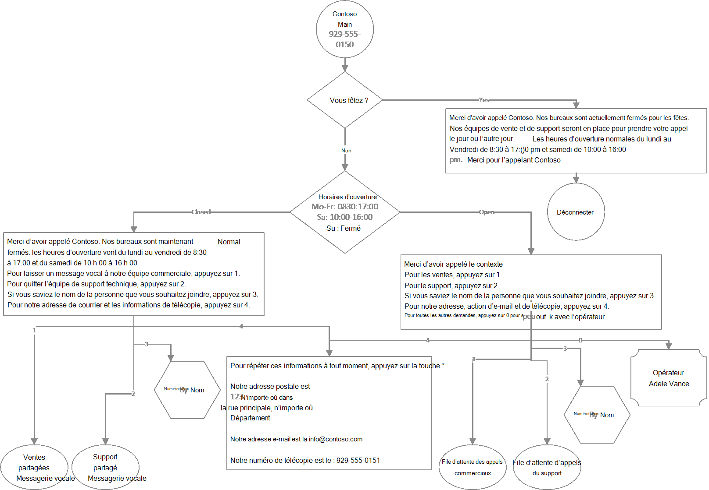

# <a name="create-an-auto-attendant-via-cmdlets"></a>Créer un moyen de gestion automatique via des cmdlets

## <a name="assumptions"></a>Hypothèses
1)  PowerShell est installé sur votre ordinateur
- Configurer votre ordinateur pour [l’Windows PowerShell](/SkypeForBusiness/set-up-your-computer-for-windows-powershell/set-up-your-computer-for-windows-powershell)
- Module MSTeams installé ````  (Install-Module -Name MicrosoftTeams -Force -AllowClobber) ````
- Module MSOnline installé ```` Install-Module -Name MSOnline -Force -AllowClobber ````
2)  Vous avez des droits d’administration des locataires
3)  Vous avez acheté des Microsoft Teams Téléphone
4)  Les files d’attente d’appels mentionnées ci-dessous ont déjà été configurées à la suite du guide Création de files d’attente d’appels avec les [cmdlets PowerShell.](create-a-phone-system-call-queue-via-cmdlets.md)
                                                                                               
Remarque : certaines des cmdlets référencés ci-dessous peuvent faire partie de la version d’aperçu public Teams module PowerShell.  Pour plus d’informations, [voir installer Teams prévisualisation publique de PowerShell,](teams-powershell-install.md) ainsi que les Microsoft Teams de publication [de PowerShell.](teams-powershell-release-notes.md)

Les utilisateurs qui ont déjà installé le module MicrosoftTeams doivent s’assurer que la version la plus récente ````Update-Module MicrosoftTeams```` est installée.

## <a name="scenario"></a>Scénario

Le flux d’appels du attendant automatique suivant est créé :



Informations supplémentaires sur la configuration :

- Standard automatique : Contso Main
- - Opérateur : Adele Vance
- - Activer les entrées vocales : non activé
- - Recherche dans l’annuaire : Aucune
- - Jours fériés :
- - - 1er janvier 2022
- - - 24 décembre 2022
- - - 25 décembre 2022

- Standard automatique : Numérotation par nom de Contoso
- - Opérateur : Adele Vance
- - Fuseau horaire : UTC
- - Langue : Anglais (États-Unis)
- - Activer les entrées vocales : activé
- - Message d’accueil : Aucun
- - Menu : TTS, « Dites ou entrez le nom de la personne que vous souhaitez joindre. Pour revenir au menu précédent, appuyez sur 9 »
- - Recherche dans l’annuaire : numérotation par nom
- - Portée de la numérotation : membres du support & Ventes

## <a name="login"></a>Connexion
Vous êtes invité à entrer vos informations d’identification d Teams administrateur.
```
$credential = Get-Credential
Connect-MicrosoftTeams -Credential $credential
Connect-MsolService -Credential $credential
````

## <a name="get-operator-information"></a>Obtenir des informations sur les opérateurs
````
$operatorID = (Get-CsOnlineUser -Identity “sip:adele@contoso.com”).ObjectID

$operatorEntity = New-CsAutoAttendantCallableEntity -Identity $operatorID -Type User
````

## <a name="dial-by-name-auto-attendant---resource-account-creation"></a>Numérotation par nom Standard automatique - Création d’un compte de ressource
Remarque : créez ici un compte de ressource afin qu’il puisse être référencé sur le attendant automatique principal.  Le attendant automatique numérotation par nom réel sera créé ultérieurement.

### <a name="get-license-types"></a>Obtenir les types de licences
````
Get-MsolAccountSku
````

### <a name="create-and-assign-resource-account"></a>Créer et affecter un compte de ressource
Remarque : Téléphone numéro non requis ici, car la file d’attente d’appels est avant terminée par un Standard automatique
- ApplicationID
- - Standard automatique : ce933385-9390-45d1-9512-c8d228074e07
- - File d’attente d’appels : 11cd3e2e-fccb-42ad-ad00-878b93575e07
````
New-CsOnlineApplicationInstance -UserPrincipalName ContosoDialByNameAA-RA@contoso.com -DisplayName "Contoso Dial By Name AA" -ApplicationID "ce933385-9390-45d1-9512-c8d228074e07"

Set-MsolUser -UserPrincipalName "ContosoDialByNameAA-RA@contoso.com" -UsageLocation US

Set-MsolUserLicense -UserPrincipalName “ContosoDialByNameAA-RA@contoso.com” -AddLicenses "contoso:PHONESYSTEM_VIRTUALUSER"

$dialByNameApplicationInstanceID = (Get-CsOnlineUser "ContosoDialByNameAA-RA@contoso.com").ObjectID
````

## <a name="contoso-main-menu-auto-attendant"></a>Menu principal de Contoso Standard automatique
### <a name="create-holiday-schedules"></a>Créer des plannings de congés
````
$dtr = New-CsOnlineDateTimeRange -Start "24/12/2022" -End "25/12/2022"

$christmasSchedule = New-CsOnlineSchedule -Name "Christmas" -FixedSchedule -DateTimeRanges @($dtr)

$dtr = New-CsOnlineDateTimeRange -Start "01/01/2022" -End "02/01/2022"

$newyearSchedule = New-CsOnlineSchedule -Name "New Year" -FixedSchedule -DateTimeRanges @($dtr)
````

### <a name="create-address-fax-and-email-information-prompt"></a>Créer une invite d’informations sur l’adresse, la télécopie et le courrier électronique
````
$addressPrompt = New-CsAutoAttendantPrompt -TextToSpeechPrompt "To repeat this information at any time press the * key. Our mailing address is: 123 Main Street, Any town, Any Place, County. Our email address is: info@contoso.com. Our fax number is: 929-555-0151"
````

### <a name="create-holiday-prompts-and-menu-options"></a>Créer des invites et des options de menu pour les fêtes
````
$christmasGreetingPrompt = New-CsAutoAttendantPrompt -TextToSpeechPrompt "Thank you for calling Contoso. Our offices ae currently closed for the Christmas holiday. Our Sales and Support teams will be happy to take your call on the next business day. Regular business hours are Monday through Friday from 8:30 am to 5:00 pm and Saturday from 10:00 am to 4:00 pm eastern time. Thank you for calling Contso."

$christmasMenuOption = New-CsAutoAttendantMenuOption -Action DisconnectCall -DtmfResponse Automatic

$christmasMenu = New-CsAutoAttendantMenu -Name "Christmas Menu" -MenuOptions @($christmasMenuOption)

$christmasCallFlow = New-CsAutoAttendantCallFlow -Name "Christmas" -Greetings @($christmasGreetingPrompt) -Menu $christmasMenu

$christmasCallHandlingAssociation = New-CsAutoAttendantCallHandlingAssociation -Type Holiday -ScheduleId $christmasSchedule.Id -CallFlowId $christmasCallFlow.Id

$newyearGreetingPrompt = New-CsAutoAttendantPrompt -TextToSpeechPrompt "Thank you for calling Contoso. Our offices ae currently closed for the New Year’s holiday. Our Sales and Support teams will be happy to take your call on the next business day. Regular business hours are Monday through Friday from 8:30 am to 5:00 pm and Saturday from 10:00 am to 4:00 pm eastern time. Thank you for calling Contso."

$newyearMenuOption = New-CsAutoAttendantMenuOption -Action DisconnectCall -DtmfResponse Automatic

$newyearMenu = New-CsAutoAttendantMenu -Name "New Year Menu" -MenuOptions @($newyearMenuOption)

$newyearCallFlow = New-CsAutoAttendantCallFlow -Name "New Year" -Greetings @($newyearGreetingPrompt) -Menu $newyearMenu

$newyearCallHandlingAssociation = New-CsAutoAttendantCallHandlingAssociation -Type Holiday -ScheduleId $newyearSchedule.Id -CallFlowId $newyearCallFlow.Id
````

### <a name="create-after-hours-schedules"></a>Créer des plannings d’heures de travail en de suite
````
$timerangeMoFr = New-CsOnlineTimeRange -Start 08:30 -end 17:00

$timerangeSa = New-CsOnlineTimeRange -Start 10:00 -end 16:00

$afterHoursSchedule = New-CsOnlineSchedule -Name "After Hours Schedule" -WeeklyRecurrentSchedule -MondayHours @($timerangeMoFr) -TuesdayHours @($timerangeMoFr) -WednesdayHours @($timerangeMoFr) -ThursdayHours @($timerangeMoFr) -FridayHours @($timerangeMoFr) -SaturdayHours @($timerangeSa) -Complement
````

### <a name="create-after-hours-prompts-and-menu-options"></a>Créer des invites et des options de menu après les heures de travail
````
$afterHoursGreetingPrompt = New-CsAutoAttendantPrompt -TextToSpeechPrompt "Thank you for calling Contoso. Our offices are now closed. Regular business hours are Monday through Friday from 8:30 am to 5:00 pm and Saturday from 10:00 am to 4:00 pm eastern time."

$afterHoursMenuPrompt = New-CsAutoAttendantPrompt -TextToSpeechPrompt “To leave a voicemail for our sales team press 1.To leave a message for our support team press 2.If you know the name of the person you would like to reach, press 3.For our address, email and fax information press 4.”

$afterHoursMenuOption1Target = (Get-Team -displayname "Sales").GroupID

$afterHoursMenuOption1Entity = New-CsAutoAttendantCallableEntity -Identity $afterHoursMenuOption1Target -Type SharedVoiceMail -EnableTranscription -EnableSharedVoicemailSystemPromptSuppression

$afterHoursMenuOption1 = New-CsAutoAttendantMenuOption -Action TransferCallToTarget -DtmfResponse Tone1 -CallTarget $afterHoursMenuOption1Entity

$afterHoursMenuOption2Target = (Get-Team -displayname "Support").GroupID

$afterHoursMenuOption2Entity = New-CsAutoAttendantCallableEntity -Identity $afterHoursMenuOption2Target -Type SharedVoicemail -EnableTranscription -EnableSharedVoicemailSystemPromptSuppression

$afterHoursMenuOption2 = New-CsAutoAttendantMenuOption -Action TransferCallToTarget -DtmfResponse Tone2 -CallTarget $afterHoursMenuOption2Entity

$dialbynameAAOption3Target = (Get-CsOnlineUser -Identity “ContosoDialByNameAA-RA@contso.com”).ObjectID

$dialbynameAAMenuOption3Entity = New-CsAutoAttendantCallableEntity -Identity $dialbynameAAOption3Target -Type applicationendpoint

$dialbynameAAMenuOption3 = New-CsAutoAttendantMenuOption -Action TransferCallToTarget -DtmfResponse Tone3 -CallTarget $dialbynameAAMenuOption3Entity

$afterHoursMenuOption4 = New-CsAutoAttendantMenuOption -Action Announcement -DtmfResponse Tone4 -Prompt $addressPrompt
````

### <a name="create-after-hours-menu-and-call-flow"></a>Créer un menu d’heures de travail en de suite et un menu d’Flow
````
$afterHoursMenu = New-CsAutoAttendantMenu -Name "After Hours Menu" -MenuOptions @($afterHoursMenuOption1, $afterHoursMenuOption2, $dialbynameAAMenuOption3, $afterHoursMenuOption4) -Prompt $afterHoursMenuPrompt

$afterHoursCallFlow = New-CsAutoAttendantCallFlow -Name "After Hours Call Flow" -Greetings @($afterHoursGreetingPrompt) -Menu $afterHoursMenu

$afterHoursCallHandlingAssociation = New-CsAutoAttendantCallHandlingAssociation -Type AfterHours -ScheduleId $afterHoursSchedule.Id -CallFlowId $afterHoursCallFlow.Id
````

### <a name="create-open-hours-prompts-and-menu-options"></a>Créer des invites d’heures d’ouverture et des options de menu
````
$openHoursGreetingPrompt = New-CsAutoAttendantPrompt -TextToSpeechPrompt " Thank you for calling Contoso."

$openHoursMenuPrompt = New-CsAutoAttendantPrompt -TextToSpeechPrompt “For Sales press 1. For Support press 2. If you know the name of the person you would like to reach, press 3. For our address, email and fax information, press 4. For all other inquiries press 0 to speak with the operator.”

$openHoursMenuOption1Target = (Get-CsOnlineUser "Sales-RA@contoso.com").ObjectID

$openHoursMenuOption1Entity = New-CsAutoAttendantCallableEntity -Identity $openHoursMenuOption1Target -Type applicationendpoint

$openHoursMenuOption1 = New-CsAutoAttendantMenuOption -Action TransferCallToTarget -DtmfResponse Tone1 -CallTarget $openHoursMenuOption1Entity

$openHoursMenuOption2Target = (Get-CsOnlineUser "Support-RA@contoso.com").ObjectID

$openHoursMenuOption2Entity = New-CsAutoAttendantCallableEntity -Identity $openHoursMenuOption2Target -Type applicationendpoint

$openHoursMenuOption2 = New-CsAutoAttendantMenuOption -Action TransferCallToTarget -DtmfResponse Tone2 -CallTarget $openHoursMenuOption2Entity

$openHoursMenuOption4 = New-CsAutoAttendantMenuOption -Action Announcement -DtmfResponse Tone4 -Prompt $addressPrompt

$openHoursMenuOption0 = New-CsAutoAttendantMenuOption -Action TransferCallToOperator -DtmfResponse Tone0
````

### <a name="create-open-hours-menu"></a>Menu Créer des heures d’ouverture
````
$openHoursMenu = New-CsAutoAttendantMenu -Name "Open Hours Menu" -MenuOptions @($openHoursMenuOption1, $openHoursMenuOption2, $dialbynameAAMenuOption3, $openHoursMenuOption4, $openHoursMenuOption0) -Prompt $openHoursMenuPrompt

$openHoursCallFlow = New-CsAutoAttendantCallFlow -Name "Open Hours Call Flow" -Greetings @($openHoursGreetingPrompt) -Menu $openHoursMenu
````

### <a name="create-auto-attendant"></a>Créer des Standard automatique
````
$autoAttendant = New-CsAutoAttendant -Name “Contoso Main” -DefaultCallFlow $openHoursCallFlow -CallFlows @($afterHoursCallFlow, $christmasCallFlow, $newyearCallFlow) -CallHandlingAssociations @($afterHoursCallHandlingAssociation, $christmasCallHandlingAssociation, $newyearCallHandlingAssociation) -LanguageId “en-US” -TimeZoneId “Eastern Standard Time” -Operator $operatorEntity
````

### <a name="get-license-types"></a>Obtenir les types de licences
````
Get-MsolAccountSku
````

### <a name="create-and-assign-resource-account"></a>Créer et affecter un compte de ressource
Remarque : Téléphone numéro non requis ici, car la file d’attente d’appels est avant terminée par un Standard automatique
- ApplicationID
- - Standard automatique : ce933385-9390-45d1-9512-c8d228074e07
- - File d’attente d’appels : 11cd3e2e-fccb-42ad-ad00-878b93575e07
````
New-CsOnlineApplicationInstance -UserPrincipalName ContosoMainAA-RA@contoso.com -DisplayName "Contoso Main AA" -ApplicationID "ce933385-9390-45d1-9512-c8d228074e07"

Set-MsolUser -UserPrincipalName "ContosoMainAA-RA@contoso.com" -UsageLocation US

Set-MsolUserLicense -UserPrincipalName “ContosoMainAA-RA@contoso.com” -AddLicenses "contoso:PHONESYSTEM_VIRTUALUSER"

$applicationInstanceID = (Get-CsOnlineUser "ContosoMainAA-RA@contoso.com").ObjectID

$autoAttendantID = (Get-CsAutoAttendant -NameFilter "Contoso Main").Identity

New-CsOnlineApplicationInstanceAssociation -Identities @($applicationInstanceID) -ConfigurationID $autoAttendantID -ConfigurationType AutoAttendant
````

### <a name="get-list-of-unassigned-service-numbers"></a>Obtenir la liste des numéros de service non engagés
````
Get-CsOnlineTelephoneNumber -IsNotAssigned -InventoryType Service
````

#### <a name="assign-available-phone-number"></a>Affecter un numéro de téléphone disponible
Remarque : l’emplacement d’utilisation attribué au numéro de téléphone doit correspondre à l’emplacement d’utilisation attribué au compte de ressource.

````
Set-CsPhoneNumberAssignment -Identity ContosoMainAA-RA@contoso.com -PhoneNumber +{spare number from output of above command} -PhoneNumberType CallingPlan
````

## <a name="dial-by-name-auto-attendant---completion"></a>Numérotation par nom Standard automatique - Achèvement
### <a name="create-dial-scope"></a>Créer une étendue de numérotation
````
$salesGroupID = Find-CsGroup -SearchQuery "Sales" | % { $_.Id }

$supportGroupID = Find-CsGroup -SearchQuery "Support" | % { $_.Id }

$dialScope = New-CsAutoAttendantDialScope -GroupScope -GroupIds @($salesGroupID, $supportGroupID)
````

### <a name="create-prompts-and-menu-options"></a>Créer des invites et des options de menu
````
$dialByNameMenuPrompt = New-CsAutoAttendantPrompt -TextToSpeechPrompt "Please say or enter the name of the person you would like to reach. To return to the previous menu press 9”

$dialByNameMenuOption9Target = (Get-CsOnlineUser "ContosoMainAA-RA@contoso.com").ObjectID

$dialByNameMenuOption9Entity = New-CsAutoAttendantCallableEntity -Identity $dialByNameMenuOption9Target -Type applicationendpoint

$dialByNameMenuOption9 = New-CsAutoAttendantMenuOption -Action TransferCallToTarget -DtmfResponse Tone9 -CallTarget $dialByNameMenuOption9Entity

$dialByNameMenu = New-CsAutoAttendantMenu -Name "Contoso Dial By Name AA" -MenuOptions @($dialByNameMenuOption9) -Prompt $dialByNameMenuPrompt

$dialByNameMenu = New-CsAutoAttendantMenu -Name "Contoso Dial By Name AA" -MenuOptions @($dialByNameMenuOption9) -Prompt $dialByNameMenuPrompt -EnableDialByName -DirectorySearchMethod ByName

$dialByNameCallFlow = New-CsAutoAttendantCallFlow -Name "Contoso Dial By Name Call Flow" -Menu $dialByNameMenu

$dialByNameAutoAttendant = New-CsAutoAttendant -Name “Contoso Dial By Name” -DefaultCallFlow $dialByNameCallFlow -LanguageId “en-US” -TimeZoneId “UTC” -Operator $operatorEntity -EnableVoiceResponse -InclusionScope $dialScope
````

### <a name="assign-resource-account"></a>Affecter un compte de ressource
````
New-CsOnlineApplicationInstanceAssociation -Identities @($dialByNameApplicationInstanceID) -ConfigurationID $dialByNameAutoAttendant.Id -ConfigurationType AutoAttendant
````
