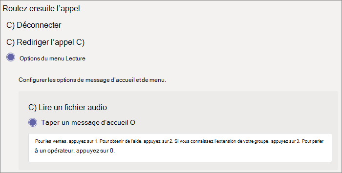
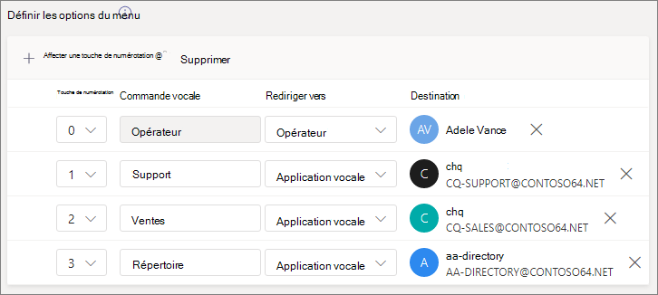
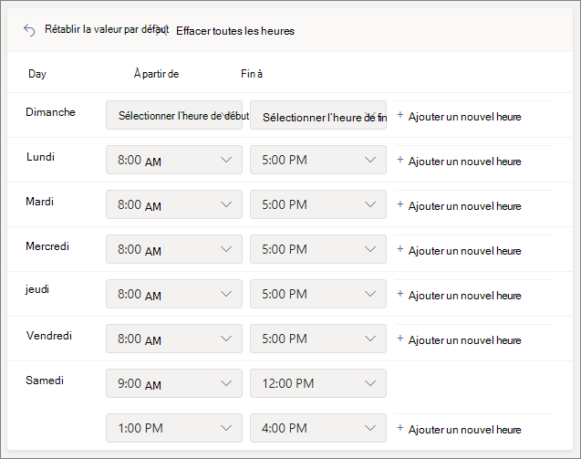
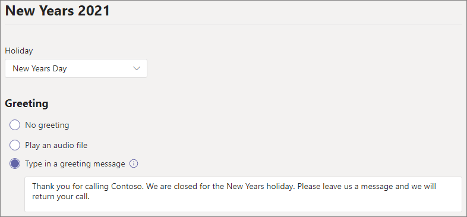
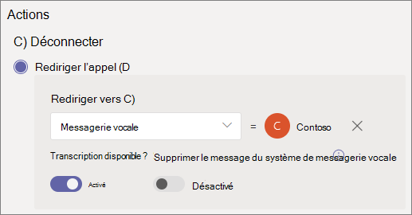
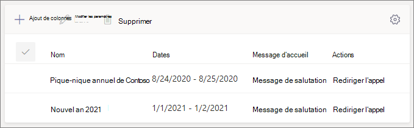
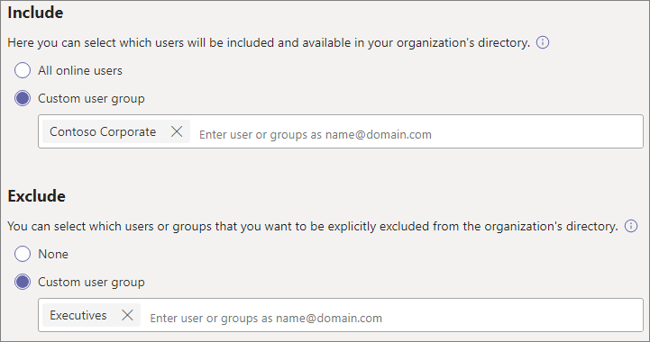
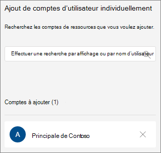
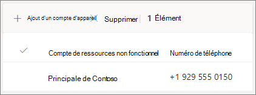

# Configurer un attendant automatique

Les employés automatiques peuvent appeler votre organisation et parcourir un système de menus pour parler au service, à la file d’attente d’appels, à une personne ou à un opérateur. Vous pouvez créer des attendants automatiques pour votre organisation à l’aide du Microsoft Teams d’administration, ou avec PowerShell.

> [!TIP]
> Cet article est pour les grandes organisations. Si votre organisation est petite entreprise, lisez [plutôt Configurer un service de attendant automatique - Didacticiel pour les](/microsoftteams/business-voice/create-a-phone-system-auto-attendant-smb) petites entreprises.

Veillez à lire l’article [Planifier les standards automatiques et les files d’attente des appels pour Teams](plan-auto-attendant-call-queue.md), puis à suivre les [étapes de démarrage](plan-auto-attendant-call-queue.md#getting-started) avant de suivre les procédures de cet article.

Les serveurs automatiques peuvent diriger les appels, sur la base des commentaires des appelants, vers l’une des destinations suivantes : 

- **Opérateur** (opérateur défini pour le transport automatique). La définition d’un opérateur est facultative. L’opérateur peut être défini comme n’importe quelle autre destination dans cette liste.
- **Une personne de votre organisation** qui peut recevoir des appels vocux. Il peut s’agit d’un utilisateur en ligne ou d’un utilisateur hébergé sur site utilisant Skype Entreprise Server.
- **Application vocale :** un autre attendant automatique ou une file d’attente d’appels. (Choisissez le compte de ressource associé au port automatique ou à la file d’attente d’appels lorsque vous choisissez cette destination.)
- **Messagerie vocale** : boîte vocale associée à Microsoft 365 groupe de messagerie que vous spécifiez. Vous pouvez choisir si vous voulez des transcriptions de messages vocaux et le message « Veuillez laisser un message après le ton ». invite système.
- **Numéro de téléphone externe :** n’importe quel numéro de téléphone. (Voir [les détails techniques du transfert externe](create-a-phone-system-auto-attendant.md#external-phone-number-transfers---technical-details).
- **Annonce (fichier audio)** : lire un fichier audio. Message d’annonce enregistré que vous téléchargez enregistré en tant qu’audio dans . WAV, .MP3, ou . Format WMA. L’enregistrement ne peut pas avoir une taille supérieure à 5 Mo. Le système lit l’annonce, puis revient au menu du transport automatique.
- **Annonce (tapée)** : taper un message. Texte que le système doit lire. Vous pouvez entrer jusqu’à 1 000 caractères. Le système lit l’annonce, puis revient au menu du transport automatique.

Vous serez invité à choisir l’une de ces options à différents stades lorsque vous configurerez un attendant automatique.

Pour configurer un attendant automatique, dans le centre Teams’administration, développez **Voix**, sélectionnez **Les attendants automatiques**, puis **sélectionnez Ajouter**.

## Démonstration vidéo

Cette vidéo montre un exemple de base de la création d’un attendant automatique dans Teams.

> [!VIDEO https://www.microsoft.com/videoplayer/embed/RWEnCG?autoplay=false]

## Informations générales

1. Tapez un nom pour le attendant automatique dans la zone en haut.

2. Pour désigner un opérateur, spécifiez la destination des appels vers l’opérateur. Cette désignation est facultative (mais recommandée). Définissez **l’option** Opérateur pour permettre aux appelants de sortir des menus et de parler à une personne désignée.

3. Spécifiez le fuseau horaire de ce attendant automatique. Le fuseau horaire est utilisé pour calculer les heures d’ouverture si vous [créez un flux d’appels distinct pour les heures de travail en de suite](#call-flow-for-after-hours).

4. Spécifiez une [langue prise en](create-a-phone-system-auto-attendant-languages.md) charge pour ce attendant automatique. Il s’agit de la langue qui sera utilisée pour les invites vocales générées par le système.

5. Choisissez si vous voulez activer les entrées vocales. Lorsqu’elle est activée, le nom de chaque option de menu devient un mot clé de reconnaissance vocale. Par exemple, les appelants peuvent dire « Un » pour sélectionner l’option de menu mappée vers la touche 1, ou dire « Ventes » pour sélectionner l’option de menu appelée « Ventes ».

   > [!NOTE]
   > Si vous choisissez une langue à l’étape 4 qui ne prend pas en charge les entrées vocales, cette option est désactivée.

6. **Sélectionnez Suivant**.

## Flux d’appels

Choisissez si vous souhaitez lire un message d’accueil lorsque le attendant automatique répond à un appel.

Si vous **sélectionnez Lire un fichier audio**, vous pouvez utiliser le **bouton Télécharger fichier** pour télécharger un message d’accueil enregistré en tant qu’audio dans . WAV, .MP3, ou . Format WMA. L’enregistrement ne peut pas avoir une taille supérieure à 5 Mo.

Si vous sélectionnez **Taper un message** d’accueil, le système lit le texte que vous tapez (jusqu’à 1 000 caractères) lorsque le attendant automatique répond à un appel.

Choisissez la façon dont vous voulez router l’appel.

Si vous sélectionnez **Déconnecter**, le attendant automatique raccrochera.

Si vous sélectionnez **Rediriger l’appel**, vous pouvez choisir l’une des destinations de routage des appels.

Si vous sélectionnez **les options du menu** Lecture, vous pouvez choisir de lire un fichier **audio** ou de taper un **message** d’accueil, puis de choisir entre les options de menu et la recherche dans l’annuaire.

### Options de menu

Pour les options de numérotation, affectez les touches 0-9 du clavier téléphonique à l’une des destinations de routage des appels. (Touches \* (astérisque) \# et (livre) sont réservés par le système et ne peuvent pas être réasignés. Appuyez sur l’une de ces touches pour répéter le menu actuel.)

> [!NOTE]
> La touche # ne fait que revenir au dernier moyen de service automatique. Une fois la limite franchie vers un nouveau attendant automatique, la touche # ne vous permettra pas d’aller au précédent.

Les mappages de clés ne doivent pas être continus. Il est possible de créer un menu avec les touches 0, 1 et 3 mappées aux options, sans utiliser la touche numéro 2.

Nous vous recommandons de ma mappage de la touche zéro à l’opérateur si vous en avez configuré un. Si l’opérateur n’est pas réglé sur une touche quelconque, la commande vocale « Opérateur » est également désactivée.

Pour chaque option de menu, spécifiez les paramètres suivants :

- **Touche de numérotation** (clé du clavier téléphonique pour accéder à cette option). Si des entrées vocales sont disponibles, les appelants peuvent également dire ce numéro pour accéder à l’option.

- **Commande vocale** : définit la commande vocale qu’un appelant peut lui donner pour accéder à cette option, si les entrées vocales sont activées. Il peut contenir plusieurs mots tels que « Service clientèle » ou « Activités et activités ». Par exemple, l’appelant peut appuyer sur 2, dire « deux » ou dire « Ventes » pour sélectionner l’option mappée aux deux touches. Ce texte est également restituer par sms par reconnaissance vocale pour l’invite de confirmation de service, ce qui peut être un peu comme « Transfert de votre appel vers les ventes ».

- **Rediriger vers** ( destination de routage des appels utilisée lorsque les appelants choisissent cette option). Si vous redirigez vers un service de service automatique ou une file d’attente d’appels, sélectionnez le compte de ressource qui lui est associé.

### Recherche dans l’annuaire

Si vous attribuez des touches de numérotation aux destinations,  nous vous recommandons de choisir l’aucune pour **la recherche dans l’annuaire**. Si un appelant tente de composer un nom ou une extension à l’aide de touches affectées à des destinations spécifiques, il se peut qu’ils soient acheminés de manière inattendue vers une destination avant qu’ils n’tentent d’entrer le nom ou l’extension. Nous vous recommandons de créer un attendant automatique distinct pour la recherche dans l’annuaire et de lier votre attendant automatique principal à celui-ci à l’aide d’une clé de numérotation.

Si vous n’avez pas attribué de touches de numérotation, choisissez une option pour **la recherche dans l’annuaire**.

**Numérotation par nom** : si vous activez cette option, les appelants peuvent dire le nom de l’utilisateur ou le taper sur le clavier téléphonique. Tout utilisateur en ligne ou tout utilisateur hébergé sur site utilisant Skype Entreprise Server est un utilisateur éligible et peut être trouvé avec la numérotation par nom. (Vous pouvez définir qui figure dans l’annuaire et qui n’est pas inclus dans la page de [portée de la](#dial-scope) numérotation.)

**Numérotation par extension** : si vous activez cette option, les appelants peuvent entrer en contact avec les utilisateurs de votre organisation en composant leur numéro de téléphone. Tout utilisateur en ligne ou tout utilisateur hébergé sur site utilisant Skype Entreprise Server est un utilisateur éligible et peut être trouvé avec la numérotation **par extension**. (Vous pouvez définir qui figure dans l’annuaire et qui n’est pas inclus dans la page de [portée de la](#dial-scope) numérotation.)

Les utilisateurs que vous souhaitez rendre disponibles pour la numérotation par extension doivent avoir une extension spécifiée dans l’un des attributs téléphoniques suivants définis dans Active Directory (et synchronisés via Azure AD Connecter) ou Azure Active Directory. (Pour plus [d’informations, voir Ajouter des utilisateurs individuellement](/microsoft-365/admin/add-users/add-users) ou en bloc.)

- OfficePhone/TelephoneNumber (AD et Azure AD)
- HomePhone (AD)
- Mobile/MobilePhone (AD et Azure AD)
- OtherTelephone (AD)

Le format requis pour entrer l’extension dans le champ Numéro de téléphone de l’utilisateur peut être l’un des formats suivants :

- *+\<phone number>;ext=\<extension>*
- *+\<phone number>x\<extension>*
- *x\<extension>*

- Exemple 1 : Set-MsolUser -UserPrincipalName usern@domain.com -Phonenumber « +15555555678;ext=5678 »
- Exemple 2 : Set-MsolUser -UserPrincipalName usern@domain.com -Phonenumber « +1555555678x5678 »
- Exemple 3 : Set-MsolUser -UserPrincipalName usern@domain.com -Phonenumber « x5678 »

Vous pouvez définir l’extension dans le [centre Centre d'administration Microsoft 365'administration](https://admin.microsoft.com/) [Azure Active Directory’équipe](https://aad.portal.azure.com). Jusqu’à 12 heures peuvent être nécessaires avant que les modifications ne soient disponibles pour les attendants automatiques et les files d’attente d’appels.

> [!NOTE]
> Si vous souhaitez utiliser les fonctionnalités Numérotation **par** nom et Numérotation par **numérotation par numérotation** de poste, vous pouvez affecter une touche de numérotation sur votre postes de service automatique principal pour joindre un personnel automatique activé pour la numérotation par **nom**. Dans ce attendant automatique, vous pouvez affecter la touche 1 (qui ne possède aucune lettre associée) pour atteindre le numérotation par **numérotation par numérotation** automatique de poste.

Pour plus [d’informations, reportez-vous à la numérotation et à la référence](dial-voice-reference.md) vocale.

Une fois que vous avez sélectionné une option **de recherche dans l’annuaire** , sélectionnez **Suivant**.

## Flux d’appels pendant les heures de travail en de suite

Les heures d’ouverture peuvent être définies pour chaque attendant automatique. Si ce n'est pas le cas, tous les jours et toutes les heures de la semaine seront considérés comme heures d'ouverture, car une planification 24/24 est définie par défaut. Les heures d’ouverture peuvent être définies avec des pauses au cours de la journée et toutes les heures non définies comme heures d’ouverture sont considérées comme des heures d’ouverture en de suite. Vous pouvez définir différentes options de traitement des appels entrants et des messages d’accueil pour les heures de travail en de suite.

Selon la configuration de vos files d’attente automatiques et de vos files d’attente, il se peut que vous devrez uniquement spécifier le routage des appels en de après-heures pour les travailleurs automatiques avec des numéros de téléphone directs.

Si vous souhaitez un routage d’appel distinct pour les appelants en de suite, spécifiez vos heures d’ouverture pour chaque jour. **Sélectionnez Ajouter un nouvel horaire** pour spécifier plusieurs jeux d’heures pour une journée donnée, par exemple pour spécifier une pause déjeuner.

Une fois que vous avez spécifié vos heures d’ouverture, sélectionnez vos options de routage des appels pour les heures de fermeture. Les mêmes options sont disponibles que pour le routage des appels pendant les heures d’ouverture spécifiés ci-dessus.

Lorsque **vous** avez terminé, sélectionnez Suivant.

## Flux d’appels pendant les jours fériés

Votre employé automatique peut avoir un flux [d’appels pour chaque jour férié que vous avez installé](set-up-holidays-in-teams.md). Vous pouvez ajouter jusqu'à 20 congés planifiés pour chaque standard automatique.

1. Sur la page Paramètres d’appel pour les fêtes, sélectionnez **Ajouter**.

2. Tapez un nom pour ce paramètre de congés.

3. Dans **la** dropdown Jours fériés, choisissez les jours fériés que vous voulez utiliser.

4. Choisissez le type de message d’accueil que vous voulez utiliser.

    

5. Choisissez si vous voulez **déconnecter ou** **rediriger l’appel** .

6. Si vous choisissez de rediriger l’appel, choisissez sa destination de routage.

7. Sélectionnez **Enregistrer**.

Répétez la procédure si nécessaire pour chaque jour férié supplémentaire.

Lorsque vous avez ajouté tous vos jours fériés, sélectionnez **Suivant**.

## Portée de la numérotation

*L’étendue de* la numérotation définit les utilisateurs disponibles dans l’annuaire lorsqu’un appelant utilise la numérotation par nom ou la numérotation par extension. La valeur par défaut de **Tous les** utilisateurs en ligne inclut tous les utilisateurs de votre organisation qui sont des utilisateurs en ligne ou hébergés sur site à l’aide d Skype Entreprise Server.

Vous pouvez inclure ou exclure des utilisateurs spécifiques en sélectionnant  Groupe d’utilisateurs personnalisés sous Inclure ou Exclure, puis en choisissant un ou plusieurs groupes Microsoft 365, listes de distribution ou groupes de sécurité.  Par exemple, vous pouvez exclure des cadres de votre organisation de l’annuaire d’appels. (Si un utilisateur se trouve dans les deux listes, il sera exclu de l’annuaire.)

> [!NOTE]
> Jusqu’à 36 heures peuvent être nécessaire pour que le nom d’un nouvel utilisateur soit répertorié dans l’annuaire.

Lorsque vous avez terminé de définir l’étendue de la numérotation, sélectionnez **Suivant**.

## Comptes de ressources

Tous les attendants automatiques doivent avoir un compte de ressource associé.  Les travailleurs automatiques de premier niveau auront besoin d’au moins un compte de ressource associé à un numéro de service. Si vous le souhaitez, vous pouvez affecter plusieurs comptes de ressources à un fournisseur de services automatique, chacun avec un numéro de service distinct.

Pour ajouter un compte de ressource, **sélectionnez Ajouter un compte** et recherchez le compte à ajouter. **Sélectionnez Ajouter**, puis **Ajouter**.

Lorsque vous avez terminé d’ajouter des comptes de ressources, sélectionnez **Envoyer** pour terminer la configuration du attendant automatique.

Pour [plus d’Teams, voir Gérer les comptes](manage-resource-accounts.md) de ressources.

## Transferts de numéros de téléphone externes - Détails techniques

Reportez-vous [aux conditions préalables](plan-auto-attendant-call-queue.md#prerequisites) pour autoriser les travailleurs automatiques à transférer des appels en externe.  De plus,:

- Pour un compte de ressource avec  une licence Plan d’appels ou un numéro de [Connecter](operator-connect-plan.md) d’opérateur, le numéro de téléphone de transfert externe doit être entré au format E.164 (+[code du pays][code de zone][numéro de téléphone]).

- Pour un compte de ressource ayant une stratégie de routage voix de licence Microsoft Teams Téléphone et de routage direct, le format du numéro de téléphone de transfert externe dépend des paramètres du contrôleur de session en bordure [(SBC](direct-routing-connect-the-sbc.md)).

Le numéro de téléphone sortant affiché est déterminé comme suit :

  - Pour le plan d’appels et Connecter numéros de téléphone, le numéro de téléphone de l’appelant d’origine s’affiche.
  - Pour les numéros de routage direct, le nombre envoyé est basé sur le paramètre P-Ed-Identity (NT) sur le SBC, comme suit :
    - S’il est désactivé, le numéro de téléphone de l’appelant d’origine s’affiche. Il s’agit du paramètre par défaut et recommandé.
    - S’il est activé, le numéro de téléphone du compte de ressource s’affiche.

Dans un Skype Entreprise hybride, pour transférer un appel de attendant automatique vers le RSTN, créez un utilisateur sur site avec le transfert d’appel sur le numéro PSTN. L’utilisateur doit être activé pour les Voix Entreprise une stratégie vocale lui est affectée. Pour en savoir plus, [consultez le transfert d’appel du attendant automatique vers PSTN](/SkypeForBusiness/plan/exchange-unified-messaging-online-migration-support#auto-attendant-call-transfer-to-pstn).

## Applets de commande de standard automatique

Windows PowerShell vous permet de créer et gérer des attendants automatiques via la ligne de commande d’une manière par lot ou par programme.

Les cmdlets suivantes vous permettent de gérer les travailleurs automatiques :

- [New-CsAutoAttendant](/powershell/module/skype/new-csautoattendant)  
- [Get-CsAutoAttendant](/powershell/module/skype/get-csautoattendant)
- [Set-CsAutoAttendant](/powershell/module/skype/set-csautoattendant)
- [Update-CsAutoAttendant](/powershell/module/skype/update-csautoattendant)
- [Remove-CsAutoAttendant](/powershell/module/skype/remove-csautoattendant)
- [Nouvelle CsOnlineTimeRange](/powershell/module/skype/new-csonlinetimerange)
- [Nouvelle CsOnlineDateTimeRange](/powershell/module/skype/new-csonlinedatetimerange)
- [Nouvelle CsOnlineSchedule](/powershell/module/skype/New-CsOnlineSchedule)
- [Get-CsAutoAttendantHolidays](/powershell/module/skype/get-csautoattendantholidays)
- [Import-CsAutoAttendantHolidays](/powershell/module/skype/import-csautoattendantholidays)
- [Export-CsAutoAttendantHolidays](/powershell/module/skype/export-csautoattendantholidays)
- [New-CsAutoAttendantDialScope](/powershell/module/skype/New-CsAutoAttendantDialScope)
- [New-CsAutoAttendantPrompt](/powershell/module/skype/New-CsAutoAttendantPrompt)
- [New-CsAutoAttendantCallableEntity](/powershell/module/skype/New-CsAutoAttendantCallableEntity)
- [New-CsAutoAttendantMenuOption](/powershell/module/skype/New-CsAutoAttendantMenuOption)
- [New-CsAutoAttendantMenu](/powershell/module/skype/new-csautoattendantmenu)
- [New-CsAutoAttendantCallFlow](/powershell/module/skype/New-CsAutoAttendantCallFlow)
- [New-CsAutoAttendantCallHandlingAssociation](/powershell/module/skype/New-CsAutoAttendantCallHandlingAssociation)
- [Get-CsAutoAttendantStatus](/powershell/module/skype/Get-CsAutoAttendantStatus)
- [Get-CsAutoAttendantTenantInformation](/powershell/module/skype/Get-CsAutoAttendantTenantInformation)

Les cmdlets supplémentaires suivantes sont également nécessaires pour gérer les utilisateurs, les comptes de ressources, les licences Microsoft Teams Téléphone, les numéros de téléphone, les fichiers audio et la langue prise en charge qui seront utilisées avec les files d’attente d’appels :

Utilisateurs/Teams

- Utilisateurs
- - [Get-CsOnlineUser](/powershell/module/skype/Get-CsOnlineUser)

- Teams : 
- - [Get-Team](/powershell/module/teams/Get-Team)

Comptes de ressources :

- [New-CsOnlineApplicationInstance](/powershell/module/skype/New-CsOnlineApplicationInstance)
- [Find-CsOnlineApplicationInstance](/powershell/module/skype/Find-CsOnlineApplicationInstance)
- [Get-CsOnlineApplicationInstance](/powershell/module/skype/Get-CsOnlineApplicationInstance)
- [Set-CsOnlineApplicationInstance](/powershell/module/skype/Set-CsOnlineApplicationInstance)
- [New-CsOnlineApplicationInstanceAssociation](/powershell/module/skype/New-CsOnlineApplicationInstanceAssociation)
- [Get-CsOnlineApplicationInstanceAssociation](/powershell/module/skype/Get-CsOnlineApplicationInstanceAssociation)
- [Remove-CsOnlineApplicationInstanceAssociation](/powershell/module/skype/Remove-CsOnlineApplicationInstanceAssociation)
- [Get-CsOnlineApplicationInstanceAssociationStatus](/powershell/module/skype/Get-CsOnlineApplicationInstanceAssociationStatus)

Licences Teams Téléphone virtuels :

- [Get-MsolAccountSku](/powershell/module/msonline/get-msolaccountsku)
- [Set-MsolUserLicense](/powershell/module/msonline/set-msoluserlicense)

Téléphone affectation de numéro :

- [Get-CsOnlineTelephoneNumber](/powershell/module/skype/Get-CsOnlineTelephoneNumber)
- [Set-CsPhoneNumberAssignment](/powershell/module/teams/Set-CsPhoneNumberAssignment)

Fichiers audio

- [Get-CsOnlineAudioFile](/powershell/module/skype/Get-CsOnlineAudioFile)
- [Import-CsOnlineAudioFile](/powershell/module/skype/Import-CsOnlineAudioFile)
- [Export-CsOnlineAudioFile](/powershell/module/skype/Export-CsOnlineAudioFile)
- [Remove-CsOnlineAudioFile](/powershell/module/skype/Remove-CsOnlineAudioFile)

Langues de prise en charge et fuseaux horaires

- [Get-CsAutoAttendantSupportedLanguage](/powershell/module/skype/Get-CsAutoAttendantSupportedLanguage)
- [Get-CsAutoAttendantSupportedTimeZone](/powershell/module/skype/Get-CsAutoAttendantSupportedTimeZone)

Pour consulter un guide pas à pas sur la création de guides automatiques avec PowerShell, voir Créer des guides [automatiques avec des cmdlets PowerShell](create-a-phone-system-auto-attendant-via-cmdlets.md)

## Standard automatique outil de diagnostic

Si vous êtes administrateur, vous pouvez utiliser l’outil de diagnostic suivant pour vérifier qu’un employé automatique peut recevoir des appels :

1. Sélectionnez **Exécuter les tests** ci-dessous, qui remplira le diagnostic dans le Centre d'Administration Microsoft 365. 

   > [!div class="nextstepaction"]
   > [Exécuter des tests : Teams Standard automatique](https://aka.ms/TeamsAADiag)

2. Dans le volet Exécuter un diagnostic, entrez le compte de ressource dans  le champ Nom d’utilisateur ou Courrier électronique, puis sélectionnez **Exécuter les tests**.

3. Les tests identifient les configurations de compte de client, de stratégie ou de ressource qui empêchent le attendant automatique de recevoir des appels et fournissent des étapes pour résoudre les problèmes identifiés.

## Rubriques connexes

[Voici ce que vous obtenez avec Teams Téléphone](./here-s-what-you-get-with-phone-system.md)

[Obtenir des numéros de téléphone de service](./getting-service-phone-numbers.md)

[Disponibilité des forfaits d’appels et de l’audioconférence selon les régions et les pays](./country-and-region-availability-for-audio-conferencing-and-calling-plans/country-and-region-availability-for-audio-conferencing-and-calling-plans.md)

[Présentation de Windows PowerShell et Skype Entreprise Online](/SkypeForBusiness/set-up-your-computer-for-windows-powershell/set-up-your-computer-for-windows-powershell)
