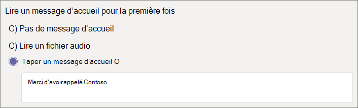

# Configurer un standard automatique

Les standards automatiques permettent aux personnes d’appeler votre organisation et de naviguer dans un système de menus pour parler au service approprié, à la file d’attente des appels, à la personne ou à un opérateur. Vous pouvez créer des standards automatiques pour votre organisation à l’aide du centre d’administration Microsoft teams ou avec PowerShell.

Vérifiez que vous disposez [d’un plan de lecture pour les standards automatiques d’équipe et les files d’attente d’appels](plan-auto-attendant-call-queue.md) , puis suivez les [étapes de mise](plan-auto-attendant-call-queue.md#getting-started) en route avant de suivre les procédures décrites dans cet article.

Les standards automatiques peuvent diriger les appels, en fonction de l’entrée des appelants, vers l’une des destinations suivantes : 

- **Personne de votre organisation** : une personne de votre organisation qui peut recevoir des appels vocaux. Il peut s’agir d’un utilisateur en ligne ou hébergé sur site utilisant Skype entreprise Server.
- **Application vocale** -autre standard automatique ou file d’attente d’appels. (Sélectionnez le compte de ressources associé au standard automatique ou à la file d’attente d’appels lors du choix de cette destination.)
- **Numéro de téléphone externe** -n’importe quel numéro de téléphone. (Voir les [Détails techniques sur les transferts externes](create-a-phone-system-auto-attendant.md#external-phone-number-transfers---technical-details)).
- Boîte **vocale** -la boîte aux lettres vocale associée à un groupe Microsoft 365 que vous spécifiez.
- **Opérateur** -l’opérateur défini pour le standard automatique. La définition d’un opérateur est facultative. L’opérateur peut être défini comme n’importe quelle autre destination dans cette liste.

Vous êtes invité à choisir l’une de ces options à différentes étapes Lorsque vous configurez un standard automatique.

Pour configurer un standard automatique, dans le centre d’administration Teams, développez **voix**, cliquez sur **standards automatiques**, puis cliquez sur **Ajouter**.

## Informations générales

1. Tapez un nom pour le standard automatique dans la zone située dans la partie supérieure.

2. Si vous souhaitez désigner un opérateur, spécifiez la destination des appels à l’opérateur. Facultatif (mais recommandé). Vous pouvez définir l’option d' **opérateur** permettant aux appelants de sortir des menus et de parler à une personne désignée.

3. Spécifiez le fuseau horaire pour ce standard automatique. Le fuseau horaire est utilisé pour calculer les heures d’ouverture, si vous [créez un flux d’appels distinct pendant les heures qui suivent](#call-flow-for-after-hours).

4. Spécifiez une langue pour ce standard automatique. Il s’agit de la langue qui sera utilisée pour les invites vocales générées par le système.

5. Indiquez si vous voulez activer les entrées vocales. Lorsque cette option est activée, le nom de chaque option de menu devient un mot clé de reconnaissance vocale. Par exemple, les appelants peuvent prononcer « un » pour sélectionner l’option de menu mappée à la clé 1, ou dire « ventes » pour sélectionner l’option de menu « ventes ».

6. Cliquez sur **Suivant**.

## Flux d’appels

Indiquez si vous voulez lire un message d’accueil lorsque le standard automatique répond à un appel.

Si vous sélectionnez **lire un fichier audio** , vous pouvez utiliser le bouton **Télécharger un fichier** pour télécharger un message d’accueil enregistré en tant que fichier audio. WAV,. MP3 ou. Format WMA. Le nombre d’enregistrements ne peut pas dépasser 5 Mo.

Si vous sélectionnez l’option **taper un message d’accueil** le système lira le texte que vous tapez (jusqu’à 1000 caractères) lorsque le standard automatique répond à un appel.

Choisissez le mode de routage de l’appel.

Si vous sélectionnez **déconnecter**, le standard automatique raccrochera l’appel.

Si vous sélectionnez **rediriger l’appel**, vous pouvez choisir l’une des destinations de routage des appels.

Si vous sélectionnez les **options de menu lire**, vous pouvez choisir de **lire un fichier audio** ou **de taper un message d’accueil** , puis de choisir entre les options de menu et la recherche dans l’annuaire.

### Options de menu

Pour les options de numérotation, vous pouvez affecter les touches 0-9 du clavier du téléphone à l’une des destinations de routage des appels. (Les clés \* (REPEAT) et \# (retour) sont réservés par le système et ne peuvent pas être réaffectés.)

Les mappages de clés ne doivent pas nécessairement être continus. Par exemple, il est possible de créer un menu avec les clés 0, 1 et 3 mappées à des options, tandis que la touche 2 n’est pas utilisée.

Nous vous recommandons de mapper la touche 0 à l’opérateur si vous en avez configuré un. Si l’opérateur n’est pas défini sur une touche, la commande vocale « opérateur » est également désactivée.

Pour chaque option de menu, spécifiez les éléments suivants :

- **Clé de numérotation** -touche du clavier du téléphone pour accéder à cette option. Si les entrées vocales sont disponibles, les appelants peuvent également prononcer ce numéro pour accéder à l’option.

- **Commande vocale** : définit la commande vocale que l’appelant peut donner pour accéder à cette option, si les entrées vocales sont activées. Elle peut contenir plusieurs mots tels que « service clientèle » ou « opérations et raisons ». Par exemple, l’appelant peut appuyer sur 2, prononcer « deux » ou dire « ventes » pour sélectionner l’option associée à la clé 2. Ce texte est également affiché par synthèse vocale pour l’invite de confirmation du service (par exemple, « transfert de votre appel vers les ventes »).

- **Rediriger vers** -la destination du routage des appels utilisée lorsque les appelants choisissent cette option. Si vous redirigez vers une file d’attente d’appels ou de standard automatique, sélectionnez le compte de ressources associé.

### Recherche dans l’annuaire

Si vous affectez des clés de numérotation aux destinations, nous vous recommandons de choisir **aucune** pour la recherche dans l' **Annuaire**. Si un appelant tente de composer un nom ou une extension à l’aide de clés affectées à des destinations spécifiques, il est possible qu’il soit routé de manière inattendue vers une destination avant d’avoir fini d’entrer le nom ou l’extension. Nous vous recommandons de créer un standard automatique distinct pour la recherche dans l’annuaire et de définir le lien principal de votre standard automatique à l’aide d’une clé de numérotation.

Si vous n’avez pas affecté de touches de numérotation, sélectionnez une option pour la recherche dans l' **Annuaire**.

**Composer par nom** : Si vous activez cette option, les appelants peuvent prononcer le nom de l’utilisateur ou le taper sur le clavier du téléphone. Tout utilisateur en ligne disposant d’une licence de système téléphonique ou d’un utilisateur hébergé sur site utilisant Skype entreprise Server est éligible et est disponible avec la numérotation par nom. (Vous pouvez définir qui est et qui n’est pas inclus dans le répertoire de la page de [portée de numérotation](#dial-scope) ).

**Composer par poste** : Si vous activez cette option, les appelants peuvent se connecter aux utilisateurs de votre organisation en composant leur numéro de poste. Tout utilisateur en ligne disposant d’une licence de système téléphonique ou d’un utilisateur hébergé sur site utilisant Skype entreprise Server est éligible et peut être trouvé avec la **numérotation par poste**. (Vous pouvez définir qui est et qui n’est pas inclus dans le répertoire de la page de [portée de numérotation](#dial-scope) ).

Les utilisateurs que vous souhaitez rendre disponibles pour composer par poste doivent avoir une extension spécifiée dans le cadre de l’un des attributs de téléphone suivants définis dans Active Directory ou Azure Active Directory (voir [Ajouter des utilisateurs individuellement ou en bloc](https://docs.microsoft.com/microsoft-365/admin/add-users/add-users) pour plus d’informations).

- OfficePhone
- HomePhone
- Mobile/MobilePhone
- TelephoneNumber/PhoneNumber
- OtherTelephone

Le format requis pour entrer l’extension dans le champ numéro de téléphone de l’utilisateur est : *+ \<phone number> ext = \<extension>* ou *+ \<phone number> ; x \<extension>*.
Par exemple : Set-MsolUser-UserPrincipalName usern@domain.com-PhoneNumber "+ 15555555678 ; ext = 5678".

Vous pouvez définir l’extension dans le [Centre d’administration Microsoft 365](https://admin.microsoft.com/) ou dans le [Centre d’administration Azure Active Directory](https://aad.portal.azure.com). Il faut parfois jusqu’à 12 heures pour que les modifications soient disponibles aux standards automatiques et aux files d’attente d’appels.

> [!NOTE]
> Si vous voulez utiliser les fonctions **numérotation par nom** et **numéro de poste par numéro** , vous pouvez affecter une touche de numérotation à votre standard automatique principal pour atteindre un standard automatique activé pour la **numérotation par nom**. Dans ce standard automatique, vous pouvez affecter la touche 1 (qui ne comporte pas de lettres) pour atteindre le standard automatique de **composition par extension** .

Lorsque vous avez sélectionné une option de recherche dans l' **Annuaire** , cliquez sur **suivant**.

## Flux d’appels pour après heures

Les heures d’activité peuvent être définies pour chaque standard automatique. Si ce n'est pas le cas, tous les jours et toutes les heures de la semaine seront considérés comme heures d'ouverture, car une planification 24/24 est définie par défaut. Les heures d’ouverture peuvent être définies à l’aide de pauses pendant la journée, et toutes les heures qui ne sont pas définies comme heures d’ouverture. Vous pouvez définir des options de traitement des appels entrantes différentes et des salutations pour une durée de l’heure.

Selon la manière dont vous avez configuré vos standards automatiques et les files d’attente d’appels, il est possible que vous deviez spécifier le routage des appels après-heures pour les standards automatiques avec des numéros de téléphone directs.

Si vous souhaitez un routage des appels distinct pour les appelants après l’heure, spécifiez les heures d’activité pour chaque jour. Cliquez sur **Ajouter un nouvel horaire** pour spécifier plusieurs jeux d’heures pour un jour donné, par exemple pour spécifier une pause déjeuner.

Une fois que vous avez spécifié les heures d’appel, sélectionnez vos options de routage des appels pour après heures. Les mêmes options sont disponibles que pour le routage des appels d’heures d’activités que vous avez spécifié ci-dessus.

Lorsque vous avez terminé, cliquez sur **suivant** .

## Flux d’appels pendant les vacances

Le standard automatique peut avoir un flux d’appels pour chaque [jour férié que vous avez configuré](set-up-holidays-in-teams.md). Vous pouvez ajouter jusqu'à 20 congés planifiés pour chaque standard automatique.

1. Dans la page Paramètres des appels de vacances, cliquez sur **Ajouter**.

2. Tapez un nom pour ce paramètre de vacances.

3. Dans la liste déroulante **jour férié** , choisissez le jour férié que vous souhaitez utiliser.

4. Choisissez le type d’message d’accueil que vous voulez utiliser.

    

5. Choisissez si vous souhaitez vous **déconnecter** ou **Rediriger** l’appel.

6. Si vous avez choisi de rediriger l’appel, sélectionnez la destination de routage des appels pour l’appel.

7. Cliquez sur **Enregistrer**.

Répétez la procédure selon vos besoins pour chaque jour férié supplémentaire.

Lorsque vous avez ajouté tous vos jours fériés, cliquez sur **suivant**.

## Étendue de numérotation

L' *étendue de numérotation* définit les utilisateurs disponibles dans l’annuaire quand un appelant utilise la numérotation par nom ou par numéro de poste par extension. La valeur par défaut de **tous les utilisateurs en ligne** inclut tous les utilisateurs de votre organisation qui sont des utilisateurs en ligne disposant d’une licence de système téléphonique ou hébergés en local à l’aide de Skype entreprise Server.

Vous pouvez inclure ou exclure des utilisateurs spécifiques en sélectionnant **groupe d’utilisateurs personnalisé** sous **inclure** ou **exclure** et en choisissant un ou plusieurs groupes Microsoft 365, listes de distribution ou groupes de sécurité. Par exemple, vous souhaiterez peut-être exclure les dirigeants de votre organisation du répertoire de numérotation. (Si l’utilisateur figure dans les deux listes, il est exclu de l’annuaire.)

> [!NOTE]
> Le nom d’un nouvel utilisateur peut nécessiter un maximum de 36 heures.

Lorsque vous avez terminé de définir l’étendue de numérotation, cliquez sur **suivant**.

## Comptes de ressources

Tous les standards automatiques doivent disposer d’un compte de ressources associé.  Les standards automatiques de premier niveau ont besoin d’au moins un compte de ressources associé à un numéro de service. Si vous le souhaitez, vous pouvez affecter plusieurs comptes de ressources à un standard automatique, chacun avec un numéro de service distinct.

Pour ajouter un compte de ressource, cliquez sur **Ajouter un compte** et recherchez le compte que vous voulez ajouter. Cliquez sur **Ajouter**, puis cliquez sur **Ajouter**.

Lorsque vous avez terminé d’ajouter des comptes de service, cliquez sur **valider**. Cela termine la configuration de standard automatique.

## Transferts de numéros de téléphone externes-détails techniques

Reportez-vous aux [conditions préalables](plan-auto-attendant-call-queue.md#prerequisites) pour permettre aux standards automatiques de transférer les appels dans l’extérieur.  De plus,:

- Dans le cas d’un compte de ressources avec un numéro de [plan d’appels](calling-plans-for-office-365.md) , le numéro de téléphone de transfert externe doit être saisi au format E. 164 (+ [indicatif du pays] [indicatif] [numéro de téléphone]).

- Dans le cas d’un compte de ressources doté d’un numéro d’acheminement direct, le format des numéros de téléphone de transfert externe dépend des paramètres du [contrôleur de bordure de session (SBC)](direct-routing-connect-the-sbc.md) .

Le numéro de téléphone sortant affiché est déterminé comme suit :

  - Pour les numéros de plan d’appels, le numéro de téléphone de l’appelant initial est affiché.
  - Pour les numéros de routage directs, le numéro envoyé est basé sur le paramètre P-assertion-Identity (PAI) sur l’SBC, comme suit :
    - S’il est défini sur Disabled, le numéro de téléphone de l’appelant initial est affiché. Il s’agit du paramètre par défaut et recommandé.
    - Si cette option est activée, le numéro de téléphone de votre compte de ressources est affiché.

Dans un environnement hybride Skype entreprise, pour transférer un appel de standard automatique vers le RTC, créez un nouvel utilisateur local avec le renvoi d’appel défini sur le numéro RTC. L’utilisateur doit être activé pour voix entreprise et avoir reçu une stratégie vocale. Pour en savoir plus, voir [transfert d’appel standard automatique vers PSTN](https://docs.microsoft.com/SkypeForBusiness/plan/exchange-unified-messaging-online-migration-support#auto-attendant-call-transfer-to-pstn).

### Créer un standard automatique avec PowerShell

Vous pouvez également utiliser PowerShell pour créer et configurer des standards automatiques. Voici les applets de passe dont vous avez besoin pour gérer un standard automatique :

- [Nouveau-CsAutoAttendant](https://docs.microsoft.com/powershell/module/skype/new-csautoattendant)  
- [Set-CsAutoAttendant](https://docs.microsoft.com/powershell/module/skype/set-csautoattendant)
- [Get-CsAutoAttendant](https://docs.microsoft.com/powershell/module/skype/get-csautoattendant)
- [Get-CsAutoAttendantHolidays](https://docs.microsoft.com/powershell/module/skype/get-csautoattendantholidays)
- [Remove-CsAutoAttendant](https://docs.microsoft.com/powershell/module/skype/remove-csautoattendant)
- [Nouveau-CsAutoAttendantMenu](https://docs.microsoft.com/powershell/module/skype/new-csautoattendantmenu)
- [Nouveau-CsOnlineAudioFile](https://docs.microsoft.com/powershell/module/skype/new-CsOnlineAudioFile)
- [Nouveau-CsAutoAttendantCallFlow](https://docs.microsoft.com/powershell/module/skype/New-CsAutoAttendantCallFlow)
- [Export-CsAutoAttendantHolidays](https://docs.microsoft.com/powershell/module/skype/export-csorganizationalautoattendantholidays)
- [Nouvelle CsOnlineTimeRange](https://docs.microsoft.com/powershell/module/skype/new-csonlinetimerange)
- [Nouvelle CsOnlineDateTimeRange](https://docs.microsoft.com/powershell/module/skype/new-csonlinedatetimerange)
- [Nouvelle CsOnlineSchedule](https://docs.microsoft.com/powershell/module/skype/New-CsOnlineSchedule)
- [Get-CsAutoAttendantSupportedTimeZone](https://docs.microsoft.com/powershell/module/skype/Get-CsAutoAttendantSupportedTimeZone)
- [Nouveau-CsAutoAttendantCallHandlingAssociation](https://docs.microsoft.com/powershell/module/skype/New-CsAutoAttendantCallHandlingAssociation)
- [Get-CsAutoAttendantSupportedLanguage](https://docs.microsoft.com/powershell/module/skype/Get-CsAutoAttendantSupportedLanguage)
- [Importation-CsAutoAttendantHolidays](https://docs.microsoft.com/powershell/module/skype/import-csautoattendantholidays)
- [Nouveau-CsAutoAttendantCallableEntity](https://docs.microsoft.com/powershell/module/skype/New-CsAutoAttendantCallableEntity)

## Voir aussi

[Voici les avantages du système téléphonique](/MicrosoftTeams/here-s-what-you-get-with-phone-system)

[Obtention de numéros de téléphone de service](/microsoftteams/getting-service-phone-numbers)

[Disponibilité des forfaits d’appels et de l’audioconférence selon les régions et les pays](/microsoftteams/country-and-region-availability-for-audio-conferencing-and-calling-plans/country-and-region-availability-for-audio-conferencing-and-calling-plans)

[Exemple petite entreprise : configurer un standard automatique](/microsoftteams/tutorial-org-aa)

[Présentation de Windows PowerShell et Skype Entreprise Online](/SkypeForBusiness/set-up-your-computer-for-windows-powershell/set-up-your-computer-for-windows-powershell)
