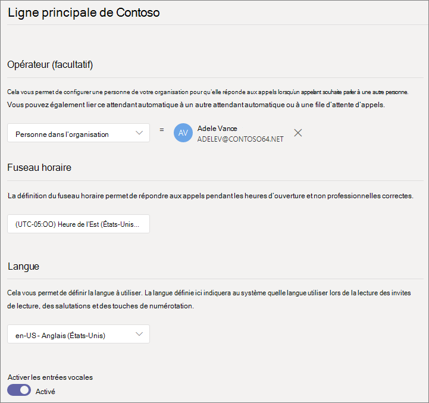

# Configurer un standard automatiqueSet up an auto attendant

Les standards automatiques permettent aux personnes d’appeler votre organisation et de naviguer dans un système de menus pour parler au service approprié, à la file d’attente des appels, à la personne ou à un opérateur.Auto attendants let people call your organization and navigate a menu system to speak to the right department, call queue, person, or an operator. Vous pouvez créer des standards automatiques pour votre organisation à l’aide du centre d’administration Microsoft teams ou avec PowerShell.You can create auto attendants for your organization with the Microsoft Teams admin center, or with PowerShell. 

Vérifiez que vous disposez [d’un plan de lecture pour les standards automatiques d’équipe et les files d’attente d’appels](plan-auto-attendant-call-queue.md) , puis suivez les [étapes de mise](plan-auto-attendant-call-queue.md#getting-started) en route avant de suivre les procédures décrites dans cet article.Be sure you have read [Plan for Teams auto attendants and call queues](plan-auto-attendant-call-queue.md) and followed the [getting started steps](plan-auto-attendant-call-queue.md#getting-started) before you follow the procedures in this article.

Les standards automatiques peuvent diriger les appels, en fonction de l’entrée des appelants, vers l’une des destinations suivantes :Auto attendants can direct calls, based on callers' input, to one of the following destinations:

- **Personne de votre organisation** : une personne de votre organisation qui peut recevoir des appels vocaux.**Person in the organization** - a person in your organization who is able to receive voice calls. Il peut s’agir d’un utilisateur en ligne ou hébergé sur site utilisant Skype entreprise Server.This can be an online user or a user hosted on-premises using Skype for Business Server.
- **Application vocale** -autre standard automatique ou file d’attente d’appels.**Voice app** - another auto attendant or a call queue. (Sélectionnez le compte de ressources associé au standard automatique ou à la file d’attente d’appels lors du choix de cette destination.)(Choose the resource account associated with the auto attendant or call queue when choosing this destination.)
- **Numéro de téléphone externe** -n’importe quel numéro de téléphone.**External phone number** - any phone number. (Voir les [Détails techniques sur les transferts externes](create-a-phone-system-auto-attendant.md#external-phone-number-transfers---technical-details)).(See [external transfer technical details](create-a-phone-system-auto-attendant.md#external-phone-number-transfers---technical-details)).
- Boîte **vocale** -la boîte aux lettres vocale associée à un groupe Microsoft 365 que vous spécifiez.**Voicemail** - the voice mailbox associated with a Microsoft 365 group that you specify.
- **Opérateur** -l’opérateur défini pour le standard automatique.**Operator** - the operator defined for the auto attendant. La définition d’un opérateur est facultative.Defining an operator is optional. L’opérateur peut être défini comme n’importe quelle autre destination dans cette liste.The operator can be defined as any of the other destinations in this list.

Vous êtes invité à choisir l’une de ces options à différentes étapes Lorsque vous configurez un standard automatique.You'll be prompted to choose one of these options at various stages as you set up an auto attendant.

Pour configurer un standard automatique, dans le centre d’administration Teams, développez **voix**, cliquez sur **standards automatiques**, puis cliquez sur **Ajouter**.To set up an auto attendant, in the Teams admin center, expand **Voice**, click **Auto attendants**, and then click **Add**.

## Informations généralesGeneral info

1. Tapez un nom pour le standard automatique dans la zone située dans la partie supérieure.Type a name for the auto attendant in the box at the top.

2. Si vous souhaitez désigner un opérateur, spécifiez la destination des appels à l’opérateur.If you want to designate an operator, specify the destination for calls to the operator. Facultatif (mais recommandé).This is optional (but recommended). Vous pouvez définir l’option d' **opérateur** permettant aux appelants de sortir des menus et de parler à une personne désignée.You can set the **Operator** option to allow callers to break out of the menus and speak to a designated person.

3. Spécifiez le fuseau horaire pour ce standard automatique.Specify the time zone for this auto attendant. Le fuseau horaire est utilisé pour calculer les heures d’ouverture, si vous [créez un flux d’appels distinct pendant les heures qui suivent](#call-flow-for-after-hours).The time zone is used for calculating business hours if you [create a separate call flow for after hours](#call-flow-for-after-hours).

4. Spécifiez une langue pour ce standard automatique.Specify a language for this auto attendant. Il s’agit de la langue qui sera utilisée pour les invites vocales générées par le système.This the language that will be used for system-generated voice prompts.

5. Indiquez si vous voulez activer les entrées vocales.Choose if you want to enable voice inputs. Lorsque cette option est activée, le nom de chaque option de menu devient un mot clé de reconnaissance vocale.When enabled, the name of every menu option becomes a speech-recognition keyword. Par exemple, les appelants peuvent prononcer « un » pour sélectionner l’option de menu mappée à la clé 1, ou dire « ventes » pour sélectionner l’option de menu « ventes ».For example, callers can say "One" to select the menu option mapped to key 1, or they can say "Sales" to select the menu option named "Sales."

6. Cliquez sur **Suivant**.Click **Next**.

## Flux d’appelsCall flow

Indiquez si vous voulez lire un message d’accueil lorsque le standard automatique répond à un appel.Choose if you want to play a greeting when the auto attendant answers a call.

Si vous sélectionnez **lire un fichier audio** , vous pouvez utiliser le bouton **Télécharger un fichier** pour télécharger un message d’accueil enregistré en tant que fichier audio. WAV,. MP3 ou. Format WMA.If you select **Play an audio file** you can use the **Upload file** button to upload a recorded greeting message saved as audio in .WAV, .MP3, or .WMA format. Le nombre d’enregistrements ne peut pas dépasser 5 Mo.The recording can be no larger than 5 MB.

Si vous sélectionnez l’option **taper un message d’accueil** le système lira le texte que vous tapez (jusqu’à 1000 caractères) lorsque le standard automatique répond à un appel.If you select **Type a greeting message** the system will read the text you the text that you type (up to 1000 characters) when the auto attendant answers a call.

Choisissez le mode de routage de l’appel.Choose how you want to route the call.

Si vous sélectionnez **déconnecter**, le standard automatique raccrochera l’appel.If you select **Disconnect**, the auto attendant will hang up the call.

Si vous sélectionnez **rediriger l’appel**, vous pouvez choisir l’une des destinations de routage des appels.If you select **Redirect call**, you can choose one of the call routing destinations.

Si vous sélectionnez les **options de menu lire**, vous pouvez choisir de **lire un fichier audio** ou **de taper un message d’accueil** , puis de choisir entre les options de menu et la recherche dans l’annuaire.If you select **Play menu options**, you can choose to **Play an audio file** or **Type in a greeting message** and then choose between menu options and directory search.

### Options de menuMenu options

Pour les options de numérotation, vous pouvez affecter les touches 0-9 du clavier du téléphone à l’une des destinations de routage des appels.For dialing options, you can assign the 0-9 keys on the telephone keypad to one of the call routing destinations. (Les clés \* (REPEAT) et \# (retour) sont réservés par le système et ne peuvent pas être réaffectés.)(The keys \* (Repeat) and \# (Back) are reserved by the system and can't be reassigned.)

Les mappages de clés ne doivent pas nécessairement être continus.Key mappings don't have to be continuous. Par exemple, il est possible de créer un menu avec les clés 0, 1 et 3 mappées à des options, tandis que la touche 2 n’est pas utilisée.It is possible, for example, to create a menu with keys 0, 1, and 3 mapped to options, while the 2 key isn't used.

Nous vous recommandons de mapper la touche 0 à l’opérateur si vous en avez configuré un.We recommend mapping the 0 key to the operator if you have configured one. Si l’opérateur n’est pas défini sur une touche, la commande vocale « opérateur » est également désactivée.If the operator isn't set to any key, the voice command "Operator" is also disabled. 

Pour chaque option de menu, spécifiez les éléments suivants :For each menu option, specify the following:

- **Clé de numérotation** -touche du clavier du téléphone pour accéder à cette option.**Dial key** - the key on the telephone keypad to access this option. Si les entrées vocales sont disponibles, les appelants peuvent également prononcer ce numéro pour accéder à l’option.If voice inputs are available, callers can also say this number to access the option.

- **Commande vocale** : définit la commande vocale que l’appelant peut donner pour accéder à cette option, si les entrées vocales sont activées.**Voice command** - defines the voice command that a caller can give to access this option, if voice inputs are enabled. Elle peut contenir plusieurs mots tels que « service clientèle » ou « opérations et raisons ».It can contain multiple words like "Customer Service" or "Operations and Grounds." Par exemple, l’appelant peut appuyer sur 2, prononcer « deux » ou dire « ventes » pour sélectionner l’option associée à la clé 2.For example, the caller can press 2, say "two," or say "Sales" to select the option mapped to the 2 key. Ce texte est également affiché par synthèse vocale pour l’invite de confirmation du service (par exemple, « transfert de votre appel vers les ventes »).This text is also rendered by text to speech for the service confirmation prompt, which might be something like "Transferring your call to sales."

- **Rediriger vers** -la destination du routage des appels utilisée lorsque les appelants choisissent cette option.**Redirect to** - the call routing destination used when callers choose this option. Si vous redirigez vers une file d’attente d’appels ou de standard automatique, sélectionnez le compte de ressources associé.If you are redirecting to an auto attendant or call queue, choose the resource account associated with it.

### Recherche dans l’annuaireDirectory search

Si vous affectez des clés de numérotation aux destinations, nous vous recommandons de choisir **aucune** pour la recherche dans l' **Annuaire**.If you assign dial keys to destinations, we recommend that you choose **None** for **Directory search**. Si un appelant tente de composer un nom ou une extension à l’aide de clés affectées à des destinations spécifiques, il est possible qu’il soit routé de manière inattendue vers une destination avant d’avoir fini d’entrer le nom ou l’extension.If a caller attempts to dial a name or extension using keys that are assigned to specific destinations, they may be unexpectedly routed to a destination before they finish entering the name or extension. Nous vous recommandons de créer un standard automatique distinct pour la recherche dans l’annuaire et de définir le lien principal de votre standard automatique à l’aide d’une clé de numérotation.We recommend that you create a separate auto attendant for directory search and have your main auto attendant link to it via a dial key.

Si vous n’avez pas affecté de touches de numérotation, sélectionnez une option pour la recherche dans l' **Annuaire**.If you didn't assign dial keys, then choose an option for **Directory search**.

**Composer par nom** : Si vous activez cette option, les appelants peuvent prononcer le nom de l’utilisateur ou le taper sur le clavier du téléphone.**Dial by name** - If you enable this option, callers can say the user's name or type it on the telephone keypad. Tout utilisateur en ligne disposant d’une licence de système téléphonique ou d’un utilisateur hébergé sur site utilisant Skype entreprise Server est éligible et est disponible avec la numérotation par nom.Any online user with a Phone System license, or any user hosted on-premises using Skype for Business Server, is an eligible user and can be found with Dial by name. (Vous pouvez définir qui est et qui n’est pas inclus dans le répertoire de la page de [portée de numérotation](#dial-scope) ).(You can set who is and is not included in the directory on the [Dial scope](#dial-scope) page.)

**Composer par poste** : Si vous activez cette option, les appelants peuvent se connecter aux utilisateurs de votre organisation en composant leur numéro de poste.**Dial by extension** - If you enable this option, callers can connect with users in your organization by dialing their phone extension. Tout utilisateur en ligne disposant d’une licence de système téléphonique ou d’un utilisateur hébergé sur site utilisant Skype entreprise Server est éligible et peut être trouvé avec la **numérotation par poste**.Any online user with a Phone System license, or any user hosted on-premises using Skype for Business Server, is an eligible user and can be found with **Dial by extension**. (Vous pouvez définir qui est et qui n’est pas inclus dans le répertoire de la page de [portée de numérotation](#dial-scope) ).(You can set who is and is not included in the directory on the [Dial scope](#dial-scope) page.)

Les utilisateurs que vous souhaitez rendre disponibles pour composer par poste doivent avoir une extension spécifiée dans le cadre de l’un des attributs de téléphone suivants définis dans Active Directory ou Azure Active Directory (voir [Ajouter des utilisateurs individuellement ou en bloc](https://docs.microsoft.com/microsoft-365/admin/add-users/add-users) pour plus d’informations).Users you wish to make available for Dial By Extension need to have an extension specified as part of one of the following phone attributes defined in Active Directory or Azure Active Directory (See [Add users individually or in bulk](https://docs.microsoft.com/microsoft-365/admin/add-users/add-users) for more information.)

- OfficePhoneOfficePhone
- HomePhoneHomePhone
- Mobile/MobilePhoneMobile/MobilePhone
- TelephoneNumber/PhoneNumberTelephoneNumber/PhoneNumber
- OtherTelephoneOtherTelephone

Le format requis pour entrer une extension dans le champ numéro de téléphone de l’utilisateur est \* + <phone number> ext = <extension> \* ou \* + <phone number> x <extension> \*.The required format to enter the extension in the user phone number field is either *+<phone number>ext=<extension>* or *+<phone number>x<extension>*.

Vous pouvez définir l’extension dans le [Centre d’administration Microsoft 365](https://admin.microsoft.com/) ou dans le [Centre d’administration Azure Active Directory](https://aad.portal.azure.com).You can set the extension in the [Microsoft 365 admin center](https://admin.microsoft.com/) or the [Azure Active Directory admin center](https://aad.portal.azure.com). Il faut parfois jusqu’à 12 heures pour que les modifications soient disponibles aux standards automatiques et aux files d’attente d’appels.It can take up to 12 hours before changes are available to auto attendants and call queues.

> [!NOTE]
> Si vous voulez utiliser les fonctions **numérotation par nom** et **numéro de poste par numéro** , vous pouvez affecter une touche de numérotation à votre standard automatique principal pour atteindre un standard automatique activé pour la **numérotation par nom**.If you want to use both the **Dial by name** and **Dial by extension** features, you can assign a dial key on your main auto attendant to reach an auto attendant enabled for **Dial by name**. Dans ce standard automatique, vous pouvez affecter la touche 1 (qui ne comporte pas de lettres) pour atteindre le standard automatique de **composition par extension** .Within that auto attendant, you can assign the 1 key (which has no letters associated with it) to reach the **Dial by extension** auto attendant.

Lorsque vous avez sélectionné une option de recherche dans l' **Annuaire** , cliquez sur **suivant**.Once you have selected a **Directory search** option, click **Next**.

## Flux d’appels pour après heuresCall flow for after hours

Les heures d’activité peuvent être définies pour chaque standard automatique.Business hours can be set for each auto attendant. Si ce n'est pas le cas, tous les jours et toutes les heures de la semaine seront considérés comme heures d'ouverture, car une planification 24/24 est définie par défaut.If business hours aren't set, all days and all hours in the day are considered business hours because a 24/7 schedule is set by default. Les heures d’ouverture peuvent être définies à l’aide de pauses pendant la journée, et toutes les heures qui ne sont pas définies comme heures d’ouverture.Business hours can be set with breaks in time during the day, and all of the hours that are not set as business hours are considered after-hours. Vous pouvez définir des options de traitement des appels entrantes différentes et des salutations pour une durée de l’heure.You can set different incoming call-handling options and greetings for after-hours.

Selon la manière dont vous avez configuré vos standards automatiques et les files d’attente d’appels, il est possible que vous deviez spécifier le routage des appels après-heures pour les standards automatiques avec des numéros de téléphone directs.Depending on how you have configured your auto attendants and call queues, you may only need to specify after-hours call routing for auto attendants with direct phone numbers.

Si vous souhaitez un routage des appels distinct pour les appelants après l’heure, spécifiez les heures d’activité pour chaque jour.If you want separate call routing for after-hours callers, then specify your business hours for each day. Cliquez sur **Ajouter un nouvel horaire** pour spécifier plusieurs jeux d’heures pour un jour donné, par exemple pour spécifier une pause déjeuner.Click **Add new time** to specify multiple sets of hours for a given day, for example, to specify a lunch break.

Une fois que vous avez spécifié les heures d’appel, sélectionnez vos options de routage des appels pour après heures.Once you have specified your business hours, then choose your call routing options for after hours. Les mêmes options sont disponibles que pour le routage des appels d’heures d’activités que vous avez spécifié ci-dessus.The same options are available as for the business hours call routing that you specified above.

Lorsque vous avez terminé, cliquez sur **suivant** .Click **Next** when you're done.

## Flux d’appels pendant les vacancesCall flows during holidays

Le standard automatique peut avoir un flux d’appels pour chaque [jour férié que vous avez configuré](set-up-holidays-in-teams.md).Your auto attendant can have a call flow for each [Holiday you've set up](set-up-holidays-in-teams.md). Vous pouvez ajouter jusqu'à 20 congés planifiés pour chaque standard automatique.You can add up to 20 scheduled holidays to each auto attendant.

1. Dans la page Paramètres des appels de vacances, cliquez sur **Ajouter**.On the Holiday call settings page, click **Add**.

2. Tapez un nom pour ce paramètre de vacances.Type a name for this holiday setting.

3. Dans la liste déroulante **jour férié** , choisissez le jour férié que vous souhaitez utiliser.From the **Holiday** dropdown, choose the holiday that you want to use.

4. Choisissez le type d’message d’accueil que vous voulez utiliser.Choose the type of greeting that you want to use.

    

5. Choisissez si vous souhaitez vous **déconnecter** ou **Rediriger** l’appel.Choose if you want to **Disconnect** or **Redirect** the call.

6. Si vous avez choisi de rediriger l’appel, sélectionnez la destination de routage des appels pour l’appel.If you chose to redirect, choose the call routing destination for the call.

7. Cliquez sur **Enregistrer**.Click **Save**.

Répétez la procédure selon vos besoins pour chaque jour férié supplémentaire.Repeat the procedure as needed for each additional holiday.

Lorsque vous avez ajouté tous vos jours fériés, cliquez sur **suivant**.When you've added all your holidays, click **Next**.

## Étendue de numérotationDial scope

L' *étendue de numérotation* définit les utilisateurs disponibles dans l’annuaire quand un appelant utilise la numérotation par nom ou par numéro de poste par extension.The *dial scope* defines which users are available in the directory when a caller uses dial-by-name or dial-by-extension. La valeur par défaut de **tous les utilisateurs en ligne** inclut tous les utilisateurs de votre organisation qui sont des utilisateurs en ligne disposant d’une licence de système téléphonique ou hébergés en local à l’aide de Skype entreprise Server.The default of **All online users** includes all users in your organization that are Online users with a Phone System license or hosted on-premises using Skype for Business Server.

Vous pouvez inclure ou exclure des utilisateurs spécifiques en sélectionnant **groupe d’utilisateurs personnalisé** sous **inclure** ou **exclure** et en choisissant un ou plusieurs groupes Microsoft 365, listes de distribution ou groupes de sécurité.You can include or exclude specific users by selecting **Custom user group** under **Include** or **Exclude** and choosing one or more Microsoft 365 groups, distribution lists, or security groups. Par exemple, vous souhaiterez peut-être exclure les dirigeants de votre organisation du répertoire de numérotation.For example, you might want to exclude executives in your organization from the dialing directory.

> [!NOTE]
> Le nom d’un nouvel utilisateur peut nécessiter un maximum de 36 heures.It might take up to 36 hours for a new user to have their name listed in the directory.

Lorsque vous avez terminé de définir l’étendue de numérotation, cliquez sur **suivant**.When you're done setting the dial scope, click **Next**.

## Comptes de ressourcesResource accounts

Tous les standards automatiques doivent disposer d’un compte de ressources associé.All auto attendants must have an associated resource account.  Les standards automatiques de premier niveau ont besoin d’au moins un compte de ressources associé à un numéro de service.First level auto attendants will need at least one resource account that has an associated service number. Si vous le souhaitez, vous pouvez affecter plusieurs comptes de ressources à un standard automatique, chacun avec un numéro de service distinct.If you wish, you can assign several resource accounts to an auto attendant, each with a separate service number.

Pour ajouter un compte de ressource, cliquez sur **Ajouter un compte** et recherchez le compte que vous voulez ajouter.To add a resource account, click **Add account** and search for the account that you want to add. Cliquez sur **Ajouter**, puis cliquez sur **Ajouter**.Click **Add**, and then click **Add**.

Lorsque vous avez terminé d’ajouter des comptes de service, cliquez sur **valider**.When you have finished adding service accounts, click **Submit**. Cela termine la configuration de standard automatique.This completes the auto attendant configuration.

## Transferts de numéros de téléphone externes-détails techniquesExternal phone number transfers - technical details

Lorsque vous transférez des appels vers un numéro de téléphone externe, le compte de ressources associé au standard automatique ou à la file d’attente d’appels doit être doté d’un numéro de téléphone et d’un système téléphonique Microsoft 365-licence utilisateur virtuelles.When transferring calls to an external phone number, the resource account associated with the auto attendant or call queue must have a phone number and a Microsoft 365 Phone System - Virtual User license. En outreAdditionally:

- Dans le cas d’un compte de ressources avec un numéro de plan d’appels, attribuez une licence de [plan d’appel](calling-plans-for-office-365.md) .For a resource account with a Calling Plan number, assign a [Calling Plan](calling-plans-for-office-365.md) license.
- Dans le cas d’un compte de ressources avec un numéro de routage direct, attribuez une [stratégie de routage vocal en ligne](manage-voice-routing-policies.md).For a resource account with a Direct Routing number, assign an [online voice routing policy](manage-voice-routing-policies.md).

Le numéro de téléphone sortant affiché est déterminé comme suit :The outbound phone number that's displayed is determined as follows:

  - Pour les numéros de plan d’appels, le numéro de téléphone de l’appelant initial est affiché.For Calling Plan numbers, the original caller's phone number is displayed.
  - Pour les numéros de routage directs, le numéro envoyé est basé sur le paramètre P-assertion-Identity (PAI) sur l’SBC, comme suit :For Direct Routing numbers, the number sent is based on the P-Asserted-Identity (PAI) setting on the SBC, as follows:
    - S’il est défini sur Disabled, le numéro de téléphone de l’appelant initial est affiché.If set to Disabled, the original caller's phone number is displayed. Il s’agit du paramètre par défaut et recommandé.This is the default and recommended setting.
    - Si cette option est activée, le numéro de téléphone de votre compte de ressources est affiché.If set to Enabled, the resource account phone number is displayed.

Les transferts entre les Trunks de plans d’appel et les Trunks de routage direct ne sont pas pris en charge.Transfers between Calling Plan trunks and Direct Routing trunks aren't supported.

Dans un environnement hybride, pour transférer un appel de standard automatique vers le RTC via l’intégration RTC Skype entreprise, créez un nouvel utilisateur local avec le renvoi d’appel défini sur le numéro RTC.In a hybrid environment, to transfer an auto attendant call to the PSTN via Skype for Business PSTN integration, create a new on-premises user with call forwarding set to the PSTN number. L’utilisateur doit être activé pour voix entreprise et avoir reçu une stratégie vocale.The user must be enabled for Enterprise Voice and have a voice policy assigned. Pour en savoir plus, voir [transfert d’appel standard automatique vers PSTN](https://docs.microsoft.com/SkypeForBusiness/plan/exchange-unified-messaging-online-migration-support#auto-attendant-call-transfer-to-pstn).To learn more, see [Auto attendant call transfer to PSTN](https://docs.microsoft.com/SkypeForBusiness/plan/exchange-unified-messaging-online-migration-support#auto-attendant-call-transfer-to-pstn).

### Créer un standard automatique avec PowerShellCreate an auto attendant with PowerShell

Vous pouvez également utiliser PowerShell pour créer et configurer des standards automatiques.You can also use PowerShell to create and set up auto attendants. Voici les applets de passe dont vous avez besoin pour gérer un standard automatique :Here are the cmdlets that you need to manage an auto attendant:

- [Nouveau-CsAutoAttendantNew-CsAutoAttendant](https://docs.microsoft.com/powershell/module/skype/new-csautoattendant?view=skype-ps)  
- [Set-CsAutoAttendantSet-CsAutoAttendant](https://docs.microsoft.com/powershell/module/skype/set-csautoattendant?view=skype-ps)
- [Get-CsAutoAttendantGet-CsAutoAttendant](https://docs.microsoft.com/powershell/module/skype/get-csautoattendant?view=skype-ps)
- [Get-CsAutoAttendantHolidaysGet-CsAutoAttendantHolidays](https://docs.microsoft.com/powershell/module/skype/get-csautoattendantholidays?view=skype-ps)
- [Remove-CsAutoAttendantRemove-CsAutoAttendant](https://docs.microsoft.com/powershell/module/skype/remove-csautoattendant?view=skype-ps)
- [Nouveau-CsAutoAttendantMenuNew-CsAutoAttendantMenu](https://docs.microsoft.com/powershell/module/skype/new-csautoattendantmenu?view=skype-ps)
- [Nouveau-CsOnlineAudioFileNew-CsOnlineAudioFile](https://docs.microsoft.com/powershell/module/skype/new-CsOnlineAudioFile?view=skype-ps)
- [Nouveau-CsAutoAttendantCallFlowNew-CsAutoAttendantCallFlow](https://docs.microsoft.com/powershell/module/skype/New-CsAutoAttendantCallFlow?view=skype-ps)
- [Export-CsAutoAttendantHolidaysExport-CsAutoAttendantHolidays](https://docs.microsoft.com/powershell/module/skype/export-csorganizationalautoattendantholidays?view=skype-ps)
- [Nouvelle CsOnlineTimeRangeNew-CsOnlineTimeRange](https://docs.microsoft.com/powershell/module/skype/new-csonlinetimerange?view=skype-ps)
- [Nouvelle CsOnlineDateTimeRangeNew-CsOnlineDateTimeRange](https://docs.microsoft.com/powershell/module/skype/new-csonlinedatetimerange?view=skype-ps)
- [Nouvelle CsOnlineScheduleNew-CsOnlineSchedule](https://docs.microsoft.com/powershell/module/skype/New-CsOnlineSchedule?view=skype-ps)
- [Get-CsAutoAttendantSupportedTimeZoneGet-CsAutoAttendantSupportedTimeZone](https://docs.microsoft.com/powershell/module/skype/Get-CsAutoAttendantSupportedTimeZone?view=skype-ps)
- [Nouveau-CsAutoAttendantCallHandlingAssociationNew-CsAutoAttendantCallHandlingAssociation](https://docs.microsoft.com/powershell/module/skype/New-CsAutoAttendantCallHandlingAssociation?view=skype-ps)
- [Get-CsAutoAttendantSupportedLanguageGet-CsAutoAttendantSupportedLanguage](https://docs.microsoft.com/powershell/module/skype/Get-CsAutoAttendantSupportedLanguage?view=skype-ps)
- [Importation-CsAutoAttendantHolidaysImport-CsAutoAttendantHolidays](https://docs.microsoft.com/powershell/module/skype/import-csautoattendantholidays?view=skype-ps)
- [Nouveau-CsAutoAttendantCallableEntityNew-CsAutoAttendantCallableEntity](https://docs.microsoft.com/powershell/module/skype/New-CsAutoAttendantCallableEntity?view=skype-ps)

## Sujets associésRelated topics

[Voici les avantages du système téléphoniqueHere's what you get with Phone System](/MicrosoftTeams/here-s-what-you-get-with-phone-system)

[Obtention de numéros de téléphone de serviceGetting service phone numbers](/microsoftteams/getting-service-phone-numbers)

[Disponibilité des forfaits d’appels et de l’audioconférence selon les régions et les paysCountry and region availability for Audio Conferencing and Calling Plans](/microsoftteams/country-and-region-availability-for-audio-conferencing-and-calling-plans/country-and-region-availability-for-audio-conferencing-and-calling-plans)

[Exemple petite entreprise : configurer un standard automatiqueSmall business example — Set up an auto attendant](/microsoftteams/tutorial-org-aa) 

[Présentation de Windows PowerShell et Skype Entreprise OnlineAn introduction to Windows PowerShell and Skype for Business Online](/SkypeForBusiness/set-up-your-computer-for-windows-powershell/set-up-your-computer-for-windows-powershell)
