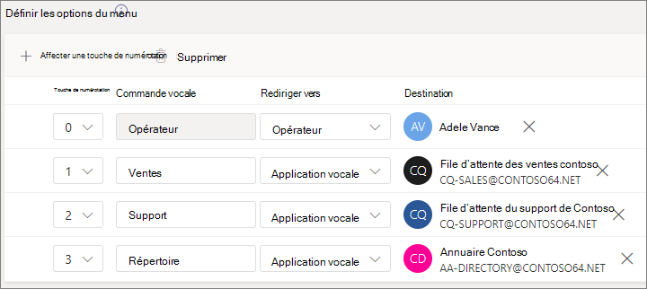

# Configurer un attendant automatiqueSet up an auto attendant

Les employés automatiques peuvent appeler votre organisation et parcourir un système de menus pour parler au service, à la file d'attente d'appels, à une personne ou à un opérateur.Auto attendants let people call your organization and navigate a menu system to speak to the right department, call queue, person, or an operator. Vous pouvez créer des attendants automatiques pour votre organisation à l'aide du Centre d'administration Microsoft Teams ou de PowerShell.You can create auto attendants for your organization with the Microsoft Teams admin center, or with PowerShell.

Veillez à lire l’article [Planifier les standards automatiques et les files d’attente des appels pour Teams](plan-auto-attendant-call-queue.md), puis à suivre les [étapes de démarrage](plan-auto-attendant-call-queue.md#getting-started) avant de suivre les procédures de cet article.Be sure you have read [Plan for Teams auto attendants and call queues](plan-auto-attendant-call-queue.md) and followed the [getting started steps](plan-auto-attendant-call-queue.md#getting-started) before you follow the procedures in this article.

Les attendants automatiques peuvent diriger les appels, sur la base de l'entrée des appelants, vers l'une des destinations suivantes : Auto attendants can direct calls, based on callers' input, to one of the following destinations: 

- **Opérateur** (opérateur défini pour le transport automatique).**Operator** - the operator defined for the auto attendant. La définition d'un opérateur est facultative.Defining an operator is optional. L'opérateur peut être défini comme n'importe quelle autre destination dans cette liste.The operator can be defined as any of the other destinations in this list.
- **Une personne de votre organisation** qui peut recevoir des appels vocux.**Person in the organization** - a person in your organization who can receive voice calls. Il peut s'agit d'un utilisateur en ligne ou d'un utilisateur hébergé sur site utilisant Skype Entreprise Server.This person can be an online user or a user hosted on-premises using Skype for Business Server.
- **Application vocale :** un autre service de messagerie automatique ou une file d'attente d'appels.**Voice app** - another auto attendant or a call queue. (Choisissez le compte de ressource associé au port automatique ou à la file d'attente d'appels lorsque vous choisissez cette destination.)(Choose the resource account associated with the auto attendant or call queue when choosing this destination.)
- **Messagerie vocale** : boîte vocale associée à un groupe Microsoft 365 que vous spécifiez.**Voicemail** - the voice mailbox associated with a Microsoft 365 group that you specify.
- **Numéro de téléphone externe -** n'importe quel numéro de téléphone.**External phone number** - any phone number. (Voir [les détails techniques du transfert externe).](create-a-phone-system-auto-attendant.md#external-phone-number-transfers---technical-details)(See [external transfer technical details](create-a-phone-system-auto-attendant.md#external-phone-number-transfers---technical-details)).
- **Annonce (fichier audio)** : lire un fichier audio.**Announcement (Audio file)** - Play an audio file. Message d'annonce enregistré que vous téléchargez enregistré en tant qu'audio dans . WAV, . MP3 ou . Format WMA.A recorded announcement message you upload that's saved as audio in .WAV, .MP3, or .WMA format. L'enregistrement ne peut pas avoir une taille supérieure à 5 Mo.The recording can be no larger than 5 MB. Le système lit l'annonce, puis revient au menu du transport automatique.The system plays the announcement, and then returns to the auto attendant menu.
- **Annonce (tapée)** : taper un message.**Announcement (Typed)** - Type in a message. Texte que le système doit lire.Text you want the system to read. Vous pouvez entrer jusqu'à 1 000 caractères.You can enter up to 1000 characters. Le système lit l'annonce, puis revient au menu du transport automatique.The system plays the announcement, and then returns to the auto attendant menu.

Vous serez invité à choisir l'une de ces options à différents stades lorsque vous configurerez un attendant automatique.You'll be prompted to choose one of these options at various stages as you set up an auto attendant.

> [!NOTE]
> Lorsque vous choisissez la messagerie vocale comme destination, deux options supplémentaires sont disponibles :When choosing Voicemail as a destination, two additional options are available:
> - **Transcription** (par défaut : non) : lorsqu'il est activé, le message vocal est transcrit et inclus dans le message électronique.**Transcription** (Default: Off) - when enabled, the voicemail message will be transcribed and included as part of the email.
> - **Supprimer le message** d'accueil (par défaut : non activé) : lorsqu'il est activé, le message système standard « Veuillez laisser un message après le ton.**Suppress Greeting** (Default: Off) - when enabled, the standard system message "Please leave a message after the tone. Lorsque vous avez terminé, veuillez raccrocher ou appuyer sur le hachage pour plus d'options. »When you have finished please hang up or press the hash key for more options." ne sera pas supprimée.will be suppressed.

Pour configurer un attendant automatique, dans le Centre d'administration Teams, développez **Voix,** sélectionnez **Les attendants automatiques,** puis **sélectionnez Ajouter.**To set up an auto attendant, in the Teams admin center, expand **Voice**, select **Auto attendants**, and then select **Add**.

## Informations généralesGeneral info

1. Tapez un nom pour le attendant automatique dans la zone en haut.Type a name for the auto attendant in the box at the top.

2. Pour désigner un opérateur, spécifiez la destination des appels vers l'opérateur.To designate an operator, specify the destination for calls to the operator. Cette désignation est facultative (mais recommandée).This designation is optional (but recommended). Définissez **l'option** Opérateur pour permettre aux appelants de sortir des menus et de parler à une personne désignée.Set the **Operator** option to allow callers to break out of the menus and speak to a designated person.

3. Spécifiez le fuseau horaire de ce attendant automatique.Specify the time zone for this auto attendant. Le fuseau horaire est utilisé pour calculer les heures d'ouverture si vous créez un flux d'appels distinct pour les [heures de travail en de suite.](#call-flow-for-after-hours)The time zone is used for calculating business hours if you [create a separate call flow for after hours](#call-flow-for-after-hours).

4. Spécifiez une [langue prise en](create-a-phone-system-auto-attendant-languages.md) charge pour ce attendant automatique.Specify a [supported language](create-a-phone-system-auto-attendant-languages.md) for this auto attendant. Il s'agit de la langue qui sera utilisée pour les invites vocales générées par le système.This is the language that will be used for system-generated voice prompts.

5. Choisissez si vous voulez activer les entrées vocales.Choose if you want to enable voice inputs. Lorsqu'elle est activée, le nom de chaque option de menu devient un mot clé de reconnaissance vocale.When enabled, the name of every menu option becomes a speech-recognition keyword. Par exemple, les appelants peuvent dire « Un » pour sélectionner l'option de menu mappée vers la touche 1, ou dire « Ventes » pour sélectionner l'option de menu appelée « Ventes ».For example, callers can say "One" to select the menu option mapped to key 1, or they can say "Sales" to select the menu option named "Sales."

> [!NOTE]
> Si vous choisissez une langue à l'étape 4 qui ne prend pas en charge les entrées vocales, cette option est désactivée.If you choose a language in Step 4 that doesn't support voice inputs this option will be disabled.

6. Sélectionnez **Suivant.**Select **Next**.

## Flux d'appelsCall flow

Choisissez si vous voulez lire un message d'accueil lorsque le attendant automatique répond à un appel.Choose if you want to play a greeting when the auto attendant answers a call.

Si vous **sélectionnez Lire un fichier audio,** vous pouvez utiliser le bouton Télécharger un fichier pour télécharger un message d'accueil enregistré en tant qu'audio dans .  WAV, . MP3 ou . Format WMA.If you select **Play an audio file** you can use the **Upload file** button to upload a recorded greeting message saved as audio in .WAV, .MP3, or .WMA format. L'enregistrement ne peut pas avoir une taille supérieure à 5 Mo.The recording can be no larger than 5 MB.

Si vous sélectionnez Taper un **message** d'accueil, le système lit le texte que vous tapez (jusqu'à 1 000 caractères) lorsque le attendant automatique répond à un appel.If you select **Type a greeting message** the system will read the text that you type (up to 1000 characters) when the auto attendant answers a call.

Choisissez la façon dont vous voulez router l'appel.Choose how you want to route the call.

Si vous sélectionnez **Déconnecter,** le attendant automatique raccrochera.If you select **Disconnect**, the auto attendant will hang up the call.

Si vous sélectionnez **Rediriger l'appel,** vous pouvez choisir l'une des destinations de routage des appels.If you select **Redirect call**, you can choose one of the call routing destinations.

Si vous sélectionnez **les options du menu** Lecture, vous pouvez choisir de lire un fichier **audio** ou de taper un **message** d'accueil, puis de choisir entre les options de menu et la recherche dans l'annuaire.If you select **Play menu options**, you can choose to **Play an audio file** or **Type in a greeting message** and then choose between menu options and directory search.

### Options de menuMenu options

Pour les options de numérotation, affectez les touches 0-9 du clavier téléphonique à l'une des destinations de routage des appels.For dialing options, assign the 0-9 keys on the telephone keypad to one of the call routing destinations. (Touches \* (Répéter) et (Retour) sont réservés par le système et \# ne peuvent pas être réassignés.)(The keys \* (Repeat) and \# (Back) are reserved by the system and can't be reassigned.)

Les mappages de clés ne doivent pas être continus.Key mappings don't have to be continuous. Il est possible de créer un menu avec les touches 0, 1 et 3 mappées aux options, sans utiliser la touche numéro 2.It's possible to create a menu with keys 0, 1, and 3 mapped to options, while the number 2 key isn't used.

Nous vous recommandons de ma mappage de la touche zéro à l'opérateur si vous en avez configuré un.We recommend mapping the zero key to the operator if you've configured one. Si l'opérateur n'est pas réglé sur une touche quelconque, la commande vocale « Opérateur » est également désactivée.If the operator isn't set to any key, the voice command "Operator" is also disabled.

Pour chaque option de menu, spécifiez les paramètres suivants :For each menu option, specify the following settings:

- **Touche de numérotation** (clé du clavier téléphonique pour accéder à cette option).**Dial key** - the key on the telephone keypad to access this option. Si des entrées vocales sont disponibles, les appelants peuvent également dire ce numéro pour accéder à l'option.If voice inputs are available, callers can also say this number to access the option.

- **Commande vocale** : définit la commande vocale qu'un appelant peut lui donner pour accéder à cette option, si les entrées vocales sont activées.**Voice command** - defines the voice command that a caller can give to access this option, if voice inputs are enabled. Il peut contenir plusieurs mots tels que « Service clientèle » ou « Activités et activités ».It can contain multiple words like "Customer Service" or "Operations and Grounds." Par exemple, l'appelant peut appuyer sur 2, dire « deux » ou dire « Ventes » pour sélectionner l'option mappée vers les deux touches.For example, the caller can press 2, say "two," or say "Sales" to select the option mapped to the two keys. Ce texte est également restituel par sms par reconnaissance vocale pour l'invite de confirmation de service, par exemple, « Transfert de votre appel vers les ventes ».This text is also rendered by text to speech for the service confirmation prompt, which might be something like "Transferring your call to sales."

- **Rediriger vers** (destination de routage des appels utilisée lorsque les appelants choisissent cette option).**Redirect to** - the call routing destination used when callers choose this option. Si vous redirigez vers un service de service automatique ou une file d'attente d'appels, sélectionnez le compte de ressource qui lui est associé.If you are redirecting to an auto attendant or call queue, choose the resource account associated with it.

### Recherche dans l'annuaireDirectory search

Si vous attribuez des touches de  numérotation aux destinations, nous vous recommandons de choisir l'aucune pour **la recherche dans l'annuaire.**If you assign dial keys to destinations, we recommend that you choose **None** for **Directory search**. Si un appelant tente de composer un nom ou une extension à l'aide de touches affectées à des destinations spécifiques, il se peut qu'ils soient acheminés de manière inattendue vers une destination avant qu'ils n'tentent de terminer la saisie du nom ou de l'extension.If a caller attempts to dial a name or extension using keys that are assigned to specific destinations, they might be unexpectedly routed to a destination before they finish entering the name or extension. Nous vous recommandons de créer un attendant automatique distinct pour la recherche dans l'annuaire et de lier votre attendant automatique principal à celui-ci à l'aide d'une clé de numérotation.We recommend that you create a separate auto attendant for directory search and have your main auto attendant link to it with a dial key.

Si vous n'avez pas attribué les touches de numérotation, choisissez une option pour **la recherche dans l'annuaire.**If you didn't assign dial keys, then choose an option for **Directory search**.

**Numérotation par nom** : si vous activez cette option, les appelants peuvent dire le nom de l'utilisateur ou le taper sur le clavier téléphonique.**Dial by name** - If you enable this option, callers can say the user's name or type it on the telephone keypad. Tout utilisateur en ligne ou tout utilisateur hébergé sur site utilisant Skype Entreprise Server est un utilisateur éligible et peut être trouvé avec la numérotation par nom.Any online user or any user hosted on-premises using Skype for Business Server, is an eligible user and can be found with Dial by name. (Vous pouvez définir qui figure dans l'annuaire et qui n'est pas inclus dans la page de [portée de la](#dial-scope) numérotation.)(You can set who is and isn't included in the directory on the [Dial scope](#dial-scope) page.)

**Numérotation par extension** : si vous activez cette option, les appelants peuvent entrer en contact avec les utilisateurs de votre organisation en composant leur numéro de téléphone.**Dial by extension** - If you enable this option, callers can connect with users in your organization by dialing their phone extension. Tout utilisateur en ligne ou tout utilisateur hébergé sur site utilisant Skype Entreprise Server est un utilisateur éligible et peut être trouvé avec la numérotation **par extension.**Any online user or any user hosted on-premises using Skype for Business Server, is an eligible user and can be found with **Dial by extension**. (Vous pouvez définir qui figure dans l'annuaire et qui n'est pas inclus dans la page de [portée de la](#dial-scope) numérotation.)(You can set who is and isn't included in the directory on the [Dial scope](#dial-scope) page.)

Les utilisateurs que vous souhaitez rendre disponibles pour la numérotation par extension doivent avoir une extension spécifiée dans  l'un des attributs de téléphones suivants définis dans Active Directory ou Azure Active Directory (voir Ajouter des utilisateurs individuellement ou en bloc pour plus d'informations).)Users you want to make available for Dial By Extension need to have an extension specified as part of one of the following phones attributes defined in Active Directory or Azure Active Directory (See [Add users individually or in bulk](/microsoft-365/admin/add-users/add-users) for more information.)

- OfficePhoneOfficePhone
- Téléphone (domicile)HomePhone
- Mobile/MobilePhoneMobile/MobilePhone
- TelephoneNumber/PhoneNumberTelephoneNumber/PhoneNumber
- OtherTelephoneOtherTelephone

Le format requis pour entrer l'extension dans le champ Numéro de téléphone de l'utilisateur peut être l'un des formats suivants :The required format to enter the extension in the user phone number field can be one of the following formats:

- *+\<phone number>;ext=\<extension>**+\<phone number>;ext=\<extension>*
- *+\<phone number>x\<extension>**+\<phone number>x\<extension>*
- *x\<extension>**x\<extension>*

- Exemple 1 : Set-MsolUser -UserPrincipalName usern@domain.com -Phonenumber « +1555555678;ext=5678 »Example 1: Set-MsolUser -UserPrincipalName usern@domain.com -Phonenumber "+15555555678;ext=5678"
- Exemple 2 : Set-MsolUser -UserPrincipalName usern@domain.com -Phonenumber « +1555555678x5678 »Example 2: Set-MsolUser -UserPrincipalName usern@domain.com -Phonenumber "+15555555678x5678"
- Exemple 3 : Set-MsolUser -UserPrincipalName usern@domain.com -Phonenumber « x5678 »Example 3: Set-MsolUser -UserPrincipalName usern@domain.com -Phonenumber "x5678"

Vous pouvez définir l'extension dans le Centre [d'administration Microsoft 365](https://admin.microsoft.com/) ou le [Centre d'administration Azure Active Directory.](https://aad.portal.azure.com)You can set the extension in the [Microsoft 365 admin center](https://admin.microsoft.com/) or the [Azure Active Directory admin center](https://aad.portal.azure.com). Jusqu'à 12 heures peuvent être nécessaires avant que les modifications ne soient disponibles pour les attendants automatiques et les files d'attente d'appels.It can take up to 12 hours before changes are available to auto attendants and call queues.

> [!NOTE]
> Si vous souhaitez utiliser les fonctionnalités Numérotation **par** nom et Numérotation par **numérotation** par numérotation de poste, vous pouvez affecter une touche de numérotation sur votre postes de service automatique principal afin d'atteindre un postes de numérotation automatique activé pour la numérotation **par nom.**If you want to use both the **Dial by name** and **Dial by extension** features, you can assign a dial key on your main auto attendant to reach an auto attendant enabled for **Dial by name**. Dans ce attendant automatique, vous pouvez affecter la touche 1 (qui ne possède aucune lettre associée) pour atteindre le numéro par numérotation par **numérotation** automatique de poste.Within that auto attendant, you can assign the 1 key (which has no letters associated with it) to reach the **Dial by extension** auto attendant.

Une fois que vous avez sélectionné une option **de recherche dans l'annuaire,** sélectionnez **Suivant.**Once you have selected a **Directory search** option, select **Next**.

## Flux d'appels pendant les heures de travail en de suiteCall flow for after hours

Les heures d'ouverture peuvent être définies pour chaque employé de service automatique.Business hours can be set for each auto attendant. Si ce n'est pas le cas, tous les jours et toutes les heures de la semaine seront considérés comme heures d'ouverture, car une planification 24/24 est définie par défaut.If business hours aren't set, all days and all hours in the day are considered business hours because a 24/7 schedule is set by default. Les heures d'ouverture peuvent être définies avec des pauses au cours de la journée et toutes les heures non définies comme heures d'ouverture sont considérées comme des heures d'ouverture en de suite.Business hours can be set with breaks in time during the day, and all of the hours that are not set as business hours are considered after-hours. Vous pouvez définir différentes options de traitement des appels entrants et des messages d'accueil pour les heures de travail en de suite.You can set different incoming call-handling options and greetings for after-hours.

Selon la configuration de vos files d'attente et de vos files d'attente automatiques, il se peut que vous devrez uniquement spécifier le routage des appels en de après-heures pour les travailleurs automatiques avec des numéros de téléphone directs.Depending on how you have configured your auto attendants and call queues, you may only need to specify after-hours call routing for auto attendants with direct phone numbers.

Si vous souhaitez un routage d'appel distinct pour les appelants en de suite, spécifiez vos heures d'ouverture pour chaque jour.If you want separate call routing for after-hours callers, then specify your business hours for each day. Sélectionnez **Ajouter un nouvel horaire** pour spécifier plusieurs ensembles d'heures pour un jour donné, par exemple pour spécifier une pause déjeuner.Select **Add new time** to specify multiple sets of hours for a given day, for example, to specify a lunch break.

Une fois que vous avez spécifié vos heures d'ouverture, sélectionnez vos options de routage des appels pour les heures de fermeture.Once you've specified your business hours, then choose your call routing options for after hours. Les mêmes options sont disponibles que pour le routage des appels aux heures d'ouverture spécifiés ci-dessus.The same options are available as for the business hours call routing that you specified above.

Lorsque **vous** avez terminé, sélectionnez Suivant.Select **Next** when you're done.

## Flux d'appels pendant les jours fériésCall flows during holidays

Votre employé automatique peut avoir un flux [d'appels](set-up-holidays-in-teams.md)pour chaque jour férié que vous avez installé.Your auto attendant can have a call flow for each [Holiday you've set up](set-up-holidays-in-teams.md). Vous pouvez ajouter jusqu'à 20 congés planifiés pour chaque standard automatique.You can add up to 20 scheduled holidays to each auto attendant.

1. Dans la page Paramètres d'appel pour les fêtes, sélectionnez **Ajouter.**On the Holiday call settings page, select **Add**.

2. Tapez un nom pour ce paramètre de congés.Type a name for this holiday setting.

3. Dans la **dropdown** Jours fériés, choisissez les jours fériés que vous voulez utiliser.From the **Holiday** dropdown, choose the holiday that you want to use.

4. Choisissez le type de message d'accueil que vous voulez utiliser.Choose the type of greeting that you want to use.

    

5. Choisissez si vous voulez **déconnecter ou** **rediriger** l'appel.Choose if you want to **Disconnect** or **Redirect** the call.

6. Si vous choisissez de rediriger l'appel, choisissez sa destination de routage.If you chose to redirect, choose the call routing destination for the call.

7. Sélectionnez **Enregistrer**.Select **Save**.

Répétez la procédure si nécessaire pour chaque jour férié supplémentaire.Repeat the procedure as needed for each additional holiday.

Une fois que vous avez ajouté tous vos jours fériés, sélectionnez **Suivant.**When you've added all your holidays, select **Next**.

## Portée de la numérotationDial scope

*L'étendue de* la numérotation définit les utilisateurs disponibles dans l'annuaire lorsqu'un appelant utilise la numérotation par nom ou la numérotation par extension.The *dial scope* defines which users are available in the directory when a caller uses dial-by-name or dial-by-extension. La valeur par défaut de **Tous les** utilisateurs en ligne inclut tous les utilisateurs de votre organisation qui sont des utilisateurs en ligne ou hébergés sur site à l'aide de Skype Entreprise Server.The default of **All online users** includes all users in your organization that are Online users or hosted on-premises using Skype for Business Server.

Vous pouvez inclure ou exclure  des utilisateurs  spécifiques en sélectionnant Groupe d'utilisateurs personnalisés sous Inclure ou Exclure, puis en choisissant un ou plusieurs groupes, listes de distribution ou groupes de sécurité Microsoft 365. You can include or exclude specific users by selecting **Custom user group** under **Include** or **Exclude** and choosing one or more Microsoft 365 groups, distribution lists, or security groups. Par exemple, vous pouvez exclure des cadres de votre organisation de l'annuaire d'appels.For example, you might want to exclude executives in your organization from the dialing directory. (Si un utilisateur se trouve dans les deux listes, il sera exclu de l'annuaire.)(If a user is in both lists, they will be excluded from the directory.)

> [!NOTE]
> Jusqu'à 36 heures peuvent être nécessaire pour que le nom d'un nouvel utilisateur soit répertorié dans l'annuaire.It might take up to 36 hours for a new user to have their name listed in the directory.

Lorsque vous avez terminé de définir l'étendue de la numérotation, sélectionnez **Suivant.**When you're done setting the dial scope, select **Next**.

## Comptes de ressourcesResource accounts

Tous les attendants automatiques doivent avoir un compte de ressource associé.All auto attendants must have an associated resource account.  Les travailleurs automatiques de premier niveau auront besoin d'au moins un compte de ressource associé à un numéro de service.First-level auto attendants will need at least one resource account that has an associated service number. Si vous le souhaitez, vous pouvez affecter plusieurs comptes de ressources à un service automatique, chacun avec un numéro de service distinct.If you wish, you can assign several resource accounts to an auto attendant, each with a separate service number.

Pour ajouter un compte de ressource, **sélectionnez Ajouter un compte et** recherchez le compte à ajouter.To add a resource account, select **Add account** and search for the account that you want to add. **Sélectionnez** Ajouter, puis **Ajouter.**Select **Add**, and then select **Add**.

Lorsque vous avez terminé d'ajouter des comptes de service, sélectionnez **Envoyer** pour terminer la configuration du attendant automatique.When you have finished adding service accounts, select **Submit** to complete auto attendant configuration.

## Transferts de numéros de téléphone externes - Détails techniquesExternal phone number transfers - technical details

Reportez-vous [aux conditions préalables](plan-auto-attendant-call-queue.md#prerequisites) pour autoriser les travailleurs automatiques à transférer des appels en externe.Refer to the [Prerequisites](plan-auto-attendant-call-queue.md#prerequisites) in order to allow auto attendants to transfer calls externally.  De plus,:In addition:

- Pour un compte de ressource titulaire d'une licence Forfait d'appels, le numéro de téléphone de transfert externe doit être entré au format E.164 (+[code du pays][code de zone][numéro de téléphone]).For a resource account with a [Calling Plan license](calling-plans-for-office-365.md), the external transfer phone number must be entered in E.164 format (+[country code][area code][phone number]).

- Pour un compte de ressource ayant une licence système téléphonique et une stratégie de routage vocal en ligne de routage direct, le format du numéro de téléphone de transfert externe dépend des paramètres du contrôleur de session en bordure [(SBC).](direct-routing-connect-the-sbc.md)For a resource account with a Phone System License and Direct Routing online voice routing policy, the external transfer phone number format is dependant on the [Session Border Controller (SBC)](direct-routing-connect-the-sbc.md) settings.

Le numéro de téléphone sortant affiché est déterminé comme suit :The outbound phone number that's displayed is determined as follows:

  - Pour les numéros de plan d'appel, le numéro de téléphone de l'appelant d'origine s'affiche.For Calling Plan numbers, the original caller's phone number is displayed.
  - Pour les numéros de routage direct, le nombre envoyé est basé sur le paramètre P-Ed-Identity (NT) sur le SBC, comme suit :For Direct Routing numbers, the number sent is based on the P-Asserted-Identity (PAI) setting on the SBC, as follows:
    - S'il est désactivé, le numéro de téléphone de l'appelant d'origine s'affiche.If set to Disabled, the original caller's phone number is displayed. Il s'agit du paramètre par défaut et recommandé.This is the default and recommended setting.
    - S'il est activé, le numéro de téléphone du compte de ressource s'affiche.If set to Enabled, the resource account phone number is displayed.

Dans un environnement hybride Skype Entreprise, pour transférer un appel de moyen de transport automatique vers le réseau PSTN, créez un utilisateur sur site avec le transfert d'appel sur le numéro PSTN.In a Skype for Business hybrid environment, to transfer an auto attendant call to the PSTN, create a new on-premises user with call forwarding set to the PSTN number. L'utilisateur doit être activé pour les Voix Entreprise une stratégie vocale lui est affectée.The user must be enabled for Enterprise Voice and have a voice policy assigned. Pour en savoir plus, [consultez le transfert d'appel du attendant automatique vers PSTN.](/SkypeForBusiness/plan/exchange-unified-messaging-online-migration-support#auto-attendant-call-transfer-to-pstn)To learn more, see [Auto attendant call transfer to PSTN](/SkypeForBusiness/plan/exchange-unified-messaging-online-migration-support#auto-attendant-call-transfer-to-pstn).

### Créer un attendant automatique avec PowerShellCreate an auto attendant with PowerShell

Vous pouvez également utiliser PowerShell pour créer et configurer des attendants automatiques.You can also use PowerShell to create and set up auto attendants. Voici les cmdlets dont vous avez besoin pour gérer un attendant automatique :Here are the cmdlets that you need to manage an auto attendant:

- [New-CsAutoAttendantNew-CsAutoAttendant](/powershell/module/skype/new-csautoattendant)  
- [Set-CsAutoAttendantSet-CsAutoAttendant](/powershell/module/skype/set-csautoattendant)
- [Get-CsAutoAttendantGet-CsAutoAttendant](/powershell/module/skype/get-csautoattendant)
- [Get-CsAutoAttendantHolidaysGet-CsAutoAttendantHolidays](/powershell/module/skype/get-csautoattendantholidays)
- [Remove-CsAutoAttendantRemove-CsAutoAttendant](/powershell/module/skype/remove-csautoattendant)
- [New-CsAutoAttendantMenuNew-CsAutoAttendantMenu](/powershell/module/skype/new-csautoattendantmenu)
- [New-CsOnlineAudioFileNew-CsOnlineAudioFile](/powershell/module/skype/new-CsOnlineAudioFile)
- [New-CsAutoAttendantCallFlowNew-CsAutoAttendantCallFlow](/powershell/module/skype/New-CsAutoAttendantCallFlow)
- [Export-CsAutoAttendantHolidaysExport-CsAutoAttendantHolidays](/powershell/module/skype/export-csorganizationalautoattendantholidays)
- [Nouvelle CsOnlineTimeRangeNew-CsOnlineTimeRange](/powershell/module/skype/new-csonlinetimerange)
- [Nouvelle CsOnlineDateTimeRangeNew-CsOnlineDateTimeRange](/powershell/module/skype/new-csonlinedatetimerange)
- [Nouvelle CsOnlineScheduleNew-CsOnlineSchedule](/powershell/module/skype/New-CsOnlineSchedule)
- [Get-CsAutoAttendantSupportedTimeZoneGet-CsAutoAttendantSupportedTimeZone](/powershell/module/skype/Get-CsAutoAttendantSupportedTimeZone)
- [New-CsAutoAttendantCallHandlingAssociationNew-CsAutoAttendantCallHandlingAssociation](/powershell/module/skype/New-CsAutoAttendantCallHandlingAssociation)
- [Get-CsAutoAttendantSupportedLanguageGet-CsAutoAttendantSupportedLanguage](/powershell/module/skype/Get-CsAutoAttendantSupportedLanguage)
- [Import-CsAutoAttendantHolidaysImport-CsAutoAttendantHolidays](/powershell/module/skype/import-csautoattendantholidays)
- [New-CsAutoAttendantCallableEntityNew-CsAutoAttendantCallableEntity](/powershell/module/skype/New-CsAutoAttendantCallableEntity)

## Rubriques connexesRelated topics

[Les avantages du système téléphoniqueHere's what you get with Phone System](./here-s-what-you-get-with-phone-system.md)

[Obtenir des numéros de téléphone de serviceGetting service phone numbers](./getting-service-phone-numbers.md)

[Disponibilité des forfaits d’appels et de l’audioconférence selon les régions et les paysCountry and region availability for Audio Conferencing and Calling Plans](./country-and-region-availability-for-audio-conferencing-and-calling-plans/country-and-region-availability-for-audio-conferencing-and-calling-plans.md)

[Présentation de Windows PowerShell et Skype Entreprise OnlineAn introduction to Windows PowerShell and Skype for Business Online](/SkypeForBusiness/set-up-your-computer-for-windows-powershell/set-up-your-computer-for-windows-powershell)
