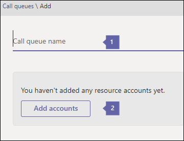

# <a name="create-a-cloud-call-queue"></a>Créer une file d’attente d’appels cloud

Les files d’attente d’appels Cloud peuvent fournir :

- Message d’accueil.
- Musique pendant que les personnes sont en attente.
- La redirection des appels vers des téléopérateurs dans des listes de distribution et des groupes de sécurité à extension messagerie.
- Définir des paramètres différents, tels que la taille maximale de la file d’attente, le délai d’expiration et les options de traitement des appels.

Vous pouvez associer un numéro de téléphone à une file d’attente d’appels à l’aide d’un [compte de ressources](manage-resource-accounts.md). Une file d’attente d’appels peut être numérotée directement ou consultée par une sélection dans un standard automatique.

L’appelant entend lire de la musique pendant qu’il est en attente et l’appel se connecte à la *première fois, première sortie* (FIFO).

Tous les appels dans la file d’attente sont envoyés aux agents par le biais de l’une des méthodes suivantes :

- Avec le routage de l’attendant, le premier appel dans la file d’attente sonne sur tous les agents en même temps.
- Avec le routage en série, le premier appel dans la file d’attente sonne tous les agents d’appel un par un.
- Avec la répétition alternée, le routage des appels entrants est équilibré de telle sorte que chaque agent d’appel obtient le même nombre d’appels à partir de la file d’attente.

    > [!NOTE]
    > Les téléopérateurs qui sont **hors ligne**, ont défini leur présence sur **ne pas déranger** ou ont désactivé la file d’attente des appels ne recevront aucun appel.

- Une seule notification d’appel entrant (pour l’appel en tête de file) sera envoyée aux téléopérateurs à la fois.
- Lorsqu’un téléopérateur accepte l’appel, le prochain appel entrant dans la file d’attente sonnera pour les autres téléopérateurs.

> [!NOTE]
> Cet article s’applique à Microsoft teams et à Skype entreprise online.

## <a name="step-1--get-started"></a>Étape 1 : prendre en main

Pour commencer à utiliser les files d’attente d’appels, il est important de garder à l’esprit les points suivants :

- Une file d’attente d’appels doit avoir un compte de ressources associé. Pour plus d’informations sur les comptes de ressources, voir [gérer les comptes de ressources dans teams](manage-resource-accounts.md) .
- Lorsque vous attribuez un numéro de téléphone à un compte de ressources, vous pouvez désormais utiliser la [licence utilisateur virtuel](teams-add-on-licensing/virtual-user.md)du système téléphonique sans frais. Le système téléphonique autorise les numéros de téléphone au niveau de l’Organisation pour une standardisation automatique et des services de files d’attente de faible coût.

> [!NOTE]
> Les numéros de service de routage direct pour les files d’attente d’appels sont pris en charge pour les utilisateurs et agents Microsoft teams uniquement.

> [!NOTE]
> Pour rediriger les appels vers des utilisateurs de votre organisation qui sont en ligne, ils doivent disposer d’une licence de **système téléphonique** et être activés pour Enterprise Voice ou disposer d’offres d’appels d’Office 365. Consultez la rubrique [affectation de licences Skype entreprise](/Skype/SfbOnline/skype-for-business-and-microsoft-teams-add-on-licensing/assign-skype-for-business-and-microsoft-teams-licenses.md) ou [affectation de licences Microsoft teams](assign-teams-licenses.md). Pour les activer pour Enterprise Voice, vous pouvez utiliser Windows PowerShell. Par exemple, exécutez :`Set-CsUser -identity "Amos Marble" -EnterpriseVoiceEnabled $true`

- Pour en savoir plus sur les offres d’appels d’Office 365, voir [système téléphonique et](calling-plan-landing-page.md) offres d’appel et [forfaits pour Office 365](calling-plans-for-office-365.md).

- Vous ne pouvez attribuer des files d’attente d’appels Cloud qu’aux numéros de téléphone de service gratuits ou payants que vous avez dans le **Centre d’administration Microsoft teams** ou transférés à partir d’un autre fournisseur de service. Les crédits de communication sont requis pour les numéros de service gratuits.

    > [!NOTE]
    > Les numéros de téléphone des utilisateurs (abonnés) ne peuvent pas être attribués aux numéros de service de file d’attente d’appels uniquement ou les numéros de téléphone gratuits peuvent être utilisés.

- Les clients suivants sont pris en charge pour les agents d’appel associés à une file d’attente d’appels Cloud :

  - Client de bureau Skype entreprise 2016 (versions 32 bits et 64 bits)

  - Client de bureau Lync 2013 (versions 32 bits et 64 bits)

  - Tous les modèles de téléphone IP pris en charge par Microsoft Teams. Consultez [Obtention de numéros de téléphone pour Skype Entreprise Online](/skypeforbusiness/what-is-phone-system-in-office-365/getting-phones-for-skype-for-business-online/getting-phones-for-skype-for-business-online).

  - Client Skype entreprise pour Mac (version 16.8.196 et versions ultérieures)

  - Client Skype entreprise Android (version 6.16.0.9 et versions ultérieures)

  - Client Skype entreprise pour iPhone (version 6.16.0 et versions ultérieures)

  - Client Skype entreprise pour iPad (version 6.16.0 et versions ultérieures)

  - Client Microsoft Teams (versions 32 bits et 64 bits)

  - Client Microsoft teams Mac

  - Application Microsoft teams pour iPhone

  - Application Android Microsoft teams

    > [!NOTE]
    > Les files d’attente d’appels disposant d’un numéro de routage direct ne seront pas prises en charge pour les clients Skype entreprise, les clients Lync ou les téléphones IP Skype entreprise en tant qu’agents. 

## <a name="step-2--getting-or-transferring-toll-or-toll-free-service-phone-numbers"></a>Étape 2 : Obtient ou transfère des numéros de service gratuits ou payants

Pour pouvoir créer et configurer vos files d’attente d’appels, vous devez obtenir ou transférer vos numéros de service gratuits ou payants existants. Une fois que vous avez obtenu les numéros**** > **de téléphone de** > service gratuits ou payants, ils s’affichent dans le centre > d' **administration Microsoft teams**et le **type de numéro** apparaît comme suit :**** **Service : numéro gratuit**. Pour obtenir vos numéros de service, reportez-vous à la rubrique [obtention de numéros de service](getting-service-phone-numbers.md) ou, si vous souhaitez transférer un numéro de service existant, reportez-vous à la section transférer des [numéros de téléphone vers Office 365](transfer-phone-numbers-to-office-365.md).

> [!NOTE]
> Si vous résidez en dehors des États-Unis, vous ne pouvez pas utiliser le centre d’administration de Microsoft teams pour obtenir des numéros de service. Pour plus d’informations sur la [gestion des numéros de téléphone de votre organisation](manage-phone-numbers-for-your-organization/manage-phone-numbers-for-your-organization.md) , voir gérer les numéros de téléphone situés en dehors des États-Unis.

Lorsque vous configurez plusieurs standards automatiques, il est possible que vous affectiez uniquement un numéro de téléphone au compte de ressources principal du standard automatique, qui peut diriger les appelants vers vos files d’attente d’appels ou standards automatiques imbriqués. Dans ces situations, vous créez tous les standards automatiques et les files d’attente d’appels dans votre système sans affecter d’options de clavier numérique, puis modifiez les paramètres ultérieurement. Cela est nécessaire, car vous n’êtes pas autorisé à créer une option de liaison vers une file d’attente d’appels ou un standard automatique qui n’existe pas encore.

## <a name="step-3--create-a-new-call-queue"></a>Étape 3 : création d’une file d’attente d’appels

[!INCLUDE [updating-admin-interfaces](includes/updating-admin-interfaces.md)]

> [!IMPORTANT]
> Chaque file d’attente d’appels doit avoir un [compte de ressources](manage-resource-accounts.md)associé. Vous devez d’abord créer le compte de ressources, puis vous pouvez l’associer à la file d’attente d’appels.

### <a name="using-the-microsoft-teams-admin-center"></a>Utilisation du centre d’administration Microsoft teams

Dans le **Centre d’administration de Microsoft teams**, les**files d’attente d’appels** **vocaux** > , puis cliquez sur **+ Ajouter nouveau**:

### <a name="set-the-call-queue-display-name-and-resource-account"></a>Définir le nom d’affichage de la file d’attente d’appels et le compte de ressources



* * *


**nom** de la capture d’écran précédente, entrez un nom d’affichage descriptif pour la file d’attente d’appels. Ce nom est obligatoire et peut contenir jusqu’à 64 caractères, y compris des espaces.

 Ce nom s’affiche dans la notification de l’appel entrant.

* * *


**Ajouter des comptes** Sélectionnez un compte de ressources. Le compte de ressource est ou n’est pas associé à un numéro de service payant ou gratuit pour la file d’attente d’appels, mais chaque file d’attente d’appels nécessite un compte de ressources associé.

S’il n’y figure pas, vous devez obtenir des numéros de service et les affecter à un compte de ressources avant de pouvoir créer cette file d’attente d’appels, comme décrit précédemment. Pour obtenir vos numéros de service, consultez la rubrique [obtention de numéros de téléphone de service](getting-service-phone-numbers.md). Pour créer un compte de ressources, voir [gérer les comptes de ressources dans teams](manage-resource-accounts.md) si vous souhaitez que votre file d’attente d’appels dispose d’un numéro de téléphone associé.

> [!NOTE]
> Le cas échéant, ou si vous avez besoin d’affecter un **domaine** , vous pouvez l’affecter au compte de ressources de la file d’attente d’appels.

### <a name="set-the-greeting-and-music-played-while-on-hold"></a>Définir le message d’accueil et la musique lue pendant la mise en attente


* * *


Le **message d’accueil** est facultatif. Il s’agit du message d’accueil qui est lu pour les personnes qui rejoignent le numéro de la file d’attente d’appels.

Vous pouvez charger un fichier audio (formats. wav,. mp3 ou. WMA).


**Attente musicale** Vous pouvez utiliser l’attente de musique par défaut fournie avec la file d’attente d’appels ou vous pouvez charger un fichier audio au format. wav,. mp3 ou. WMA à utiliser comme votre musique personnalisée en attente.

* * *

### <a name="select-the-call-answering-options"></a>Sélectionner les options de répondeur automatique


Vous pouvez sélectionner jusqu’à 200 opérateurs d’appel qui appartiennent à l’une des listes de diffusion ou groupes suivantes :

- Groupe Office 365
- Groupe de sécurité
- Liste de distribution

Les agents d’appel sélectionnés doivent être l’un des éléments suivants : 

- Utilisateurs en ligne avec une licence de système téléphonique et la voix entreprise activée 
- Utilisateurs en ligne avec un plan d’appels
- Utilisateurs de Skype entreprise sur site

  > [!NOTE]
  > Cela s’applique également si vous souhaitez rediriger les appels vers des utilisateurs de votre organisation qui sont en ligne. Ces personnes doivent disposer d’une licence de **système téléphonique** et d’une voix entreprise activée **ou** avoir un plan d’appels. Pour plus d’informations, reportez-vous à la section [affectation de licences Skype entreprise](/Skype/SfbOnline/skype-for-business-and-microsoft-teams-add-on-licensing/assign-skype-for-business-and-microsoft-teams-licenses.md), [attribution de licences Microsoft teams](https://docs.microsoft.com/microsoftteams/assign-teams-licenses)ou le [plan d’appels qui vous convient ?](https://docs.microsoft.com/microsoftteams/calling-plan-landing-page)

 Pour activer un agent pour voix entreprise, vous pouvez utiliser Windows PowerShell. Par exemple, exécutez :`Set-CsUser -identity "Amos Marble" -EnterpriseVoiceEnabled $true`

- Utilisateurs disposant d’une licence de **système téléphonique** ou d’une offre d’appels ajoutée à un groupe Office 365 ; Liste de distribution à extension messagerie ; ou un groupe de sécurité. La réception d’appels à partir d’une file d’attente peut durer jusqu’à trois heures pour un agent nouvellement ajouté dans une liste de distribution ou un groupe de sécurité. Une liste de distribution ou un groupe de sécurité nouvellement créé peut nécessiter jusqu’à 48 heures de disponibilité pour une utilisation avec des files d’attente d’appels. Les nouveaux groupes Office 365 sont disponibles presque immédiatement.

- Si vos agents utilisent l’application Microsoft teams pour effectuer des appels de file d’attente d’appels, ils doivent être en mode TeamsOnly.


**Méthode de routage** Vous pouvez choisir **standard**, **série**ou **tourniquet** pour la méthode de distribution de votre file d’attente d’appels. La totalité des files d’attente d’appels nouvelles et existantes est activée par défaut. Lorsque le routage standard est utilisé, le premier appel dans la file d’attente sonne sur tous les agents d’appel en même temps. Le premier agent d’appel pour décrocher l’appel obtient l’appel.

- Le routage de l' **attendant** entraîne le premier appel dans la file d’attente pour sonner tous les agents d’appel en même temps. Le premier agent d’appel pour décrocher l’appel obtient l’appel.
- **Routage en série** les appels entrants sonnent un par un, en commençant par le début de la liste des agents d’appel. Les agents ne peuvent pas être commandés dans la liste des agents d’appel. Si un agent est rejeté ou ne décroche pas d’appel, l’appel sonnera sur l’agent suivant dans la liste et tentera d’avoir accès à tous les agents un par un jusqu’à ce qu’il soit décroché ou arrive à expiration dans la file d’attente.
  > [!NOTE]
  > Le routage en série ignorera les agents qui sont **hors ligne**, ont défini leur présence sur **ne pas déranger**ou a **refusé** d’obtenir des appels à partir de cette file d’attente.
- **Tourniquet de tourniquet** qui achemine les appels entrants de telle sorte que chaque agent d’appel obtient le même nombre d’appels à partir de la file d’attente. Cela pourrait être souhaitable dans un environnement de ventes entrantes pour garantir l’égalité des chances entre tous les agents d’appel.

### <a name="select-an-agent-opt-out-option"></a>Sélectionner une option d’annulation d’agent


* * *


**L’agent peut refuser d'** avoir accès aux appels Vous pouvez choisir d’autoriser les agents de files d’attente d’appels à refuser d’effectuer des appels à partir d’une file d’attente particulière en activant cette option.

L’activation de cette option permet à tous les agents de cette file d’attente de démarrer ou d’arrêter de recevoir des appels à partir de la file d’attente d’appels. Vous pouvez révoquer les privilèges d’annulation de l’agent à tout moment en désactivant la case à cocher, pour que les agents le fassent automatiquement pour cette file d’attente (paramètre par défaut pour tous les agents).

Pour accéder à l’option d’annulation, les agents peuvent procéder comme suit :

 1. Ouvrez les **options** de votre client Skype entreprise de bureau.
 2. Dans l’onglet **transfert d’appel** , cliquez sur le lien modifier les **paramètres en ligne** .
 3. Dans la page Paramètres utilisateur, cliquez sur **files d’attente d’appels**, puis désactivez les cases à cocher correspondant aux files d’attente pour lesquelles elles doivent être refusées.

    > [!NOTE]
    > Les agents qui utilisent des applications ou des points de terminaison autres que le bureau Skype entreprise peuvent accéder à l’option d’annulation [https://aka.ms/cqsettings](https://aka.ms/cqsettings)du portail des paramètres utilisateur.


**paramètre alerte** de l’agent de capture d’écran précédent

Cela définit la durée d’un appel de l’agent pour être averti de l’appel avant que les méthodes de routage par série ou par répétition alternées soient déplacées vers l’agent suivant.

Le paramètre par défaut est de 30 secondes, mais peut être configuré pour une durée de 3 minutes maximum.

* * *

### <a name="set-the-call-overflow-and-timeout-handling-options"></a>Définir les options de dépassement d’appel et de gestion des délais d’expiration


* * *


**Nombre maximal d’appels dans la file d’attente** Utilisez cette valeur pour définir le nombre maximal d’appels qui peuvent attendre dans la file d’attente en même temps. La valeur par défaut est 50, mais elle peut varier entre 0 et 200. Lorsque cette limite est atteinte, l’appel est géré selon la configuration du paramètre **lorsque le nombre maximal d’appels est atteint** ci-dessous.

* * *


**Lorsque le nombre maximum d’appels est atteint** Lorsque la file d’attente des appels atteint sa taille maximale (définie en utilisant le **nombre maximal d’appels dans la file d’attente** ), vous pouvez choisir ce qu’il advient des nouveaux appels entrants.

- Se **déconnecter** L’appel est déconnecté.
- **Rediriger vers** Lorsque vous choisissez cette option, sélectionnez l’une des options suivantes :

  - **Personne de votre entreprise** Un utilisateur en ligne disposant d’une licence de **système téléphonique** et est activé pour voix entreprise ou avoir un plan d’appels. Vous pouvez la configurer de manière à ce que l’appelant puisse être dirigé vers la boîte vocale. Pour cela, sélectionnez une **personne au sein de votre entreprise** et configurez cette personne pour que les appels soient transférés directement à la boîte vocale.

  Pour en savoir plus sur les licences requises pour la boîte vocale, consultez la rubrique [configurer la messagerie vocale Cloud](set-up-phone-system-voicemail.md).

  - **Application vocale** Sélectionnez le nom d’un compte de ressources associé à une file d’attente d’appels ou à un standard automatique que vous avez déjà créé.

* * *


**Délai d’appel : délai d’attente maximum** Vous pouvez également décider du temps qu’un appel peut mettre en attente dans la file d’attente avant qu’il arrive à expiration, et qu’il doive être redirigé ou déconnecté. Le moment où il est redirigé dépend de la façon dont vous définissez le paramètre à la **fin de l’appel** . Vous pouvez définir une heure comprise entre 0 et 45 minutes.

La valeur Timeout peut être définie en secondes, à des intervalles de 15 secondes. Cela vous permet de manipuler le flux d’appels avec une granularité plus fine. Par exemple, vous pouvez spécifier que les appels qui ne sont pas traités par un agent dans un délai de 30 secondes s’exécutent dans un standard automatique de recherche d’annuaires.


**Lorsque** le délai d’appel est épuisé Lorsque l’appel atteint la limite définie en fonction de la **durée pendant laquelle un appel peut patienter dans la file d’attente** , vous pouvez choisir ce qu’il advient de cet appel :

- Se **déconnecter** L’appel est déconnecté.
- **Rediriger cet appel vers** Lorsque vous choisissez cette option, vous disposez des options suivantes :
  - **Personne de votre entreprise** Un utilisateur en ligne disposant d’une licence de **système téléphonique** et est activé pour voix entreprise ou avec des plans d’appels. Vous pouvez le régler pour que la personne appelant soit redirigée vers la messagerie vocale. Pour cela, sélectionnez une **personne au sein de votre entreprise** et configurez cette personne pour que les appels soient transférés directement à la boîte vocale.

  Pour en savoir plus sur les licences requises pour la boîte vocale, consultez la rubrique [configurer la messagerie vocale Cloud](set-up-phone-system-voicemail.md).

  - **Application vocale** Sélectionnez le nom d’un compte de ressources associé à une file d’attente d’appels ou à un standard automatique que vous avez déjà créé.

## <a name="change-a-users-caller-id-for-outbound-calls"></a>Modification de l’ID d’appelant d’un utilisateur pour les appels sortants

Vous pouvez protéger l’identité d’un utilisateur en modifiant son ID d’appelant pour les appels sortants vers une file d’attente d’appels, le standard automatique ou n’importe quel numéro de service à l’aide de l’applet **de nouvelle cmdlet New-CsCallingLineIdentity** .

Pour cela, exécutez :

``` Powershell
New-CsCallingLineIdentity -Identity "UKSalesQueue" -CallingIdSubstitute "Service" -ServiceNumber 14258828080 -EnableUserOverride $False -Verbose
```

Appliquez ensuite la stratégie à l’utilisateur à l’aide de l’applet **de demande Grant-CallingLineIdentity** . Pour cela, exécutez :

``` Powershell
Grant-CsCallingLineIdentity -PolicyName UKSalesQueue -Identity "AmosMarble@contoso.com"
```

Pour plus d’informations sur la configuration des paramètres d’identification de l’appelant au sein de votre organisation, consultez l’article [Comment l’identification de l’appelant peut être utilisée au sein de votre organisation](/microsoftteams/how-can-caller-id-be-used-in-your-organization).

## <a name="call-queue-cmdlets"></a>Cmdlets de files d’attente d’appels

Vous pouvez également utiliser Windows PowerShell pour créer et configurer des files d’attente d’appels. Voici les applets de passe que vous utilisez pour gérer une file d’attente d’appels.

- [Nouveau-CsCallQueue](https://docs.microsoft.com/powershell/module/skype/new-CsCallQueue?view=skype-ps)

- [Set-CsCallQueue](https://docs.microsoft.com/powershell/module/skype/set-CsCallQueue?view=skype-ps)

- [Get-CsCallQueue](https://docs.microsoft.com/powershell/module/skype/get-CsCallQueue?view=skype-ps)

- [Remove-CsCallQueue](https://docs.microsoft.com/powershell/module/skype/remove-CsCallQueue?view=skype-ps)

### <a name="more-about-windows-powershell"></a>Informations supplémentaires sur PowerShell Windows

- Windows PowerShell est axé sur la gestion des utilisateurs et sur les actions qu'ils sont autorisés ou non à effectuer. Windows PowerShell vous permet de gérer Office 365 et Microsoft teams grâce à un point d’administration unique qui peut vous simplifier le travail quotidien lorsque vous avez plusieurs tâches à effectuer. Pour prendre en main Windows PowerShell, consultez ces rubriques :

  - [Présentation de Windows PowerShell et Skype Entreprise Online](/SkypeForBusiness/set-up-your-computer-for-windows-powershell/set-up-your-computer-for-windows-powershell)

  - [Windows PowerShell est axé sur la gestion des utilisateurs et sur les actions qu'ils sont autorisés ou non à effectuer. En utilisant Windows PowerShell, vous pouvez gérer Office 365 depuis un seul point d'administration, ce qui simplifiera votre travail quotidien si vous devez effectuer de nombreuses tâches différentes. Pour commencer à utiliser Windows PowerShell, reportez-vous aux rubriques suivantes :](https://docs.microsoft.com/en-us/office365/enterprise/powershell/why-you-need-to-use-office-365-powershell)

- Windows PowerShell offre de nombreux avantages en termes de rapidité, de simplicité et de productivité par le biais du centre d’administration Microsoft Teams, par exemple, lorsque vous apportez des modifications à un grand nombre d’utilisateurs à la fois. Découvrez ces avantages dans les rubriques suivantes :

  - [Gérer Office 365 avec Windows PowerShell](https://docs.microsoft.com/en-us/office365/enterprise/powershell/manage-office-365-with-office-365-powershell)

  - [Configurer votre ordinateur pour Windows PowerShell](https://docs.microsoft.com/en-us/SkypeForBusiness/set-up-your-computer-for-windows-powershell/set-up-your-computer-for-windows-powershell)

## <a name="related-topics"></a>Voir aussi

[Voici les avantages du système téléphonique dans Office 365](here-s-what-you-get-with-phone-system.md)

[Obtention de numéros de téléphone de service](getting-service-phone-numbers.md)

[Disponibilité des forfaits d’appels et de l’audioconférence selon les régions et les pays](country-and-region-availability-for-audio-conferencing-and-calling-plans/country-and-region-availability-for-audio-conferencing-and-calling-plans.md)

[Nouveau-CsOnlineApplicationInstance](https://docs.microsoft.com/powershell/module/skype/new-csonlineapplicationinstance?view=skype-ps)
