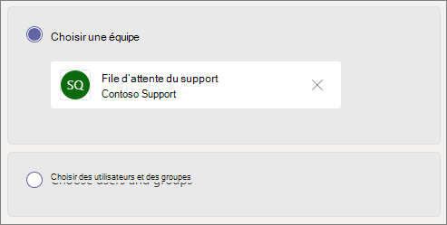

# Créer une file d’attente des appels

Les files d’attente des appels utilisent une méthode de routage des appelants, qui sont orientés vers les personnes de votre organisation qui pourront les aider à résoudre un problème ou répondre à une question. Les appels sont distribués les uns après les autres aux personnes présentes dans la file d’attente (appelées *agents*). 

> [!TIP]
> Cet article est pour les grandes organisations. Si votre organisation est une petite entreprise, lisez plutôt Créer une file d’attente [d’appels - Didacticiel sur les](/microsoftteams/business-voice/create-a-phone-system-call-queue-smb) petites entreprises.

Les files d’attente des appels fournissent :

- un message d’accueil.

- une musique pour les personnes en attente dans la file d’attente.

- un routage des appels vers les agents, en utilisant la méthode *Premier entré, premier sorti* (PEPS).

- Gestion des options pour le débordement et la temporisation des files d’attente.

Veillez à lire l’article [Planifier les standards automatiques et les files d’attente des appels pour Teams](plan-auto-attendant-call-queue.md), puis à suivre les [étapes de démarrage](plan-auto-attendant-call-queue.md#getting-started) avant de suivre les procédures de cet article.

**Pour plus [d’informations, voir](#call-queue-feature-compatibility) la matrice de compatibilité des fonctionnalités de la fonctionnalité de file d’attente d’appels ci-dessous.**

## Démonstration vidéo

Cette vidéo montre un exemple de base de la création d’une file d’attente d’appels dans Teams.

> [!VIDEO https://www.microsoft.com/videoplayer/embed/RWCF23?autoplay=false]

## Créer la file d’attente d’appels

Pour configurer une file d’attente des appels, dans le centre d’administration Teams, développez **Voix**, cliquez sur **Files d’attente d’appels**, puis sur **Ajouter**.

Saisissez un nom pour la file d’attente des appels.

## Comptes de ressources

Cliquez sur **Ajouter des comptes**, recherchez le compte de ressource que vous souhaitez utiliser avec cette file d’attente des appels, cliquez sur **Ajouter**, puis de nouveau sur **Ajouter**. (Les agents verront le nom du compte de ressource lorsqu’ils recevront un appel entrant.)

Pour plus d’informations, [voir Gérer Teams comptes de ressources.](manage-resource-accounts.md)

## ID de l’appelant dynamique

**Disponible pour les Teams de bureau pour les utilisateurs de bureau de canal/de collaboration et Teams utilisateurs de client mobile avec des files d’attente d’appels standard**

Vous pouvez affecter des numéros d’ID d’appelant sortant pour les agents en spécifiant un ou plusieurs comptes de ressources avec un numéro de téléphone. Les agents peuvent sélectionner le numéro d’ID d’appelant sortant à utiliser avec chaque appel sortant qu’ils font.

Cliquez **sur** Ajouter, recherchez les comptes de ressources que vous voulez autoriser les agents à utiliser à des fins d’ID d’appelant lors des appels sortants, cliquez sur **Ajouter, puis** sur **Ajouter**.

**Files d’attente d’appels standard**

Pour Teams de bureau et les files d’attente standard, envisagez de définir directement l’ID d’appelant pour les membres de la file d’attente d’appels sur le numéro de service de la file d’attente d’appels ou du standard automatique approprié. Pour plus d’informations, voir [Gérer les stratégies d’ID](caller-id-policies.md) d’appelant dans Microsoft Teams.

> [!NOTE]
> Le compte de ressource utilisé à des fins d’ID d’appel doit avoir une licence Microsoft Teams Système téléphonique’utilisateur virtuel et l’une des autorisations suivantes est attribuée :
>
> - Licence forfait d’appels et numéro de téléphone affecté
> - Un opérateur Connecter numéro de téléphone affecté
> - Une stratégie de routage vocal en ligne (l’affectation de numéros de téléphone est facultative lors de l’utilisation du routage direct)

## Langue

Choisissez une [langue prise en charge](create-a-phone-system-call-queue-languages.md). Nous utiliserons cette langue pour les invites vocales générées par le système et la transcription de la messagerie vocale (si vous les activez).

## Message d’accueil et musique de mise en attente dans la file d’attente

Indiquez si vous souhaitez diffuser un message d’accueil aux appelants lorsqu’ils arrivent dans la file d’attente. Vous devez télécharger un fichier MP3, WAV ou WMA contenant le message d’accueil que vous souhaitez diffuser. La taille maximale de l’enregistrement téléchargé est de 5 Mo.

Teams fournit une musique par défaut aux appelants lorsqu’ils sont en attente dans une file d’attente. La musique par défaut fournie dans les files d’attente des appels Teams est exempte de toute redevance payable par votre organisation. Si vous souhaitez diffuser un fichier audio spécifique, choisissez **Lire un fichier audio** et téléchargez un fichier MP3, WAV ou WMA.

> [!NOTE]
> Vous êtes responsable de la suppression et de la sécurisation indépendantes de tous les droits et autorisations d’utilisation de la musique ou du fichier audio avec votre service Microsoft Teams, qui peuvent inclure la propriété intellectuelle et d’autres droits dans toute musique, les effets sonores, les marques audio, les marques de noms et autres contenus du fichier audio de tous les titulaires des droits concernés, notamment des artistes, des acteurs,  des auteurs, des professionnels de l’art, des fêtes, des composers, des étiquettes d’enregistrement, des éditeurs de musique, des bandes sonores, des bandes sonores, des droits de copyright, des organisations de gestion collective et toute autre partie qui possède, contrôle ou licence les droits de copyright de la musique, les effets sonores, l’audio et les autres droits de propriété intellectuelle.

## Agents d’appel

Examinez les [conditions d’ajout des agents à une file d’attente ](plan-auto-attendant-call-queue.md#prerequisites).

##### Canal Teams

Vous pouvez ajouter jusqu’à 200 agents via un canal Teams. Vous devez être membre de l’équipe, créateur ou propriétaire du canal pour ajouter un canal à la file d’attente.

Si vous voulez [utiliser un canal Teams pour gérer la file d’attente](https://support.microsoft.com/office/9f07dabe-91c6-4a9b-a545-8ffdddd2504e), sélectionnez l’option **Sélectionner une équipe**, puis cliquez sur **Ajouter un canal**. Recherchez l’équipe à utiliser, sélectionnez-la, puis cliquez sur **Ajouter**. Sélectionnez le canal que vous voulez utiliser (seuls les canaux standard sont pris en charge), puis cliquez **sur Appliquer**. 

Les clients suivants sont pris en charge lors de l’utilisation d Teams pour les files d’attente d’appels : 

  - Microsoft Teams Windows client
  - Client Microsoft Teams pour Mac

> [!NOTE]
> Si vous utilisez cette option, l’utilisation de la file d’attente d’appels peut prendre jusqu’à 24 heures.

##### Utilisateurs et groupes

Vous pouvez ajouter jusqu’à 20 agents individuellement et jusqu’à 200 agents via des groupes.

Si vous voulez ajouter des utilisateurs individuels ou des groupes à la file d’attente, sélectionnez l’option **Choisir des utilisateurs et des groupes**. 

Pour ajouter un utilisateur à la file d’attente, cliquez sur **Ajouter des utilisateurs**, recherchez l’utilisateur, cliquez sur **Ajouter**, puis de nouveau sur **Ajouter**.

Pour ajouter un groupe à la file d’attente, cliquez sur **Ajouter des groupes**, recherchez le groupe, cliquez sur **Ajouter**, puis sur **Ajouter**. Vous pouvez utiliser des listes de distribution, des groupes de sécurité et des groupes Microsoft 365 ou des équipes Microsoft Teams.

> [!NOTE]
> L’arrivée du premier appel peut prendre jusqu’à huit heures pour les nouveaux utilisateurs ajoutés à un groupe.

## Routage des appels

Le **mode conférence** réduit considérablement le temps nécessaire à la mise en relation d’un appelant avec un agent, une fois que l’agent a accepté l’appel. Pour que le mode conférence fonctionne, les agents de la file d’attente des appels doivent utiliser l’un des clients suivants :

  - la dernière version du client Microsoft Teams pour ordinateur de bureau, de l’application Android ou de l’application iOS
  - Microsoft Teams Téléphone version 1449/1.0.94.2020051601 ou ultérieure
  
Les comptes de Teams agents doivent être Teams mode client uniquement. Les agents qui ne répondent pas aux exigences ne sont pas inclus dans la liste de routage des appels. Nous vous recommandons d’activer le mode conférence pour vos files d’attente des appels si tous vos agents utilisent des clients compatibles.

> [!NOTE]
> Le mode conférence n’est pas pris en charge si les appels téléphoniques sont acheminés vers la file d’attente à partir d’une passerelle de routage direct activée pour le routage en fonction de l’emplacement.

> [!TIP]
> Nous **vous recommandons** de définir le mode Conférence sur **On** .

La **méthode de routage** détermine l’ordre dans lequel les agents reçoivent les appels de la file d’attente. Sélectionnez l’une des options suivantes :

- Le **routage du standard** appelle tous les agents de la file d’attente en même temps. Le premier agent à prendre l’appel reçoit l’appel.

- Le **routage en série** appelle tous les agents d’appel les uns après les autres, dans l’ordre spécifié dans la liste des **Agents d’appel**. Si un agent le fait sans appel ou ne décroche pas, l’appel sonnera sur l’agent suivant. Cette situation se répète jusqu’à ce que l’appel soit retenté ou sort.

- Le **tourniquet (round robin)** équilibre le routage des appels entrants afin que chaque agent d’appel reçoive le même nombre d’appels provenant de la file d’attente. Cette méthode de routage peut être souhaitable dans un environnement de vente entrant afin d’assurer la même opportunité entre tous les agents d’appel.

- L’**inactivité la plus longue** achemine chaque appel vers l’agent qui a été inactif le plus longtemps. Un agent est considéré comme inactif si son état de présence est disponible. Les agents dont l’état de présence n’est pas disponible ne peuvent pas recevoir d’appels tant qu’ils n’ont pas changé leur présence en Disponible. 

> [!TIP]
> Il **est recommandé de définir la méthode de routage** sur **Rond-rer ou** **Inactif le** plus long.

> [!NOTE]
> Si [l’enregistrement de](teams-recording-policy.md) conformité est activé sur les agents, la combinaison du **mode** conférence et du **routage d’Attendant** n’est pas prise en charge. Si vous avez besoin d’utiliser **le mode** Conférence, sélectionnez **Routage** en **série,** Rer. arrondi ou Inactif le plus **long** comme **méthode de routage**. Si vous devez utiliser le **routage d’Attendant**, définissez **le mode** Conférence sur **Off(s**).
> 
> **Lorsqu’il** s’agit d’une période d’inactivité la plus longue et qu’il y a moins d’appels dans la file d’attente que pour les agents disponibles, seuls les deux premiers agents inactifs les plus longs sont présentés avec les appels de la file d’attente.
> 
> Lors de  l’utilisation de la durée la plus longue d’inactivité, il peut être possible qu’un agent reçoie un appel de la file d’attente peu de temps après être indisponible ou si la réception d’un appel de la file d’attente prend un peu de temps après être devenue disponible.
> 
> La présentation des appels de la file d’attente d’appels à des agents peut être en conflit avec les restrictions de routage basées sur l’emplacement. Dans ce cas, l’agent reçoit un toast d’appel, mais ne peut pas répondre à l’appel. Cette condition se poursuit jusqu’à ce qu’un autre agent soit disponible pour répondre à l’appel, que l’appelant raccroche ou que la condition du délai d’attente des appels se produit.  

Le **routage basé sur la présence** utilise le statut de disponibilité des agents d’appel pour déterminer si un agent doit être inclus dans la liste de routage des appels pour la méthode de routage sélectionnée. Les agents d’appel dont le statut de disponibilité est défini sur **Disponible** sont inclus dans la liste de routage des appels et peuvent recevoir des appels. Les agents dont le statut de disponibilité est défini sur un autre statut sont exclus de la liste de routage des appels et ne recevront pas d’appels tant que leur statut de disponibilité ne sera pas défini sur **Disponible**. 

Vous pouvez activer le routage des appels basé sur la présence avec toutes les méthodes de routage.

Si un agent refuse de recevoir des appels, il ne sera pas inclus dans la liste de routage des appels, quel que soit son statut de disponibilité. 

> [!NOTE]
> Lorsque  l’inactive la plus longue est sélectionnée comme méthode de routage, un routage basé sur la présence est nécessaire et activé automatiquement, même si le basculement de routage en  fonction de la présence est éteint et grisé.
>
> Si le routage basé sur la présence n’est pas activé et qu’il y a plusieurs appels dans la file d’attente, le système présentera ces appels simultanément aux agents, quel que soit leur statut de présence. Cela entraînera plusieurs notifications d’appels aux agents, en particulier si certains agents ne répondent pas à l’appel initial qui leur est présenté.
> 
> Les agents qui utilisent le client Skype Entreprise ne sont pas inclus dans la liste de routage des appels lorsque le routage basé sur la présence est activé. Si certains de vos agents utilisent Skype Entreprise, n’activez pas le routage des appels basé sur la présence.

> [!TIP]
> Il **est recommandé de définir le routage en fonction** **de la** présence vers Le.

La **durée de l’alerte pour un agent** spécifie la durée pendant laquelle le téléphone d’un agent sonnera avant que la file d’attente ne redirige l’appel vers l’agent suivant.

> [!TIP]
> Nous **vous recommandons de définir la durée d’alerte** de l’agent sur **20** secondes.

## Gestion du débordement des appels

Le **nombre maximal d’appels dans la file d’attente** spécifie le nombre maximal d’appels pouvant attendre dans la file d’attente à tout moment. La valeur par défaut est de 50, mais elle peut être définie sur une valeur comprise entre 0 et 200. Lorsque cette limite est atteinte, l’appel est géré comme cela est indiqué par le paramètre **Lorsque le nombre maximum d’appels est atteint**.

Vous pouvez choisir de mettre fin à l’appel ou de le rediriger vers l’une des destinations de routage des appels. Par exemple, vous pouvez demander à l’appelant de laisser un message vocal pour les agents dans la file d’attente. Pour les transferts [externes, consultez les conditions préalables et les transferts](plan-auto-attendant-call-queue.md#prerequisites) de numéros de téléphone [externes - Détails techniques](create-a-phone-system-auto-attendant.md#external-phone-number-transfers---technical-details) de la mise en forme des numéros.

> [!NOTE]
> Si le nombre maximum d’appels est défini sur 0, le message d’accueil ne sera pas diffusé.

## Gestion de la temporisation des appels

**Temporisation de l’appel : temps d’attente maximum** spécifie la durée maximum pendant laquelle un appel peut être mis en attente dans la file d’attente avant de le rediriger ou d’y mettre fin. Vous pouvez spécifier une valeur comprise entre 0 seconde et 45 minutes.

Vous pouvez choisir de mettre fin à l’appel ou de le rediriger vers l’une des destinations de routage des appels. Par exemple, vous pouvez demander à l’appelant de laisser un message vocal pour les agents dans la file d’attente. Pour les transferts [externes, reportez-vous aux conditions préalables et aux transferts](plan-auto-attendant-call-queue.md#prerequisites) de numéros de téléphone [externes - Détails techniques](create-a-phone-system-auto-attendant.md#external-phone-number-transfers---technical-details) de la mise en forme des numéros.

Lorsque vous avez sélectionné vos options de temporisation des appels, cliquez sur **Enregistrer**.

## Résumé des paramètres recommandés de la file d’attente d’appels

Les configurations ci-dessous sont recommandées :

- **Mode conférence** sur **On**
- **Méthode de routage** sur **Tourniquet (round robin)** ou **Inactivité la plus longue**
- **Routage basé sur la présence** sur **Activé**
- **Durée de l’alerte pour un agent :** sur **20 secondes**

## Compatibilité des fonctionnalités des fonctionnalités de la file d’attente d’appels

|Fonctionnalité                          |Teams Desktop1 |Teams Mobile2 |Lync |Téléphones IP | Files d’attente d’appels standard |Files d’attente d’appels basées sur un canal | Commentaire |
|:--------------------------------|:------------------------:|:-----------------------:|:---:|:--------:|:--------------------:|:------------------------:|:-------------|
|**Méthodes de routage de l’agent**        |                          |                         |     |          |                      |                          |              |
|`Attendant Routing`              |v                         |O                        |v    |v         |v                     |v                         |*Par défaut*     |
|`Longest Idle`3       |v                         |v                        |N    |O         |v                     |v                         |*Recommandé* |
|`Round Robin`                    |v                         |v                        |v    |v         |v                     |v                         |*Recommandé* |
|`Serial`                         |v                         |v                        |v    |v         |Y4         |Y4             |              |
|**Modes de transfert**               |                          |                         |     |          |                      |                          |              |
|`Conference Mode`5    |v                         |O                        |N    |Y6|v                  |v                         |*Recommandé* |
|`Transfer Mode`                  |v                         |v                        |v    |v         |v                     |v                         |              |
|Routage basé sur la présence3|v                        |O                        |N    |O         |v                     |v                         |*Recommandé* |
|Les agents peuvent se désesser               |v                         |v                        |Y7|Y7|v          |v                         |*Par défaut*     |
|Files d’attente basées sur les canaux             |v                         |N                        |N    |N         |n/a                   |Y8             |              |
|L’toast d’appel affiche le nom du compte de ressource |Y9       |v                        |v    |          |v                     |O                         |              |
|**ID de l’appelant dynamique**            |                          |                         |     |          |                      |                          |              |
|`Standard call queue`            |N                         |N                        |N    |N         |O                     |n/a                       |              |
|`Channel based call queue`       |v                         |n/a                      |n/a  |n/a       |n/a                   |v                         |              |
|**Méthodes de connectivité PSTN**    |                          |                         |     |          |                      |                          |Voir la Note 10   |
|`Calling Plans`                  |v                         |v                        |v    |v         |v                     |v                         |              |
|`Direct Routing`                 |v                         |O                        |N    |N         |O                     |v                         |              |
|`Operator Connect`               |v                         |v                        |     |          |v                     |v                         |              |

Remarques :
1. Microsoft Teams Windows client, client Microsoft Teams Mac, Microsoft Teams infrastructure de bureau virtualisée, Microsoft Teams client web.
2. Microsoft Teams iPhone, c’est Microsoft Teams’application Android.
3. La sélection de l’idle la plus longue pour la méthode de routage de l’agent active automatiquement le routage basé sur la présence.
4. Ne peut définir l’ordre que lorsque vous ajoutez des utilisateurs individuels dans les files d’attente standard. Lorsqu’une liste de distribution ou Teams canal est utilisé, son ordre d’utilisation est alphabétique.
5. Le mode conférence n’est pas pris en charge si les appels téléphoniques sont acheminés vers la file d’attente à partir d’une passerelle de routage direct activée pour le routage en fonction de l’emplacement.
6. Microsoft Teams téléphone uniquement.
7. Via la page du portail Paramètres utilisateur, à l’accueilhttps://aka.ms/vmsettings
8. Seuls les canaux publics sont pris en charge.
9. Hors Teams client web.
10. Les attendants automatiques et les files d’attente d’appels ne peuvent pas transférer d’appels entre des méthodes de connectivité PSTN.

## Clients pris en charge

Les clients suivants sont pris en charge pour les agents d’appel dans une file d’attente des appels :

  - Client Skype Entreprise 2016 pour ordinateur de bureau (versions 32 bits et 64 bits)
  - Client Lync 2013 pour ordinateur de bureau (versions 32 bits et 64 bits)
  - Tous les modèles de téléphone IP pris en charge pour Microsoft Teams. Consultez l’article [Obtenir des téléphones pour Skype Entreprise Online](/skypeforbusiness/what-is-phone-system-in-office-365/getting-phones-for-skype-for-business-online/getting-phones-for-skype-for-business-online).
  - Client Skype Entreprise pour Mac (version 16.8.196 et versions ultérieures)
  - Client Skype Entreprise pour Android (version 6.16.0.9 et versions ultérieures)
  - Client Skype Entreprise pour iPhone (version 6.16.0 et versions ultérieures)
  - Client Skype Entreprise pour iPad (version 6.16.0 et versions ultérieures)
  - Client Windows Microsoft Teams (versions 32 bits et 64 bits)
  - Client Microsoft Teams pour Mac
  - Microsoft Teams [infrastructure de bureau virtualisé](/microsoftteams/teams-for-vdi) (Windows Virtual Desktop, Citrix et VMware)
  - Application Microsoft Teams pour iPhone
  - Application Microsoft Teams pour Android

    > [!NOTE]
    > Les files d’attente des appels auxquelles un numéro de routage direct est attribué ne prennent pas en charge les clients Skype Entreprise, les clients Lync ou les téléphones IP Skype Entreprise en tant qu’agents. Le Teams client n’est pris en charge qu’avec [un mode de co-existence Teams uniquement](/microsoftteams/setting-your-coexistence-and-upgrade-settings).

## Cmdlets de files d’attente des appels

Windows PowerShell vous permet de créer et de gérer des files d’attente d’appels via la ligne de commande d’une manière par lot ou par programme.

Les cmdlets suivantes vous permettent de gérer une file d’attente d’appels :

- [New-CsCallQueue](/powershell/module/skype/New-CsCallQueue)
- [Get-CsCallQueue](/powershell/module/skype/Get-CsCallQueue)
- [Set-CsCallQueue](/powershell/module/skype/Set-CsCallQueue)
- [Remove-CsCallQueue](/powershell/module/skype/Remove-CsCallQueue)

Les cmdlets supplémentaires suivantes sont également nécessaires pour gérer les utilisateurs, les comptes de ressources, les licences Microsoft Teams Téléphone, les numéros de téléphone, les fichiers audio et la langue prise en charge qui seront utilisées avec les files d’attente d’appels :

Utilisateurs/Teams

- Utilisateurs
- - [Get-CsOnlineUser](/powershell/module/skype/Get-CsOnlineUser)

- Teams : 
- - [Get-Team](/powershell/module/teams/Get-Team)
- - [Get-TeamChannel](/powershell/module/teams/Get-TeamChannel)

Comptes de ressources :

- [New-CsOnlineApplicationInstance](/powershell/module/skype/New-CsOnlineApplicationInstance)
- [Find-CsOnlineApplicationInstance](/powershell/module/skype/Find-CsOnlineApplicationInstance)
- [Get-CsOnlineApplicationInstance](/powershell/module/skype/Get-CsOnlineApplicationInstance)
- [Set-CsOnlineApplicationInstance](/powershell/module/skype/Set-CsOnlineApplicationInstance)
- [New-CsOnlineApplicationInstanceAssociation](/powershell/module/skype/New-CsOnlineApplicationInstanceAssociation)
- [Get-CsOnlineApplicationInstanceAssociation](/powershell/module/skype/Get-CsOnlineApplicationInstanceAssociation)
- [Remove-CsOnlineApplicationInstanceAssociation](/powershell/module/skype/Remove-CsOnlineApplicationInstanceAssociation)
- [Get-CsOnlineApplicationInstanceAssociationStatus](/powershell/module/skype/Get-CsOnlineApplicationInstanceAssociationStatus)

Licences Teams Téléphone virtuels :

- [Get-MsolAccountSku](/powershell/module/msonline/get-msolaccountsku)
- [Set-MsolUserLicense](/powershell/module/msonline/set-msoluserlicense)

Téléphone affectation de numéro :

- [Get-CsOnlineTelephoneNumber](/powershell/module/skype/Get-CsOnlineTelephoneNumber)
- [Set-CsPhoneNumberAssignment](/powershell/module/teams/Set-csphonenumberassignment)

Fichiers audio

- [Get-CsOnlineAudioFile](/powershell/module/skype/Get-CsOnlineAudioFile)
- [Import-CsOnlineAudioFile](/powershell/module/skype/Import-CsOnlineAudioFile)
- [Export-CsOnlineAudioFile](/powershell/module/skype/Export-CsOnlineAudioFile)
- [Remove-CsOnlineAudioFile](/powershell/module/skype/Remove-CsOnlineAudioFile)

Listes de langues de prise en charge

- [Get-CsAutoAttendantSupportedLanguage](/powershell/module/skype/Get-CsAutoAttendantSupportedLanguage)

Pour consulter un guide pas à pas sur la création de files d’attente d’appels avec PowerShell, voir Création de files d’attente [d’appels avec des cmdlets PowerShell](create-a-phone-system-call-queue-via-cmdlets.md)

## Outil de diagnostic de files d’attente d’appels

Si vous êtes administrateur, vous pouvez utiliser l’outil de diagnostic suivant pour vérifier qu’une file d’attente d’appels peut recevoir des appels :

1. Sélectionnez **Exécuter les tests** ci-dessous, qui remplira le diagnostic dans le Centre d'Administration Microsoft 365. 

   > [!div class="nextstepaction"]
   > [Exécuter des tests : gérer Teams file d’attente d’appels](https://aka.ms/TeamsCallQueueDiag)

2. Dans le volet Exécuter un diagnostic, entrez le compte de ressource dans  le champ Nom d’utilisateur ou Courrier électronique, puis sélectionnez **Exécuter les tests**.

3. Les tests permettent de renvoyer les meilleures étapes suivantes pour s’adresser aux configurations de compte de client, de stratégie et de ressource afin de vérifier que la file d’attente d’appels peut recevoir des appels.

## Rubriques connexes

[Voici ce que vous obtenez avec Microsoft Teams Téléphone](here-s-what-you-get-with-phone-system.md)

[Obtenir des numéros de téléphone de service](getting-service-phone-numbers.md)

[Disponibilité des forfaits d’appels et de l’audioconférence selon les régions et les pays](country-and-region-availability-for-audio-conferencing-and-calling-plans/country-and-region-availability-for-audio-conferencing-and-calling-plans.md)
