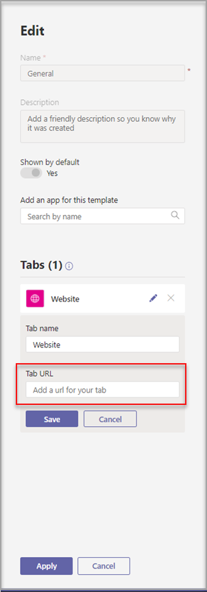
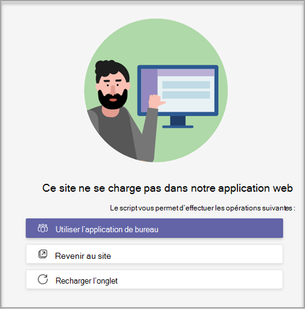

# Créer un modèle d’équipe personnalisé dans Microsoft Teams

**Les modèles personnalisés ne sont pas encore pris en charge pour les clients EDU.**

Un modèle d’équipe personnalisé est une structure d’équipe prédéfinise avec un ensemble de canaux, d’onglets et d’applications. Vous pouvez développer un modèle qui vous permet de créer rapidement l’espace de collaboration qui vous permet de créer le bon espace de collaboration. Votre modèle d’équipe personnalisé utilise vos paramètres préférés.  

 

> [!VIDEO https://www.microsoft.com/en-us/videoplayer/embed/RE4P5rx]

Pour commencer :

1. Se connecter au Centre d’administration de Microsoft Teams.

2. Dans le groupe de navigation de gauche, **développez Teams**  >  **d’équipe.**

3. Sélectionnez **Ajouter**.

    

4. Dans la section **Modèles d’équipe,** **sélectionnez Créer un tout nouveau modèle.**

5. Dans la section **Paramètres du modèle,** remplissez les champs suivants, puis sélectionnez **Suivant**:
    - Nom du modèle
    - Descriptions brèves et longues du modèle
    - Visibilité des paramètres régionaux  

    

6. Dans la section **Canaux, onglets et** applications, ajoutez les canaux et applications dont votre équipe a besoin.

    1. Dans la section **Canaux,** sélectionnez **Ajouter.**
    2. Dans la boîte **de** dialogue Ajouter, nommez le canal.
    3. Ajoutez une description.
    4. Décidez si le canal doit être affiché par défaut.
    5. Recherchez un nom d’application que vous souhaitez ajouter au canal.
    6. Sélectionnez **Appliquer** lorsque vous avez terminé.

    

8. Sélectionnez **Envoyer** lorsque vous avez terminé.

Votre nouveau modèle est affiché dans la liste **des modèles d’équipe.** Le modèle peut être utilisé pour créer une équipe dans Teams.

> [!Note]
> 24 heures peuvent être nécessaire aux utilisateurs de Teams pour voir un changement de modèle personnalisé dans la galerie.

## Personnalisation des applications de l’onglet Site web

> [!Note]
> Cette fonctionnalité est en version préliminaire

Vous pouvez spécifier des URL pour les onglets de site web pour les canaux dans les modèles d’équipe personnalisés. Les utilisateurs finaux qui créent des équipes avec des modèles auront des onglets de site web prédéfinés sur l’URL de site spécifiée.

Pour commencer :

1. Créez un modèle d’équipe ou modifiez un modèle d’équipe existant.

2. Dans la section Canaux, ajoutez un nouveau canal ou sélectionnez un canal existant, puis sélectionnez **Modifier.**

3. Dans la **section Ajouter une application pour ce modèle,** ajoutez une application Site web.

    

4. Sélectionnez l’icône modifier et entrer l’URL de votre choix.

    

5. Sélectionnez **Enregistrer** pour les modifications apportées à l’application de l’onglet, puis **sélectionnez Appliquer** pour enregistrer vos modifications.

## Problèmes connus

**Problème**: si vous avez créé une équipe à partir d’un modèle personnalisé qui contenait d’autres onglets personnalisés, vous pouvez voir des onglets vides à la place de vos applications d’onglets personnalisées. Vos onglets par défaut (tels que **Publications,** **Fichiers** et **Wiki)** s’afficheront comme prévu.

**Solution**: pour résoudre ce problème, supprimez l’onglet personnalisé et ajoutez un nouvel onglet avec la même application. Si vous n’êtes pas autorisé à supprimer l’onglet personnalisé et à ajouter un nouvel onglet, contactez le propriétaire de l’équipe pour obtenir de l’aide.

Nous travaillons actuellement sur un correctif pour les équipes futures créées à partir de modèles personnalisés.

**Problème**: lors de l’Teams dans le navigateur, certains sites web ne peuvent pas être restituer dans un Teams onglet.

**Solution**: si vous avez des difficultés à afficher le contenu de l’onglet du site web, vous serez redirigé pour ouvrir l’onglet dans une page web distincte ou ouvrir Teams dans l’application de bureau pour afficher l’application de l’onglet de votre site web.

## Sujets associés

- [Utiliser des modèles d’équipe dans le Centre d’administration](get-started-with-teams-templates-in-the-admin-console.md)
- [Créer un modèle à partir d’une équipe existante](create-template-from-existing-team.md)
- [Créer un modèle d’équipe à partir d’un modèle d’équipe existant](create-template-from-existing-template.md)
