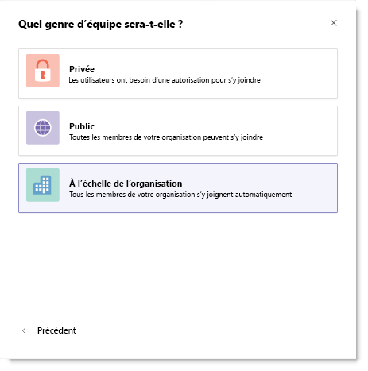

# Utiliser des équipes à l’échelle de l’organisation dans Microsoft Teams pour aider tout le monde à collaborer

Les administrateurs généraux peuvent créer des équipes à l’échelle de l’organisation qui permettent à tous les membres d’une petite et moyenne organisation de faire partie d’une équipe unique et collaborative. Les équipes à l’échelle de l’organisation incluent automatiquement chaque utilisateur de l’organisation et maintiennent l’appartenance à jour à mesure que les utilisateurs rejoignent et quittent l’organisation.

Si votre organisation n’a pas plus de 5 000 utilisateurs dans Teams, une équipe à l’échelle de l’organisation est créée automatiquement. Les équipes à l’échelle de l’organisation sont limitées aux organisations qui n’ont pas plus de 10 000 utilisateurs. Vous pouvez avoir jusqu’à cinq équipes à l’échelle de l’organisation. 

## Créer une équipe à l’échelle de l’organisation

Il existe deux façons de créer une équipe à l’échelle de l’organisation :

- Convertir une équipe existante en équipe à l’échelle de l’organisation. Accédez au nom de l’équipe, puis cliquez sur **Plus d’options** > **Modifier l’équipe**.

- [Créez une équipe à partir de zéro](https://support.microsoft.com/office/174adf5f-846b-4780-b765-de1a0a737e2b) et choisissez l’option **à l’échelle** de l’organisation.

    

## Types d’utilisateurs dans une équipe à l’échelle de l’organisation

Lorsqu’une équipe à l’échelle de l’organisation est créée, tous les administrateurs généraux et les administrateurs Teams sont ajoutés en tant que propriétaires d’équipe et tous les utilisateurs actifs sont ajoutés en tant que membres de l’équipe. Les membres de l’équipe ne peuvent pas quitter une équipe à l’échelle de l’organisation, mais les propriétaires d’équipe peuvent ajouter ou supprimer manuellement des utilisateurs si nécessaire. Lorsque Teams ajoute ou supprime automatiquement une personne, une notification est envoyée au canal Général.

Les utilisateurs sans licence sont également ajoutés à l’équipe. La première fois qu’un utilisateur sans licence se connecte à Teams, une licence exploratoire Microsoft Teams lui est attribuée. Pour en savoir plus sur la licence exploratoire, consultez [Gérer la licence exploratoire Microsoft Teams](teams-exploratory.md).

Les types de comptes suivants ne seront pas ajoutés à votre équipe à l’échelle de l’organisation :

- Comptes bloqués pour la connexion
- Invités
- Comptes de ressources ou de service (par exemple, les comptes associés aux standards automatiques et aux files d’attente d’appels)
- Comptes de salle ou de matériel
- Comptes reposant sur une boîte aux lettres partagée

> [!NOTE]
> Les salles qui ne font pas partie d’une liste de salles, d’équipements et de comptes de ressources peuvent être ajoutées ou synchronisées avec l’équipe à l’échelle de l’organisation. Les propriétaires d’équipe peuvent facilement supprimer ces comptes de l’équipe.

## Options pour tirer le meilleur parti d’une équipe à l’échelle de l’organisation

Pour tirer le meilleur parti de votre équipe à l’échelle de l’organisation, nous recommandons aux propriétaires d’équipe d’effectuer les tâches suivantes :

### Autoriser uniquement les propriétaires d’équipe à publier sur le canal général

Réduisez les bruits de canal en faisant en sorte que seuls les propriétaires d’équipe publient sur le canal général.

1. Accédez à l’équipe, recherchez le canal Général, puis sélectionnez **... Plus d’options** > **Gérer le canal**.
2. Sous l’onglet **Paramètres du canal** , cliquez sur **Autorisations**, puis sélectionnez **Seuls les propriétaires peuvent publier des messages**.

### Désactiver les mentions @team et @ [nom de l’équipe]

Réduisez @mentions pour empêcher la surcharge de l’ensemble de l’organisation.

1. Accédez à l’équipe et cliquez sur **... Autres options** \> **Gérer l’équipe**.
2. Sous l’onglet **Paramètres** , cliquez sur **@mentions** \> désactiver **l’option Afficher les membres pour @team ou @[nom de l’équipe]**.

### Afficher automatiquement les canaux importants

Afficher les canaux importants pour veiller à ce que tous les membres de votre organisation engagent des conversations spécifiques. Pour plus d’information, consultez [Ajouter automatiquement les canaux aux favoris pour toute l’équipe](https://support.office.com/article/auto-favorite-channels-for-the-whole-team-a948272c-5aa5-429c-863c-4e1e1cd6b0f6).

### Configurer la modération des canaux

Envisagez de configurer la modération des canaux et d’octroyer des fonctionnalités de modérateur à certains membres de l’équipe. (Lorsque la modération est configurée, les propriétaires d’équipe reçoivent automatiquement des fonctionnalités de modérateur.) Les modérateurs peuvent :

- Contrôler qui peut démarrer une nouvelle publication dans un canal
- Ajouter et supprimer des modérateurs
- Contrôler si les membres de l’équipe peuvent répondre aux messages de canal existants
- Contrôler si les bots et les connecteurs peuvent envoyer des messages de canal.

Si vous souhaitez en savoir plus, consultez l’article [Configurer et gérer la modération des canaux dans Microsoft Teams](manage-channel-moderation-in-teams.md).

### Supprimez les comptes sans propriétaire

Même si les membres ne peuvent pas quitter une équipe à l’échelle de l’organisation, en tant que propriétaire d’équipe, vous pouvez gérer la liste d’équipe en supprimant les comptes qui n’appartiennent pas. **Veillez à utiliser Teams pour supprimer des utilisateurs de votre équipe à l’échelle de l’organisation**. Si vous utilisez une autre méthode pour supprimer un utilisateur, tel que le Centre d'administration Microsoft 365 ou d’un groupe dans Outlook, l’utilisateur peut être ajouté à l’équipe à l’échelle de l’organisation.

## Rubriques connexes

Regardez une vidéo sur [la création d’une équipe à l’échelle de l’organisation dans Microsoft Teams](https://www.youtube.com/watch?v=x3qGlwwCz_w).
