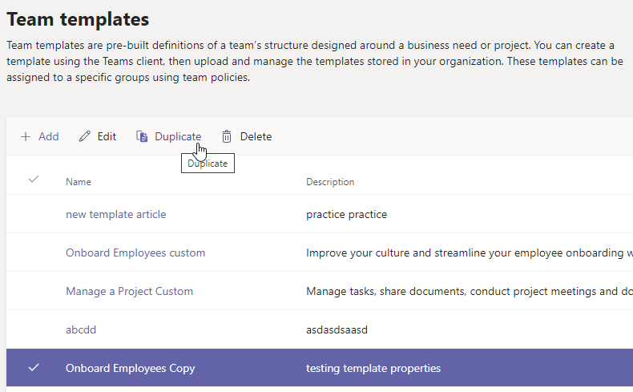

# Créer un modèle d’équipe à partir d’un modèle d’équipe existant dans Microsoft Teams

**Les modèles personnalisés ne sont pas encore pris en charge pour les clients EDU.**

Microsoft Teams fournit des modèles prédéfinis qui peuvent être enregistrés et modifiés pour répondre aux besoins particuliers de votre organisation.

1. Se connecter au Centre d’administration de Microsoft Teams.

2. Dans le volet de navigation de gauche, développez **Modèles d’équipe** **Teams** > .

3. Dans la section **Modèles d’équipe** , sélectionnez en regard d’un modèle d’équipe que vous souhaitez dupliquer pour le mettre en surbrillance.

4. Sélectionnez **Dupliquer**.

(Vous pouvez également sélectionner **Ajouter** >  **Commencez par un modèle existant** pour ouvrir **Sélectionnez le modèle à utiliser comme point de départ**.)

5. Dans l’écran **Sélectionner le modèle à utiliser comme point de départ** , sélectionnez **Suivant**.

    Le modèle dupliqué s’ouvre et le mot **Copier** est ajouté au nom.

6. Renseignez les champs suivants, puis sélectionnez **Suivant** :
    - Nom du modèle
    - Descriptions courtes et longues des modèles
    - Visibilité des paramètres régionaux  

7. Dans la section **Canaux, onglets et applications** , modifiez les canaux et applications existants dont votre équipe a besoin.

    1. Sélectionnez un canal à modifier, puis **sélectionnez Modifier**.
    2. **Appliquez** vos modifications lorsque vous avez terminé.

8. Ajoutez les canaux ou applications dont votre équipe a besoin.

    1. Dans la section **Canaux** , sélectionnez **Ajouter**.
    2. Dans la boîte de dialogue **Ajouter** , nommez le canal.
    3. Ajoutez une description.
    4. Déterminez si le canal doit être affiché par défaut.
    5. Recherchez un nom d’application que vous souhaitez ajouter au canal.
    6. Sélectionnez **Appliquer** lorsque vous avez terminé.

7. Sélectionnez **Envoyer** lorsque vous avez terminé d’ajouter des canaux et des applications.

    Le nouveau modèle est enregistré dans la bibliothèque de modèles.

> [!Note]
> Jusqu’à 24 heures peuvent être nécessaires pour que les utilisateurs teams voient un modèle personnalisé dans la galerie.

## Articles connexes

- [Bien démarrer avec les modèles d’équipe dans le Centre d’administration](get-started-with-teams-templates-in-the-admin-console.md)
- [Créer un modèle à partir d’une équipe existante](create-template-from-existing-team.md)
- [Créer un modèle d’équipe](create-a-team-template.md)