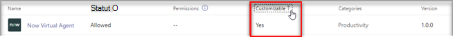
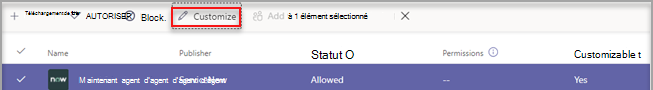
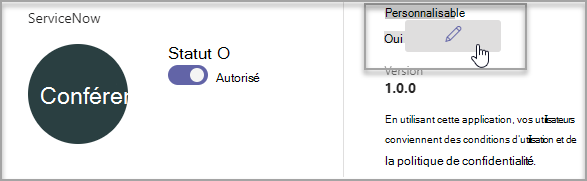
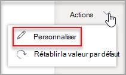
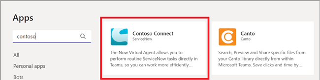
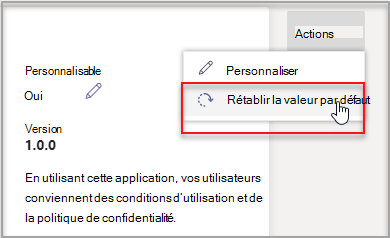

# Personnaliser des applications dans Microsoft Teams

 Microsoft Teams fournit des personnalisations d’application pour améliorer Teams expérience utilisateur. Certains développeurs d’applications autorisent la personnalisation d’une application par l Teams administrateur. L’administrateur peut personnaliser ou renommer les propriétés de l’application en fonction des besoins de l’organisation à l’aide de la page Teams d’administration **Gérer les applications.** Les détails que vous pouvez personnaliser sont les autres :

- Nom court
- Brève description
- Description complète
- URL de la politique de confidentialité
- URL du site web
- URL des conditions d’utilisation
- Icône de couleur
- Icône Plan
- Couleur d’accentuage

Consultez le [Teams de manifeste pour](/microsoftteams/platform/resources/schema/manifest-schema) plus d’informations sur les champs que vous pouvez personnaliser.

> [!NOTE]
> La personnalisation des applications n’est pas prise en Cloud de la communauté du secteur public du département de la défense (GCCH) ou du département de la défense (DoD).
> Pour l’instant, cette fonctionnalité n’est pas disponible pour les applications téléchargées Microsoft Teams exerment.

## Personnaliser les détails de l’application

Pour commencer à personnaliser une application, terminez les étapes suivantes :

1. Se connecter au Centre d’administration de Microsoft Teams.

2. Développez **Teams Applications et** **sélectionnez Gérer les applications.**

3. Consultez **la colonne Personnalisable** de la liste des applications et t triez par applications personnalisables.

   

   Trois points d’entrée vous sont accessibles pour accéder à la fonctionnalité personnaliser :

   - Sélectionnez en côté de l’application que vous voulez personnaliser, puis **sélectionnez Personnaliser.**

     

   - Sélectionnez le nom de l’application, **puis Personnalisable.**

     

   - Sélectionnez le nom de l’application, puis **sélectionnez** Personnaliser dans la dropdown **Actions.**

     

4. Développez la section **Détails** et personnalisez les champs suivants :

    - Nom court
    - Brève description
    - Description complète
    - Site web
    - URL de la politique de confidentialité
    - URL des conditions d’utilisation

   

> [!Note]
> Seuls les champs que le développeur de l’application a attribués comme personnalisables seront visibles.

5. Développez la section **Icône.**

   1. Télécharger une icône. Utilisez une icône en couleur (192 x 192 pixels) au format PNG.

   1. Choisissez une couleur de contour d’icône. Utilisez un contour transparent (32 x 32) pixels au format PNG.

   1. Sélectionnez une couleur d’accentuage de l’application qui correspond à l’icône.

    

6. Une fois votre application personnalisée, sélectionnez **Appliquer.**

7. **Sélectionnez** Publier pour publier l’application personnalisée.

   L’application personnalisée est désormais répertoriée dans votre page **Gérer les applications.** Vous n’aurez qu’une version de l’application, car la personnalisation des fonctionnalités de l’application ne crée pas de copie de l’application.

Vos utilisateurs finaux Teams désormais ouvrir leur client Teams client pour voir l’application personnalisée.

   

### Considérations particulières pour la personnalisation d’une application

La note suivante contient des détails importants sur la personnalisation d’une application.

> [!Note]
> - Lorsque vous personnalisez des applications et toute description liée à une application, veillez à respecter les instructions de personnalisation fournies par l’éditeur dans leur documentation ou conditions d’utilisation. Vous devez également respecter les droits d’autres personnes concernant les images tierces que vous pourriez utiliser.
> - Les données de personnalisation fournies par l’administrateur sont stockées dans la région la plus proche.
> - Il vous faut s’assurer que les liens vers les conditions d’utilisation ou la politique de confidentialité sont valides.
> - Si l’éditeur de l’application n’autorise plus la personnalisation d’un champ, un message s’affiche sur la page des détails de l’application pour informer l’administrateur des champs qui ne peuvent plus être personnalisés. Toutes les modifications apportées à ce champ seront de retour aux valeurs d’origine.
> - Nous vous recommandons de tester les modifications de personnalisation d’application Teams client de test avant d’apporter ces modifications dans votre environnement de production.
> - Les modifications apportées à la marque peuvent nécessiter jusqu’à 24 heures pour que les utilisateurs voient ces modifications.

## Passer en revue les détails de l’application

Vous souhaitez peut-être consulter les détails de l’application pour examiner les informations.

1. Se connecter au Centre d’administration de Microsoft Teams.

2. Développez **Applications Teams** et sélectionnez **Gérer les applications**.

3. Sélectionnez le nom de l’application.

4. Afficher les détails de l’application, y compris le nom d’origine de l’application **Short name from publisher.**

   

   Le **champ Nom court de l’éditeur** n’est visible que si vous avez modifié le nom court de l’application.

## Rétablir les détails de l’application par défaut

À tout moment, vous pouvez rétablir les paramètres d’origine des détails de l’application.

1. Se connecter au Centre d’administration de Microsoft Teams.

2. Développez **Teams Applications et** **sélectionnez Gérer les applications.**

3. Sélectionnez le nom de l’application.

4. Sélectionnez **Rétablir la valeur par défaut** dans la dropdown **Actions.**

   

## Questions fréquentes (FAQ)

**Combien de temps faut-il à mes utilisateurs pour voir l’application personnalisée ?**

Bien que l’administrateur puisse immédiatement voir les modifications dans Teams d’administration, les modifications peuvent prendre jusqu’à 24 heures pour que les utilisateurs finaux les voient.  

**Le fournisseur de l’application peut-il personnaliser l’application pour ses clients ?**

 Non, l’administrateur d’un client doit personnaliser l’application pour son client à l’aide du Teams d’administration.

**L’application personnalisée sera-t-elle déployée automatiquement pour remplacer mon application personnalisée actuelle dans un client ?**

Non, les administrateurs de client devront supprimer manuellement une application personnalisée et publier la version personnalisée de l’application. Si vous avez personnalisé une application et l’avez publiée comme application personnalisée, la nouvelle application personnalisée à l’aide de la fonctionnalité de personnalisation de l’application ne remplacera pas l’application personnalisée actuelle.  

**Le rapport d’utilisation des applications affichera-t-il également les valeurs personnalisées telles que le nom court personnalisé ?**

 Non, le rapport d’utilisation des applications indique toujours le nom d’origine de l’application envoyée par l’éditeur.

**Quelles applications puis-je personnaliser à l’aide de la fonctionnalité de personnalisation des applications ?**

Vous pouvez seulement personnaliser les applications qui ont été autorisées à être personnalisables par l’éditeur de l’application. L’éditeur de l’application devra s’y rendre pour permettre à ses clients de personnaliser l’application.

**Les propriétés personnalisées s’afficheront-elle sur l’écran d’autorisation graphique ?**

Non, l’écran d’autorisation affiche toujours la valeur d’origine envoyée par l’éditeur.

## Article connexe

- [Gérer les applications](manage-apps.md)
- [Personnaliser votre Magasin d’applications](customize-your-app-store.md)
- [Renommer vos applications](https://techcommunity.microsoft.com/t5/microsoft-teams-blog/rebrand-apps-to-your-own-organization-s-branding-with-app/ba-p/2376296)
