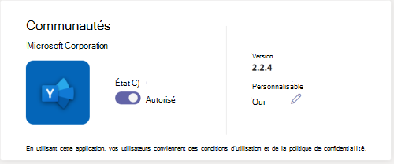

# Personnaliser l’apparence des applications dans le magasin Teams de votre organisation

Microsoft Teams permet aux administrateurs de personnaliser Teams application pour améliorer l’expérience du Store et respecter la personnalisation de leur organisation. Un développeur d’applications peut autoriser la personnalisation de son application par un administrateur Teams. Vous pouvez ensuite mettre à jour les propriétés de l’application en fonction des besoins de l’organisation, dans la page Gérer les applications dans Teams Centre d’administration. Les détails que vous pouvez personnaliser sont les suivants :

* Nom court
* Brève description
* Description complète
* URL de la politique de confidentialité
* URL du site web
* URL des conditions d’utilisation
* Icône d’application
* Couleur de contour de l’icône
* Couleur d’accentuation

Pour plus d’informations sur les différents champs de métadonnées de l’application, consultez le [schéma de manifeste Teams](/microsoftteams/platform/resources/schema/manifest-schema) dans la documentation du développeur.

> [!NOTE]
> Vous ne pouvez pas personnaliser les applications chargées de manière indépendante dans n’importe quelle organisation. Vous ne pouvez pas personnaliser une application dans des clouds Cloud de la communauté du secteur public High (GCCH) ou Department of Defense (DoD).

## Personnaliser les détails d’une application

Pour personnaliser une application, procédez comme suit :

1. Se connecter au Centre d’administration de Microsoft Teams.

1. Développez **Teams applications** et **[sélectionnez Gérer les applications](https://admin.teams.microsoft.com/policies/manage-apps)**.

1. Vérifiez la colonne **Personnalisable** de la liste des applications et triez par applications personnalisables.

   

   Il existe trois points d’entrée pour accéder à la fonctionnalité personnaliser :

   * Sélectionnez en regard de l’application que vous souhaitez personnaliser, puis **sélectionnez Personnaliser**.

     

   * Sélectionnez le nom de l’application, puis sélectionnez l’icône d’édition dans **Personnalisable**.

     

   * Sélectionnez le nom de l’application, cliquez sur le **pointage du menu dépassement** sur **Actions** , puis sélectionnez Personnaliser.

     

1. Développez la section **Détails** et personnalisez un ou plusieurs des champs suivants. Les champs affectés comme personnalisables par le développeur sont visibles.

    * Nom court
    * Brève description
    * Description complète
    * Site web
    * URL de la politique de confidentialité
    * URL des conditions d’utilisation

   

1. Développez la section **Icône** .

1. Télécharger une icône. Utilisez un pixel d’icône (192 x 192) au format PNG.

1. Choisissez une couleur de contour d’icône. Utilisez un pixel de contour transparent (32 x 32) au format PNG.

1. Sélectionnez une couleur d’accentuation d’application qui correspond à l’icône.

   

1. Après avoir personnalisé l’application, **sélectionnez Appliquer**.

1. Sélectionnez **Publier** pour publier l’application personnalisée.

   L’application personnalisée est désormais répertoriée dans la page **Gérer les applications** . Vous n’aurez qu’une seule version de l’application, car la personnalisation des fonctionnalités de l’application ne crée pas de copie de l’application.

À présent, vos Teams utilisateurs finaux peuvent voir l’application personnalisée dans leur client.

   

Notez les détails suivants sur la personnalisation d’une application :

* Lorsque vous personnalisez des applications et toute description liée à une application, veillez à suivre les instructions de personnalisation fournies par l’éditeur d’application dans leur documentation ou conditions d’utilisation. Vous êtes également responsable du respect des droits d’autrui concernant les images tierces que vous pouvez utiliser.

* Administration données de personnalisation fournies sont stockées dans la région la plus proche.

* Il vous incombe de vous assurer que les liens vers les conditions d’utilisation ou la politique de confidentialité sont valides.

* Si l’éditeur d’application n’autorise plus la personnalisation d’un champ, un message s’affiche sur la page de détails de l’application pour informer l’administrateur des champs qui ne peuvent plus être personnalisés. Toutes les modifications apportées à ce champ seront rétablies aux valeurs d’origine.

* Nous vous recommandons de tester les modifications de personnalisation d’application dans un client de test Teams avant d’effectuer ces modifications dans votre environnement de production.

* Les modifications apportées à la personnalisation peuvent nécessiter jusqu’à 24 heures pour se propager à tous les utilisateurs.

* Pour qu’une application devienne personnalisable, les développeurs peuvent fournir une nouvelle version de l’application. Vous chargez la nouvelle version et supprimez la version précédente de l’application. Si vous avez personnalisé une application et l’avez publiée, la nouvelle application personnalisée à l’aide de la fonctionnalité de personnalisation de l’application ne remplacera pas l’application actuelle.

* Le [rapport d’utilisation de l’application](teams-analytics-and-reports/app-usage-report.md) affiche le nom d’origine de l’application fournie par l’éditeur.

* La boîte de dialogue de consentement d’autorisation Microsoft Graph affiche le nom d’origine de l’application fournie par l’éditeur. Il vous aide à identifier avec précision une application tout en lui fournissant des autorisations.

## Examiner les détails de l’application

Vous souhaiterez peut-être voir les détails de l’application pour passer en revue les informations.

1. Se connecter au Centre d’administration de Microsoft Teams.

1. Développez **Teams applications** et **[sélectionnez Gérer les applications](https://admin.teams.microsoft.com/policies/manage-apps)**.

1. Sélectionnez le nom de l’application.

1. Affichez les détails de l’application, y compris le nom d’application **d’origine Nom court de l’éditeur**.

   

   Le **nom court du champ Éditeur** n’est visible que si vous avez modifié le nom court de l’application.

## Réinitialiser les détails de l’application aux valeurs par défaut

Vous pouvez réinitialiser les détails de l’application aux valeurs d’origine fournies par le développeur de l’application. L’option est disponible uniquement pour l’application que vous personnalisez.

1. Dans Teams centre d’administration, accédez **à Teams Apps** > **[Manage apps](https://admin.teams.microsoft.com/policies/manage-apps)**.

1. Sélectionnez le nom de l’application.

1. Sélectionnez **Rétablir la valeur par défaut** dans le menu **Actions** .

   

## Article connexe

* [Gérer les applications](manage-apps.md)
* [Personnaliser l’App Store de votre organisation](customize-your-app-store.md)
* [Renommer vos applications](https://techcommunity.microsoft.com/t5/microsoft-teams-blog/rebrand-apps-to-your-own-organization-s-branding-with-app/ba-p/2376296)
