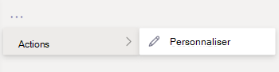

# Personnaliser des applications dans Microsoft TeamsCustomize apps in Microsoft Teams

 Microsoft Teams fournit des personnalisations d’application pour améliorer Teams expérience utilisateur.Microsoft Teams provides app customization to enhance the Teams experience. Certains développeurs d’applications autorisent la personnalisation d’une application par l Teams administrateur. L’administrateur peut personnaliser ou renommer les propriétés de l’application en fonction des besoins de l’organisation à l’aide de la page Teams d’administration **Gérer les applications.**Some app developers allow an app to be customized by the Teams admin. The admin can customize or rebrand the app properties based on the organizational needs using the Teams admin center **Manage apps** page. Les détails que vous pouvez personnaliser sont les autres :The details you can customize are:

- Nom courtShort name
- Brève descriptionShort description
- Description complèteFull description
- URL de la politique de confidentialitéPrivacy policy URL
- URL du site webWebsite URL
- URL des conditions d’utilisationTerms of use URL
- Icône de couleurColor icon
- Icône PlanOutline icon
- Couleur d’accentuageAccent color

Consultez le [Teams de manifeste pour](/microsoftteams/platform/resources/schema/manifest-schema) plus d’informations sur les champs que vous pouvez personnaliser.See the [Teams Manifest schema](/microsoftteams/platform/resources/schema/manifest-schema) for details about the fields that you can customize.

> [!NOTE]
> La personnalisation des applications n’est pas prise en Cloud de la communauté du secteur public du département de la défense (GCCH) ou du département de la défense (DoD).Customizing apps isn't supported in Government Community Cloud High (GCCH) or Department of Defense (DoD) at this time.

## Personnaliser les détails de l’applicationCustomize the app's details

Pour commencer à personnaliser une application, terminez les étapes suivantes :To start customizing an app, complete the following steps:

1. Se connecter au Centre d’administration de Microsoft Teams.Sign in to the Teams admin center.
2. Développez **Teams Applications et** **sélectionnez Gérer les applications.**Expand **Teams Apps** and select **Manage apps**.
3. Consultez **la colonne Personnalisable** de la liste des applications et t triez par applications personnalisables.Check the **Customizable** column of the apps list and sort by apps that are customizable.

   

   Trois points d’entrée vous sont accessibles pour accéder à la fonctionnalité personnaliser :There are three entry points to access the customize feature:

   - Sélectionnez en côté de l’application que vous voulez personnaliser, puis **sélectionnez Personnaliser.**Select next to the app that you want to customize, and then select **Customize**.

     

   - Sélectionnez le nom de l’application, **puis Personnalisable.**Select the app name and then **Customizable**.

     

   - Sélectionnez le nom de l’application, puis **sélectionnez** Personnaliser dans la dropdown **Actions.**Select the app name, and then select **Customize** from the **Actions** dropdown.

     

4. Développez la section **Détails** et personnalisez les champs suivants :Expand the **Details** section and customize the following fields:

    - Nom courtShort name
    - Brève descriptionShort description
    - Description complèteFull description
    - Site webWebsite
    - URL de la politique de confidentialitéPrivacy policy URL
    - URL des conditions d’utilisationTerms of use URL

   

> [!Note]
> Seuls les champs que le développeur de l’application a attribués comme personnalisables seront visibles.Only the fields that the app developer has assigned as customizable will be visible.

5. Développez la section **Icône.**Expand the **Icon** section.

   a.a. Télécharger une icône.Upload an icon. Utilisez une icône en couleur (192 x 192 pixels) au format PNG.Use one full-color icon (192x192) pixel in PNG format.

   b.b. Choisissez une couleur de contour d’icône.Choose an icon outline color. Utilisez un contour transparent (32 x 32) pixels au format PNG.Use one transparent outline (32x32) pixel in PNG format.

   c.c. Sélectionnez une couleur d’accentuage de l’application qui correspond à l’icône.Select an app accent color that matches the icon.

    

6. Une fois votre application personnalisée, sélectionnez **Appliquer.**Once your app has been customized, select **Apply**.

7. **Sélectionnez** Publier pour publier l’application personnalisée.Select **Publish** to publish the customized app.

   L’application personnalisée est désormais répertoriée dans votre page **Gérer les applications.**The customized app is now listed in your **Manage apps** page. Vous n’aurez qu’une version de l’application, car la personnalisation des fonctionnalités de l’application ne crée pas de copie de l’application.You'll have only one version of the app, since customizing the app features doesn't create a copy of the app.

Vos utilisateurs finaux Teams désormais ouvrir leur client Teams client pour voir l’application personnalisée.Now your Teams end users can open their Teams client to see the customized app.

   

### Considérations particulières pour la personnalisation d’une applicationSpecial considerations for customizing an app

La note suivante contient des détails importants sur la personnalisation d’une application.The following note includes important details about customizing an app.

> [!Note]
> - Lorsque vous personnalisez des applications et toute description liée à une application, veillez à respecter les instructions de personnalisation fournies par l’éditeur dans leur documentation ou conditions d’utilisation.When you customize apps, and any description related to an app, ensure that you follow any customization guidelines if provided by the app publisher in their documentation or terms of use. Vous devez également respecter les droits d’autres personnes concernant les images tierces que vous pourriez utiliser.You're also responsible for respecting the rights of others regarding any third-party images you might use.
> - Les données de personnalisation fournies par l’administrateur sont stockées dans la région la plus proche.Admin-provided customization data is stored in the nearest region.
> - Il vous faut s’assurer que les liens vers les conditions d’utilisation ou la politique de confidentialité sont valides.You are responsible for ensuring that links to terms of use or privacy policy are valid.
> - Si l’éditeur de l’application n’autorise plus la personnalisation d’un champ, un message s’affiche sur la page des détails de l’application pour informer l’administrateur des champs qui ne peuvent plus être personnalisés.In case the app publisher no longer allows a field to be customizable, a message appears on the app details page notifying the admin about the fields that can't be customized any longer. Toutes les modifications apportées à ce champ seront de retour aux valeurs d’origine.All the changes made to that field will be reverted to the original values.
> - Nous vous recommandons de tester les modifications de personnalisation d’application Teams client de test avant d’apporter ces modifications dans votre environnement de production.We recommend testing app customization changes in a Teams test tenant before making these changes in your production environment.
> - Les modifications apportées à la marque peuvent nécessiter jusqu’à 24 heures pour que les utilisateurs voient ces modifications.Changes to branding might require up to 24 hours for the users to see the changes.

## Passer en revue les détails de l’applicationReview app details

Vous souhaitez peut-être consulter les détails de l’application pour examiner les informations.You might want to see the app details to review the information.

1. Se connecter au Centre d’administration de Microsoft Teams.Sign in to the Teams admin center.

2. Développez **Applications Teams** et sélectionnez **Gérer les applications**.Expand **Teams apps** and select **Manage apps**.

3. Sélectionnez le nom de l’application.Select the app name.

4. Afficher les détails de l’application, y compris le nom d’origine de l’application **Short name from publisher.**View the app details, including the original app name **Short name from publisher**.

   

   Le **champ Nom court de l’éditeur** n’est visible que si vous avez modifié le nom court de l’application.The **Short name from publisher** field is only visible if you've changed the app's short name.

## Rétablir les détails de l’application par défautReset app details to default

À tout moment, vous pouvez rétablir les paramètres d’origine des détails de l’application.At any time, you can reset the app details to the original settings.

1. Se connecter au Centre d’administration de Microsoft Teams.Sign in to the Teams admin center.

2. Développez **Teams Applications et** **sélectionnez Gérer les applications.**Expand **Teams Apps** and select **Manage apps**.

3. Sélectionnez le nom de l’application.Select the app name.

4. Sélectionnez **Rétablir la valeur par défaut** dans la dropdown **Actions.**Select **Reset to default** from the **Actions** dropdown.

   

## Foire aux questionsFrequently asked questions

**Combien de temps faut-il à mes utilisateurs pour voir l’application personnalisée ?****How long will it take for my users to see the customized app?**

Bien que l’administrateur puisse immédiatement voir les modifications dans Teams d’administration, les modifications peuvent prendre jusqu’à 24 heures pour que les utilisateurs finaux les voient.Although the admin can immediately see the changes in Teams Admin Center, it might take up to 24 hours for the end users to see the changes.  

**Le fournisseur de l’application peut-il personnaliser l’application pour ses clients ?****Can the app provider customize the app for its customers?**

 Non, l’administrateur d’un client doit personnaliser l’application pour son client à l’aide du Teams d’administration.No, the admin of a tenant needs to customize the app for their tenant using the Teams Admin Center.

**L’application personnalisée sera-t-elle déployée automatiquement pour remplacer mon application personnalisée actuelle dans un client ?****Will the customized app automatically get deployed to replace my current custom app in a tenant?**

Non, les administrateurs de client devront supprimer manuellement une application personnalisée et publier la version personnalisée de l’application.No, the tenant admins will have to manually remove any custom app and publish the customized version of the app. Si vous avez personnalisé une application et l’avez publiée comme application personnalisée, la nouvelle application personnalisée à l’aide de la fonctionnalité de personnalisation de l’application ne remplacera pas l’application personnalisée actuelle.If you have customized an app and published it as a custom app, the new app customized using the app customization feature won't replace the current custom app.  

**Le rapport d’utilisation des applications affichera-t-il également les valeurs personnalisées telles que le nom court personnalisé ?****Will the app usage report also show the customized values such as customized short name?**

 Non, le rapport d’utilisation des applications indique toujours le nom d’origine de l’application envoyée par l’éditeur.No, the app usage report will still show the original name of the app sent from the publisher.

**Quelles applications puis-je personnaliser à l’aide de la fonctionnalité de personnalisation des applications ?****Which apps can I customize using the app customization feature?**

Vous pouvez seulement personnaliser les applications qui ont été autorisées à être personnalisables par l’éditeur de l’application.You can only customize apps that have been allowed to be customizable by the app publisher. L’éditeur de l’application devra s’y rendre pour permettre à ses clients de personnaliser l’application.The app publisher will need to opt in to allow its customers to customize the app.

**Les propriétés personnalisées s’afficheront-elle sur l’écran d’autorisation graphique ?****Will the customized properties show up on the graph permission consent screen?**

Non, l’écran d’autorisation affiche toujours la valeur d’origine envoyée par l’éditeur.No, the permission consent screen will still show the original value sent by the publisher.

## Article connexeRelated article

- [Gérer les applicationsManage apps](manage-apps.md)
- [Personnaliser votre Magasin d’applicationsCustomize your app store](customize-your-app-store.md)
- [Renommer vos applicationsRebrand your apps](https://techcommunity.microsoft.com/t5/microsoft-teams-blog/rebrand-apps-to-your-own-organization-s-branding-with-app/ba-p/2376296)
