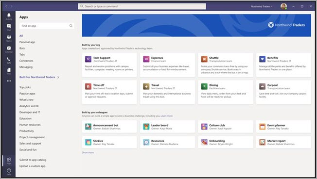

# Magasin d’applications personnalisées dans Microsoft TeamsCustom apps store in Microsoft Teams

Vous pouvez désormais personnaliser le magasin d’applications de votre organisation dans Teams avec la personnalisation de votre entreprise en ajoutant votre logo, vos arrière-plans et des couleurs de texte personnalisées pour qu’il soit plus invitant pour les utilisateurs finaux.Now you can customize your organization's apps store in Teams with your company branding by adding your logo, custom backgrounds, and custom text colors to make it more inviting to end users.

> [!Note]
> L’application des modifications apportées à la marque nécessitera 24 heures.Changes to branding will require 24 hours to take effect.

Vous pouvez accéder au Magasin de personnalisation dans le Centre d’administration en sélectionnant les **applications Teams**  >  **: Personnaliser le Magasin.**You can access the customize store in the admin center by selecting **Teams apps** > **Customize store**.

  

Cet article décrit les fonctionnalités du magasin d’applications personnalisées et leur utilisation.This article describes the Custom apps store features and how to use them.

## Personnaliser le logo de votre organisationCustomize your organization logo

<!-- Bookmark used by Context Sensitive Help (CSH). Do not delete. -->

<!-- Do not remove the bookmark link above. -->

Ici, vous pouvez télécharger le logo de votre organisation.Here you can upload your organization logo. Le logo sélectionné s’affiche dans le client Teams dans **les applications**  >  **conçues pour votre** page client.The logo selected will appear in the Teams client in **Apps** > **Built for your tenant** page.

Lorsque vous sélectionnez **l’option Choisir une** image, vous pouvez télécharger le fichier de votre choix.When you select the **Choose a picture** option, you can upload the file of your choice. Le logo doit avoir la taille 240 x 60 ou s’il doit être dimensioné de cette taille.The logo should be 240x60, or it will be scaled to that size. Elle ne doit pas avoir une taille supérieure à 5 Mo.It should be no larger than 5 MB. Les formats pris en charge sont les autres :The supported formats are:

- .svg.svg
- .png.png
- .jpg.jpg

Le logo s’affiche dans le coin supérieur droit du catalogue d’applications client du Magasin Teams.The logo is shown in the top, right corner of the tenant app catalog in the Teams store.

## Personnaliser votre petit logoCustomize your small logo

<!-- Bookmark used by Context Sensitive Help (CSH). Do not delete. -->

<!-- Do not remove the bookmark link above. -->

Le logo de votre organisation est une image ou un symbole représentant la marque de votre organisation et n’inclut pas le nom de votre société.Your organization logomark or small logo is an image or symbol that represents your organization brand and doesn't include your company name. La marque de amour permet aux membres d’une équipe d’identifier le magasin d’applications.The lovemark helps team members identify the Apps store. Le logo sélectionné s’affiche dans le client Teams dans la page Applications.The logo selected will appear in the Teams client in Apps page.

Lorsque vous sélectionnez **l’option Choisir une** image, vous pouvez télécharger le fichier de votre choix.When you select the **Choose a picture** option, you can upload the file of your choice. Le logo doit avoir une taille de 32 x 32 pixels, ou réduite à cette taille.The logomark should be 32x32 pixels, or it will be scaled to that size. Elle ne doit pas avoir une taille supérieure à 5 Mo.It should be no larger than 5 MB. Les formats pris en charge sont les autres :The supported formats are:

- .svg.svg
- .png.png
- .jpg.jpg

Le petit logo s’affiche à côté du titre de la section Créé pour **le** client dans la page d’accueil du Magasin Teams.The small logo is shown next to the **Built for tenant** section title in the Teams store landing page.

## Personnaliser la couleur d’arrière-planCustomize the background color

<!-- Bookmark used by Context Sensitive Help (CSH). Do not delete. -->

<!-- Do not remove the bookmark link above. -->

Assurez-vous que l’arrière-plan présente suffisamment de contraste avec le texte afin que les utilisateurs puisse lire le texte de façon claire.Make sure that the background has enough contrast with the text so the users can read the text clearly. L’arrière-plan s’affiche dans le client Teams **dans les applications**  >  **conçues pour l’en-tête de votre** client.The background will appear in the Teams client in **Apps** > **Built for your tenant** header.

Vous disposez des options suivantes :Your options are:

- Utiliser le thème d’arrière-plan par défaut du client TeamsUse Teams client default background theme
- Choisissez une image.Choose a picture. Lorsque vous sélectionnez l’image d’arrière-plan, vous pouvez télécharger le fichier de votre choix.When you select the background picture, you can upload the file of your choice. L’arrière-plan doit avoir une taille de 1212 x 100 pixels ou s’écheller de cette taille.The background should be 1212x100 pixels, or it will be scaled to that size. Elle ne doit pas avoir une taille supérieure à 5 Mo.It should be no larger than 5 MB. Les formats pris en charge sont les autres :The supported formats are:
  - .svg.svg
  - .png.png
  - .jpg.jpg
- Choisissez un arrière-plan personnalisé.Choose a custom background. Lorsque vous **sélectionnez Choisir une couleur personnalisée,** un séleceur de couleurs s’ouvre.When you select **Choose a custom color**, a color chooser opens. Sélectionnez la couleur de votre choix en ajustant l’échelle du séleceur de couleurs.Select the color that you want by adjusting the scale of the color chooser.

L’image ou la couleur d’arrière-plan est utilisée comme arrière-plan de la bannière supérieure dans le catalogue des applications clientes Teams.The background image or color is used as the background for the top banner in the Teams tenant app catalog.

## Personnaliser la couleur de texte de votre nomCustomize the text color of your name

<!-- Bookmark used by Context Sensitive Help (CSH). Do not delete. -->

<!-- Do not remove the bookmark link above. -->

Assurez-vous que la couleur de texte présente suffisamment de contraste avec l’arrière-plan afin que les utilisateurs peuvent lire clairement le nom de votre organisation.Make sure the text color has enough contrast with the background so that the users can read the name of your organization clearly. Le texte s’affiche dans le client Teams dans **les applications**  >  **conçues pour l’en-tête de votre** client.The text will appear in the Teams client in **Apps** > **Built for your tenant** header.

Lorsque vous **sélectionnez Choisir une couleur personnalisée,** un séleceur de couleurs s’ouvre.When you select **Choose a custom color**, a color chooser opens. Sélectionnez la couleur de votre choix en ajustant l’échelle du séleceur de couleurs.Select the color that you want by adjusting the scale of the color chooser.

 

## Finaliser la personnalisation de votre magasin d’applications d’équipeComplete the customization of your team apps store

Une fois que vous avez terminé de personnaliser votre magasin d’applications, assurez-vous de sélectionner Enregistrer **pour** enregistrer vos modifications.When you've finished customizing your apps store, be sure to select **Save** to save your changes.
Pour afficher un aperçu de vos modifications, sélectionnez **Preview apps store** pour afficher une représentation de votre magasin d’applications personnalisé.To preview your changes, select **Preview apps store** to see a representation of your customized apps store.

 

> [!Note]
> La représentation peut différer de la version finale de votre magasin d’applications personnalisées, car certaines couleurs par défaut sont basées sur la version du client Teams de vos utilisateurs.The representation might vary from the final version of your customized apps store because some default colors are based on your users' version of Teams client.

## Article connexeRelated article

[Gérer vos applicationsManage your apps](manage-apps.md)
