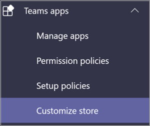

# Magasin d’applications personnalisées dans Microsoft Teams

Vous pouvez désormais personnaliser le magasin d’applications de votre organisation dans Teams avec la personnalisation de votre entreprise en ajoutant votre logo, vos arrière-plans et vos couleurs de texte personnalisées pour qu’il soit plus invitant pour les utilisateurs finaux.

> [!Note]
> L’application des modifications apportées à la marque nécessitera 24 heures.

Vous pouvez accéder au Magasin de personnalisation dans le Centre d’administration en sélectionnant **Teams applications**  >  **Personnaliser le magasin.**

  

Cet article décrit les fonctionnalités du magasin d’applications personnalisées et leur utilisation.

## Personnaliser le logo de votre organisation

<!-- Bookmark used by Context Sensitive Help (CSH). Do not delete. -->

<!-- Do not remove the bookmark link above. -->

Ici, vous pouvez télécharger le logo de votre organisation. Le logo sélectionné s’affiche dans la Teams client **dans les applications**  >  **conçues pour votre** page client.

Lorsque vous sélectionnez **l’option Choisir une** image, vous pouvez télécharger le fichier de votre choix. Le logo doit avoir la taille 240 x 60 ou s’il doit être dimensioné de cette taille. Elle ne doit pas avoir une taille supérieure à 5 Mo. Les formats pris en charge sont les autres :

- .svg
- .png
- .jpg

Le logo apparaît dans le coin supérieur droit du catalogue d’applications client du Teams store.

## Personnaliser votre petit logo

<!-- Bookmark used by Context Sensitive Help (CSH). Do not delete. -->

<!-- Do not remove the bookmark link above. -->

Le logo de votre organisation est une image ou un symbole représentant la marque de votre organisation et n’inclut pas le nom de votre société. Le signet love permet aux membres d’une équipe d’identifier le magasin d’applications. Le logo sélectionné s’affiche dans la Teams client dans la page Applications.

Lorsque vous sélectionnez **l’option Choisir une** image, vous pouvez télécharger le fichier de votre choix. Le logo doit avoir une taille de 32 x 32 pixels ou être réduite de cette taille. Elle ne doit pas avoir une taille supérieure à 5 Mo. Les formats pris en charge sont les autres :

- .svg
- .png
- .jpg

Le petit logo s’affiche en côté du titre de **la** section Créé pour le client dans la page d Teams d’accueil du magasin d’articles.

## Personnaliser la couleur d’arrière-plan

<!-- Bookmark used by Context Sensitive Help (CSH). Do not delete. -->

<!-- Do not remove the bookmark link above. -->

Assurez-vous que l’arrière-plan présente suffisamment de contraste avec le texte afin que les utilisateurs puisse lire le texte de façon claire. L’arrière-plan s’affiche dans Teams client **dans les applications**  >  **conçues pour l’en-tête de votre** client.

Vous disposez des options suivantes :

- Utiliser Teams thème d’arrière-plan par défaut du client
- Choisissez une image. Lorsque vous sélectionnez l’image d’arrière-plan, vous pouvez télécharger le fichier de votre choix. L’arrière-plan doit faire 1212 x 100 pixels ou s’écheller de cette taille. Elle ne doit pas avoir une taille supérieure à 5 Mo. Les formats pris en charge sont les autres :
  - .svg
  - .png
  - .jpg
- Choisissez un arrière-plan personnalisé. Lorsque vous **sélectionnez Choisir une couleur personnalisée,** un séleceur de couleurs s’ouvre. Sélectionnez la couleur de votre choix en ajustant l’échelle du séleceur de couleurs.

L’image ou la couleur d’arrière-plan est utilisée comme arrière-plan de la bannière supérieure du Teams du catalogue d’applications clientes.

## Personnaliser la couleur de texte de votre nom

<!-- Bookmark used by Context Sensitive Help (CSH). Do not delete. -->

<!-- Do not remove the bookmark link above. -->

Assurez-vous que la couleur de texte présente suffisamment de contraste avec l’arrière-plan afin que les utilisateurs peuvent lire clairement le nom de votre organisation. Le texte s’affiche dans Teams client dans **les applications**  >  **conçues pour l’en-tête de votre** client.

Lorsque vous **sélectionnez Choisir une couleur personnalisée,** un séleceur de couleurs s’ouvre. Sélectionnez la couleur de votre choix en ajustant l’échelle du séleceur de couleurs.

 

## Finaliser la personnalisation de votre magasin d’applications d’équipe

Une fois que vous avez terminé de personnaliser votre magasin d’applications, assurez-vous de sélectionner Enregistrer **pour** enregistrer vos modifications.
Pour afficher un aperçu de vos modifications, sélectionnez **Preview apps store** pour afficher une représentation de votre magasin d’applications personnalisé.

> [!Note]
> La représentation peut différer de la version finale de votre magasin d’applications personnalisées, car certaines couleurs par défaut sont basées sur la version de vos utilisateurs Teams client.

## Article connexe

[Gérer vos applications](manage-apps.md)
