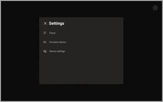
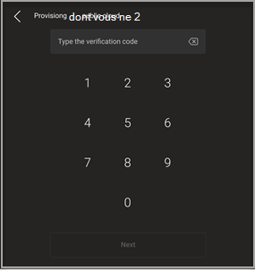
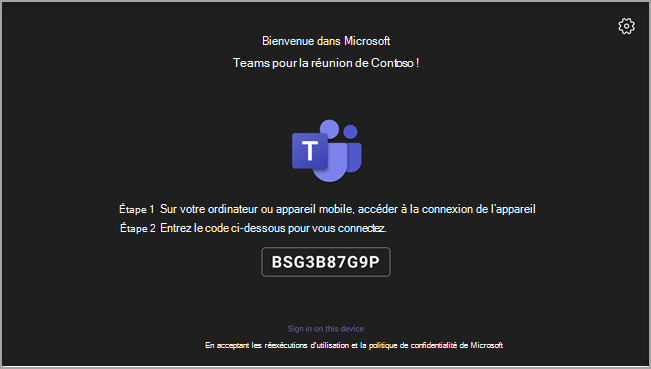
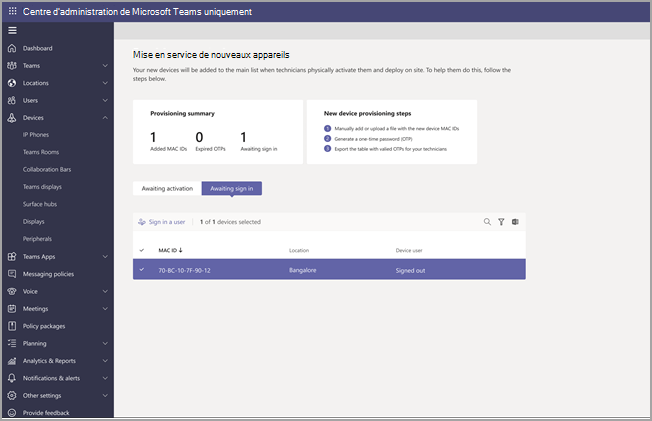
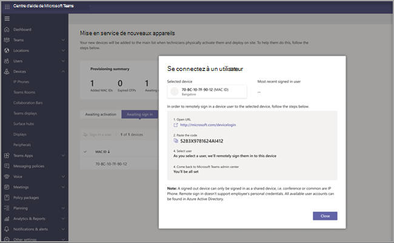

# Mise en service à distance et se connectez pour Teams appareils Android

Les administrateurs informatiques peuvent mettre en service à distance un appareil Android et Teams se connectent. Pour mettre en service un appareil à distance, l’administrateur doit télécharger les ID MAC des appareils en cours de mise en service et créer un code de vérification. L’ensemble du processus peut être accompli à distance à partir du centre Teams’administration.

## Passer en revue les appareils pris en charge

La liste suivante présente les conditions requises pour le microprogramme de l’appareil Android.

|Catégorie d’appareil|Modèle d’appareil|Version du microprogramme|
|-|-|-|
|Teams téléphones portables|Yealink T55/T56/T58|58.15.0.124|
|Teams téléphones portables|Yealink VP59|91.15.0.58|
|Teams téléphones portables|Yealink CP960|73.15.0.117|
|Teams téléphones portables|Yealink MP56/MP54/MP58|122.15.0.36|
|Teams téléphones portables|Crestron UC-2|1.0.3.52|
|Teams téléphones portables|  PolySoin C60|  7.0.2.1071|
|Teams téléphones portables|  CCX400/CCX500/CCX600    |7.0.2.1072|
|Teams téléphones portables|  Audio Codes C448HD/C450HD/C470HD|   1.10.120|
|Teams panneaux|  Crestron 770/1070|  1.004.0115|
|salles Teams sur Android|Logitech Cat Bar Mini|1.2.982|
|salles Teams sur Android|Logitech Cat Bar|1.2.982|
|salles Teams sur Android|AudioCodes RXV80|1.13.361|
|salles Teams sur Android|CESSEURS DÉVELOPPENT VISION 3T|1.2.2.21182.10|
|salles Teams sur Android|Barre de réunions Yealink A30|133.15.0.60|
|salles Teams sur Android|Barre de réunions Yealink A20|133.15.0.60|
|salles Teams sur Android|Console tactile CTP18 Yealink|137.15.0.37|
|salles Teams sur Android|Poly Studio X30|3.5.0.344025|
|salles Teams sur Android|Poly Studio X50|3.5.0.344025|
|salles Teams sur Android|Console tactile Poly TC8 |3.5.0.210489|
|salles Teams sur Android|Yealink VC210|118.15.0.54|

## Ajouter une adresse MAC d’appareil

Pour mettre en service un nouvel appareil, vous suivrez les étapes suivantes.

1. Se connecter au Centre d’administration de Microsoft Teams.
2. Développez **Teams Appareils mobiles.**
3. Sélectionnez **Provision new device** from the **Actions** tab.

Dans la **fenêtre Provision de nouveaux appareils,** vous pouvez ajouter l’adresse mac manuellement ou télécharger un fichier.

### Ajouter manuellement une adresse MAC de périphérique

1. Dans **l’onglet En attente d’activation,** **sélectionnez Ajouter un ID MAC.**

   

1. Entrez l’ID MAC.
1. Entrez un emplacement pour aider les techniciens à identifier l’emplacement d’installation des appareils.
1. Sélectionnez **Appliquer** lorsque vous avez terminé.

### Télécharger fichier pour ajouter l’adresse MAC d’un appareil

1. Dans **l’onglet En attente d’activation,** **sélectionnez Télécharger ID MAC.**
2. Téléchargez le modèle de fichier.
3. Entrez l’ID MAC et l’emplacement, puis enregistrez le fichier.
4. **Sélectionnez le** fichier, puis **sélectionnez Télécharger.**

## Générer un code de vérification

Vous avez besoin d’un code de vérification pour les appareils. Le code de vérification est généré en bloc ou au niveau de l’appareil et est valable pendant 24 heures.

1. Dans **l’onglet En attente d’activation,** sélectionnez un ID MAC existant.
   Un mot de passe est créé pour l’adresse MAC et s’affiche dans la colonne **Code de** vérification.

2. Fournissez la liste des ID MAC et des codes de vérification aux techniciens de champ. Vous pouvez exporter les détails directement dans un fichier et le partager avec le technicien qui travaille sur l’installation réelle.

## Approvisionnement de l’appareil

Lorsque l’appareil est sous tension et connecté au réseau, le technicien le connecte. Ces étapes sont effectuées sur l’appareil Teams’appareil mobile.

1. Le technicien sélectionne Périphérique **d’approvisionnement** dans le **Paramètres.**  

   
  
2. Le technicien entre le code de vérification spécifique de l’appareil dans le champ de saisie fourni.

   

   Une fois l’appareil correctement mis en service, le nom du client s’affiche dans la page de inscription.

   

## Se connectez à distance

Le périphérique est sous l’onglet En **attente de la** signature. Démarrez le processus de inscription à distance en sélectionnant le périphérique individuel.

1. Sélectionnez un appareil dans **l’onglet En attente de la connectez-vous.**

   

2. Suivez les instructions dans **Se connectez à un utilisateur,** puis sélectionnez **Fermer.**

   

## Article connexe

- [Gérer vos périphériques dans Teams](device-management.md)
- [Mettre à jour Teams appareils à distance](remote-update.md)
