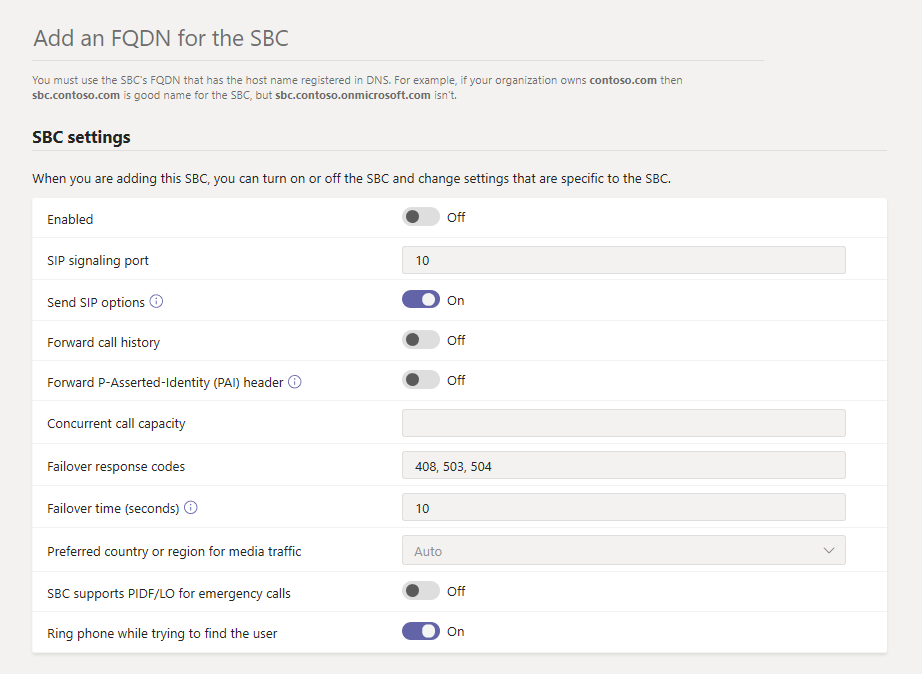

# <a name="connect-your-session-border-controller-sbc-to-direct-routing"></a>Connecter votre contrôleur de bordure de session (SBC) vers le routage direct

Cet article explique comment configurer un contrôleur de session border Controller (SBC) et le connecter à Système téléphonique routage direct.  Voici l’étape 1 des étapes suivantes pour configurer le routage direct :

- **Étape 1. Connecter votre SBC avec votre Système téléphonique et valider la connexion** (cet article)
- Étape 2. [Activer le routage direct pour les utilisateurs](direct-routing-enable-users.md)
- Étape 3. [Configurer le routage des appels](direct-routing-voice-routing.md)
- Étape 4. [Traduire des nombres dans un autre format](direct-routing-translate-numbers.md)

Pour plus d’informations sur la procédure de configuration du routage direct, voir [Configurer le routage direct.](direct-routing-configure.md)

Vous pouvez utiliser le [centre Microsoft Teams d’administration](#using-the-microsoft-teams-admin-center) ou [PowerShell](#using-powershell) pour configurer et connecter un SBC au routage direct.

## <a name="using-the-microsoft-teams-admin-center"></a>Utiliser le centre d’administration Microsoft Teams

1. Dans le navigateur de gauche, cliquez sur l’onglet  >   **SBCs.**
2. Cliquez sur **Ajouter**.
3. Entrez un FQDN pour le SBC. <br><br>Assurez-vous que la partie nom de domaine du nom de domaine complet correspond à un domaine enregistré dans votre client et gardez à l’esprit que le nom de domaine n’est pas pris en charge pour le nom de domaine `*.onmicrosoft.com` FQDN SBC. Par exemple, si vous avez deux noms de domaine et `contoso.com` `contoso.onmicrosoft.com` , utilisez-le `sbc.contoso.com` comme nom SBC. Si vous utilisez un sous-domaine, assurez-vous que ce sous-domaine est également enregistré dans votre client. Par exemple, si vous voulez l’utiliser, `sbc.service.contoso.com` vous devez être `service.contoso.com` inscrit.
4. Configurez les paramètres suivants pour le SBC, en fonction des besoins de votre organisation. Pour plus d’informations sur chacun de ces paramètres, voir [les paramètres SBC.](#sbc-settings)

    

5. Une fois que vous avez terminé, cliquez sur **Enregistrer**.

## <a name="using-powershell"></a>Utiliser PowerShell

Pour connecter votre SBC au routage direct, vous devez :

1. [Connecter à Skype Entreprise Online à l’aide de PowerShell.](#connect-to-skype-for-business-online-by-using-powershell)
2. [Connecter le SBC au client.](#connect-the-sbc-to-the-tenant)
3. [Vérifiez la connexion SBC.](#verify-the-sbc-connection)

### <a name="connect-to-skype-for-business-online-by-using-powershell"></a>Connecter à Skype Entreprise Online à l’aide de PowerShell

Vous pouvez utiliser une session PowerShell connectée au client pour associer le SBC à l’interface de routage direct. Pour ouvrir une session PowerShell, suivez les étapes décrites dans [configurer votre ordinateur pour Windows PowerShell.](/SkypeForBusiness/set-up-your-computer-for-windows-powershell/set-up-your-computer-for-windows-powershell)
 
Après avoir établi une session PowerShell distante, vérifiez que vous pouvez voir les commandes pour gérer le SBC. Pour vérifier les commandes, tapez ou copiez-collez la commande suivante dans la session PowerShell, puis appuyez sur Entrée : 

```PowerShell
Get-Command *onlinePSTNGateway*
```

La commande renvoie les quatre fonctions affichées ici pour vous aider à gérer le SBC.

<pre>
CommandType    Name                       Version    Source 
-----------    ----                       -------    ------ 
Function       Get-CsOnlinePSTNGateway    1.0        tmp_v5fiu1no.wxt 
Function       New-CsOnlinePSTNGateway    1.0        tmp_v5fiu1no.wxt 
Function       Remove-CsOnlinePSTNGateway 1.0        tmp_v5fiu1no.wxt 
Function       Set-CsOnlinePSTNGateway    1.0        tmp_v5fiu1no.wxt
</pre>

### <a name="connect-the-sbc-to-the-tenant"></a>Connecter SBC au client

Utilisez la [cmdlet New-CsOnlinePSTNGateway](/powershell/module/skype/new-csonlinepstngateway) pour connecter le SBC au client. Dans une session PowerShell, tapez ce qui suit, puis appuyez sur Entrée :

```PowerShell
New-CsOnlinePSTNGateway -Fqdn <SBC FQDN> -SipSignalingPort <SBC SIP Port> -MaxConcurrentSessions <Max Concurrent Sessions the SBC can handle> -Enabled $true
```

  > [!NOTE]
  > 1. Nous vous recommandons de définir une limite d’appels maximale dans le SBC à l’aide des informations disponibles dans la documentation SBC. La limite déclenchera une notification si le SBC est au niveau de capacité.
  > 2. Vous ne pouvez connecter le SBC que si la partie domaine de son nom de domaine (FQDN) correspond à l’un des domaines enregistrés dans votre client, à l’exception de \* .onmicrosoft.com. L’utilisation de onmicrosoft.com noms de domaine n’est pas prise en charge pour le nom de domaine \* complet SBC. Par exemple, si vous avez deux noms de domaine, **contoso**.com et **contoso**.onmicrosoft.com, vous pouvez utiliser sbc.contoso.com pour le nom SBC. Si vous essayez de connecter le code SBC avec un nom tel que sbc.contoso.abc, le système ne vous le permet pas, car le domaine n’est pas propriétaire de ce client.<br/>
  > Outre le domaine enregistré dans votre client, il est important qu’un utilisateur soit affecté à ce domaine et à une licence E3 ou E5. Si ce n’est pas le cas, le message d’erreur suivant s’agit :<br/>
  `Can not use the "sbc.contoso.com" domain as it was not configured for this tenant`.

Voici un exemple :

```PowerShell
New-CsOnlinePSTNGateway -Identity sbc.contoso.com -Enabled $true -SipSignalingPort 5067 -MaxConcurrentSessions 100 
```

Ce qui renvoie :

<pre>
Identity              : sbc.contoso.com 
Fqdn                  : sbc.contoso.com 
SipSignalingPort     : 5067 
FailoverTimeSeconds   : 10 
ForwardCallHistory    : False 
ForwardPai            : False 
SendSipOptions        : True 
MaxConcurrentSessions : 100 
Enabled               : True   
</pre>

> [!NOTE]
> Cet exemple montre uniquement les paramètres minimum requis. Vous pouvez définir d’autres paramètres avec la cmdlet [New-CsOnlinePSTNGateway](/powershell/module/skype/new-csonlinepstngateway) pendant le processus de connexion. Pour en savoir plus, [consultez les paramètres SBC.](#sbc-settings)
 
### <a name="verify-the-sbc-connection"></a>Vérifier la connexion SBC

Pour vérifier la connexion :

- [Vérifiez si le SBC figure dans la liste des SBC couplés.](#check-whether-the-sbc-is-on-the-list-of-paired-sbcs)
- [Valider les options SIP.](#validate-sip-options)
 
#### <a name="check-whether-the-sbc-is-on-the-list-of-paired-sbcs"></a>Vérifier si le SBC figure dans la liste des SBC couplés

Après avoir connecté le SBC, utilisez l’cmdlet [Get-CsOnlinePSTNGateway](/powershell/module/skype/get-csonlinepstngateway) pour vérifier qu’il figure dans la liste des SBC couplés. Tapez ce qui suit dans une session Remote PowerShell, puis appuyez sur Entrée :

```PowerShell
Get-CsOnlinePSTNGateway -Identity sbc.contoso.com  
```

La passerelle couplée doit apparaître dans la liste,  comme illustré dans l’exemple ci-dessous, et le paramètre Activé doit afficher la valeur **Vrai.**

Ce qui renvoie :

<pre>
Identity              : sbc.contoso.com  
Fqdn                  : sbc.contoso.com
SipSignalingPort     : 5067
CodecPriority         : SILKWB,SILKNB,PCMU,PCMA
ExcludedCodecs        :  
FailoverTimeSeconds   : 10
ForwardCallHistory    : False
ForwardPai            : False
SendSipOptions        : True
MaxConcurrentSessions : 100
Enabled               : True
</pre>

#### <a name="validate-sip-options"></a>Valider les options SIP

Pour valider le coupage à l’aide des options SIP sortantes, utilisez l’interface de gestion SBC et confirmez que SBC reçoit 200 réponses OK pour ses messages d’OPTIONS sortants.

Lorsque le routage direct voit les options entrantes, il commence à envoyer des messages d’options SIP sortantes vers le FQDN SBC configuré dans le champ d’en-tête Contact du message options entrantes. 

Pour valider le coupage à l’aide des options SIP entrantes, utilisez l’interface de gestion SBC et voyez que SBC envoie une réponse aux messages OPTIONS provenant du routage direct et que le code de réponse envoyé est 200 OK.

## <a name="sbc-settings"></a>Paramètres SBC

Ce tableau répertorie les options que vous pouvez définir pour le SBC dans le Centre d’administration Microsoft Teams et à l’aide de l’cmdlet [New-CsOnlinePSTNGateway.](/powershell/module/skype/new-csonlinepstngateway)

|Obligatoire?|Microsoft Teams centre d’administration|Paramètre PowerShell|Description|Par défaut|Valeurs possibles|Type et restrictions|
|:-----|:-----|:-----|:-----|:-----|:-----|:-----|
|Oui|**Ajouter un FQDN pour le SBC**|FQDN |Aucun|Nom de nom de domaine complet, limite 63 caractères|String, consultez la liste des caractères autorisés et non autorisés dans les conventions d’attribution de noms dans Active Directory pour les [ordinateurs,](https://support.microsoft.com/help/909264) les domaines, les sites et les utils.|
|Non|**Activé**|Activé|Utilisez cette fonction pour activer le SBC pour les appels sortants. Vous pouvez l’utiliser pour supprimer temporairement le SBC du service pendant sa mise à jour ou pendant la maintenance. |False|Vrai<br/>False|Boolean|
|Oui|**Port de signalisation SIP**|SipSignalingPort |Il s’agit du port d’écoute utilisé pour communiquer avec le routage direct à l’aide du protocole TLS (Transport Layer).|Aucun|N’importe quel port|De 0 à 65 535 |
|Non|**Envoyer les options SIP**|SendSIPOptions |Définit si le SBC envoie les messages d’options SIP. Il est vivement recommandé d’activer ce paramètre. Lorsque ce paramètre est éteint, le SBC est exclu du système de surveillance et d’alerte.|Vrai|Vrai<br/>False|Boolean|
|Non|**Historique des appels de avance**|ForwardCallHistory |Indique si les informations de l’historique des appels sont transmis via la ligne. Lorsque vous l’activer, le proxy Microsoft 365 ou Office 365 envoie un en-tête Historique et référent par référence. |False|Vrai<br/>False|Boolean|
|Non|**En-tête Forward P-Ed-Identity (NT)**|ForwardPAI|Indique si l’en-têteS est transmis en même temps que l’appel. L’en-tête PAI permet de vérifier l’identité de l’appelant. Si ce paramètre est sous, l’en-tête Privacy:ID est également envoyé.|False|Vrai<br/>False|Boolean|
|Non|**Capacité des appels simultanés**|MaxConcurrentSessions |Lorsque vous définissez une valeur, le système d’alerte vous avertit lorsque le nombre de sessions simultanées est supérieur ou de 90 % à cette valeur. Si vous ne définissez pas de valeur, les alertes ne sont pas générées. Toutefois, le système de surveillance signale le nombre de sessions simultanées toutes les 24 heures. |Null|Null<br/>De 1 à 100 000 ||
|Non|**Codes de réponse deover**|FailoverResponseCodes<br>|Si le routage direct reçoit un code d’erreur 4xx ou 6xx SIP en réponse à une invitation sortante, l’appel est considéré comme terminé par défaut. Sortant signifie un appel d’un client Teams vers le réseau PSTN avec le flux de trafic : client Teams -> Routage direct -> SBC -> réseau téléphonique). Lorsque vous spécifiez un code de réponse deover, cela force direct Routing à essayer un autre SBC (si un autre SBC existe dans la stratégie de routage vocal de l’utilisateur) lorsqu’il reçoit les codes spécifiés si le SBC ne peut pas effectuer d’appel en raison de problèmes de réseau ou autres. Pour plus d’informations, voir [Failover de codes SIP spécifiques](direct-routing-trunk-failover-on-outbound-call.md)reçus du contrôleur de bordure de session (SBC).|408, 503, 504||Int|
|Non|**Heures deover (secondes)**|FailoverTimeSeconds |Lorsque vous définissez une valeur, les appels sortants qui ne répondent pas à la passerelle dans le temps que vous définissez sont acheminés vers la ligne disponible suivante. S’il n’y a pas de ligne supplémentaire, l’appel est automatiquement supprimé. La valeur par défaut est 10 secondes. Dans une organisation qui a des réseaux lents et des réponses aux passerelles, cela peut potentiellement entraîner la chute inutile d’appels.|10|Numéro|Int|
|Non|**Pays ou région préféré(s) pour le trafic de médias**|MediaRelayRoutingLocationOverride | Non applicable au routage direct. Ce paramètre est réservé aux opérateurs gérés dans les plans d’appels. |Aucun|||
|Non|**SBC prend en charge piDF/LO pour les appels d’urgence**|Pid pieSupported|Indiquez si le SBC prend en charge l’objet PIDF/LO (Presence Information Data Format Location Object) pour les appels d’urgence.||||
|Non| - |MediaBypass|Ce paramètre indique si le SBC prend en charge la dérivation média et si vous souhaitez l’utiliser pour ce SBC. |Aucun|Vrai<br/>False|Boolean|

## <a name="see-also"></a>Voir aussi

[Planifier le routage direct](direct-routing-plan.md)

[Configurer le routage direct](direct-routing-configure.md)

[Présentation de Teams PowerShell](teams-powershell-overview.md)
