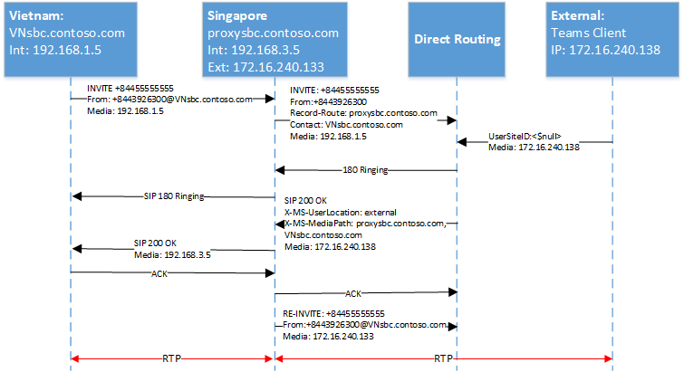

# <a name="configure-local-media-optimization-for-direct-routing"></a>Configurer l’optimisation des médias locaux pour le routage direct

La configuration de l’optimisation des médias locaux est basée sur des paramètres réseau courants avec d’autres fonctionnalités voix cloud, telles que le routage Location-Based et les appels d’urgence dynamiques. Pour en savoir plus sur les régions réseau, les sites réseau, les sous-réseaux et les adresses IP de confiance, consultez Paramètres réseau pour les [fonctionnalités vocales cloud.](cloud-voice-network-settings.md)

Avant de configurer l’optimisation des médias locaux, consultez l’optimisation des médias [locaux pour le routage direct.](direct-routing-media-optimization.md)  

Pour configurer l’optimisation des médias locaux, les étapes suivantes sont nécessaires. Vous pouvez utiliser le Centre Teams’administration de l’utilisateur ou PowerShell. Pour plus d’informations, [voir Gérer votre topologie de réseau.](manage-your-network-topology.md)

1. Configurez l’utilisateur et les sites SBC (comme décrit dans cet article).
2. Configurez les SBC pour l’optimisation des médias locaux (conformément à la spécification de votre fournisseur SBC).

Le diagramme suivant illustre la configuration réseau utilisée dans les exemples tout au long de cet article.


## <a name="configure-the-user-and-the-sbc-sites"></a>Configurer l’utilisateur et les sites SBC

Pour configurer l’utilisateur et les sites SBC, vous devez :

1. [Gérer les adresses IP de confiance externes.](#manage-external-trusted-ip-addresses)  

2. [Définissez la topologie de](#define-the-network-topology) réseau en configurant les régions réseau, les sites réseau et les sous-réseaux.

3. [Définissez la topologie](#define-the-virtual-network-topology) de réseau virtuel en attribuant un ou plusieurs SBC aux sites avec les modes appropriés et les valeurs SBC de proxy.


## <a name="configure-sbcs-for-local-media-optimization-according-to-the-sbc-vendor-specification"></a>Configurez le ou les SBC pour l’optimisation des médias locaux en fonction de la spécification du fournisseur SBC

Cet article décrit la configuration des composants Microsoft. Pour plus d’informations sur la configuration SBC, consultez la documentation de votre fournisseur SBC. Pour plus d’informations sur les fournisseurs SBC qui supportent l’optimisation des médias locaux, voir Contrôleurs de session [certifiés pour le routage direct.](direct-routing-border-controllers.md)

## <a name="manage-external-trusted-ip-addresses"></a>Gérer les adresses IP de confiance externes

Les IPS fiables externes sont les IPS externes Internet du réseau d’entreprise. Ces adresses IP sont les adresses IP utilisées par Microsoft Teams clients lorsqu’ils se connectent à Microsoft 365. Vous devez ajouter ces IPS externes pour chaque site où vous avez des utilisateurs utilisant l’optimisation des médias locaux.

Pour ajouter les adresses IP publiques pour chaque site, utilisez l'New-CsTenantTrustedIPAddress cmdlet. Vous pouvez définir un nombre illimité d’adresses IP fiables pour un client. Si les adresses IP externes vus par Microsoft 365 sont des adresses IPv4 et IPv6, vous devez ajouter les deux types d’adresses IP. Pour IPv4, utilisez le masque 32. Pour IPv6, utilisez le masque 128. Vous pouvez ajouter des adresses IP externes individuelles et des sous-réseaux IP externes en spécifiant différents masques sur l’cmdlet.

```
New-CsTenantTrustedIPAddress -IPAddress <External IP address> -MaskBits <Subnet bitmask> -Description <description>
```


Exemple d’ajout d’adresses IP fiables.

```
New-CsTenantTrustedIPAddress -IPAddress 172.16.240.110 -MaskBits 32 -Description "Vietnam site trusted IP"
New-CsTenantTrustedIPAddress -IPAddress 172.16.240.120 -MaskBits 32 -Description "Indonesia site trusted IP"
New-CsTenantTrustedIPAddress -IPAddress 172.16.240.130 -MaskBits 32 -Description "Singapore site trusted IP"
```


## <a name="define-the-network-topology"></a>Définir la topologie de réseau

Cette section décrit comment définir les régions réseau, les sites réseau et les sous-réseaux pour votre topologie de réseau.

Tous les paramètres respectent la cas. Vous devez donc vous assurer d’utiliser le même cas que lors de l’installation.  (Par exemple, les valeurs GatewaySiteID « Vietnam » et « vietnam » seront traitées comme des sites différents.)

### <a name="define-network-regions"></a>Définir les régions réseau

Pour définir les régions du réseau, utilisez l'New-CsTenantNetworkRegion de cmdlet. Le paramètre RegionID est un nom logique qui représente la géographie de la région et ne présente aucune dépendance ou restriction. Le paramètre CentralSite `<site ID>` est facultatif.

```
New-CsTenantNetworkRegion -NetworkRegionID <region ID>  
```

L’exemple suivant crée une région réseau nommée APAC :

```
New-CsTenantNetworkRegion -NetworkRegionID "APAC"  
```

###  <a name="define-network-sites"></a>Définir des sites réseau

Pour définir des sites réseau, utilisez l'New-CsTenantNetworkSite cmdlet. Chaque site réseau doit être associé à une région réseau.

```
New-CsTenantNetworkSite -NetworkSiteID <site ID> -NetworkRegionID <region ID>
```

L’exemple suivant crée trois nouveaux sites réseau( Vietnam, Indonésie et Singapour) dans la région APAC :

```
New-CsTenantNetworkSite -NetworkSiteID "Vietnam" -NetworkRegionID "APAC"
New-CsTenantNetworkSite -NetworkSiteID "Indonesia" -NetworkRegionID "APAC"
New-CsTenantNetworkSite -NetworkSiteID "Singapore" -NetworkRegionID "APAC"
```

### <a name="define-network-subnets"></a>Définir des sous-réseaux réseau

Pour définir des sous-réseaux et les associer à des sites réseau, utilisez New-CsTenantNetworkSubnet cmdlet. Chaque sous-réseau ne peut être associé qu’à un seul site. 

```
New-CsTenantNetworkSubnet -SubnetID <Subnet IP address> -MaskBits <Subnet bitmask> -NetworkSiteID <site ID>
```

L’exemple suivant définit trois sous-réseaux et les associe aux trois sites réseau : Vietnam, Indonésie et Singapour :

```
New-CsTenantNetworkSubnet -SubnetID 192.168.1.0 -MaskBits 24 -NetworkSiteID “Vietnam”
New-CsTenantNetworkSubnet -SubnetID 192.168.2.0 -MaskBits 24 -NetworkSiteID “Indonesia”
New-CsTenantNetworkSubnet -SubnetID 192.168.3.0 -MaskBits 24 -NetworkSiteID “Singapore”
```

## <a name="define-the-virtual-network-topology"></a>Définir la topologie de réseau virtuel 

Tout d’abord, l’administrateur client crée une nouvelle configuration SBC pour chaque SBC pertinent à l’aide de lNew-CsOnlinePSTNGateway dlet.
L’administrateur client définit la topologie de réseau virtuel en spécifiant les sites réseau pour les objets de passerelle PSTN à l’aide de Set-CsOnlinePSTNGateway cmdlet :

```
PS C:\> Set-CsOnlinePSTNGateway -Identity <Identity> -GatewaySiteID <site ID> -MediaBypass <true/false> -BypassMode <Always/OnlyForLocalUsers> -ProxySBC  <proxy SBC FQDN or $null>
```

Remarques : 
   - Si le client n’a qu’un SBC, le paramètre -ProxySBC doit être obligatoire au $null ou au FQDN SBC (SBC central avec scénario de ligne centralisée).
   - Le paramètre -MediaBypass doit être réglé sur $true pour prendre en charge l’optimisation des médias locaux.
   - Si le paramètre SBC n’a pas de paramètre -BypassMode, les en-têtes X-MS ne seront pas envoyés. 
   - Tous les paramètres respectent la cas, aussi devez-vous vous assurer d’utiliser le même cas que celui utilisé lors de l’installation.  (Par exemple, les valeurs GatewaySiteID « Vietnam » et « vietnam » seront traitées comme des sites différents.)

L’exemple suivant ajoute trois SBE aux sites réseau vietnam, Indonésie et Singapour dans la région APAC avec le mode Toujours contourner :

```
Set-CSOnlinePSTNGateway -Identity “proxysbc.contoso.com” -GatewaySiteID “Singapore” -MediaBypass $true -BypassMode “Always” -ProxySBC $null

Set-CSOnlinePSTNGateway -Identity “VNsbc.contoso.com” -GatewaySiteID “Vietnam” -MediaBypass $true -BypassMode “Always” -ProxySBC “proxysbc.contoso.com”

Set-CSOnlinePSTNGateway -Identity “IDsbc.contoso.com” -GatewaySiteID “Indonesia” -MediaBypass $true -BypassMode “Always” -ProxySBC “proxysbc.contoso.com”
```

Remarque : pour garantir la interruption des opérations lorsque l’optimisation des médias locaux et le routage Location-Based sont configurés en même temps, les SLB en aval doivent être activés pour LBR en configurant le paramètre GatewaySiteLbrEnabled sur $true pour chaque SBC en aval. (Ce paramètre n’est pas obligatoire pour le SBC proxy.)

D’après les informations ci-dessus, le routage direct inclura trois en-têtes SIP propriétaires pour les invitations et les invitations siP, comme indiqué dans le tableau suivant.

En-têtes X-MS introduits dans le routage direct dans les invitations et les Re-Invites si BypassMode est défini :

| Nom de l’en-tête | Valeurs | Commentaires | 
|:------------|:-------|:-------|
| X-MS-UserLocation | interne/externe | Indique si l’utilisateur est interne ou externe |
| Request-URI INVITE sip: +84439263000@VNsbc.contoso.com SIP /2.0 | SBC FQDN | FQDN ciblé pour l’appel même si le SBC n’est pas connecté directement au routage direct |
| X-MS-MediaPath | Exemple : proxysbc.contoso.com, VNsbc.contoso.com | Ordre des SBC à utiliser pour le chemin de médias entre l’utilisateur et la cible SBC. Le SBC final est toujours le dernier |
| X-MS-UserSite | usersiteID | Chaîne définie par l’administrateur client |

## <a name="call-flows"></a>Flux d’appels 

L’exemple suivant illustre les flux d’appels pour deux modes :

- [Toujours contourner](#always-bypass-mode)
- [Uniquement pour les utilisateurs locaux](#only-for-local-users-mode)

### <a name="always-bypass-mode"></a>Toujours contourner le mode

Le mode Contournement est l’option la plus simple à configurer. L’administrateur client peut configurer un site unique pour tous les utilisateurs et SBCS si tous les SBCs sont accessibles à partir d’un site.

Les exemples montrent le mode De contournement toujours pour les scénarios suivants :

- [Appels sortants et l’utilisateur se trouve au même emplacement que le SBC](#outbound-calls-and-the-user-is-in-the-same-location-as-the-sbc-with-always-bypass)
- [Appels entrants et l’utilisateur se trouve au même emplacement que le SBC](#inbound-calls-and-the-user-is-in-the-same-location-as-the-sbc-with-always-bypass)
- [Appels sortants et utilisateur externe](#outbound-calls-and-the-user-is-external-with-always-bypass)
- [Appels entrants et l’utilisateur est externe](#inbound-calls-and-the-user-is-external-with-always-bypass)

Le tableau suivant indique le FQDN et les adresses IP utilisés dans les exemples suivants :

| FQDN | Adresse IP externe SBC | Adresse IP interne SBC | Sous-réseau interne | Lieu | NAT externe (adresse IP fiable) |
|:------------|:-------|:-------|:-------|:-------|:-------|
| VNsbc.contoso.com | Aucun | 192.168.1.5 | 192.168.1.0/24 | Vietnam | 172.16.240.110 |
| IDsbc.contoso.com | Aucun | 192.168.2.5 | 192.168.2.0/24 | Indonésie | 172.16.240.120 |
| proxysbc.contoso.com | 172.16.240.133 | 192.168.3.5 | 192.168.3.0/24 | Singapour | 172.16.240.130 |


#### <a name="outbound-calls-and-the-user-is-in-the-same-location-as-the-sbc-with-always-bypass"></a>Appels sortants et l’utilisateur se trouve au même emplacement que le SBC avec toujours contournement

| Mode |    Utilisateur |  Lieu |  Direction de l’appel |
|:------------|:-------|:-------| :-------|
| AlwaysBypass |    Interne |  Le même site que SBC |  Sortant |

Le tableau suivant indique la configuration et l’action de l’utilisateur final :

| Emplacement physique de l’utilisateur| Un utilisateur effectue ou reçoit un appel vers/depuis un numéro | Numéro de téléphone de l’utilisateur  | Stratégie de routage vocal en ligne | Mode configuré pour SBC |
|:------------|:-------|:-------|:-------|:-------|
| Vietnam | +84 4 3926 3000 | +84 4 5555 5555   | Priorité 1 : ^ \+ 84(\d {9} )$ -VNsbc.contoso.com <br> Priorité 2 : .* - proxysbc.contoso.com   | VNsbc.contoso.com – Toujours contourner <br> proxysbc.contoso.com – Toujours contourner


Le diagramme suivant montre l’évolution SIP d’un appel sortant avec le mode de contournement Toujours et l’utilisateur situé au même emplacement que le SBC.


Le tableau suivant indique les en-têtes X-MS envoyés par routage direct :

| Paramètre | Explication |
|:------------|:-------|
| Inviter+8443926300@VNsbc.contoso.com | Le nom de sécurité (FQDN) cible du SBC défini dans la stratégie de routage voix en ligne est envoyé dans l’URI de demande | 
| X-MS-UserLocation : interne | Le champ indique que l’utilisateur se trouve dans le réseau d’entreprise |
| X-MS-MediaPath : VNsbc.contoso.com |   Indique quel SBC le client doit traverser jusqu’au SBC cible. Dans ce cas, comme nous avons Toujours contournement, et le client est interne au nom de la cible envoyé en tant que seul nom dans l’en-tête. | 
|X-MS-UserSite : Vietnam |   Champ indiqué sur le site où se trouve l’utilisateur. |


#### <a name="inbound-calls-and-the-user-is-in-the-same-location-as-the-sbc-with-always-bypass"></a>Appels entrants et l’utilisateur se trouve au même emplacement que le SBC avec toujours contournement

| Mode |    Utilisateur |  Lieu |  Direction de l’appel |
|:------------|:-------|:-------|:-------|:-------|
| AlwaysBypass |    Interne | Le même site que SBC | Entrant |


Lors d’un appel entrant, l’emplacement de l’utilisateur est inconnu et la fonction SBC doit deviner où se trouve l’utilisateur. Si l’estimation n’est pas correcte, une nouvelle invitation est requise. Ce cas suppose que l’utilisateur est interne, que les médias peuvent circuler directement et qu’aucune autre action n’est requise (nouvelle invitation).
Le SBC connecté au service de routage direct signale l’emplacement SBC d’origine en fournissant des champs Record-Route et Contact. Sur la base de ces champs, le chemin de médias est calculé par routage direct.

Remarque : Étant donné qu’un utilisateur peut avoir plusieurs points de terminaison, la prise en charge de 183 n’est pas possible. Dans ce cas, le routage direct utilise toujours 180 sonneries. 

Le diagramme suivant montre l’évolution SIP d’un appel entrant avec le mode AlwaysBypass, et l’utilisateur se trouve au même emplacement que le SBC.


#### <a name="outbound-calls-and-the-user-is-external-with-always-bypass"></a>Appels sortants et l’utilisateur est externe avec Toujours contourner

| Mode |    Utilisateur |  Site |  Direction de l’appel
|:------------|:-------|:-------|:-------|
AlwaysBypass |  Externe |  N/A | Sortant |


Le diagramme suivant illustre l’évolution SIP d’un appel sortant avec le mode AlwaysBypass et l’utilisateur est externe :


Le tableau suivant indique les en-têtes X-MS envoyés par le service de routage direct :

| Paramètre |   Explication |
|:------------|:-------|
|Inviter+8443926300@VNsbc.contoso.com | Le nom de sécurité (FQDN) cible du SBC tel que défini dans la stratégie de routage voix en ligne est envoyé dans l’URI de demande.|
| X-MS-UserLocation : externe | Le champ indique que l’utilisateur se trouve en dehors du réseau d’entreprise. |
| X-MS-MediaPath : proxysbc.contoso.com, VNsbc.contoso.com    | Indique quel SBC le client doit traverser jusqu’au SBC cible. Dans ce cas, nous avons Toujours contourné et le client est externe. |

#### <a name="inbound-calls-and-the-user-is-external-with-always-bypass"></a>Appels entrants et l’utilisateur est externe avec Toujours contournement

| Mode | Utilisateur | Site |  Direction de l’appel |
|:------------|:-------|:-------|:-------|
AlwaysBypass |  Externe |  N/A |   Entrant |

Pour un appel entrant, le SBC connecté au routage direct doit envoyer une nouvelle invitation (par défaut, les candidats aux médias locaux sont toujours proposés) si l’emplacement de l’utilisateur est externe.  Le X-MediaPath est calculé sur la base des Record-Route et de l’utilisateur SBC spécifié.

Le diagramme suivant illustre l’évolution SIP d’un appel entrant avec le mode AlwaysBypass et l’utilisateur est externe.




### <a name="only-for-local-users-mode"></a>Uniquement pour le mode utilisateur local

Les supports multimédias locaux du SBC cible ne seront proposés que si un utilisateur se trouve au même emplacement que le SBC. Dans tous les autres cas, les médias circulent via une adresse IP interne ou externe du proxy SBC.

Les scénarios suivants sont décrits :

- [Appels sortants et l’utilisateur se trouve au même emplacement que le SBC](#outbound-calls-and-the-user-is-in-the-same-location-as-the-sbc-with-only-for-local-users)
- [Appels entrants et l’utilisateur se trouve au même emplacement que le SBC](#inbound-calls-and-the-user-is-in-the-same-location-as-the-sbc-with-only-for-local-users)
- [L’utilisateur n’est pas au même emplacement que le SBC, mais se trouve dans le réseau d’entreprise](#user-is-not-at-the-same-location-as-the-sbc-but-is-in-the-corporate-network-with-only-for-local-users)
- [Appels entrants et l’utilisateur est interne, mais n’est pas au même emplacement que le SBC](#inbound-call-and-the-user-is-internal-but-is-not-at-the-same-location-as-the-sbc-with-only-for-local-users)

Le tableau suivant indique la configuration et l’action de l’utilisateur final :

| Emplacement physique de l’utilisateur |  Un utilisateur effectue ou reçoit un appel vers/depuis un numéro |  Numéro de téléphone de l’utilisateur | Stratégie de routage vocal en ligne |   Mode configuré pour SBC |
|:------------|:-------|:-------|:-------|:-------|
| Vietnam | +84 4 3926 3000 |  +84 4 5555 5555 | Priorité 1 : ^ \+ 84(\d {9} )$ -VNsbc.contoso.com <br> Priorité 2 : .* - proxysbc.contoso.com | VNsbc.contoso.com – OnlyForLocalUsers Proxysbc.contoso.com – Toujours Contourner |

#### <a name="outbound-calls-and-the-user-is-in-the-same-location-as-the-sbc-with-only-for-local-users"></a>Appels sortants et l’utilisateur se trouve au même emplacement que le SBC avec uniquement pour les utilisateurs locaux

| Mode | Utilisateur | Site | Direction de l’appel |
|:------------|:-------|:-------|:-------|
| OnlyForLocalUsers |   Interne |Identique à SBC   | Sortant |

Le diagramme suivant illustre un appel sortant avec le mode OnlyForLocalUsers et l’utilisateur se trouve au même emplacement que le SBC. Il s’agit du même flux affiché dans les appels sortants lorsque l’utilisateur se trouve au même emplacement [que le SBC.](#outbound-calls-and-the-user-is-in-the-same-location-as-the-sbc-with-always-bypass)


#### <a name="inbound-calls-and-the-user-is-in-the-same-location-as-the-sbc-with-only-for-local-users"></a>Appels entrants et l’utilisateur se trouve au même emplacement que le SBC avec uniquement pour les utilisateurs locaux

| Mode | Utilisateur | Site | Direction de l’appel |
|:------------|:-------|:-------|:-------|
| OnlyForLocalUsers |   Interne | Identique à SBC | Entrant |

Le diagramme suivant illustre un appel entrant avec le mode OnlyForLocalUsers et l’utilisateur se trouve au même emplacement que le SBC. Il s’agit du même flux que celui affiché dans les appels entrants lorsque l’utilisateur se trouve au même emplacement [que le SBC.](#inbound-calls-and-the-user-is-in-the-same-location-as-the-sbc-with-always-bypass)


#### <a name="user-is-not-at-the-same-location-as-the-sbc-but-is-in-the-corporate-network-with-only-for-local-users"></a>L’utilisateur n’est pas au même emplacement que le SBC, mais se trouve sur le réseau d’entreprise avec uniquement pour les utilisateurs locaux

| Mode | Utilisateur | Site |Direction de l’appel |
|:------------|:-------|:-------|:-------|
| OnlyForLocalUsers  | Interne |   Différent de SBC | Sortant |

Le routage direct calcule X-MediaPath en fonction de l’emplacement signalé de l’utilisateur et du mode configuré sur le SBC.


Le diagramme suivant montre un appel sortant avec le mode OnlyForLocalUsers et un utilisateur interne qui n’est pas au même emplacement que le SBC.


#### <a name="inbound-call-and-the-user-is-internal-but-is-not-at-the-same-location-as-the-sbc-with-only-for-local-users"></a>Appel entrant et l’utilisateur est interne, mais n’est pas au même emplacement que le SBC avec uniquement pour les utilisateurs locaux

| Mode |    Utilisateur |  Site |  Direction de l’appel |
|:------------|:-------|:-------|:-------|
| OnlyForLocalUsers | Interne |    Différent de SBC |    Entrant |

Le diagramme suivant montre un appel entrant avec le mode OnlyForLocalUsers et un utilisateur interne qui n’est pas au même emplacement que le SBC.


