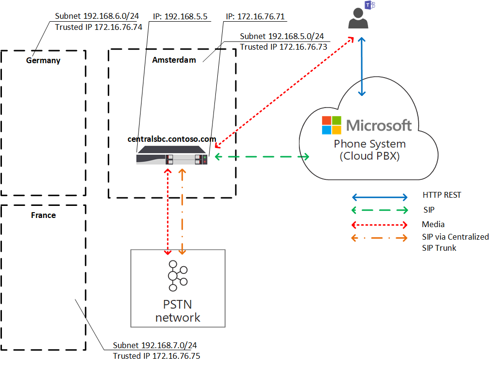

# Planifier l’optimisation des médias locaux pour le routage direct

Public Switched Telephone Network (PSTN) voice est considéré comme une application critique pour l’entreprise avec de grandes attentes en matière de qualité vocale. Le routage direct vous permet de contrôler les flux de trafic multimédia pour prendre en charge une multitude de topologies de réseau et de configurations de téléphonie locale pour différentes entreprises dans le monde entier.

L’optimisation des médias locaux pour le routage direct vous permet de gérer la qualité de la voix en :

- Contrôle de la façon dont le trafic multimédia circule entre les clients Teams et les contrôleurs de frontière de session client (SBC).
- Conserver les médias locaux dans les limites des sous-réseaux de réseau d’entreprise.
- Autoriser les flux multimédias entre les clients Teams et les SBC, même si les SBC se trouvent derrière des pare-feu d’entreprise avec des adresses IP privées et non visibles directement par Microsoft.

L’optimisation des médias locaux prend en charge deux scénarios :

- Centralisation de toutes les jonctions locales par le biais d’un SBC centralisé connecté à la jonction principale du protocole SIP (Session Initiation Protocol), fournissant des services de téléphonie à toutes les succursales locales de l’entreprise.

- Création d’une topologie de réseau virtuel de SBC , où les SBC dans les filiales locales sont connectées à un SBC proxy centralisé qui est visible et communique avec le système Téléphone Microsoft via son adresse IP externe. Dans une topologie de réseau virtuel, les SBC en aval communiquent via des adresses IP internes et ne sont pas directement visibles par Système téléphonique.

Cet article décrit les fonctionnalités et les scénarios et solutions des clients. Pour plus d’informations sur la configuration, consultez [Configurer l’optimisation des médias locaux](direct-routing-media-optimization-configure.md).

  > [!NOTE]
  > Si vous souhaitez conserver les médias locaux dans les limites de votre intranet, l’optimisation des médias locaux est recommandée. Si vous disposez déjà de Media Bypass et que vous utilisez uniquement les adresses IP publiques de vos SBC, il n’est pas obligatoire de passer à l’optimisation des médias locaux. Vous pouvez continuer à utiliser la déviation du trafic multimédia. Pour plus d’informations, consultez [Plan Media Bypass](direct-routing-plan-media-bypass.md).

Pour plus d’informations sur les fournisseurs SBC qui prennent en charge l’optimisation des médias locaux, consultez [Contrôleurs de bordure de session certifiés pour le routage direct](direct-routing-border-controllers.md).

## Scénarios clients pris en charge

Pour cette discussion, supposons que Contoso gère plusieurs entreprises à travers le monde comme suit. (Notez que les régions Europe et APAC sont utilisées comme exemples uniquement. Une entreprise peut avoir plusieurs régions différentes avec des exigences similaires.)

- **En Europe**, Contoso a des bureaux dans environ 30 pays. Chaque bureau possède son propre Exchange de succursale privée (PBX).

  Contoso s’est vue offrir une option pour centraliser les jonctions dans un seul emplacement , Amsterdam, pour les 30 bureaux européens. Contoso a déployé le SBC à Amsterdam, fourni suffisamment de bande passante pour exécuter des appels via l’emplacement centralisé, connecté une jonction SIP centrale à l’emplacement centralisé et commencé à servir tous les emplacements européens à partir d’Amsterdam.

- **Dans la région APAC**, Contoso a plusieurs bureaux dans différents pays.

  Dans de nombreux pays, l’entreprise a encore des jonctions de multiplexage de division du temps (TDM) dans les succursales locales. La centralisation des jonctions TDM n’étant pas une option dans la région APAC, il n’est pas possible de basculer vers SIP. Supposons qu’il existe plus de 50 succursales Contoso dans la région APAC avec des centaines de passerelles (SBC). Dans ce scénario, il n’est pas possible d’associer toutes les passerelles à l’interface de routage direct en raison d’un manque d’adresses IP publiques et/ou d’interruptions Internet locales. En outre, certains pays imposent des exigences réglementaires qui ne peuvent pas être satisfaites sans une connectivité réseau RTC locale.

En fonction de ses besoins métier, Contoso a implémenté deux solutions avec l’optimisation des médias locaux pour le routage direct :

- **En Europe**, toutes les jonctions sont centralisées et les flux multimédias entre le SBC central et les utilisateurs, en fonction de l’emplacement de l’utilisateur.

  - Si un utilisateur est connecté au sous-réseau local d’un réseau d’entreprise (c’est-à-dire que l’utilisateur est interne), les flux multimédias entre l’adresse IP interne du SBC central et le client Teams de l’utilisateur.

  - Si un utilisateur est en dehors des limites du réseau d’entreprise , par exemple, si l’utilisateur utilise une connexion Internet sans fil publique, l’utilisateur est considéré comme externe. Dans ce cas, le média circule entre l’adresse IP externe du SBC central et le client Teams.

- **Dans la région APAC**, un SBC de proxy centralisé est associé au routage direct Microsoft, qui dirige les médias entre l’interface de routage direct et les SBC en aval dans les filiales locales.

  Les SBC en aval dans les succursales locales ne sont pas directement visibles par le routage direct dans APAC, mais elles sont jumelées à l’aide de l’applet de commande Set-CSOnlinePSTNGateway pour créer une topologie de réseau virtuel dans Téléphone Microsoft System. Les médias restent toujours locaux lorsque cela est possible. Les utilisateurs externes ont des médias qui circulent entre le client Teams et l’adresse IP publique du SBC proxy.

## SBC central avec jonctions centralisées

Pour créer une solution dans laquelle les services RTC sont fournis à toutes les succursales locales via un SBC central unique avec une jonction SIP centralisée connectée, l’administrateur client Contoso associe un SBC (centralsbc.contoso.com) au service ; le SBC dispose d’une jonction SIP centralisée qui lui est connectée.

- Lorsqu’un utilisateur se trouve dans le réseau interne de l’entreprise, le SBC fournit l’adresse IP interne du SBC pour le média.

- Lorsqu’un utilisateur se trouve en dehors du réseau d’entreprise, le SBC fournit l’adresse IP externe (publique) du SBC.

> [!NOTE]
> Toutes les valeurs des exemples, tables ou diagrammes sont présentées à des fins d’illustration uniquement.

Tableau 1. Exemples de paramètres réseau pour les SBC

| Lieu | Nom de domaine complet SBC | Sous-réseau interne | NAT externe (adresse IP approuvée) | Adresse IP externe SBC | Adresse IP interne SBC |
|:------------|:-------|:-------|:-------|:-------|:-------|
| Amsterdam | centralsbc.contoso.com | 192.168.5.0/24 | 172.16.76.73 | 172.16.76.71 | 192.168.5.5 |
| Allemagne | Non déployé | 192.168.6.0/24 | 172.16.76.74 | Non déployé |  Non déployé |
| France | Non déployé | 192.168.7.0/24 | 172.16.76.75 | Non déployé |  Non déployé |

### Utilisateur interne

Le diagramme suivant montre le flux de trafic lorsqu’un utilisateur est connecté au réseau d’entreprise dans la filiale ou le site d’accueil de l’utilisateur.

En local, l’utilisateur est affecté à la filiale locale en Allemagne. L’utilisateur effectue un appel téléphonique de routage direct via Teams.

- Le client Teams de l’utilisateur communique directement avec Système téléphonique via l’API REST, mais le média généré pendant l’appel est transmis à l’adresse IP interne du SBC central.

- Le SBC redirige le flux vers Système téléphonique et le réseau RTC connecté.

- Le SBC central est visible pour Système téléphonique via l’adresse IP externe uniquement.

Diagramme 1. Flux de trafic lorsque l’utilisateur se trouve dans le site « home » avec un SBC centralisé et une jonction SIP centralisée connectée

### Utilisateur externe

Le diagramme suivant montre le flux de trafic lorsqu’un utilisateur n’est pas local et n’est pas connecté au réseau d’entreprise (autrement dit, l’appareil de l’utilisateur est connecté à Internet via un appareil mobile ou un Wi-Fi public). L’utilisateur effectue un appel téléphonique de routage direct via Teams :

- Le client Teams de l’utilisateur communique directement avec Système téléphonique via l’API REST, mais, dans ce cas, le média généré pendant l’appel circule vers l’adresse IP externe du SBC central.

- Le SBC redirige le flux vers Système téléphonique et le réseau RTC connecté.

- Le SBC central est visible pour Système téléphonique via l’adresse IP externe uniquement.

Dans ce cas, le comportement est similaire, que l’utilisateur soit local à la filiale en Allemagne ou à toute autre succursale. L’utilisateur est considéré comme externe, car il est en dehors des limites du réseau d’entreprise.

Diagramme 2. Flux de trafic lorsque l’utilisateur est externe avec un SBC centralisé et une jonction SIP centralisée connectée

## Proxy SBC avec SBC connecté en aval

Pour créer une solution dans laquelle les services RTC sont fournis dans toutes les succursales locales de la région APAC où la centralisation des jonctions TDM n’est pas une option, l’administrateur Contoso associe un SBC (proxysbc.contoso.com), également appelé SBC proxy, au service de routage direct.

Par la suite, l’administrateur Contoso ajoute des SBC en aval indiquant qu’ils peuvent être atteints via le proxysbc.contoso.com SBC proxy. Les SBC en aval ne disposent pas d’adresses IP publiques. Toutefois, elles peuvent être affectées à des itinéraires vocaux. Le tableau ci-dessous montre des exemples de paramètres réseau et de configuration.

Lorsqu’un utilisateur se trouve dans la filiale locale où se trouve le SBC en aval, le trafic multimédia circule directement entre l’utilisateur et le SBC en aval local. Si un utilisateur se trouve en dehors du bureau (sur un Internet public), le média transite de l’utilisateur vers l’adresse IP publique du SBC proxy, qui le proxye vers le ou les SBC en aval appropriés.

Tableau 2. Exemple d’informations réseau SBC

| Lieu | Nom de domaine complet SBC | Sous-réseau interne | NAT externe (adresse IP approuvée) | Adresse IP externe SBC  | Adresse IP interne SBC |
|:------------|:-------|:-------|:-------|:-------|:-------|
| Vietnam | VNsbc.contoso.com | 192.168.1.0/24 | 172.16.240.110 | Aucun |  192.168.1.5 |
| Indonésie  | IDsbc.contoso.com | 192.168.2.0/24 | 172.16.240.120 | Aucun |  192.168.2.5 |
| Singapour | proxysbc.contoso.com |   192.168.3.0/24 | 172.16.240.130 | 172.16.240.133 | 192.168.3.5 |

### Utilisateur interne

Le diagramme suivant montre le flux de trafic de haut niveau pour le scénario lorsqu’un utilisateur se trouve à l’intérieur du bureau dans la région APAC.
L’utilisateur, qui est affecté à une filiale locale au Vietnam et qui est en local, passe un appel téléphonique de routage direct via Teams.

- Le client Teams de l’utilisateur communique avec Système téléphonique directement via l’API REST, mais le média généré pendant l’appel circule vers l’adresse IP interne du SBC local.

- Le SBC local redirige le flux vers le SBC proxy à Singapour et vers le réseau RTC local connecté.

-  Le SBC proxy est visible pour Système téléphonique via l’adresse IP externe uniquement et achemine le flux du SBC en aval (dans ce cas, le SBC local au Vietnam) vers Système téléphonique.

- Le SBC en aval dans la filiale locale n’est pas visible par Système téléphonique directement, mais il est mappé dans la topologie de réseau virtuel définie par l’administrateur Contoso lors de la configuration de l’optimisation des médias locaux.

> [!NOTE]
> Le comportement peut être différent pour les utilisateurs locaux et les utilisateurs non locaux en fonction du mode d’optimisation des médias locaux configuré.

Pour plus d’informations sur les modes possibles et le comportement pertinent, consultez Configurer l’optimisation des médias locaux.

Diagramme 3. Flux de trafic lorsque l’utilisateur se trouve dans le réseau « d’accueil » avec un SBC proxy et avec des SBC connectés en aval

! [Diagramme montrant à nouveau l’optimisation des médias locaux du flux de trafic.] (média/direct-routing-media-op-3.png « Flux de trafic en cas de SBC proxy avec SBC connecté en aval lorsque l’utilisateur se trouve dans le réseau « home »)

### Utilisateur externe

Le diagramme suivant montre le flux de trafic lorsqu’un utilisateur est en dehors des limites du réseau d’entreprise. L’utilisateur n’est pas local (il ne se trouve pas dans les limites du réseau d’entreprise). L’utilisateur effectue un appel téléphonique de routage direct via Teams à un numéro de téléphone au Vietnam.

- Le client Teams de l’utilisateur communique avec Système téléphonique directement via l’API REST, mais le média généré pendant l’appel transite d’abord vers l’adresse IP externe du proxy SBC à Singapour.

- En fonction des stratégies de configuration et de voix (voir [Configurer l’optimisation des médias locaux](direct-routing-media-optimization-configure.md) pour plus d’informations), le proxy SBC redirige le flux vers le SBC en aval au Vietnam.

- Le SBC en aval au Vietnam redirige le flux vers le réseau RTC local connecté.

- Le SBC proxy est visible pour Système téléphonique via l’adresse IP externe uniquement.

-  Le SBC en aval dans la filiale locale n’est pas visible par Système téléphonique directement, mais il est mappé dans la topologie de réseau virtuel définie par l’administrateur Contoso lors de la configuration de l’optimisation des médias locaux. Dans l’exemple, l’utilisateur est considéré comme externe, car il est en dehors des limites du réseau d’entreprise.

Diagramme 4. Flux de trafic lorsque l’utilisateur est externe avec un SBC proxy et avec des SBC en aval connectés

## Modes d’optimisation des médias locaux

L’optimisation des médias locaux prend en charge deux modes :

- **Mode 1 : Toujours contourner**. Dans ce cas, si l’utilisateur est interne, le média transite par l’adresse IP interne du SBC en aval local, quel que soit l’emplacement réel de l’utilisateur interne ; par exemple, dans la même succursale où se trouve le SBC en aval ou dans une autre succursale.

- **Mode 2 : uniquement pour les utilisateurs locaux**. Dans ce mode, le média est directement acheminé vers l’adresse IP interne du SBC en aval local uniquement lorsqu’il est généré par l’utilisateur interne situé dans la même filiale que le SBC en aval.

Pour faire la distinction entre les modes d’optimisation des médias locaux, l’administrateur client doit définir le paramètre -BypassMode sur « Always » ou « OnlyForLocalUsers » pour chaque SBC à l’aide de l’applet de commande Set-CSonlinePSTNGateway. Pour plus d’informations, consultez [Configurer l’optimisation des médias locaux](direct-routing-media-optimization-configure.md).

> [!NOTE]
> Lorsque les utilisateurs sont internes, une connectivité multimédia entre l’utilisateur et le SBC sur l’adresse IP interne est **requise**. Dans ce cas, il n’y a pas de secours aux relais de transport public pour les médias, car le SBC fournira une adresse IP interne pour la connectivité multimédia.

### Mode 1 : Toujours contourner

Si vous disposez d’une bonne connexion entre les succursales, le mode recommandé est Toujours contourner.

Par exemple, supposons qu’une entreprise dispose d’une jonction SIP centralisée à Amsterdam, qui dessert 30 pays et dispose d’une bonne connectivité entre les 30 sites et les utilisateurs locaux. Il existe également une branche en Allemagne où un SBC local est déployé.

Le SBC en Allemagne peut être configuré en mode « Toujours contourner ». Les utilisateurs, quel que soit leur emplacement, se connectent directement au SBC via l’adresse IP interne du SBC (par exemple, de la France à l’Allemagne ; voir le diagramme ci-dessous pour référence).

Les éléments suivants décrivent deux scénarios :

- Scénario 1. L’utilisateur se trouve au même emplacement que le SBC défini dans la stratégie de routage vocal en ligne.

- Scénario 2. L’utilisateur et les passerelles se trouvent dans différents sites.

#### Scénario 1. L’utilisateur se trouve au même emplacement que le SBC défini dans la stratégie de routage vocal en ligne

Le SBC à Amsterdam est configuré pour être un SBC proxy pour un SBC en aval local en Allemagne. L’utilisateur se trouve en Allemagne dans le même sous-réseau que le réseau d’entreprise du SBC local. Les deux SBC (proxy et en aval) sont configurés pour le mode Always Bypass. Les stratégies de routage vocal en ligne spécifient qu’en cas d’appels en Allemagne (avec le code régional +49), elles doivent être routées vers le SBC local en Allemagne. Tous les autres appels , et en cas d’échec du SBC en Allemagne, les appels en Allemagne, doivent être acheminés vers le SBC proxy à Amsterdam. Le tableau suivant résume l’exemple de configuration.

Tableau 3. Exemple de configuration pour le scénario 1

| Emplacement physique de l’utilisateur | L’utilisateur appelle un numéro | Stratégie de routage vocal en ligne | Mode configuré pour SBC | Flow multimédia |
|:------------|:-------|:-------|:-------|:-------|
| Allemagne | +49 1 437 2800 | Priorité 1 : ^\+49(\d{8})$ -DEsbc.contoso.com Priorité 2 : .* - proxysbc.contoso.com| DEsbc.contoso.com – Toujours contourner  proxysbc.contoso.com : Toujours contourner | Teams <-> DEsbc.contoso.com utilisateur |

Le diagramme ci-dessous montre le flux de trafic de haut niveau pour l’utilisateur interne en Allemagne qui effectue un appel téléphonique de routage direct via Teams au numéro en Allemagne.

- Le client Teams de l’utilisateur communique avec Système téléphonique directement via l’API REST.

- Le média généré pendant l’appel circule vers l’adresse IP interne du SBC local.

- Le SBC local redirige le flux vers le SBC proxy à Amsterdam et vers le réseau RTC local connecté.

- Le SBC proxy est visible pour Système téléphonique via l’adresse IP externe uniquement et achemine le flux du SBC en aval (dans ce cas, le SBC local en Allemagne) vers Système téléphonique.

- Le SBC en aval dans la filiale locale n’est pas visible par Système téléphonique directement, mais il est mappé dans la topologie de réseau virtuel définie par l’administrateur Contoso lors de la configuration de l’optimisation des médias locaux.

Diagramme 5.  Flux de trafic avec le mode « Toujours contourner » et l’utilisateur se trouve sur le site « accueil »

! [Diagramme montrant l’optimisation des médias locaux du flux de trafic.] (média/direct-routing-media-op-5.png « Flux de trafic avec le mode « Toujours contourner » et l’utilisateur se trouve dans le site « accueil »)

#### Scénario 2 : L’utilisateur et les passerelles se trouvent dans différents sites

Le SBC à Amsterdam est configuré pour être un SBC proxy pour un SBC en aval local en Allemagne. Les deux SBC (proxy et en aval) sont configurés pour le mode Always Bypass. L’utilisateur interne en France, situé dans la filiale locale, effectue un appel de routage direct vers l’Allemagne. Les stratégies de routage vocal en ligne spécifient que les appels vers l’Allemagne (avec le code régional +49) doivent être routées vers le SBC local en Allemagne. Tous les autres appels et, en cas d’échec du SBC en Allemagne, tous les appels en Allemagne, doivent être acheminés vers le SBC proxy à Amsterdam. Le tableau suivant résume l’exemple de configuration.

Tableau 4. Exemple de configuration pour le scénario 2

| Emplacement physique de l’utilisateur | L’utilisateur appelle un numéro | Stratégie de routage vocal en ligne | Mode configuré pour SBC | Flow multimédia |
|:------------|:-------|:-------|:-------|:-------|
| France | +49 1 437 2800 | Priorité 1 : ^\+49(\d{8})$ -DEsbc.contoso.com  Priorité 2 : .* - proxysbc.contoso.com |  DEsbc.contoso.com – Toujours contourner proxysbc.contoso.com – Toujours contourner | < utilisateur Teams – > DEsbc.contoso.com  |

Le diagramme suivant illustre le flux de trafic de haut niveau lorsque l’utilisateur allemand interne situé en France effectue un appel téléphonique de routage direct via Teams au numéro en Allemagne.

- Le client Teams de l’utilisateur communique avec Système téléphonique directement via l’API REST.

- Le média généré pendant l’appel transite directement vers le SBC dans l’adresse IP interne de l’Allemagne.

- Le SBC en Allemagne redirige le flux vers le proxy SBC à Amsterdam et vers le réseau RTC local connecté.

Diagramme 6.  Flux de trafic avec le mode « Toujours contourner » et l’utilisateur n’est pas dans le site « accueil », mais dans le réseau interne

! [Un diagramme montre l’optimisation des médias locaux du flux de trafic.] (média/direct-routing-media-op-6.png « Flux de trafic avec le mode « Toujours contourner » et l’utilisateur n’est pas dans le site « accueil », mais dans le réseau interne »)

### Mode 2 : uniquement pour les utilisateurs locaux

S’il existe des connexions incorrectes entre les succursales locales mais de bonnes connexions entre chaque succursale locale et une succursale régionale, le mode recommandé est « Uniquement pour les utilisateurs locaux ».

Par exemple, dans la région APAC, supposons que Contoso possède plusieurs bureaux dans différents pays. Pour de nombreux pays, le passage à SIP n’est pas possible, car l’entreprise a encore des jonctions TDM dans de nombreuses succursales locales. La centralisation des jonctions TDM n’est pas une option dans la région APAC. De plus, il existe plus de 50 succursales Contoso dans la région APAC avec des centaines de passerelles (SBC).

Pour créer une solution dans laquelle les services RTC sont fournis dans toutes les succursales locales de la région APAC où la centralisation des jonctions TDM n’est pas une option, l’administrateur Contoso associe un SBC régional à Singapour en tant que proxy SBC au service de routage direct. La connexion directe entre les succursales locales n’est pas bonne, mais il y a une bonne connexion entre chaque succursale locale et le SBC régional à Singapour. Pour le SBC régional, l’administrateur choisit le mode « Toujours contourner », et pour les SBC en aval locaux, l’administrateur choisit le mode « Uniquement pour les utilisateurs locaux ».

Les éléments suivants décrivent deux scénarios :

- Scénario 1. L’utilisateur se trouve au même emplacement que le SBC défini dans la stratégie de routage vocal en ligne

- Scénario 2. L’utilisateur et les passerelles se trouvent dans différents sites

#### Scénario 1. L’utilisateur se trouve au même emplacement que le SBC défini dans la stratégie de routage vocal en ligne

Supposons que le SBC à Singapour est configuré pour être un SBC proxy pour les SBC en aval locaux au Vietnam et en Indonésie. L’utilisateur se trouve au Vietnam au même emplacement que le SBC local. Les stratégies de routage vocal en ligne spécifient que les appels au Vietnam (avec le code régional +84) doivent être routées vers le SBC local au Vietnam. Tous les autres appels et, si le SBC au Vietnam échoue, les appels au Vietnam doivent être acheminés vers le SBC proxy à Singapour. Le tableau suivant résume l’exemple de configuration.

Tableau 5. Exemple de configuration pour le scénario de mode « Uniquement pour les utilisateurs locaux » 1

| Emplacement physique de l’utilisateur | L’utilisateur appelle un numéro | Stratégie de routage vocal en ligne | Mode configuré pour SBC | Flow multimédia |
|:------------|:-------|:-------|:-------|:-------|
| Vietnam | +84 4 3926 3000 | Priorité 1 : ^\+84(\d{9})$ -VNsbc.contoso.com  Priorité 2 : .* - proxysbc.contoso.com | VNsbc.contoso.com : uniquement pour les utilisateurs locaux   proxysbc.contoso.com : Toujours contourner | Teams <-> VNsbc.contoso.com utilisateur |

Dans le diagramme suivant, un utilisateur affecté à la filiale locale au Vietnam, alors qu’il est en local, effectue un appel téléphonique de routage direct via Teams.

- Le client Teams de l’utilisateur communique avec Système téléphonique directement via l’API REST.

- Le média généré pendant les flux d’appel vers l’adresse IP interne du SBC local.

- Le SBC local redirige le flux vers le SBC proxy à Singapour et vers le réseau RTC local connecté.

- Le SBC proxy est visible pour Système téléphonique via l’adresse IP externe uniquement et achemine le flux du SBC en aval (dans ce cas, le SBC local au Vietnam) vers Système téléphonique.

- Le SBC en aval dans la filiale locale n’est pas visible pour Système téléphonique directement, mais il est mappé dans la topologie de réseau virtuel.

Diagramme 7. Flux de trafic avec le mode « Uniquement pour les utilisateurs locaux » et l’utilisateur se trouve dans le site « accueil »

! [Autre diagramme montrant l’optimisation des médias locaux du flux de trafic.] (média/direct-routing-media-op-7.png « Flux de trafic avec le mode « Uniquement pour les utilisateurs locaux » et l’utilisateur est dans le site « accueil »)

#### Scénario 2. L’utilisateur et les passerelles se trouvent dans différents sites

Supposons que le SBC à Singapour est configuré pour être un SBC proxy pour les SBC en aval locaux au Vietnam et en Indonésie. L’utilisateur interne en Indonésie, situé dans la filiale locale, effectue un appel de routage direct au Vietnam. Les stratégies de routage voix en ligne spécifient que les appels au Vietnam (avec le code régional +84) doivent être routées vers le SBC local au Vietnam. Tous les autres appels, et en cas d’échec du SBC au Vietnam, doivent être acheminés vers le SBC proxy à Singapour. Le proxy SBC à Singapour est défini sur le mode « Toujours contourner » et le SBC local au Vietnam est défini sur « Uniquement pour les utilisateurs locaux ». Le tableau suivant résume l’exemple de configuration.

Tableau 6. Configuration utilisateur

| Emplacement physique de l’utilisateur | L’utilisateur appelle un numéro | Stratégie de routage vocal en ligne | Mode configuré pour SBC | Flow multimédia |
|:------------|:-------|:-------|:-------|:-------|
| Indonésie | +84 4 3926 3000 | Priorité 1 : ^\+84(\d{9})$ -VNsbc.contoso.com   Priorité 2 : .* - proxysbc.contoso.com |VNsbc.contoso.com : uniquement pour les utilisateurs locaux   proxysbc.contoso.com : Toujours contourner | Teams utilisateur <–> proxysbc.contoso.com <–> VNsbc.contoso.com |

Dans le diagramme suivant, l’utilisateur interne, alors qu’il est en local dans la filiale indonésien, effectue un appel téléphonique de routage direct via Teams à un numéro au Vietnam.

- Le client Teams de l’utilisateur communique avec Système téléphonique directement via l’API REST.

- Le média généré pendant les flux d’appel vers l’adresse IP interne du proxy SBC commence par.

- Le proxy SBC à Singapour redirige le flux vers l’adresse IP interne du SBC en aval au Vietnam et vers Système téléphonique.

- Le SBC en aval au Vietnam achemine le flux vers le réseau RTC local connecté.

- Le SBC proxy est visible pour Système téléphonique via l’adresse IP externe uniquement.

- Les SBC en aval dans les filiales locales ne sont pas visibles par Système téléphonique directement, mais sont mappées dans la topologie de réseau virtuel.

Diagramme 8.  Flux de trafic avec le mode « Uniquement pour les utilisateurs locaux » et l’utilisateur n’est pas dans le site « accueil », mais dans le réseau interne

! [Un autre diagramme montre l’optimisation des médias locaux du flux de trafic.] (média/direct-routing-media-op-8.png « Flux de trafic avec le mode « Uniquement pour les utilisateurs locaux », l’utilisateur n’est pas dans le site « accueil », mais dans le réseau interne »)

## Problèmes connus

Voici une liste des problèmes connus qui sont actuellement présents dans l’optimisation des médias locaux. Microsoft travaille sur la résolution de ces problèmes.

| Problème | Contournement |
| :--- | :--- |
| Teams client n’est pas identifié comme **interne** lorsque l’adresse IP publique du client Teams correspond à la liste d’adresses IP approuvées du client. | L’optimisation des médias locaux nécessite que le sous-réseau client Teams corresponde à un [sous-réseau réseau](/powershell/module/skype/new-cstenantnetworksubnet) configuré par le locataire|
| Les escalades d’appels entraînent des appels supprimés lorsque le client Teams est identifié comme interne.| Désactivez l’optimisation des médias locaux sur le SBC de routage direct.|
| Les escalades d’appels de 1 à 1 entre les clients internes et les appels multipartes avec des clients/ressources externes entraînent la suppression d’appels | Travail en cours sur un correctif. Vous pouvez également désactiver l’optimisation des médias locaux sur le SBC de routage direct.|
| Teams utilisateur met l’appel en attente. Musique joue sur l’extrémité RTC et l’optimisation des médias locaux fonctionne. L’utilisateur Teams reprend l’appel. L’appel à PSTN reprend, mais l’optimisation des médias locaux ne fonctionne pas et l’appel continue via le SBC central (proxy) | Lorsqu’un utilisateur parcs un appel pour lancer la musique en attente (MoH), il est remonté de 1:1 à un appel multiparty par le contrôleur d’appel pour appeler media controller et media processor (servant de mixer AVMCU) par le biais duquel MoH atteint un utilisateur qui a été mis en attente. La désaffectation vers un appel 1:1 après la reprise de l’appel n’a jamais lieu conformément à la conception. Désactivez l’optimisation des médias locaux sur le SBC de routage direct.|
|Pendant qu’un appel est en cours d’établissement pendant quelques secondes, l’utilisateur peut entendre le silence.| En raison de la complexité de l’architecture d’optimisation des médias locaux, cela peut se produire dans certains cas.|
|Les applications vocales (par exemple, Standard automatique, File d’attente d’appels) ne fonctionnent pas.| LMO ne prend pas en charge Les applications vocales, car elles résident dans le cloud et nécessitent une connectivité externe. Aucune solution de contournement pour l’instant.|
