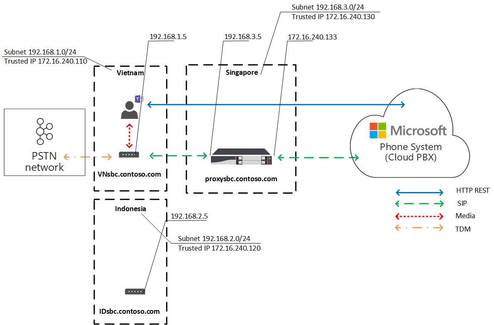

# Optimisation du contenu multimédia local pour le routage directLocal Media Optimization for Direct Routing

Le réseau téléphonique public commuté (RTC) est considéré comme une application vitale pour les entreprises dont la qualité de la voix est élevée.Public Switched Telephone Network (PSTN) voice is considered a business-critical application with high expectations for voice quality. Le routage direct vous permet de contrôler les flux de trafic multimédia pour accepter une multitude de topologies réseau et de configuration de téléphonie locale pour différentes entreprises dans le monde entier.Direct Routing lets you control media traffic flows to accommodate a multitude of network topologies and local telephony setups for various enterprises all over the world. 

L’optimisation des éléments multimédias locaux pour le routage direct vous permet de gérer la qualité de la voix.Local Media Optimization for Direct Routing lets you manage voice quality by:

-   Contrôle du flux de trafic multimédia entre les clients teams et les contrôleurs de frontière de session client (SBCs).Controlling how media traffic flows between the Teams clients and the customer Session Border Controllers (SBCs).
-   Conservation de l’emplacement local des contenus multimédias dans les limites des sous-réseaux du réseau d’entreprise.Keeping media local within the boundaries of corporate network subnets.
-   Autorisant les flux multimédias entre les clients teams et les éléments SBCs, même si les éléments SBCs sont situés derrière des pare-feux d’entreprise disposant d’une IPs privée et ne sont pas visibles par Microsoft directement.Allowing media streams between the Teams clients and the SBCs even if the SBCs are behind corporate firewalls with private IPs and not visible to Microsoft directly.

L’optimisation des éléments multimédias locaux prend en charge deux scénarios :Local Media Optimization supports two scenarios:

- Centralisation de toutes les lignes locales par le biais d’un SBC centralisé connecté au Trunk SIP (Session Initiation Protocol) principal, fournissant des services de téléphonie à toutes les succursales locales de l’entreprise.Centralization of all local trunks through a centralized SBC connected to the main Session Initiation Protocol (SIP)trunk--providing telephony services to all local branch offices of the company.

-   Création d’une topologie de réseau virtuel de type SBCs--où les éléments SBCs dans les succursales locales sont connectés à un SBC proxy centralisé qui est visible par le système Microsoft Phone et en communiquant avec ce système par le biais de son adresse IP externe.Building a virtual network topology of SBCs--where the SBCs in the local branch offices are connected to a centralized proxy SBC that is visible to, and communicating with, Microsoft Phone System through its external IP address. Dans une topologie de réseau virtuel, les éléments SBCs en aval permettent de communiquer par le biais d’une IPs interne et ne sont pas directement visibles par le système téléphonique.In a virtual network topology, downstream SBCs are communicating through internal IPs and are not directly visible to Phone System.

Cet article décrit les fonctionnalités de fonctionnalité, et les scénarios et solutions de clients.This article describes feature functionality, and customer scenarios and solutions. Pour plus d’informations sur la configuration, voir [configurer l’optimisation des médias locaux](direct-routing-media-optimization-configure.md).For details on configuration, see [Configure Local Media Optimization](direct-routing-media-optimization-configure.md). 

  > [!NOTE]
  > Si vous souhaitez conserver les éléments multimédias locaux dans les limites de votre intranet, l’optimisation du contenu multimédia local est recommandée.If you want to keep media local within the boundaries of your intranet, Local Media Optimization is recommended. Si vous avez déjà une dérivation multimédia et que vous utilisez uniquement les adresses IP publiques de votre SBCs, il n’est pas obligatoire de procéder à une optimisation de média locale.If you already have Media Bypass and you use only the public IP addresses of your SBCs, it is not mandatory to move to Local Media Optimization. Vous pouvez continuer à utiliser le contournement multimédia.You can continue to use Media Bypass. Pour plus d’informations, voir [planifier un contournement de média](direct-routing-plan-media-bypass.md).For more information, see [Plan Media Bypass](direct-routing-plan-media-bypass.md).

## Scénarios clients pris en chargeSupported customer scenarios

Pour cette discussion, supposez que contoso exécute plusieurs entreprises sur le globe comme suit.For this discussion, assume that Contoso runs multiple businesses across the globe as follows. (Notez que les régions Europe et APAC ne sont utilisées qu’à titre d’exemple.(Note that Europe and APAC regions are used as examples only. Une société peut avoir plusieurs régions différentes ayant des exigences similaires.)A company might have several different regions with similar requirements.)
 
- **En Europe**, contoso dispose de bureaux dans approximativement 30 pays.**In Europe**, Contoso has offices in approximately 30 countries. Chaque succursale possède son propre échange de succursale privée.Each office has its own Private Branch Exchange (PBX). 

  Contoso a offert une option de centralisation des Trunks au sein d’un emplacement--Amsterdam--pour les 30 bureaux européens.Contoso was offered an option to centralize the trunks in one location--Amsterdam--for all 30 European offices. Contoso a déployé l’SBC dans Amsterdam, à condition de disposer d’une bande passante suffisante pour exécuter les appels par le biais de l’emplacement centralisé, connecté un Trunk SIP central à l’emplacement centralisé et commencé à utiliser tous les emplacements d’Amsterdam.Contoso deployed the SBC in Amsterdam, provided enough bandwidth to run calls through the centralized location, connected a central SIP trunk to the centralized location, and started serving all European locations from Amsterdam. 

- **Dans la région APAC**, Contoso possède plusieurs bureaux dans différents pays.**In the APAC region**, Contoso has multiple offices in different countries. 

  Dans de nombreux pays, l’entreprise dispose toujours de lignes de multiplexage de répartition du temps dans les succursales locales.In many countries, the company still has time-division multiplexing (TDM) trunks in local branch offices. La centralisation des lignes de TDM n’est pas une option disponible dans la région de l’APAC, donc le passage à SIP n’est pas possible.Centralization of the TDM trunks is not an option in the APAC region, so switching to SIP is not possible. Supposez qu’il y a plus de 50 de succursales Contoso dans la région APAC avec des centaines de passerelles (SBCs).Assume there are more than fifty Contoso branch offices across the APAC region with hundreds of gateways (SBCs). Dans ce scénario, il n’est pas possible de jumeler toutes les passerelles vers l’interface de routage directe en raison d’un manque d’adresses IP publiques et/ou de points de suite Internet locaux.In this scenario, it is not possible to pair all gateways to the Direct Routing interface because of a lack of public IP addresses and/or local internet breakouts. De plus, certains pays imposent des exigences réglementaires qui ne peuvent pas être satisfaites sans connexion réseau PSTN locale.In addition, some countries impose regulatory requirements that cannot be fulfilled without having local PSTN network connectivity.

Selon les besoins de votre entreprise, Contoso a implémenté deux solutions avec une optimisation de média locale pour le routage direct :Based on their business requirements, Contoso implemented two solutions with Local Media Optimization for Direct Routing:

- **En Europe**, toutes les lignes sont centralisées et multimédias entre le SBC central et les utilisateurs, en fonction de l’emplacement de l’utilisateur.**In Europe**, all trunks are centralized and media flows between the central SBC and the users, based on the user location. 

  - Si un utilisateur est connecté au sous-réseau local d’un réseau d’entreprise (c’est-à-dire, l’utilisateur est interne), le contenu multimédia est transmis entre l’adresse IP interne de l’SBC central et du client teams de l’utilisateur.If a user is connected to the local subnet of a corporate network (that is, the user is internal), media flows between the internal IP of the central SBC and the user’s Teams client. 
  
  - Si un utilisateur ne se trouve pas dans les limites du réseau d’entreprise, par exemple, si l’utilisateur utilise une connexion Internet sans fil publique, l’utilisateur est considéré comme externe.If a user is outside the boundaries of the corporate network--for example, if the user is using a public wireless Internet connection--then the user is considered to be external. Dans ce cas, les éléments multimédias sont acheminés entre l’adresse IP externe de la SBC centrale et celle du client Teams.In this case, the media flows between the external IP of the central SBC and the Teams client.

- **Dans la région APAC**, un proxy centralisé SBC est associé au routage direct Microsoft, qui transmet les éléments multimédias entre l’interface de routage directe et l’interface de routage directe en aval dans les agences locales.**In the APAC region**, a centralized proxy SBC is paired to Microsoft Direct Routing, which directs media between the Direct Routing interface and the downstream SBCs in local branch offices. 

  L’intérieur de l’intérieur des bureaux de succursales locaux n’est pas directement visible pour le routage direct au sein de l’Asie de l’est, mais il est couplé en utilisant l’applet de connexion Set-CSOnlinePSTNGateway pour créer une topologie de réseau virtuel dans le système Microsoft Phone.The downstream SBCs in the local branch offices are not directly visible to Direct Routing in APAC, but they are paired by using the Set-CSOnlinePSTNGateway cmdlet to create a virtual network topology within Microsoft Phone System. Le contenu multimédia reste toujours local dans la mesure du possible.Media always stays local when possible. Les utilisateurs externes disposent de contenus multimédias entre le client teams et l’adresse IP publique du proxy SBC.External users have media flowing between the Teams client and the public IP of the proxy SBC.

## SBC central avec Trunks centraliséesCentral SBC with centralized trunks

Pour créer une solution dans laquelle les services RTC sont fournis à toutes les succursales locales par le biais d’un SBC central unique avec un Trunk SIP centralisé connecté, l’administrateur client de contoso associe un SBC (centralsbc.contoso.com) au service. un Trunk SIP centralisé est connecté à l’SBC.To build a solution where PSTN services are provided to all local branch offices through a single central SBC with a connected centralized SIP trunk, the Contoso tenant administrator pairs one SBC (centralsbc.contoso.com) to the service; the SBC has a centralized SIP trunk connected to it. 

- Lorsqu’un utilisateur se trouve sur le réseau interne de l’entreprise, l’SBC fournit l’adresse IP interne de l’SBC pour le média.When a user is in the internal network of the company, the SBC provides the internal IP of the SBC for media. 

- Lorsqu’un utilisateur se trouve en dehors du réseau d’entreprise, l’SBC fournit la adresse IP externe (publique) de l’SBC.When a user is outside of the corporate network, the SBC provides the external (public) IP of the SBC.

Remarque : toutes les valeurs dans les exemples, tableaux ou diagrammes sont présentés à des fins d’illustration uniquement.Note: All values within examples, tables, or diagrams are presented for illustration purposes only.

Tableau 1.Table 1. Exemples de paramètres réseau pour SBCsExample network parameters for SBCs 

| LieuLocation | NOM DE DOMAINE COMPLET SBCSBC FQDN | Sous-réseau interneInternal subnet | NAT externe (IP de confiance)External NAT (Trusted IP) | Adresse IP externe d’une SBCSBC external IP address | Adresse IP interne de SBCSBC internal IP address |
|:------------|:-------|:-------|:-------|:-------|:-------|
| AmsterdamAmsterdam | centralsbc.contoso.comcentralsbc.contoso.com | 192.168.5.0/24192.168.5.0/24 | 172.16.76.73172.16.76.73 | 172.16.76.71172.16.76.71 | 192.168.5.5192.168.5.5 |
| AllemagneGermany | Non déployéeNot deployed | 192.168.6.0/24192.168.6.0/24 | 172.16.76.74172.16.76.74 | Non déployéeNot deployed |  Non déployéeNot deployed |
| FranceFrance | Non déployéeNot deployed | 192.168.7.0/24192.168.7.0/24 | 172.16.76.75172.16.76.75 | Non déployéeNot deployed |  Non déployéeNot deployed ||||

### Utilisateur interneInternal user

Le schéma suivant illustre le flux de trafic quand un utilisateur est connecté au réseau d’entreprise dans le bureau ou le site d’origine de l’utilisateur.The following diagram shows the traffic flow when a user is connected to the corporate network in the user’s home branch office or site. 

Sur site, l’utilisateur est affecté à la succursale locale d’Allemagne.While on premises, the user is assigned to the local branch office in Germany. L’utilisateur effectue un appel téléphonique de routage direct par le biais d’équipes.The user makes a Direct Routing phone call through Teams.

- Le client teams de l’utilisateur communique avec le système téléphonique directement par le biais de l’API REST, mais le média généré lors de l’appel est transmis à l’adresse IP interne de l’SBC central.The user’s Teams client communicates to Phone System directly through the REST API, but the media generated during the call flows to the central SBC’s internal IP address. 

- Le SBC redirige le flux vers le système téléphonique et le réseau PSTN connecté.The SBC redirects the flow to Phone System and the connected PSTN network. 

- Le SBC central est visible par le système téléphonique par le biais de l’adresse IP externe uniquement.The central SBC is visible to Phone System through the external IP address only. 

Diagramme 1.Diagram 1. Flux de trafic lorsque l’utilisateur se trouve sur le site « maison » avec un SBC centralisé et un Trunk SIP centralisé connectéTraffic flow when the user is in the ‘home’ site with a centralized SBC and with a connected centralized SIP Trunk

### Utilisateur externeExternal user

Le diagramme suivant illustre le flux de trafic quand un utilisateur n’est pas en local et n’est pas connecté au réseau d’entreprise (c’est-à-dire que l’appareil de l’utilisateur est connecté à Internet par le biais d’un appareil mobile ou d’un Wi-Fi public).The following diagram shows the traffic flow when a user is not on premises and is not connected to the corporate network (that is, the user’s device is connected to the Internet through a mobile device or public Wi-Fi). L’utilisateur effectue un appel téléphonique de routage direct par le biais d’équipes :The user makes a Direct Routing phone call through Teams:

- Le client teams de l’utilisateur communique avec son système téléphonique directement par le biais de l’API REST, mais dans ce cas, le média généré lors de l’appel est transmis à l’adresse IP externe de l’SBC central.The user’s Teams client communicates to Phone System directly through the REST API, but, in this case, the media generated during the call flows to the central SBC’s external IP address. 

- Le SBC redirige le flux vers le système téléphonique et le réseau PSTN connecté.The SBC redirects the flow to Phone System and the connected PSTN network. 

- Le SBC central est visible par le système téléphonique par le biais de l’adresse IP externe uniquement.The central SBC is visible to Phone System through the external IP address only. 

Dans le cas présent, il s’agit de la même façon que l’utilisateur est local de la succursale en Allemagne ou à n’importe quelle autre succursale.In this case, the behavior is similar whether the user is local to the branch office in Germany or to any other branch office. L’utilisateur est considéré comme extérieur, car il se trouve en dehors des limites du réseau d’entreprise.The user is considered external because the user is outside the boundaries of the corporate network.

Diagramme 2.Diagram 2. Flux de trafic lorsque l’utilisateur est externe avec un SBC centralisé et un Trunk SIP centralisé connectéTraffic flow when the user is external with a centralized SBC and with a connected centralized SIP Trunk

## SBC proxy avec connexion SBCs en avalProxy SBC with connected downstream SBCs

Pour créer une solution dans laquelle les services RTC sont fournis dans toutes les succursales locales de la région Asie de l’est, où la centralisation des Trunks TDM n’est pas une option, l’administrateur de contoso (proxysbc.contoso.com), également appelé SBC proxy, pour le service de routage direct.To build a solution where PSTN services are provided in all local branch offices in the APAC region where centralization of the TDM trunks is not an option, the Contoso administrator pairs one SBC (proxysbc.contoso.com), also called the proxy SBC, to the Direct Routing service. 

Par la suite, l’administrateur de contoso ajoute une partie SBCs en aval indiquant qu’il est possible de joindre par le biais du proxy SBC proxysbc.contoso.com.Afterwards, the Contoso administrator adds some downstream SBCs indicating that they can be reached through the proxy SBC proxysbc.contoso.com. Les fonctions SBCs en aval ne possèdent pas d’IPs public, mais peuvent être affectées à des itinéraires vocaux.Downstream SBCs do not have public IPs, however, they can be assigned to voice routes. Le tableau ci-dessous répertorie des exemples de paramètres réseau et de configuration.The table below shows example network parameters and configuration.

Lorsqu’un utilisateur se trouve dans la succursale locale où se trouve l’SBC en aval, le trafic multimédia passe entre l’utilisateur et le SBC en aval directement.When a user is in the local branch office where the downstream SBC is located, the media traffic flows between the user and the local downstream SBC directly. Si un utilisateur ne se trouve pas dans l’entreprise (sur une connexion Internet publique), les éléments multimédias passent de l’utilisateur à l’adresse IP publique du proxy SBC, qui le transmet aux SBC en aval correspondants.If a user is outside of the office (on a public internet), the media flows from the user to the public IP of the Proxy SBC, which proxies it to the relevant downstream SBC(s).

Tableau 2.Table 2. Exemple d’informations réseau SBCExample SBC network information

| LieuLocation | NOM DE DOMAINE COMPLET SBCSBC FQDN | Sous-réseau interneInternal subnet | NAT externe (IP de confiance)External NAT (Trusted IP) | Adresse IP externe d’une SBCSBC external IP address  | Adresse IP interne de SBCSBC internal IP address |
|:------------|:-------|:-------|:-------|:-------|:-------|
| VietnamVietnam | VNsbc.contoso.comVNsbc.contoso.com | 192.168.1.0/24192.168.1.0/24 | 172.16.240.110172.16.240.110 | AucunNone |  192.168.1.5192.168.1.5 |
| IndonésieIndonesia  | IDsbc.contoso.comIDsbc.contoso.com | 192.168.2.0/24192.168.2.0/24 | 172.16.240.120172.16.240.120 | AucunNone |  192.168.2.5192.168.2.5 |
| SingapourSingapore | proxysbc.contoso.comproxysbc.contoso.com |   192.168.3.0/24192.168.3.0/24 | 172.16.240.130172.16.240.130 | 172.16.240.133172.16.240.133 | 192.168.3.5192.168.3.5 |

### Utilisateur interneInternal user 

Le diagramme suivant illustre le flux de trafic de haut niveau pour le scénario lorsque l’utilisateur se trouve à l’intérieur du bureau dans la région APAC.The following diagram shows the high-level traffic flow for the scenario when a user is inside the office in the APAC region. L’utilisateur, qui est affecté à une succursale locale au Viêt Nam et est en local, effectue un appel téléphonique de routage direct par le biais d’équipes.The user, who is assigned to a local branch office in Vietnam, and is on premises, makes a Direct Routing phone call through Teams. 

- Le client teams de l’utilisateur communique avec le système téléphonique directement par le biais de l’API REST, mais les éléments multimédias générés lors de l’appel sont transmis à l’adresse IP interne d’un SBC local.The user’s Teams client communicates with Phone System directly through the REST API, but media generated during the call flows to local SBC’s internal IP address.

- Le SBC local redirige le flux vers l’SBC proxy sur Singapour et sur le réseau PSTN local connecté.The local SBC redirects the flow to the proxy SBC in Singapore and to the connected local PSTN network.

-  L’SBC proxy est visible pour le système téléphonique par le biais de l’adresse IP externe uniquement et route le flux de l’SBC en aval (dans ce cas, l’SBC local en Vietnam) vers le système téléphonique.The proxy SBC is visible to Phone System through the external IP address only and routes the flow from the downstream SBC (in this case the local SBC in Vietnam) to Phone System. 

- La ligne SBC en aval de la succursale locale n’est pas visible par le système téléphonique directement, mais elle est mappée dans la topologie du réseau virtuel définie par l’administrateur de contoso lors de la configuration de l’optimisation des médias locaux.The downstream SBC in the local branch office is not visible to Phone System directly but is mapped within the virtual network topology that is defined by the Contoso administrator while setting up Local Media Optimization.

Remarque : le comportement peut être différent pour les utilisateurs locaux et les utilisateurs non locaux, en fonction du mode d’optimisation de média local configuré.Note: The behavior might be different for local users and non-local users depending on the configured Local Media Optimization mode. 

Pour plus d’informations sur les modes et le comportement pertinents, voir Configurer l’optimisation des médias locaux.For more information on possible modes and relevant behavior, see Configure Local Media Optimization.

Diagramme 3.Diagram 3. Flux de trafic lorsque l’utilisateur se trouve sur le réseau « domestique » avec un SBC proxy et une connexion SBCs en avalTraffic flow when the user is in the “home” network with a proxy SBC and with connected downstream SBCs 

### Utilisateur externeExternal user

Le diagramme suivant illustre le flux de trafic quand un utilisateur se trouve en dehors des frontières du réseau d’entreprise.The following diagram shows the traffic flow when a user is outside of the corporate network boundaries. L’utilisateur n’est pas en local (ne se trouve pas dans les limites du réseau d’entreprise).The user is not on premises (is not within the boundaries of corporate network). L’utilisateur effectue un appel vers un numéro de téléphone au Viêt Nam par le biais d’équipes.The user makes a Direct Routing phone call through Teams to a phone number in Vietnam. 

- Le client teams de l’utilisateur communique avec le système téléphonique directement par le biais de l’API REST, mais le média généré lors du flux d’appels est d’abord transmis à l’adresse IP externe du proxy SBC dans Singapour.The user’s Teams client communicates with Phone System directly through the REST API, but the  media generated during the call flows first to the external IP address of the proxy SBC in Singapore. 

- En fonction des stratégies de configuration et de voix (pour plus d’informations, voir [configurer l’optimisation de médias locaux](direct-routing-media-optimization-configure.md) ), le proxy SBC redirige le flux vers l’SBC en aval au Viêt Nam.Based on configuration and voice policies (see [Configure Local Media Optimization](direct-routing-media-optimization-configure.md) for details), the proxy SBC redirects the flow to the downstream SBC in Vietnam. 

- L’SBC en aval dans le Viêt Nam redirige le flux vers le réseau PSTN local connecté.The downstream SBC in Vietnam redirects the flow to the connected local PSTN network. 

- L’SBC proxy est visible par le système téléphonique par le biais de l’adresse IP externe uniquement.The proxy SBC is visible to Phone System through the external IP address only.

-  La ligne SBC en aval de la succursale locale n’est pas visible par le système téléphonique directement, mais elle est mappée dans la topologie du réseau virtuel définie par l’administrateur de contoso lors de la configuration de l’optimisation des médias locaux.The downstream SBC in the local branch office is not visible to Phone System directly, but is mapped within the virtual network topology that is defined by the Contoso administrator while setting up Local Media Optimization. Dans l’exemple, l’utilisateur est considéré comme extérieur, car il ne se trouve pas dans les limites du réseau d’entreprise.In the example, the user is considered external because the user is outside the boundaries of the corporate network. 

Diagramme 4.Diagram 4. Flux de trafic lorsque l’utilisateur est externe avec un SBC proxy et avec une connexion SBCs en avalTraffic flow when the user is external with a proxy SBC and with connected downstream SBCs

## Modes d’optimisation des médias locauxLocal Media Optimization modes

L’optimisation des éléments multimédias locaux prend en charge deux modes :Local Media Optimization supports two modes:

- **Mode 1 : toujours contournement**.**Mode 1: Always bypass**. Dans le cas présent, si l’utilisateur est interne, le média passe par l’adresse IP interne de l’SBC en aval local, quel que soit l’emplacement réel de l’utilisateur interne ; par exemple, au sein de la même succursale où se trouve l’SBC en aval ou dans une autre succursale.In this case, if the user is internal, the media will flow through the local downstream SBC’s internal IP address regardless of the actual location of the internal user; for example, within the same branch office where the downstream SBC is located or in some other branch office.  

- **Mode 2 : uniquement pour les utilisateurs locaux**.**Mode 2: Only for local users**. Dans ce mode, les éléments multimédias seront acheminés directement vers l’adresse IP interne de l’SBC en aval uniquement en cas de génération par l’utilisateur interne situé dans la même succursale que l’SBC aval.In this mode, media will flow directly to the local downstream SBC’s internal IP address only when generated by the internal user located in the same branch office as the downstream SBC. 

Pour faire la distinction entre les modes d’optimisation des éléments multimédias locaux, l’administrateur client doit définir le paramètre-BypassMode sur « toujours » ou « OnlyForLocalUsers » pour chaque SBC à l’aide de l’applet de Set-CSonlinePSTNGateway.To distinguish between Local Media Optimization modes, the tenant administrator needs to set the -BypassMode parameter to either ‘Always’ or ‘OnlyForLocalUsers’ for every SBC by using the  Set-CSonlinePSTNGateway cmdlet. Pour plus d’informations, voir [configurer l’optimisation des éléments multimédias locaux](direct-routing-media-optimization-configure.md).For more information, see [Configure Local Media Optimization](direct-routing-media-optimization-configure.md).  

 > [!NOTE]
  > Lorsque les utilisateurs sont internes, la connectivité multimédia entre l’utilisateur et l’SBC sur l’adresse IP interne est **requise**.When users are internal, media connectivity between the user and the SBC over the internal IP address is **required**. Dans le cas présent, il n’y a pas de recours aux relais de transport public pour le contenu multimédia, car l’SBC fournira une adresse IP interne pour la connectivité multimédia.There is no fallback to public transport relays for media in this case as the SBC will be providing an internal IP for media connectivity. 

### Mode 1 : toujours contournementMode 1: Always bypass

Si vous avez une bonne connexion entre les succursales, le mode recommandé est toujours contournement.If you have good connection between branch offices, the recommended mode is Always bypass.
 
Par exemple, supposons qu’une entreprise dispose d’un Trunk SIP centralisé dans Amsterdam, qui dessert 30 pays et qui dispose d’une bonne connectivité entre les 30 sites et les utilisateurs locaux.For example, assume a company has a centralized SIP trunk in Amsterdam, which serves 30 countries and has good connectivity between all 30 sites and local users. Il existe également une branche en Allemagne qui déploie un SBC local.There is also a branch in Germany where a local SBC is deployed.

L’SBC en Allemagne peut être configuré en mode « toujours contournement ».The SBC in Germany can be configured in “Always bypass” mode. Les utilisateurs, quel que soit leur lieu, se connectent directement à la SBC par le biais de l’adresse IP interne de l’SBC (par exemple, de France à Allemagne ; Voir le diagramme ci-dessous pour référence).Users, regardless of their location, will connect to the SBC directly through the internal IP address of the SBC (for example from France to Germany; see the diagram below for reference).

Ce qui suit décrit deux scénarios :The following describes two scenarios:

- Scénario 1.Scenario 1. L’utilisateur se trouve au même emplacement que l’SBC défini dans la politique de routage de la voix en ligne.The user is in the same location as the SBC defined in the Online Voice Routing Policy.

- Scénario 2.Scenario 2. L’utilisateur et les passerelles se trouvent dans différents sites.The user and gateways are in different sites.

#### Scénario 1.Scenario 1. L’utilisateur se trouve au même emplacement que l’SBC défini dans la politique de routage de la voix en ligneThe user is in the same location as the SBC defined in the Online Voice Routing Policy

L’SBC dans Amsterdam est configuré en tant que SBC proxy d’un SBC local en Allemagne.The SBC in Amsterdam is configured to be a proxy SBC for a local downstream SBC in Germany. L’utilisateur se trouve en Allemagne au sein du même sous-réseau que le réseau d’entreprise de l’SBC local.The user is in Germany within the same subnet as the corporate network of the local SBC. Les éléments SBCs (proxy et aval) sont configurés pour toujours le mode contournement.Both SBCs (proxy and downstream) are configured for Always Bypass mode. Les stratégies de routage de la voix en ligne indiquent que, en cas d’appel en Allemagne (avec indicatif + 49), elles doivent être routées vers l’SBC local en Allemagne.Online voice routing policies specify that in case of calls within Germany (with area code +49) they should be routed to the local SBC in Germany. Tous les autres appels, et en cas d’échec de la SBC en Allemagne, les appels en Allemagne-doivent être routés vers l’SBC de proxy d’Amsterdam.All other calls--and in case the SBC in Germany fails, calls in Germany--should be routed to the proxy SBC in Amsterdam. Le tableau suivant récapitule les exemples de configuration.The following table summarizes the example configuration. 

Tableau 3.Table 3. Exemple de configuration pour le scénario 1Example configuration for Scenario 1

| Emplacement physique de l’utilisateurUser physical location | Un utilisateur effectue un appel vers un numéroUser makes a call to a number | Politique de routage de la voix en ligneOnline Voice Routing Policy | Mode configuré pour SBCMode configured for SBC | Flux multimédiaMedia Flow | 
|:------------|:-------|:-------|:-------|:-------|
| AllemagneGermany | commande + 49 1 437 2800+49 1 437 2800 | Priorité 1 : ^ \+ 49 (\d {8} ) $-DEsbc.contoso.comPriority 1: ^\+49(\d{8})$ -DEsbc.contoso.com Priorité 2 :. \*-proxysbc.contoso.comPriority 2: .\* - proxysbc.contoso.com| DEsbc.contoso.com : toujours contournementDEsbc.contoso.com – Always Bypass  proxysbc.contoso.com : toujours contournementproxysbc.contoso.com – Always Bypass | < des utilisateurs d’équipes – > DEsbc.contoso.comTeams User <–> DEsbc.contoso.com |

Le diagramme ci-dessous illustre le flux de trafic de haut niveau pour l’utilisateur interne en Allemagne effectuant un appel vers un téléphone de routage directe via teams vers le numéro en Allemagne.The diagram below shows the high-level traffic flow for the internal user in Germany making a Direct Routing phone call through Teams to the number in Germany. 

- Le client teams de l’utilisateur communique directement avec le système téléphonique par le biais de l’API REST.The user’s Teams client communicates with Phone System directly through the REST API. 

- Le média généré lors de l’appel est transmis à l’adresse IP interne de l’SBC local.The media generated during the call flows to the local SBC’s internal IP address. 

- Le SBC local redirige le flux vers l’SBC proxy dans Amsterdam et au réseau PSTN local connecté.The local SBC redirects the flow to the proxy SBC in Amsterdam and to the connected local PSTN network. 

- L’SBC proxy est visible pour le système téléphonique par le biais de l’adresse IP externe uniquement et route le flux de l’SBC en aval (dans ce cas, l’SBC local en Allemagne) vers le système téléphonique.The proxy SBC is visible to Phone System through the external IP address only and routes the flow from the downstream SBC (in this case, the local SBC in Germany) to Phone System. 

- La ligne SBC en aval de la succursale locale n’est pas visible par le système téléphonique directement, mais elle est mappée dans la topologie du réseau virtuel définie par l’administrateur de contoso lors de la configuration de l’optimisation des médias locaux.The downstream SBC in the local branch office is not visible to Phone System directly but is mapped within the virtual network topology that is defined by the Contoso administrator while setting up Local Media Optimization.

Diagramme 5.Diagram 5.  Flux de trafic avec le mode « toujours Bypass » et l’utilisateur se trouve sur le site « maison »Traffic flow with “Always Bypass” mode and the user is in the “home” site

#### Scénario 2 : l’utilisateur et les passerelles se trouvent dans différents sitesScenario 2: The user and gateways are in different sites

L’SBC dans Amsterdam est configuré en tant que SBC proxy d’un SBC local en Allemagne.The SBC in Amsterdam is configured to be a proxy SBC for a local downstream SBC in Germany. Les éléments SBCs (proxy et aval) sont configurés pour toujours le mode contournement.Both SBCs (proxy and downstream) are configured for Always Bypass mode. Les utilisateurs internes situés en France, situés dans la succursale locale, effectuent un appel de routage direct vers l’Allemagne.The internal user in France, located in the local branch office, is making a Direct Routing call to Germany. Les stratégies de routage vocal en ligne permettent de rediriger les appels vers l’Allemagne (avec l’indicatif de la région + 49) vers l’SBC local en Allemagne.Online voice routing policies specify that calls to Germany (with area code +49) should be routed to the local SBC in Germany. Tous les autres appels, et en cas d’échec de la SBC en Allemagne, tous les appels en Allemagne-doivent être routés vers l’SBC du proxy d’Amsterdam.All other calls--and, in case the SBC in Germany fails, all calls in Germany--should be routed to the proxy SBC in Amsterdam. Le tableau suivant récapitule les exemples de configuration.The following table summarizes the example configuration. 

Tableau 4.Table 4. Exemple de configuration pour le scénario 2Example configuration for Scenario 2

| Emplacement physique de l’utilisateurUser physical location | Un utilisateur effectue un appel vers un numéroUser makes a call to a number | Politique de routage de la voix en ligneOnline Voice Routing Policy | Mode configuré pour SBCMode configured for SBC | Flux multimédiaMedia Flow | 
|:------------|:-------|:-------|:-------|:-------|
| FranceFrance | commande + 49 1 437 2800+49 1 437 2800 | Priorité 1 : ^ \+ 49 (\d {8} ) $-DEsbc.contoso.comPriority 1: ^\+49(\d{8})$ -DEsbc.contoso.com  Priorité 2 :. \*-proxysbc.contoso.comPriority 2: .\* - proxysbc.contoso.com |  DEsbc.contoso.com : toujours contournement de proxysbc.contoso.com – toujours contournementDEsbc.contoso.com  – Always Bypass proxysbc.contoso.com – Always Bypass | < des utilisateurs d’équipes – > DEsbc.contoso.comTeams User <– > DEsbc.contoso.com  |

Le diagramme suivant illustre le flux de trafic de haut niveau lorsque l’utilisateur allemand interne situé en France effectue un appel direct par le biais d’équipes au numéro en Allemagne.The following diagram shows the high-level traffic flow when the internal German user located in France makes a Direct Routing phone call through Teams to the number in Germany. 

- Le client teams de l’utilisateur communique directement avec le système téléphonique par le biais de l’API REST.The user’s Teams client communicates with Phone System directly through the REST API.

- Le contenu multimédia généré au cours de l’appel passe directement à l’adresse IP interne de l’SBC en Allemagne.The media generated during the call flows directly to the SBC in Germany's internal IP address. 

- L’SBC en Allemagne redirige le flux vers l’SBC du proxy dans Amsterdam et au réseau PSTN local connecté.The SBC in Germany redirects the flow to the proxy SBC in Amsterdam and to the connected local PSTN network. 

Diagramme 6.Diagram 6.  Flux de trafic avec le mode « toujours Bypass » et l’utilisateur n’est pas sur le site « Home » mais sur le réseau interneTraffic flow with “Always Bypass” mode and the user is not in “home” site but in the internal network

### Mode 2 : uniquement pour les utilisateurs locauxMode 2: Only for local users

S’il existe des connexions incorrectes entre les succursales locales mais une bonne connexion entre chaque succursale locale et votre bureau régional, le mode recommandé est « uniquement pour les utilisateurs locaux ».If there are bad connections between local branch offices but good connections between each local branch office and regional office, then the recommended mode is “Only For Local Users”.

Par exemple, dans la région APAC, Contoso possède plusieurs bureaux dans différents pays.For example, in the APAC region, assume Contoso has multiple offices in different countries. Dans de nombreux pays, le basculement vers SIP n’est pas possible, car l’entreprise dispose toujours de lignes TDM dans de nombreux agences locales.For many countries, switching to SIP is not possible because the company still has TDM trunks in many local branch offices. La centralisation des lignes TDM n’est pas une option disponible dans la région de l’APAC.Centralization of the TDM trunks is not an option in the APAC region. De plus, il existe de plus de 50 contoso succursales dans la région APAC avec des centaines de passerelles (SBCs).Moreover, there are more than fifty Contoso branch offices across the APAC region with hundreds of gateways (SBCs). 

Pour créer une solution dans laquelle les services RTC sont fournis dans tous les bureaux de succursales locaux dans la région APAC où la centralisation des Trunks TDM n’est pas une option, l’administrateur contoso associe un SBC régional à Singapour en tant que proxy SBC vers le service de routage direct.To build a solution where PSTN services are provided in all local branch offices in the APAC region where centralization of the TDM trunks is not an option, the Contoso administrator pairs one regional SBC in Singapore as the proxy SBC to the Direct Routing service. La connexion directe entre les succursales locales n’est pas correcte, mais il existe une bonne connexion entre chaque succursale locale et la ligne SBC régionale dans Singapour.The direct connection between the local branch offices is not good, but there is a good connection between each local branch office and the regional SBC in Singapore. Pour le SBC régional, l’administrateur sélectionne le mode « toujours contournement » et pour l’SBCs local en aval, l’administrateur choisit le mode’uniquement pour les utilisateurs locaux.For the regional SBC, the administrator chooses ‘Always Bypass’ mode, and for the local downstream SBCs, the administrator chooses ‘Only For Local Users’ mode.

Ce qui suit décrit deux scénarios :The following describes two scenarios:

- Scénario 1.Scenario 1. L’utilisateur se trouve au même emplacement que l’SBC défini dans la politique de routage de la voix en ligneThe user is in the same location as the SBC defined in the Online Voice Routing Policy

- Scénario 2.Scenario 2. L’utilisateur et les passerelles se trouvent dans différents sitesThe user and gateways are in different sites

#### Scénario 1.Scenario 1. L’utilisateur se trouve au même emplacement que le SBC défini dans la stratégie de routage de la voix en ligneThe user is in the same location as the SBC defined in Online Voice Routing Policy

Supposez que l’SBC dans Singapour est configuré en tant que SBC proxy pour l’SBCs local en amont au Viêt Nam et en Indonésie.Assume the SBC in Singapore is configured to be a proxy SBC for the local downstream SBCs in Vietnam and Indonesia. L’utilisateur se trouve au Viêt Nam dans le même emplacement que le SBC local.The user is in Vietnam within the same location as the local SBC. Politiques de routage vocal en ligne spécifiez que les appels au Viêt-Nam (avec l’indicatif de la région + 84) doivent être routés vers l’SBC local au Viêt Nam.Online voice routing policies specify that calls in Vietnam (with area code +84) should be routed to the local SBC in Vietnam. Tous les autres appels, et, si la SBC en panne ne fonctionne pas, les appels au Viêt Nam doivent être routés vers l’SBC du proxy dans Singapour.All other calls--and, if the SBC in Vietnam fails, calls in Vietnam--should be routed to the proxy SBC in Singapore. Le tableau suivant récapitule les exemples de configuration.The following table summarizes the example configuration. 

Tableau 5.Table 5. Exemple de configuration pour le mode’uniquement pour les utilisateurs locaux’scénario 1Example configuration for ‘Only For Local Users’ mode Scenario 1

| Emplacement physique de l’utilisateurUser physical location | Un utilisateur effectue un appel vers un numéroUser makes a call to a number | Politique de routage de la voix en ligneOnline Voice Routing Policy | Mode configuré pour SBCMode configured for SBC | Flux multimédiaMedia Flow | 
|:------------|:-------|:-------|:-------|:-------|
| VietnamVietnam | commande + 84 4 3926 3000+84 4 3926 3000 | Priorité 1 : ^ \+ 84 (\d {9} ) $-VNsbc.contoso.comPriority 1: ^\+84(\d{9})$ -VNsbc.contoso.com  Priorité 2 :. \*-proxysbc.contoso.comPriority 2: .\* - proxysbc.contoso.com | VNsbc.contoso.com – uniquement pour les utilisateurs locauxVNsbc.contoso.com – Only For Local Users   proxysbc.contoso.com : toujours contournementproxysbc.contoso.com – Always Bypass | < des utilisateurs d’équipes – > VNsbc.contoso.comTeams User <–> VNsbc.contoso.com |

Dans le diagramme suivant, un utilisateur affecté à la succursale locale au Viêt Nam, en local, effectue un appel téléphonique de routage direct par le biais d’équipes.In the following diagram, a user assigned to the local branch office in Vietnam, while on premises, makes a Direct Routing phone call through Teams. 

- Le client teams de l’utilisateur communique directement avec le système téléphonique par le biais de l’API REST.The user’s Teams client communicates with Phone System directly through the REST API. 

- Le contenu multimédia généré lors de l’appel est transmis à l’adresse IP interne de l’SBC local.Media generated during the call flows to the local SBC’s internal IP address. 

- Le SBC local redirige le flux vers l’SBC proxy sur Singapour et sur le réseau PSTN local connecté.The local SBC redirects the flow to the proxy SBC in Singapore and to the connected local PSTN network. 

- L’SBC proxy est visible pour le système téléphonique par le biais de l’adresse IP externe uniquement et route le flux de l’SBC en aval (dans ce cas, l’SBC local au Viêt Nam) vers le système téléphonique.The proxy SBC is visible to Phone System through the external IP address only and routes the flow from the downstream SBC (in this case, the local SBC in Vietnam) to Phone System. 

- La ligne SBC en aval de la succursale locale n’est pas visible par le système téléphonique directement, mais elle est mappée dans la topologie du réseau virtuel.The downstream SBC in the local branch office is not visible to Phone System directly but is mapped within the virtual network topology.

Diagramme 7.Diagram 7. Flux de trafic avec le mode « uniquement pour les utilisateurs locaux » et l’utilisateur dans le site « Accueil »Traffic flow with “Only For Local Users” mode and the user is in “home” site

#### Scénario 2.Scenario 2. L’utilisateur et les passerelles se trouvent dans différents sitesThe user and gateways are in different sites

Supposez que l’SBC dans Singapour est configuré en tant que SBC proxy pour l’SBCs local en amont au Viêt Nam et en Indonésie.Assume the SBC in Singapore is configured to be a proxy SBC for the local downstream SBCs in Vietnam and Indonesia. L’utilisateur interne de l’Indonésie, situé dans la succursale locale, effectue un appel de routage direct au Viêt Nam.The internal user in Indonesia, located in the local branch office, is making a Direct Routing call to Vietnam. Politiques de routage vocal en ligne spécifiez que les appels vers le Viêt Nam (avec l’indicatif de la région + 84) doivent être routés vers l’SBC local au Viêt Nam.Online Voice routing policies specify that calls to Vietnam (with area code +84) should be routed to the local SBC in Vietnam. Tous les autres appels, et en cas d’échec de l’SBC en Viêt Nam, les appels vers le Viêt Nam doivent être routés vers l’SBC proxy de Singapour.All other calls--and, in case the SBC in Vietnam fails, calls to Vietnam--should be routed to the proxy SBC in Singapore. Le proxy SBC dans Singapour est défini sur le mode « toujours contournement » et l’SBC local au Viêt Nam est défini sur « uniquement pour le mode utilisateurs locaux ».The proxy SBC in Singapore is set to ‘Always Bypass’ mode, and the local SBC in Vietnam is set to ‘Only For Local Users’ mode. Le tableau suivant récapitule les exemples de configuration.The following table summarizes the example configuration. 

Tableau 6.Table 6. Configuration utilisateurUser configuration

| Emplacement physique de l’utilisateurUser physical location | Un utilisateur effectue un appel vers un numéroUser makes a call to a number | Politique de routage de la voix en ligneOnline Voice Routing Policy | Mode configuré pour SBCMode configured for SBC | Flux multimédiaMedia Flow | 
|:------------|:-------|:-------|:-------|:-------|
| IndonésieIndonesia | commande + 84 4 3926 3000+84 4 3926 3000 | Priorité 1 : ^ \+ 84 (\d {9} ) $-VNsbc.contoso.comPriority 1: ^\+84(\d{9})$ -VNsbc.contoso.com   Priorité 2 :. \*-proxysbc.contoso.comPriority 2: .\* - proxysbc.contoso.com |VNsbc.contoso.com – uniquement pour les utilisateurs locauxVNsbc.contoso.com – Only For Local Users   proxysbc.contoso.com : toujours contournementproxysbc.contoso.com – Always Bypass | < des utilisateurs d’équipes : > < proxysbc.contoso.com-> VNsbc.contoso.comTeams User <–> proxysbc.contoso.com <–> VNsbc.contoso.com |

Dans le diagramme suivant, l’utilisateur interne, en local, dans la succursale indonésienne, effectue un appel de téléphone de routage direct par le biais d’équipes vers un numéro au Viêt Nam.In the following diagram, the internal user, while on premises in the Indonesian branch office, makes a Direct Routing phone call through Teams to a number in Vietnam. 

- Le client teams de l’utilisateur communique directement avec le système téléphonique par le biais de l’API REST.The user’s Teams client communicates with Phone System directly through the REST API.

- Le contenu multimédia généré lors de l’appel est transmis d’abord à l’adresse IP interne de proxy SBC.Media generated during the call flows to proxy SBC’s internal IP address first. 

- Le proxy SBC dans Singapour redirige le flux vers l’adresse IP interne de l’SBC en aval au Viêt Nam et au système téléphonique.The proxy SBC in Singapore redirects the flow to the internal IP address of the downstream SBC in Vietnam and to Phone System. 

- Le SBC en aval en Viêt Nam route le flux vers le réseau PSTN local connecté.The Downstream SBC in Vietnam routes the flow to the connected local PSTN network. 

- L’SBC proxy est visible par le système téléphonique par le biais de l’adresse IP externe uniquement.The proxy SBC is visible to Phone System through the external IP address only.

- Les bureaux de succursales en aval ne sont pas visibles par le système téléphonique directement, mais ils sont mappés dans la topologie du réseau virtuel.The downstream SBCs in local branch offices are not visible to Phone System directly but are mapped within the virtual network topology.

Diagramme 8.Diagram 8.  Flux de trafic avec le mode « uniquement pour les utilisateurs locaux » et l’utilisateur n’est pas sur le site « maison » mais sur le réseau interneTraffic flow with “Only For Local Users” mode, and the user is not in “home” site but in the internal network

## Problèmes connusKnown issues

Vous trouverez ci-dessous une liste des problèmes connus actuellement présents dans l’optimisation de média local.The following is a list of known issues that are currently present in Local Media Optimization. Microsoft travaille actuellement à la résolution de ces problèmes.Microsoft is working on addressing these issues.

| ProblèmeIssue | MoyensWorkaround |
| :--- | :--- |
| Le client teams n’est pas identifié comme **interne** lorsque l’adresse IP du client teams correspond à la liste des adresses IP approuvées du client.Teams client is not identified as **internal** when the Teams client Public IP matches the customer Trusted IP list. | L’optimisation de média locale nécessite que le sous-réseau du client teams correspond à un [sous-](https://docs.microsoft.com/powershell/module/skype/new-cstenantnetworksubnet?view=skype-ps) réseau configuré par le client.Local Media Optimization requires that the Teams client subnet matches a tenant configured [network subnet](https://docs.microsoft.com/powershell/module/skype/new-cstenantnetworksubnet?view=skype-ps)|
| Les remontées des appels entraînent des appels interrompus lorsque le client teams est identifié comme interne.Call escalations result in dropped calls when the Teams client is identified as internal.| Désactiver l’optimisation des éléments multimédias locaux sur l’SBC du routage direct.Disable Local Media Optimization on the Direct Routing SBC.|

