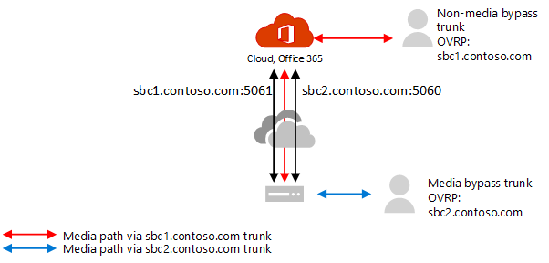

# Planifier le contournement de média avec un routage directPlan for media bypass with Direct Routing

## À propos de la dérivation média avec le routage directAbout media bypass with Direct Routing

La dérivation média vous permet de raccourcir le chemin d’accès au trafic de médias et de réduire le nombre de sauts en transit pour de meilleures performances.Media bypass enables you to shorten the path of media traffic and reduce the number of hops in transit for better performance. Avec la dérivation média, le média est conservé entre le contrôleur de bordure de session (SBC) et le client au lieu de l’envoyer via le système téléphonique Microsoft.With media bypass, media is kept between the Session Border Controller (SBC) and the client instead of sending it via the Microsoft Phone System. Pour configurer la dérivation média, le SBC et le client doivent se trouver dans le même emplacement ou réseau.To configure media bypass, the SBC and the client must be in the same location or network.

Vous pouvez contrôler la dérivation média pour chaque SBC à l’aide de la commande **Set-CSOnlinePSTNGateway** avec le paramètre **-MediaBypass** définie sur true ou false.You can control media bypass for each SBC by using the **Set-CSOnlinePSTNGateway** command with the **-MediaBypass** parameter set to true or false. Si vous activez la dérivation média, cela ne signifie pas que tout le trafic de médias restera au sein du réseau d’entreprise.If you enable media bypass, this does not mean that all media traffic will stay within the corporate network. Cet article décrit le flux d’appels dans différents scénarios.This article describes the call flow in different scenarios.    

Les diagrammes ci-dessous illustrent la différence de flux d’appels avec et sans contournement des médias.The diagrams below illustrate the difference in call flow with and without media bypass.

Sans contournement multimédia, lorsqu’un client effectue ou reçoit un appel, le trafic de signalisation et le flux de médias entre le SBC, le système téléphonique Microsoft et le client Teams, comme illustré dans le diagramme suivant :Without media bypass, when a client makes or receives a call, both signaling and media flow between the SBC, the Microsoft Phone System, and the Teams client, as shown in the following diagram:

> [!div class="mx-imgBorder"]
> 

Supposons toutefois qu’un utilisateur se trouve dans le même bâtiment ou le même réseau que le SBC.But let's assume that a user is in the same building or network as the SBC. Par exemple, supposons qu’un utilisateur se trouve dans un bâtiment dans Le Monde appelle un utilisateur PSTN :For example, assume a user who is in a building in Frankfurt makes a call to a PSTN user: 

- **Sans contournement** des médias, les médias circulent via Amsterdam ou Dublin (où les centres de données Microsoft sont déployés), puis reviennent au SBC dans Le Monde.**Without media bypass**, media will flow via either Amsterdam or Dublin (where Microsoft datacenters are deployed) and back to the SBC in Frankfurt. 

  Le centre de données en Europe est sélectionné, car le SBC est en Europe et Microsoft utilise le centre de données le plus proche du SBC.The datacenter in Europe is selected because the SBC is in Europe, and Microsoft uses the datacenter closest to the SBC. Bien que cette approche n’affecte pas la qualité des appels en raison de l’optimisation du flux de trafic au sein des réseaux Microsoft dans la plupart des régions, le trafic présente une boucle inutile.While this approach does not affect call quality due to optimization of traffic flow within Microsoft networks in most geographies, the traffic has an unnecessary loop.     

- **Avec la dérivation** média, les médias sont conservés directement entre l’utilisateur Teams et le SBC, comme illustré dans le diagramme suivant :**With media bypass**, the media is kept directly between the Teams user and the SBC as shown in the following diagram:

  > [!div class="mx-imgBorder"]
  > 

La dérivation multimédia s’appuie sur des protocoles appelés ice (Interactive Connectivity Connectivity Connectivité) sur le client Teams et ICE sur le SBC.Media bypass leverages protocols called Interactive Connectivity Establishment (ICE) on the Teams client and ICE lite on the SBC. Ces protocoles permettent au routage direct d’utiliser le chemin de médias le plus direct pour une qualité optimale.These protocols enable Direct Routing to use the most direct media path for optimal quality. ICE et ICE Lite sont des normes WebRTC.ICE and ICE Lite are WebRTC standards. Pour plus d’informations sur ces protocoles, voir RFC 5245.For detailed information about these protocols, see RFC 5245.

## Planification du flux d’appels et du pare-feuCall flow and firewall planning

La planification du flux d’appels et du pare-feu varie selon que l’utilisateur a un accès direct à l’adresse IP publique du SBC et si l’utilisateur est à l’intérieur ou à l’extérieur du réseau.Call flow and firewall planning depends on whether the user has direct access to the public IP address of the SBC, and whether the user is inside or outside of the network.

### Flux d’appels si l’utilisateur dispose d’un accès direct à l’adresse IP publique du SBCCall flow if the user has direct access to the public IP address of the SBC

Si l’utilisateur dispose d’un accès direct à l’adresse IP publique du SBC, le flux d’appels est le suivant :If the user has direct access to the public IP address of the SBC, the call flow is as follows:

- Pour la dérivation média, le client Teams doit avoir accès à l’adresse IP publique du SBC, même à partir d’un réseau interne.For media bypass, the Teams client must have access to the public IP address of the SBC even from an internal network. Si le média direct n’est pas souhaité, il peut être transmis via un relais de transport.If direct media is not desired, the media can flow via Transport Relays.

- Il s’agit de la solution recommandée lorsqu’un utilisateur se trouve dans le même bâtiment et/ou réseau que le SBC (supprimer les composants Microsoft Cloud du chemin de médias).This is the recommended solution when a user is in the same building and/or network as the SBC – remove Microsoft Cloud components from the media path.

- Les signaux circulent toujours via le cloud Microsoft.Signaling always flows via the Microsoft cloud.

Le diagramme suivant montre le flux d’appels lorsque la dérivation média est activée, que le client est interne et que le client peut accéder à l’adresse IP publique du support SBC :The following diagram shows call flow when media bypass is enabled, the client is internal, and the client can reach the public IP address of the SBC (direct media): 

- Les flèches et les valeurs numériques des chemins d’accès sont conformes aux flux [d’appels de Microsoft Teams.](https://docs.microsoft.com/microsoftteams/microsoft-teams-online-call-flows)The arrows and numeric values of the paths are in accordance with [Microsoft Teams call flows](https://docs.microsoft.com/microsoftteams/microsoft-teams-online-call-flows).

- Le trafic de signalisation SIP prend toujours les chemins 4 et 4' (selon le sens de trafic).The SIP signaling always takes paths 4 and 4' (depending on the direction of the traffic). Les médias restent locaux et prennent le chemin 5b.Media stays local and takes path 5b.

> [!div class="mx-imgBorder"]
> 

### Flux d’appels si l’utilisateur n’a pas accès à l’adresse IP publique du SBCCall flow if the user does not have access to the public IP address of the SBC

Le tableau suivant décrit le flux d’appels si l’utilisateur n’a pas accès à l’adresse IP publique du SBC.The following describes call flow if the user does not have access to the public IP address of the SBC. 

Par exemple, supposons que l’utilisateur soit externe et que l’administrateur client a décidé de ne pas ouvrir l’adresse IP publique du SBC à tous les utilisateurs d’Internet, mais uniquement au cloud Microsoft.For example, assume the user is external, and the tenant administrator decided not to open the public IP address of the SBC to everyone in the Internet, but only to the Microsoft Cloud. Les composants internes du trafic peuvent être acheminés via les relais de transport Teams.The internal components of traffic can flow via the Teams Transport Relays. Vous devez tenir compte des éléments suivants :Consider the following:

- Les relais de transport Teams sont utilisés.Teams Transport Relays are used.

- Pour la dérivation média, Microsoft utilise une version de relais de transport qui nécessite l’ouverture de ports 50 000 à 59 999 entre les relais de transport Teams et le SBC (à l’avenir, nous prévoyons de passer à la version qui nécessite uniquement 3478 et 3479 ports).For media bypass, Microsoft uses a version of Transport Relays that requires opening ports 50 000 to 59 999 between the Teams Transport Relays and the SBC (in the future we plan to move to the version which requires only 3478 and 3479 ports).

Le diagramme suivant illustre le flux d’appels lorsque la dérivation média est activée, que le client est externe et que le client ne peut pas accéder à l’adresse IP publique du contrôleur de session en bordure (les médias sont relayés par le relais de transport Teams).The following diagram shows call flow when media bypass is enabled, the client is external, and the client cannot reach the public IP address of the Session Border Controller (media is relayed by Teams Transport Relay).

- Les flèches et les valeurs numériques des chemins d’accès sont conformes aux flux [d’appels de Microsoft Teams.](https://docs.microsoft.com/microsoftteams/microsoft-teams-online-call-flows)The arrows and numeric values of the paths are in accordance with [Microsoft Teams call flows](https://docs.microsoft.com/microsoftteams/microsoft-teams-online-call-flows).

- Le média est relayé par les chemins d’accès 3, 3', 4 et 4'Media is relayed via paths 3, 3', 4 and 4'

> [!div class="mx-imgBorder"]
> 

### Flux d’appels si un utilisateur se trouve en dehors du réseau et a accès à l’adresse IP publique du SBCCall flow if a user is outside the network and has access to the public IP of the SBC

> [!NOTE]
> Cette configuration n’est pas recommandée, car elle ne prend pas en compte les relais de transport Teams.This is not a recommended configuration because it does not take advantage of Teams Transport Relays. Au lieu de cela, vous devez tenir compte du scénario précédent où l’utilisateur n’a pas accès à l’adresse IP publique du SBC.Instead, you should consider the previous scenario where the user does not have access to the public IP address of the SBC. 

Le diagramme suivant montre le flux d’appels lorsque la dérivation média est activée, que le client est externe et que le client peut atteindre l’adresse IP publique du support SBC.The following diagram shows call flow when media bypass is enabled, the client is external, and the client can reach the public IP address of the SBC (direct media).

- Les flèches et les valeurs numériques des chemins d’accès sont conformes à l’article sur les flux d’appels [de Microsoft Teams.](https://docs.microsoft.com/microsoftteams/microsoft-teams-online-call-flows)The arrows and numeric values of the paths are in accordance with the [Microsoft Teams call flows](https://docs.microsoft.com/microsoftteams/microsoft-teams-online-call-flows) article.

- Le trafic de signalisation SIP prend toujours les chemins 3 et 3' (selon le sens du trafic).The SIP signaling always takes paths 3 and 3' (depending on the direction of the traffic). Flux multimédias en utilisant le chemin d’accès 2.Media flows using path 2.

> [!div class="mx-imgBorder"]
> 

## Utilisation de processeurs multimédias et de relais de transportUse of Media Processors and Transport Relays

Microsoft Cloud peut utiliser deux composants dans le chemin d’accès du trafic de médias : Processeurs de média et Relais de transport.There are two components in the Microsoft Cloud that can be in the path of media traffic: Media Processors and Transport Relays. 

- Le processeur de média est un composant public qui gère les éléments multimédias dans les cas qui ne contournent pas et gère les médias pour les applications vocales.The Media Processor is a public facing component that handles media in non-bypass cases and handles media for voice applications.

   Les processeurs multimédias sont toujours dans le chemin pour les appels sans contournement de l’utilisateur final, mais jamais dans le chemin pour les appels contournements.Media Processors are always in the path for end user non-bypassed calls, but never in the path for bypassed calls. Les processeurs multimédias sont toujours dans le chemin d’accès de toutes les applications vocales, telles que le parc des appels, les Standard automatique de l’organisation et les files d’attente d’appels.Media Processors are always in the path for all voice applications such as Call Park, Organizational Auto Attendant, and Call Queues.

- Le relais de transport est utilisé pour se connecter au service de transport le plus proche pour envoyer le trafic en temps réel.The Transport Relay is used to connect to the closest Transport Service to send real time traffic.

   Les relais de transport peuvent ou non se trouver dans le chemin d’accès des appels contournements (provenant ou destinés à des utilisateurs finaux), selon l’endroit où se trouve l’utilisateur et la manière dont le réseau est configuré.Transport Relays might or might not be in the path for bypassed calls--originating from or destined to end users--depending on where the user is and how the network is configured .

Le diagramme suivant montre deux flux d’appels : un avec la dérivation média activée et la seconde avec la dérivation média désactivée.The following diagram shows two call flows – one with media bypass enabled and the second with media bypass disabled. Notez que le diagramme illustre uniquement le trafic provenant d’utilisateurs - ou destinés à des utilisateurs finaux.Note the diagram only illustrates traffic originating from--or destined to--end users.  
- Le contrôleur de média est un microservice dans Azure qui attribue des processeurs multimédias et crée des offres SDP (Session Description Protocol).The Media Controller is a microservice in Azure that assigns Media Processors and creates Session Description Protocol (SDP) offers.

- Le proxy SIP est un composant qui traduit le signalisation HTTP REST utilisé dans Teams en SIP.The SIP Proxy is a component that translates HTTP REST signaling used in Teams to SIP.    

> [!div class="mx-imgBorder"]
> 

Le tableau ci-dessous résume la différence entre les processeurs de média et les relais de transport.The table below summarizes the difference between Media Processors and Transport Relays.

|    | Processeurs multimédiasMedia Processors | Relais de transportTransport Relays|
| :--------------|:---------------|:------------|
Chemin de médias pour les appels non contournements pour les utilisateurs finauxIn media path for non-bypassed calls for end users | ToujoursAlways | Si le client ne parviennent pas à joindre le processeur de média directementIf client cannot reach the Media Processor directly | 
Dans le chemin de médias pour les appels contournements pour les utilisateurs finauxIn media path for bypassed calls for end users | JamaisNever | Si le client ne peut pas accéder au SBC sur l’adresse IP publiqueIf client cannot reach the SBC on the public IP address | 
Dans le chemin multimédia des applications vocalesIn media path for voice applications | ToujoursAlways | JamaisNever | 
Can do transcoding (B2BUA)\*Can do transcoding (B2BUA)\* | OuiYes | Non, seul l’audio est relayé entre les points de terminaisonNo, only relays audio between endpoints | 
Nombre d’instances dans le monde et emplacementNumber of instances worldwide and location | 10 total : 2 dans la région Est et Ouest des États-Unis ; 2 à Amsterdam et Dublin ; 2 à Hong Kong et Singapour ; 2 au Japon ; 2 en Australie de l’Est et du Sud-est10 total: 2 in US East and West; 2 in Amsterdam and Dublin; 2 in Hong Kong and Singapore; 2 in Japan ; 2 in Australia East and Southeast | MultipleMultiple

Les plages d’adresses IP sont les plus diverses :The IP ranges are:
- 52.112.0.0/14 (adresses IP de 52.112.0.1 à 52.115.255.254)52.112.0.0/14 (IP addresses from 52.112.0.1 to 52.115.255.254)
- 52.120.0.0/14 (adresses IP de 52.120.0.1 à 52.123.255.254)52.120.0.0/14 (IP addresses from 52.120.0.1 to 52.123.255.254)

\* Explication de la transcodage :\* Transcoding explanation: 

- Le processeur multimédia est B2BUA, ce qui signifie qu’il peut changer un codec (par exemple, SILK du client Teams en MP et G.711 entre MP et SBC).Media Processor is B2BUA, which means it can change a codecs (for example, SILK from Teams client to MP and G.711 between MP and SBC).

- Les relais de transport ne sont pas B2BUA, ce qui signifie que le codec n’est jamais modifié entre le client et le SBC, même si le trafic est acheminé par relais.Transport Relays are not B2BUA, which means the codec is never changed between the client and the SBC--even if traffic flows via relays.

### Utilisation de processeurs multimédias Teams si la ligne est configurée pour la dérivation médiaUse of Teams Media Processors if trunk is configured for media bypass

Les processeurs multimédias Teams sont toujours insérés dans le chemin de médias dans les scénarios suivants :Teams Media Processors are always inserted in the media path in the following scenarios:

- L’appel est recalé de 1:1 à un appel de groupeCall is escalated from 1:1 to a group call
- L’appel va être reçu par un utilisateur fédéré de TeamsCall is going to a federated Teams user
- L’appel est transféré à un utilisateur Skype EntrepriseCall is forwarded or transferred to a Skype for Business user

Assurez-vous que votre SBC a accès aux plages Processeurs de média et Relais de transport, comme décrit ci-dessous.Ensure your SBC has access to the Media Processors and Transport Relays ranges as described below.    

## Signalisation SIP : FQDNSIP Signaling: FQDNs

Pour le signalisation SIP, les exigences de nom de passe (FQDN) et de pare-feu sont identiques à ceux des cas non contourné.For SIP signaling, the FQDN and firewall requirements are the same as for non-bypassed cases. 

Le routage direct est proposé dans les environnements Microsoft 365 ou Office 365 suivants :Direct Routing is offered in the following Microsoft 365 or Office 365 environments:
- Microsoft 365 ou Office 365Microsoft 365 or Office 365
- Office 365 GCCOffice 365 GCC
- Office 365 GCC HighOffice 365 GCC High
- Office 365 DoD En savoir plus sur les [environnements Office 365](https://docs.microsoft.com/office365/servicedescriptions/office-365-platform-service-description/office-365-us-government/office-365-us-government) et us Government, tels que GCC, GCC High et DoD.Office 365 DoD Learn more about [Office 365 and US Government environments](https://docs.microsoft.com/office365/servicedescriptions/office-365-platform-service-description/office-365-us-government/office-365-us-government) such as GCC, GCC High, and DoD.

### Environnements Microsoft 365, Office 365 et GCC Office 365Microsoft 365, Office 365, and Office 365 GCC environments

Les points de connexion pour le routage direct sont les trois FQDN suivants :The connection points for Direct Routing are the following three FQDNs:

- **sip.pstnhub.microsoft.com** , vous devez d’abord essayer le FQDN global.**sip.pstnhub.microsoft.com** – Global FQDN – must be tried first. Lorsque le SBC envoie une demande de résolution de ce nom, les serveurs DNS Microsoft Azure renvoient une adresse IP pointant vers le centre de données Azure principal affecté au SBC.When the SBC sends a request to resolve this name, the Microsoft Azure DNS servers return an IP address pointing to the primary Azure datacenter assigned to the SBC. L’affectation est basée sur les mesures de performance des centres de données et la proximité géographique par rapport au SBC.The assignment is based on performance metrics of the datacenters and geographical proximity to the SBC. L’adresse IP renvoyée correspond au FQDN principal.The IP address returned corresponds to the primary FQDN.

- **sip2.pstnhub.microsoft.com** (FQDN secondaire) géographiquement à la région de deuxième priorité.**sip2.pstnhub.microsoft.com** – Secondary FQDN – geographically maps to the second priority region.

- **sip3.pstnhub.microsoft.com** – FQDN de l’situation géographique de la troisième région.**sip3.pstnhub.microsoft.com** – Tertiary FQDN – geographically maps to the third priority region.

Vous devez placer ces trois FQDN pour :You must place these three FQDNs in order to:

- Offrez une expérience optimale (moins chargé et le plus proche du centre de données SBC attribué en interrogeant le premier FQDN).Provide optimal experience (less loaded and closest to the SBC datacenter assigned by querying the first FQDN).

- Offrez un échec lorsqu’une connexion à partir d’un SBC est établie vers un centre de données qui rencontre un problème temporaire.Provide failover when a connection from an SBC is established to a datacenter that is experiencing a temporary issue. Pour plus d’informations, voir le mécanisme deover ci-dessous.For more information, see Failover mechanism below.

Les noms de **sip.pstnhub.microsoft.com,** **sip2.pstnhub.microsoft.com** et sip3.pstnhub.microsoft.com sont  résolus avec l’une des adresses IP suivantes :The FQDNs **sip.pstnhub.microsoft.com**, **sip2.pstnhub.microsoft.com**, and **sip3.pstnhub.microsoft.com** will be resolved to one of the following IP addresses:
- 52.114.148.052.114.148.0
- 52.114.132.4652.114.132.46
- 52.114.16.7452.114.16.74
- 52.114.20.2952.114.20.29
- 52.114.75.2452.114.75.24
- 52.114.76.7652.114.76.76
- 52.114.7.2452.114.7.24
- 52.114.14.7052.114.14.70

Vous devez ouvrir des ports pour toutes ces adresses IP dans votre pare-feu pour autoriser le trafic entrant et sortant à se rendre ou à partir des adresses pour le trafic de signalisation.You need to open ports for all these IP addresses in your firewall to allow incoming and outgoing traffic to and from the addresses for signaling. Si votre pare-feu prend en charge les noms DNS, le nom de domaine sip-all.pstnhub.microsoft.com **est** résolu pour toutes ces adresses IP.If your firewall supports DNS names, the FQDN **sip-all.pstnhub.microsoft.com** resolves to all these IP addresses. 

### Environnement Office 365 GCC DoDOffice 365 GCC DoD environment

Le point de connexion pour le routage direct est le FQDN suivant :The connection point for Direct Routing is the following FQDN:

**sip.pstnhub.dod.teams.microsoft.us** – FQDN global.**sip.pstnhub.dod.teams.microsoft.us** – Global FQDN. Étant donné que l’environnement Office 365 DoD existe uniquement dans les centres de données américains, il n’existe aucun nom de fQDN secondaire et secondaire.As the Office 365 DoD environment exists only in the US data centers, there is no secondary and tertiary FQDNs.

Les noms de noms de sip.pstnhub.dod.teams.microsoft.us seront résolus à l’une des adresses IP suivantes :The FQDNs – sip.pstnhub.dod.teams.microsoft.us will be resolved to one of the following IP addresses:

- 52.127.64.3352.127.64.33
- 52.127.68.3452.127.68.34

Vous devez ouvrir des ports pour toutes ces adresses IP dans votre pare-feu pour autoriser le trafic entrant et sortant à se rendre ou à partir des adresses pour le trafic de signalisation.You need to open ports for all these IP addresses in your firewall to allow incoming and outgoing traffic to and from the addresses for signaling.  Si votre pare-feu prend en charge les noms DNS, le nom de domaine sip.pstnhub.dod.teams.microsoft.us est résolu pour toutes ces adresses IP.If your firewall supports DNS names, the FQDN  sip.pstnhub.dod.teams.microsoft.us resolves to all these IP addresses. 

### Environnement Office 365 GCC HighOffice 365 GCC High environment

Le point de connexion pour le routage direct est le FQDN suivant :The connection point for Direct Routing is the following FQDN:

**sip.pstnhub.gov.teams.microsoft.us** – FQDN global.**sip.pstnhub.gov.teams.microsoft.us** – Global FQDN. Étant donné que l’environnement GCC High existe uniquement dans les centres de données américains, il n’existe aucun nom de fQDN secondaire et secondaire secondaire.As the GCC High environment exists only in the US data centers, there is no secondary and tertiary FQDNs.

Les noms de noms de sip.pstnhub.gov.teams.microsoft.us seront résolus à l’une des adresses IP suivantes :The FQDNs – sip.pstnhub.gov.teams.microsoft.us will be resolved to one of the following IP addresses:

- 52.127.88.5952.127.88.59
- 52.127.92.6452.127.92.64

Vous devez ouvrir des ports pour toutes ces adresses IP dans votre pare-feu pour autoriser le trafic entrant et sortant à se rendre ou à partir des adresses pour le trafic de signalisation.You need to open ports for all these IP addresses in your firewall to allow incoming and outgoing traffic to and from the addresses for signaling.  Si votre pare-feu prend en charge les noms DNS, le nom de domaine sip.pstnhub.gov.teams.microsoft.us est résolu pour toutes ces adresses IP.If your firewall supports DNS names, the FQDN  sip.pstnhub.gov.teams.microsoft.us resolves to all these IP addresses. 

## Signalisation SIP : portsSIP Signaling: Ports

La demande de port est la même pour tous les environnements Office 365 pour lequel un routage direct est proposé :Port requirements are the same for all Office 365 environments where Direct Routing is offered:
- Microsoft 365 ou Office 365Microsoft 365 or Office 365
- Office 365 GCCOffice 365 GCC
- Office 365 GCC HighOffice 365 GCC High
- Office 365 DoDOffice 365 DoD

Vous devez utiliser les ports suivants :You must use the following ports:

| TraficTraffic | DeFrom | ÀTo | Port sourceSource port | Port de destinationDestination port|
| :-------- | :-------- |:-----------|:--------|:---------|
SIP/TLSSIP/TLS| SIP ProxySIP Proxy | SBCSBC | 1024 - 655351024 - 65535 | Défini sur le SBCDefined on the SBC |
| SIP/TLSSIP/TLS | SBCSBC | SIP ProxySIP Proxy | Défini sur le SBCDefined on the SBC | 50615061 |

## Trafic de médias : ip et plages de portsMedia traffic: IP and Port ranges

Le trafic de médias circule entre le client SBC et le client Teams si une connectivité directe est disponible ou via des relais de transport Teams si le client ne peut pas accéder au SBC à l’aide de l’adresse IP publique.Media traffic flows between the SBC and Teams client if direct connectivity is available or via Teams Transport Relays if the client cannot reach the SBC using the public IP address.

### Conditions requises pour le trafic multimédia direct (entre le client Teams et le SBC)Requirements for direct media traffic (between the Teams client and the SBC) 

Le client doit avoir accès aux ports spécifiés (voir tableau) sur l’adresse IP publique du SBC.The client must have access to the specified ports (see table) on the public IP address of the SBC. 

Remarque : si le client se trouve dans un réseau interne, le média est flux vers l’adresse IP publique du SBC.Note: If the client is in an internal network, the media flows to the public IP address of the SBC. Vous pouvez configurer l’épinglage de cheveux sur votre appareil NAT afin que le trafic ne quitte jamais l’équipement réseau d’entreprise.You can configure hair pinning on your NAT device so traffic never leaves the enterprise network equipment.

| TraficTraffic | DeFrom | ÀTo | Port sourceSource port | Port de destinationDestination port|
| :-------- | :-------- |:-----------|:--------|:---------|
UDP/SRTPUDP/SRTP | ClientClient | SBCSBC | 50 000 – 50 01950 000 – 50 019  | Défini sur le SBCDefined on the SBC |
| UDP/SRTPUDP/SRTP | SBCSBC | ClientClient | Défini sur le SBCDefined on the SBC | 50 000 – 50 01950 000 – 50 019  |

> [!NOTE]
> Si votre périphérique réseau traduit les ports sources du client, assurez-vous que les ports traduits sont ouverts entre l’équipement réseau et le SBC.If you have a network device that translates the client's source ports, please make sure that translated ports are opened between the network equipment and the SBC. 

### Conditions requises pour l’utilisation de relais de transportRequirements for using Transport Relays

Les relais de transport sont dans la même plage que les processeurs multimédias (pour les cas sans contournement) :Transport Relays are in the same range as Media Processors (for non-bypass cases): 

### Environnements Microsoft 365, Office 365 et GCC Office 365Microsoft 365, Office 365, and Office 365 GCC environments

- 52.112.0.0 /14 (adresses IP de 52.112.0.1 à 52.115.255.254)52.112.0.0 /14 (IP addresses from 52.112.0.1 to 52.115.255.254)

## Environnement Office 365 GCC DoDOffice 365 GCC DoD environment

- 52.127.64.0/2152.127.64.0/21

### Environnement Office 365 GCC HighOffice 365 GCC High environment

- 52.127.88.0/2152.127.88.0/21

La plage de ports des relais de transport Teams (applicable à tous les environnements) est indiquée dans le tableau suivant :The port range of the Teams Transport Relays (applicable to all environments) is shown in the following table:

| TraficTraffic | DeFrom | ÀTo | Port sourceSource port | Port de destinationDestination port|
| :-------- | :-------- |:-----------|:--------|:---------|
UDP/SRTPUDP/SRTP | Relais de transportTransport Relay | SBCSBC | 50 000 -59 99950 000 -59 999    | Défini sur le SBCDefined on the SBC |
| UDP/SRTPUDP/SRTP | SBCSBC | Relais de transportTransport Relay | Défini sur le SBCDefined on the SBC | 50 000 – 59 999, 3478, 347950 000 – 59 999, 3478, 3479     |

> [!NOTE]
> Microsoft recommande au moins deux ports par appel simultané sur le SBC.Microsoft recommends at least two ports per concurrent call on the SBC. Étant donné que Microsoft dispose de deux versions de relais de transport, les suivantes sont requises :Because Microsoft has two versions of Transport Relays, the following are required:
> 
> - v4, qui ne peut fonctionner qu’avec la plage de ports 50 000 à 59 999v4, which can only work with port range 50 000 to 59 999
> 
> - v6, qui fonctionne avec les ports 3478, 3479v6, which works with ports 3478, 3479

Pour l’instant, la dérivation média ne prend en charge que la version v4 des relais de transport.At this time, media bypass only supports v4 version of Transport Relays. Nous introduirons la prise en charge de la v6 à l’avenir.We will introduce support of v6 in the future. 

Vous devez ouvrir les ports 3478 et 3479 pour la transition.You need to open ports 3478 and 3479 for transitioning. Lorsque Microsoft introduit la prise en charge des relais de transport v6 avec la dérivation média, vous n’avez pas besoin de reconfigurer votre équipement réseau ou SBCS.When Microsoft introduces support for v6 Transport Relays with Media Bypass, you will not need to reconfigure your network equipment or SBCs. 

### Exigences pour l’utilisation de processeurs multimédiasRequirements for using media processors

Les processeurs multimédias sont toujours dans le chemin de médias des applications vocales et des clients Web (par exemple, les clients Teams dans Edge ou Google Chrome).Media Processors are always in the media path for voice applications and for Web clients (for example, Teams clients in Edge or Google Chrome). La configuration requise est la même que pour une configuration sans contournement.The requirements are the same as for non-bypass configuration.

La plage IP du trafic de médias estThe IP range for media traffic is 

### Environnements Office 365 et GCC Office 365Office 365 and Office 365 GCC environments

- 52.112.0.0 /14 (adresses IP de 52.112.0.1 à 52.115.255.254)52.112.0.0 /14 (IP addresses from 52.112.0.1 to 52.115.255.254)

## Environnement Office 365 GCC DoDOffice 365 GCC DoD environment

- 52.127.64.0/2152.127.64.0/21

### Environnement Office 365 GCC HighOffice 365 GCC High environment

- 52.127.88.0/2152.127.88.0/21

La plage de ports des processeurs multimédias (applicable à tous les environnements) est indiquée dans le tableau suivant :The port range of the Media Processors (applicable to all environments) is shown in the following table:

| TraficTraffic | DeFrom | ÀTo | Port sourceSource port | Port de destinationDestination port|
| :-------- | :-------- |:-----------|:--------|:---------|
UDP/SRTPUDP/SRTP | Processeur multimédiaMedia Processor | SBCSBC | 3478, 3479 et 49 152 – 53 2473478, 3479 and 49 152 – 53 247    | Défini sur le SBCDefined on the SBC |
| UDP/SRTPUDP/SRTP | SBCSBC | Processeur multimédiaMedia Processor | Défini sur le SBCDefined on the SBC | 3478, 3479 et 49 152 – 53 2473478, 3479 and 49 152 – 53 247     |

## Configurer des ligne distinctes pour la dérivation média et la dérivation non multimédiaConfigure separate trunks for media bypass and non-media bypass  

Si vous migrez vers la dérivation média à partir d’une dérivation non multimédia et souhaitez confirmer la fonctionnalité avant de migrer toute utilisation vers la dérivation média, vous pouvez créer une ligne distincte et une stratégie de routage vocale en ligne distinctes pour router vers la ligne de dérivation média et affecter à des utilisateurs spécifiques.If you are migrating to media bypass from non-media bypass and want to confirm functionality before migrating all usage to media bypass, you can create a separate trunk and separate Online Voice Routing policy to route to the media bypass trunk and assign to specific users. 

Étapes de configuration générales :High-level configuration steps:

- Identifiez les utilisateurs qui testent la dérivation média.Identify users to test media bypass.

- Créez deux ligne distinctes avec différents FQDN : l’une activée pour la dérivation média ; l’autre non.Create two separate trunks with different FQDNs: one enabled for media bypass; the other not. 

  Les deux ligne pointent vers le même SBC.Both trunks point to the same SBC. Les ports de signalisation SIP du TLS doivent être différents.The ports for TLS SIP signaling must be different. Les ports pour les médias doivent être identiques.The ports for media must be the same.

- Créez une stratégie de routage voix en ligne et affectez la ligne de dérivation média aux itinéraires correspondants à l’utilisation PSTN pour cette stratégie.Create a new Online Voice Routing policy and assign the media bypass trunk to the corresponding routes associated with the PSTN usage for this policy.

- Affectez la nouvelle stratégie de routage voix en ligne aux utilisateurs que vous avez identifiés pour tester la dérivation média.Assign the new Online Voice Routing policy to users you have identified to test media bypass.

L’exemple ci-dessous illustre cette logique.The example below illustrates this logic.

| Ensemble d’utilisateursSet of users | Nombre d’utilisateursNumber of users | Trunk FQDN assigned in OVRPTrunk FQDN assigned in OVRP | Contournement multimédia activéMedia bypass enabled |
| :------------ |:----------------- |:--------------|:--------------|
Utilisateurs avec ligne de contournement non multimédiaUsers with non-media bypass trunk | 980980 | sbc1.contoso.com:5060sbc1.contoso.com:5060 | truetrue
Utilisateurs avec ligne de dérivation médiaUsers with media bypass trunk | 2020 | sbc2.contoso.com:5061sbc2.contoso.com:5061 | falsefalse | 

Les deux ligne peuvent pointer vers le même SBC avec la même adresse IP publique.Both trunks can point to the same SBC with the same public IP address. Les ports de signalisation TLS sur le SBC doivent être différents, comme illustré dans le diagramme suivant.The TLS signaling ports on the SBC must be different, as shown in the following diagram. Notez que vous devez vous assurer que votre certificat prend en charge les deux ligne.Note you will need to make sure that your certificate supports both trunks. En san san, vous devez avoir deux noms **(sbc1.contoso.com** et **sbc2.contoso.com**) ou avoir un certificat générique.In SAN, you need to have two names (**sbc1.contoso.com** and **sbc2.contoso.com**) or have a wildcard certificate.

> [!div class="mx-imgBorder"]
> 

Pour plus d’informations sur la configuration de deux ligne sur le même SBC, consultez la documentation fournie par votre fournisseur SBC :For information about how to configure two trunks on the same SBC, see the documentation provided by your SBC vendor:

 - [Documentation sur le déploiement de AudioCodesAudioCodes deployment documentation](https://www.audiocodes.com/solutions-products/products/products-for-microsoft-365/direct-routing-for-microsoft-teams)
- [Documentation sur le déploiement d’OracleOracle deployment documentation](https://www.oracle.com/industries/communications/enterprise-session-border-controller/microsoft.html)
- [Documentation de déploiement de Communications du rubanRibbon Communications deployment documentation](https://ribboncommunications.com/solutions/enterprise-solutions/microsoft-solutions/direct-routing-microsoft-teams-calling)
- [Documentation sur le déploiement des systèmes TE (anynode)TE-Systems (anynode) deployment documentation](https://www.anynode.de/anynode-and-microsoft-teams/)

## Points de terminaison clients pris en charge avec la dérivation médiaClient endpoints supported with media bypass

La dérivation média est prise en charge avec tous les clients de bureau Teams autonomes, les clients Android et iOS et les appareils Teams Phone.Media bypass is supported with all standalone Teams Desktop clients, Android and iOS clients and Teams Phone Devices. 

Pour tous les autres points de terminaison qui ne supportent pas la dérivation média, nous convertirons l’appel en appel sans contournement, même s’il a été démarré en tant qu’appel de contournement.For all other endpoints that do not support media bypass, we will convert the call to non-bypass even if it started as a bypass call. Cette situation se produit automatiquement et ne nécessite aucune action de l’administrateur.This happens automatically and does not require any actions from the administrator. Cela inclut les téléphones 3PIP Skype Entreprise et les clients Web Teams qui supportent l’appel de routage direct (clients WebRTC s’exécutant sur Microsoft Edge, Google Chrome, Mozilla Firefox).This includes Skype for Business 3PIP Phones, and Teams Web Clients that support Direct Routing calling (WebRTC based clients running on Microsoft Edge, Google Chrome, Mozilla Firefox). 
 
## Voir aussiSee also

[Configurer le contournement de média avec un routage directConfigure media bypass with Direct Routing](direct-routing-configure-media-bypass.md)

