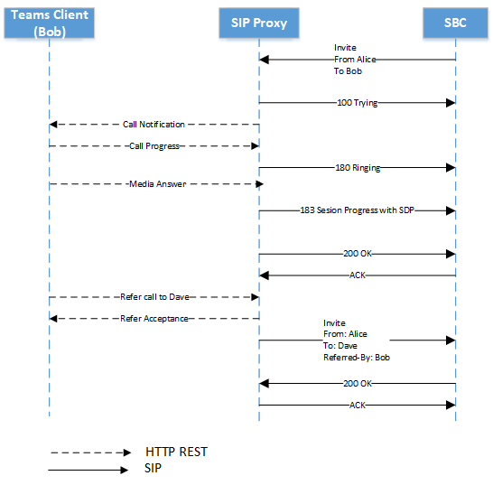

# <a name="direct-routing---sip-protocol"></a>Routage direct - Protocole SIP

Cet article décrit la façon dont le routage direct implémente le protocole SIP (Session Initiation Protocol). Pour router correctement le trafic entre un contrôleur de bordure de session (SBC) et le proxy SIP, certains paramètres SIP doivent avoir des valeurs spécifiques. Cet article est destiné aux administrateurs vocaux chargés de configurer la connexion entre le serveur SBC local et le service proxy SIP.

## <a name="processing-the-incoming-request-finding-the-tenant-and-user"></a>Traitement de la demande entrante : recherche du client et de l’utilisateur

Avant qu’un appel entrant ou sortant puisse être traitée, les messages OPTIONS sont échangés entre le proxy SIP et le SBC. Ces messages OPTIONS permettent au proxy SIP de fournir les fonctionnalités autorisées à SBC. Il est important que la négociation OPTIONS soit aboutir (réponse à la demande de 200OK), ce qui permet de communiquer davantage entre SBC et le proxy SIP pour l’établissement d’appels. Les en-têtes SIP dans les messages OPTIONS de proxy SIP sont fournis à titre d’exemple ci-dessous :

| Nom du paramètre | Exemple de valeur | 
| :---------------------  |:---------------------- |
| Request-URI | OPTIONS sip:sip.pstnhub.microsoft.com:5061 SIP /2.0 |
| Via en-tête | Via : SIP/2.0/TLS sbc1.adatum.biz:5058;alias;branch=z9hG4bKac2121518978 | 
| Max-Forwards-tête | Max-Forwards:68 |
| À partir de l’en-tête | À partir de l’en-tête de : <sip:sbc1.adatum.biz:5058> |
| À l’en-tête | À: <sip:sip.pstnhub.microsoft.com:5061> |
| En-tête CSeq | CSeq : 1 INVITATION | 
| En-tête de contact | Contact : <sip:sbc1.adatum.biz:50588;transport=tls> |

> [!NOTE]
> Les en-têtes SIP ne contiennent pas d’info-utilisateur dans l’URI SIP en cours d’utilisation. Selon la [RFC 3261, section 19.1.1](https://tools.ietf.org/html/rfc3261#section-19.1.1), la partie userinfo d’une URI est facultative et PEUT être absente lorsque l’hôte de destination ne notionne pas les utilisateurs ou lorsque le serveur proprement dit est la ressource identifiée. Si le signe @ est présent dans une URI SIP, le champ de l’utilisateur ne doit PAS être vide.
> Veuillez noter que l’URI SIPS ne doit pas être utilisée avec le routage direct, car il n’est pas pris en charge.
> Vérifiez la configuration de votre contrôleur de session border controller et vérifiez que vous n’utilisez pas d’en-têtes « Remplace » dans les demandes SIP. Le routage direct rejetera les demandes SIP dont l’en-tête remplace les en-têtes définis.

Lors d’un appel entrant, le proxy SIP doit trouver le client vers lequel l’appel est destiné et trouver l’utilisateur spécifique au sein de ce client. L’administrateur client peut configurer des numéros non DID, par exemple +1001, dans plusieurs locataires. Par conséquent, il est important de trouver le client sur lequel effectuer la recherche de numéro, car les numéros non DID peuvent être identiques dans plusieurs organisations Microsoft 365 ou Office 365 client.  

Cette section décrit comment le proxy SIP trouve le client et l’utilisateur, et effectue l’authentification du SBC sur la connexion entrante.

Voici un exemple de message d’invitation SIP lors d’un appel entrant :

| Nom du paramètre | Exemple de valeur | 
| :---------------------  |:---------------------- |
| Request-URI | INVITE sip:+18338006777@sip.pstnhub.microsoft.com SIP /2.0 |
| Via en-tête | Via : SIP/2.0/TLS sbc1.adatum.biz:5058;alias;branch=z9hG4bKac2121518978 | 
| Max-Forwards-tête | Max-Forwards:68 |
| À partir de l’en-tête | À partir de l’en-tête de : <sip:+17168712781@sbc1.adatum.biz;transport=udp;tag=1c747237679 |
| À l’en-tête | Pour : sip:+183338006777@sbc1.adatum.biz | 
| En-tête CSeq | CSeq : 1 INVITATION | 
| En-tête de contact | Contact : <sip : 68712781@sbc1.adatum.biz:5058;transport=tls> | 

À la réception de l’invitation, le proxy SIP effectue les étapes suivantes :

1. Vérifiez le certificat. Sur la connexion initiale, le service de routage direct prend le nom de nom de domaine complet présenté dans l’en-tête Contact et le fait correspond au nom commun ou au nom de remplacement d’objet du certificat présenté. Le nom SBC doit correspondre à l’une des options suivantes :

   - Option 1. Le nom complet du nom de domaine complet présenté dans l’en-tête Contact doit correspondre au nom commun/au nom de remplacement de l’objet du certificat présenté.  

   - Option 2. La partie domaine du nom de domaine complet présenté dans l’en-tête de contact (par exemple adatum.biz du sbc1.adatum.biz de nom de domaine complet) doit correspondre à la valeur générique dans Nom commun/Nom de remplacement d’objet (par exemple *.adatum.biz).

2. Essayez de trouver un client en utilisant le nom complet de nom de domaine complet présenté dans l’en-tête Contact.  

   Vérifiez si le nom de nom de domaine complet dans l’en-tête de contact (sbc1.adatum.biz) est inscrit en tant que nom DNS dans une Microsoft 365 ou Office 365 organisation. Si cette recherche est trouvée, la recherche de l’utilisateur est effectuée dans le client sur qui le nom de domaine complet SBC est enregistré en tant que nom de domaine. Si cette dernière n’est pas trouvée, l’étape 3 s’applique.   

3. L’étape 3 s’applique uniquement si l’étape 2 a échoué. 

   Supprimez la partie hôte du nom de domaine complet (FQDN) présenté dans l’en-tête du contact (nom de domaine complet : sbc12.adatum.biz, après avoir supprimé la partie hôte : adatum.biz), et vérifiez si ce nom est inscrit en tant que nom DNS dans une organisation Microsoft 365 ou Office 365. Si elle est trouvée, la recherche d’utilisateur est effectuée dans ce client. Si l’appel est in found, l’appel échoue.

4. En utilisant le numéro de téléphone présenté dans l’URI-demande, effectuez la recherche inversée de numéro au sein du client trouvé à l’étape 2 ou 3. Faire correspondre le numéro de téléphone présenté à l’URI SIP de l’utilisateur au sein du client trouvée à l’étape précédente.

5. Appliquer les paramètres de ligne. Recherchez les paramètres définies par l’administrateur client pour ce SBC.

   Microsoft ne prend pas en charge la création d’un proxy SIP tiers ou d’un serveur agent utilisateur entre le proxy SIP Microsoft et le jeu SBC couplé, ce qui peut modifier l’URI de demande créée par le SBC couplé.

   Les exigences pour les deux recherche (étapes 2 et 3) nécessaires au scénario d’interconnexion d’un SBC à plusieurs clients (scénario d’opérateur) sont couvertes plus loin dans cet article.

### <a name="detailed-requirements-for-contact-header-and-request-uri"></a>Conditions requises détaillées pour l’en-tête de contact et l’URI de demande

#### <a name="contact-header"></a>En-tête de contact

Pour tous les messages SIP entrants (OPTIONS, INVITER) au proxy SIP Microsoft, l’en-tête de contact doit avoir le nom de fQDN SBC couplé dans le nom d’hôte URI comme suit :

Syntaxe : Contact : <sip:phone ou sip address@FQDN of the SBC;transport=tls> 

Comme le [dit le RFC 3261, section 11.1](https://tools.ietf.org/html/rfc3261#section-11.1), un champ d’en-tête de contact peut être présent dans un message OPTIONS. Dans Routage direct, l’en-tête du contact est obligatoire. Pour les messages INVITER au format ci-dessus, pour les messages d’options, le info-utilisateur peut être supprimé de l’URI SIP et uniquement des FQDN envoyés au format suivant :

Syntaxe : Contact : <:FQDN du SBC;transport=tls>

Ce nom (FQDN) doit également se trouver dans le ou les champs Nom commun ou Autre objet du certificat présenté. Microsoft prend en charge l’utilisation de valeurs génériques des noms dans les champs Nom commun ou Nom de remplacement de l’objet du certificat.   

La prise en charge des caractères génériques est décrite dans [la rubrique RFC 2818, section 3.1](https://tools.ietf.org/html/rfc2818#section-3.1). Plus précisément :

*« Les noms peuvent contenir le caractère générique \* , qui est considéré comme correspondre à n’importe quel composant de nom de domaine ou fragment de composant unique. Par exemple, \*.a.com fait la correspondance foo.a.com mais pas bar.foo.a.com. f.com\* correspond à foo.com mais pas bar.com ».*

Si lebc envoie plusieurs valeurs dans l’en-tête Contact présenté dans un message SIP, seule la partie FQDN de la première valeur de l’en-tête de contact est utilisée.

En règle générale, pour le routage direct, il est important que le nom de nom deqdN soit utilisé pour remplir l’URI SIP au lieu de l’adresse IP. Un message INVITATION ou OPTIONS entrant au proxy SIP avec en-tête Contact dans lequel le nom d’hôte est représenté par IP et non FQDN, la connexion sera refusée avec l’option 403 Interdit.

#### <a name="request-uri"></a>Request-URI 

Pour tous les appels entrants, l’URI de demande est utilisée pour faire correspondre le numéro de téléphone à un utilisateur.   

Pour l’instant, le numéro de téléphone doit contenir un signe plus (+), comme illustré dans l’exemple suivant. 

```console
INVITE sip:+18338006777@sip.pstnhub.microsoft.com SIP /2.0
```
#### <a name="from-header"></a>À partir de l’en-tête

Pour tous les appels entrants, l’en-tête de l’appelant sert à faire correspondre le numéro de téléphone de l’appelant avec la liste des numéros de téléphone bloqués de l’appelant.

Le numéro de téléphone doit contenir un + comme illustré dans l’exemple suivant.

```console
From: <sip:+17168712781@sbc1.adatum.biz;transport=udp;tag=1c747237679
```

## <a name="contact-and-record-route-headers-considerations"></a>Considérations en Record-Route en-têtes de contacts et de contacts

Le proxy SIP doit calculer le prochain saut de FQDN pour les nouvelles transactions client de boîte de dialogue (par exemple Bye ou Re-Invite) et lors de la réponse aux options SIP. Les contacts ou les Record-Route sont utilisés. 

D’après le [RFC 3261, section 8.1.1.8](https://tools.ietf.org/html/rfc3261#section-8.1.1.8), l’en-tête de contact est requis dans toute demande qui peut entraîner une nouvelle boîte de dialogue. La Record-Route n’est nécessaire que si un proxy souhaite rester sur le chemin des demandes futures dans une boîte de dialogue. Si un SBC proxy est utilisé avec l’optimisation des médias locaux pour le [routage](./direct-routing-media-optimization.md) direct, un itinéraire d’enregistrement doit être configuré comme serveur proxy pour rester sur l’itinéraire. 

Microsoft recommande d’utiliser uniquement l’en-tête de contact si un SBC proxy n’est pas utilisé :

- Selon le [RFC 3261, section 20.30](https://tools.ietf.org/html/rfc3261#section-20.30), Record-Route est utilisé si un proxy souhaite rester sur le chemin des demandes futures dans une boîte de dialogue, ce qui n’est pas indispensable si aucun serveur SBC proxy n’est configuré, car tout le trafic passe entre le proxy SIP Microsoft et le SBC couplé. 

- Le proxy SIP Microsoft utilise uniquement l’en-tête contact (et non l’enregistrement-itinéraire) pour déterminer le saut suivant lors de l’envoi d’options ping sortantes. La configuration d’un seul paramètre (Contact) au lieu de deux (Contact et Record-Route) simplifie l’administration si un SBC proxy n’est pas utilisé. 

Pour calculer le saut suivant, le proxy SIP utilise :

- Priorité 1. Record-Route de niveau supérieur. Si l'Record-Route de niveau supérieur contient le nom de nom de domaine complet, le nom de nom de domaine complet est utilisé pour établir la connexion entrante sortante à la boîte de dialogue.

- Priorité 2. En-tête du contact. Si Record-Route n’existe pas, le proxy SIP recherche la valeur de l’en-tête contact pour établir la connexion sortante. (Il s’agit de la configuration recommandée.)

Si des contacts et Record-Route sont utilisés, les valeurs de l’administrateur SBC doivent rester identiques, ce qui occasionne des frais d’administration. 

### <a name="use-of-fqdn-name-in-contact-or-record-route"></a>Utilisation du nom de nom de domaine complet dans Contact ou Record-Route

L’utilisation d’une adresse IP n’est pas prise en charge dans Record-Route contact. La seule option prise en charge est un nom de domaine complet (FQDN) qui doit correspondre au nom commun ou au nom de remplacement de l’objet du certificat SBC (les valeurs génériques du certificat sont pris en charge).

- Si une adresse IP est présentée dans l’itinéraire d’enregistrement ou le contact, la vérification du certificat échoue et l’appel échoue.

- Si le nom de domaine complet ne correspond pas à la valeur du nom de remplacement Commun ou Objet du certificat présenté, l’appel échoue. 

## <a name="inbound-call-sip-dialog-description"></a>Appel entrant : description de la boîte de dialogue SIP

Le tableau suivant récapitule les différences de flux d’appels et les similitudes entre les modes sans contournement et contournement :

| Nom du paramètre | Mode sans contournement | Mode contournement
| :---------------------  |:---------------------- |:----------------|
| Media candidates in 183 and 200 messages coming from | Processeurs multimédias | Clients | 
| Nombre de messages SBC de 183 reçus | Un par session | Multiple | 
| L’appel peut se trouver avec la réponse de la seule réponse (183) | Oui | Oui |
| L’appel peut être sans réponse de la seule réponse (183) | Oui | Oui |

###  <a name="non-media-bypass-flow"></a>Flux de dérivation non multimédia

Un Teams utilisateur peut avoir plusieurs points de terminaison en même temps. Par exemple, Teams pour Windows client, Teams pour iPhone client et Teams Téléphone (Teams client Android). Chaque point de terminaison peut signaler un repos HTTP comme suit :

-   Avancement des appels – converti par le proxy SIP au message SIP 180. Lors de la réception du message 180, le SBC doit générer une sonnerie locale.

-   Réponse multimédia : convertis par le proxy SIP en message 183 avec les candidats multimédias dans le protocole SDP (Session Description Protocol). À la réception du message 183, le SBC s’attend à se connecter aux candidats aux médias reçus dans le message SDP. 

    > [!NOTE]
    > Dans certains cas, la réponse multimédia n’est peut-être pas générée et le point de fin peut répondre par un message « Appel accepté ».

-   Appel accepté – converti par le proxy SIP en message SIP 200 avec SDP. À la réception du message 200, le SBC est censé envoyer et recevoir des médias vers et à partir des candidats au programme SDP fournis.

    > [!NOTE]
    > Le routage direct ne prend pas en charge l’invitation d’offre retardée (invitation sans SDP).

#### <a name="multiple-endpoints-ringing-with-provisional-answer"></a>Plusieurs points de terminaison avec réponse inserer

1.  À la réception de la première invitation de la part du SBC, le proxy SIP envoie le message « SiP SIP/2.0 100 Trying » et informe tous les points de terminaison de l’utilisateur final concernant l’appel entrant. 

2.  Dès notification, chaque point de terminaison commence à sonner et envoie des messages « Avancement des appels » au proxy SIP. Étant donné qu Teams utilisateur peut avoir plusieurs points de terminaison, le proxy SIP peut recevoir plusieurs messages de progression des appels.

3.  Pour chaque message de progression des appels reçu de clients, le proxy SIP convertit le message de progression des appels en message SIP « Sonnerie SIP SIP/2.0 180 ». L’intervalle d’envoi de tels messages est défini par l’intervalle des messages de réception du contrôleur d’appel. Dans le diagramme suivant, deux messages 180 sont générés par le proxy SIP. Ces messages proviennent des deux points Teams terminaison de l’utilisateur. Chacun des clients a un ID de balise unique.  Chaque message provenant d’un point de terminaison différent sera une session distincte (la « balise » du paramètre dans le champ « À » sera différente). Mais il se peut qu’un point de terminaison ne génère pas le message 180 et n’envoie pas le message 183 immédiatement, comme indiqué dans le diagramme suivant.

4.  Lorsqu’un point de terminaison génère un message De réponse multimédia avec les adresses IP des candidats multimédias du point de terminaison, le proxy SIP convertit le message reçu en message « Avancement de la session SIP 183 » avec le SDP du client remplacé par le SDP provenant du processeur de média. Dans le diagramme suivant, le point de terminaison de la fork 2 a répondu à l’appel. Si la ligne n’est pas contourné, le message SIP 183 n’est généré qu’une seule fois (ring bot ou point de fin du client). La 183 peut se faire sur une bifurcation existante ou en démarrer une nouvelle.

5.  Un message d’acceptation d’appel est envoyé avec les derniers candidats au point de terminaison qui ont accepté l’appel. Le message d’acceptation d’appel est converti en message SIP 200. 

> [!div class="mx-imgBorder"]
> 

#### <a name="multiple-endpoints-ringing-without-provisional-answer"></a>Plusieurs points de terminaison avec sonnerie sans réponse inserer

1.  À la réception de la première invitation de la part du SBC, le proxy SIP envoie le message « SiP SIP/2.0 100 Trying » et informe tous les points de terminaison de l’utilisateur final concernant l’appel entrant. 

2.  Dès notification, chaque point de terminaison commence à sonner et envoie le message « Avancement des appels » au proxy SIP. Étant donné qu Teams utilisateur peut avoir plusieurs points de fin, le proxy SIP peut recevoir plusieurs messages de progression des appels.

3.  Pour chaque message de progression des appels reçu de clients, le proxy SIP convertit le message de progression des appels en message SIP « SiP SIP/2.0 180 Trying ».  L’intervalle d’envoi des messages est défini par l’intervalle de réception des messages du contrôleur d’appel. L’image ci-dessous montre deux messages générés par le proxy SIP : un utilisateur s’est connecté à trois clients Teams et chaque client envoie la progression des appels. Chaque message sera une session distincte (la « balise » du paramètre dans le champ « À » est différente)

4.  Un message d’acceptation d’appel est envoyé avec les derniers candidats au point de terminaison qui ont accepté l’appel. Le message d’acceptation d’appel est converti en message SIP 200. 

> [!div class="mx-imgBorder"]
> 

### <a name="media-bypass-flow"></a>Flux de dérivation média

Les mêmes messages (100 Tentative, 180, 183) sont utilisés dans le scénario de dérivation média. 

Le schéma ci-dessous montre un exemple de flux d’appels de contournement. 

> [!NOTE]
> Les candidats aux médias peuvent être issus de différents points de terminaison. 

> [!div class="mx-imgBorder"]
> 

## <a name="replaces-option"></a>Option Remplace

Le SBC doit prendre en charge l’invitation par remplacement.

## <a name="size-of-sdp-considerations"></a>Taille des considérations en considération de la taille du SDP

L’interface de routage direct peut envoyer un message SIP dépassant 1 500 octets.  C’est principalement la taille du projet de projet qui en est à l’origine. Toutefois, si une ligne UDP se trouve derrière le SBC, elle peut rejeter le message s’il est transmis à partir du proxy SIP Microsoft vers la ligne nonmodifiée. Lors de l’envoi du message aux ligne UDP, Microsoft recommande de faire désétrépcher certaines valeurs dans SDP sur le SBC. Par exemple, les candidats ice ou les codecs inutilisés peuvent être supprimés.

## <a name="call-transfer"></a>Transfert d’appel

Le routage direct prend en charge deux méthodes de transfert d’appel :

- Option 1. Les processus proxy SIP font référence au client localement et agit comme arbitre, comme décrit dans la section 7.1 de la RFC 3892.

  Avec cette option, le proxy SIP termine le transfert et ajoute une nouvelle invitation. 


- Option 2. Le proxy SIP envoie la référence au SBC et agit comme transféreur comme décrit dans la section 6 du RFC 5589.

  Avec cette option, le proxy SIP envoie une référence au SBC et s’attend à ce qu’il gère entièrement le transfert.

Le proxy SIP sélectionne la méthode en fonction des fonctionnalités signalées par le SBC. Si le SBC indique qu’il prend en charge la méthode « Référence », le proxy SIP utilise l’option 2 pour les transferts d’appel.

Voici un exemple de SBC envoyant le message que la méthode Référence est prise en charge :

```console
ALLOW: INVITE, OPTIONS, INFO, BYE, CANCEL, ACK, PRACK, UPDATE, REFER, SUBSCRIBE, NOTIFY
```

Si la SBC n’indique pas que faire référence comme méthode prise en charge, le routage direct utilise l’option 1 (le proxy SIP agit comme arbitre). Le SBC doit également indiquer qu’il prend en charge la méthode Notifier :

Exemple de SBC indiquant que la méthode Référence n’est pas prise en charge :

```console
ALLOW: INVITE, ACK, CANCEL, BYE, INFO, NOTIFY, PRACK, UPDATE, OPTIONS
```

### <a name="sip-proxy-processes-refer-from-the-client-locally-and-acts-as-a-referee"></a>Les processus proxy SIP font référence au client localement et agit en tant qu’arbitre

Si le SBC a indiqué que la méthode Référence n’est pas prise en charge, le proxy SIP agit comme arbitre. 

La demande de référence provenant du client sera résiliée sur le proxy SIP. (La demande de référence du client s’affiche sous la forme « Transfert d’appel vers Dave » dans le diagramme suivant.  Pour plus d’informations, voir la section 7.1 de [la rubrique RFC 3892](https://www.ietf.org/rfc/rfc3892.txt). 

> [!div class="mx-imgBorder"]
> 

### <a name="sip-proxy-send-the-refer-to-the-sbc-and-acts-as-a-transferor"></a>Le proxy SIP envoie la référence au SBC et agit en tant que transféreur

Il s’agit de la méthode préférée pour les transferts d’appel; elle est obligatoire pour les appareils qui souhaitent obtenir la certification de dérivation média. Le transfert d’appel sans que SBC puisse gérer le référencement n’est pas pris en charge en mode d’évitement média. 

La norme est expliquée dans la section 6 du RFC 5589. Les appels d’offre associés sont les autres :

- [Contrôle d’appel SIP (Session Initiation Protocol) - Transfert](https://tools.ietf.org/html/rfc5589)

- [En-tête « Remplace » siP (Session Initiation Protocol)](https://tools.ietf.org/html/rfc3891)

- [Mécanisme « Référent par » siP (Session Initiation Protocol)](https://tools.ietf.org/html/rfc3892)

Cette option part du principe que le proxy SIP agit comme un transféreur et envoie un message référent au SBC. Le SBC agit en tant que bénéficiaire du transfert et gère la référence pour générer une nouvelle offre de transfert. Il existe deux cas possibles :

- L’appel est transféré à un participant PSTN externe. 
- L’appel est transféré d’un Teams un utilisateur à un autre Teams dans le même client via le SBC. 

Si l’appel est transféré d’un utilisateur Teams à un autre via le SBC, le SBC est censé émettre une nouvelle invitation (démarrer une nouvelle boîte de dialogue) pour la cible de transfert (l’utilisateur Teams) à l’aide des informations reçues dans le message de référence. 

Pour remplir les champs To/Transferor de la transaction de la demande en interne, le proxy SIP doit communiquer ces informations dans les en-têtes REFER-TO/REFERRED-BY. 

Le proxy SIP formera la référence à en tant qu’URI SIP composée d’un nom de fQDN proxy SIP dans le nom d’hôte et d’une des façons suivantes :

- Un numéro de téléphone E.164 dans la partie nom d’utilisateur de l’URI au cas où la cible du transfert serait un numéro de téléphone ou

- Paramètres x-m et x-t codage respectivement l’ID de locataire et l’ID de locataire de la cible de transfert complet 

L’en-tête RÉFÉREZ-VOUS est un URI SIP avec l’encodage DE l’URI SIP, ainsi que l’ID de locataire du transféreur et d’autres paramètres de contexte de transfert, comme illustré dans le tableau suivant :

| Paramètre | Valeur | Description% |  
|:---------------------  |:---------------------- |:---------------------- |
| x-m | INDN | FULL IRM of transferor/transfer target as populated by CC |
| x-t | ID du locataire | ID de locataire x-t ID de locataire facultatif tel que rempli par CC |
| x-ti | ID de corrélation de transfert | ID de corrélation de l’appel au transféreur |
| x-tt | URI d’appel cible de transfert | URI de remplacement d’appel codé |

La taille de l’en-tête Référez-vous peut être jusqu’à 400 symboles dans ce cas. Le SBC doit prendre en charge la gestion des messages Renvoyer qui peuvent avoir une taille de 400 symboles.

> [!div class="mx-imgBorder"]
> 

## <a name="session-timer"></a>Timer de session

Le proxy SIP prend en charge (toujours) le timer de session pour les appels sans contournement, mais ne l’offre pas lors des appels contournement. L’utilisation du timer de session par le SBC n’est pas obligatoire.

##  <a name="use-of-request-uri-parameter-userphone"></a>Utilisation du paramètre Request-URI user=phone

Le proxy SIP analyse l’URI-demande et si le paramètre user=phone est présent, le service traite l’URI-demande comme numéro de téléphone, correspondant au numéro à un utilisateur. Si le paramètre n’est pas présent, le proxy SIP applique les paramètres heuristiques pour déterminer le type d’utilisateur Request-URI (numéro de téléphone ou adresse SIP).

Microsoft recommande de toujours appliquer le paramètre user=phone pour simplifier le processus de configuration de l’appel.

## <a name="history-info-header"></a>History-Info-tête

L’en-tête History-Info est utilisé pour retargeting SIP requests and « provide(s) un mécanisme standard pour capturer les informations de l’historique des demandes afin d’activer une grande variété de services pour les réseaux et les utilisateurs finaux ». Pour plus d’informations, [voir RFC 4244 – Section 1.1](http://www.ietf.org/rfc/rfc4244.txt). Pour Téléphone Microsoft système informatique, cet en-tête est utilisé dans les scénarios Demulring et De forwarding d’appel.  

En cas d’envoi, le History-Info est activé comme suit :

- Le proxy SIP insère un paramètre contenant le numéro de téléphone associé dans les entrées History-Info individuelles qui composent l’en-tête History-Info envoyé au contrôleur PSTN.  En utilisant uniquement les entrées qui ont le paramètre de numéro de téléphone, le contrôleur PSTN reconstruira un nouvel en-tête History-Info et le transmettrea au fournisseur de ligne SIP via le proxy SIP.

- History-Info-tête sera ajouté pour les cas de sonnerie simultanée et de forwardage.

- History-Info-tête n’est pas ajouté pour les cas de transfert d’appel.

- Pour chaque entrée d’historique dans l’en-tête de History-Info reconstruire, le paramètre de numéro de téléphone est combiné au nom de direction sip.pstnhub.microsoft.com (Direct Routing FQDN) set as the host part of the URI . Un paramètre de « user=phone » sera ajouté dans le cadre de l’URI SIP.  Tous les autres paramètres associés à l’en-History-Info d’origine, à l’exception des paramètres de contexte du téléphone, sont transmis dans l’en-tête History-Info d’origine.  

  > [!NOTE]
  > Les entrées privées (telles que déterminées par les mécanismes définis dans la section 3.3 de la mise à jour RFC 4244) seront également forwardées, car le fournisseur de ligne SIP est un homologue approuvé.

- Les appels entrants History-Info sont ignorés.

Voici le format de l’en-tête History-info envoyé par le proxy SIP :

```console
<sip:UserB@sip.pstnhub.microsoft.com?Privacy=history&Reason=SIP%3B\cause%3D486>;index=1.2,
```

Si l’appel a été redirigé plusieurs fois, les informations sur chaque redirection sont incluses avec la raison appropriée dans l’ordre chronologique.


Exemple d’en-tête :

```console
History-info: 
<sip:+14257123456@sip.pstnhub.microsoft.com;user=phone?Reason=SIP;cause=302;text=”Move Temporarily”>;index=1
<sip:+14257123457@sip.pstnhub.microsoft.com;user=phone?Reason=SIP;cause=496;text=”User Busy”>;index=1.1
```

Le History-Info est protégé par un mécanisme TLS obligatoire. 

## <a name="sbc-connection-to-direct-routing-and-failover-mechanism"></a>Connexion SBC au routage direct et au mécanisme de resserrement

Consultez le mécanisme deover de section pour le signalisation SIP dans [Plan pour le routage direct](direct-routing-plan.md#failover-mechanism-for-sip-signaling).

## <a name="retry-after"></a>Retry-After

Si un centre de données de routage direct est occupé, le service peut envoyer un message Retry-After intervalle d’une seconde au SBC. Lorsque le SBC reçoit un message 503 avec un en-tête Retry-After en réponse à une invitation, il doit mettre fin à cette connexion et essayer le prochain centre de données Microsoft disponible.

## <a name="handling-retries-603-response"></a>Gestion des dossiers (réponse 603)
Si un utilisateur final observe plusieurs appels manqués pour un appel après le refus de l’appel entrant, cela signifie que le mécanisme de nouvelle tentative de réessayation du fournisseur SBC ou PSTN est configuré de façon non configurée. Le SBC doit être reconfiguré pour arrêter les efforts de réessayation sur la réponse 603.

## <a name="ice-restart-media-bypass-call-transferred-to-an-endpoint-that-does-not-support-media-bypass"></a>Redémarrage ICE : Appel de dérivation média transféré vers un point de terminaison qui ne prend pas en charge la dérivation média

Le SBC doit prendre en charge les redémarrages ICE, comme décrit dans la rubrique [RFC 5245, section 9.1.1.1](https://tools.ietf.org/html/rfc5245#section-9.1.1.1).

Le redémarrage dans le routage direct est implémenté conformément aux paragraphes suivants du RFC :

*Pour redémarrer LA GLACE, un agent doit modifier le ice-pwd et le ice-ufrag pour le flux multimédia dans une offre.  Notez qu’il est possible d’utiliser un attribut au niveau de la session dans une offre, mais de fournir le même attribut ice-pwd ou ice-ufrag comme attribut de niveau multimédia dans une offre ultérieure.  Il ne s’agit pas d’une modification du mot de passe, mais d’une modification de sa représentation, et ne provoque pas de redémarrage de ICE.*

*Un agent définit le reste des champs dans le SDP pour ce flux multimédia comme il le ferait dans une offre initiale de ce flux multimédia (voir la section 4.3).  Par conséquent, l’ensemble des candidats peut inclure une partie, aucun ou l’ensemble des candidats précédents pour ce flux et PEUT inclure un ensemble totalement nouveau de candidats rassemblés, comme décrit dans la section 4.1.1.*

Si l’appel a été établi à l’origine avec une dérivation média et que l’appel est transféré vers un client Skype Entreprise, le routage direct doit insérer un processeur de média, car le routage direct ne peut pas être utilisé avec un client Skype Entreprise avec contournement multimédia. Le routage direct lance le processus de redémarrage de ice pwd et ice-ufrag et propose de nouveaux candidats multimédias dans une réinvitation.
