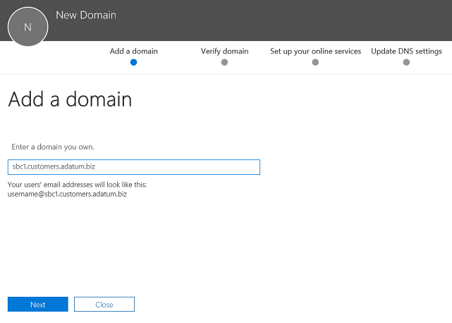
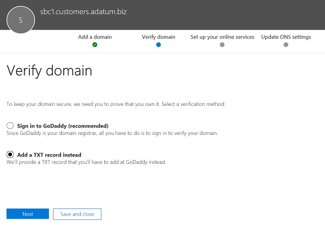
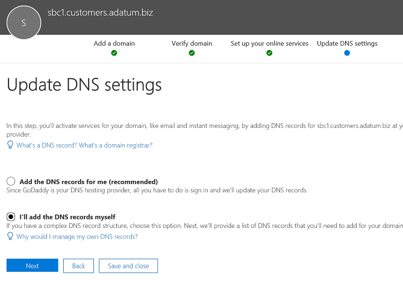
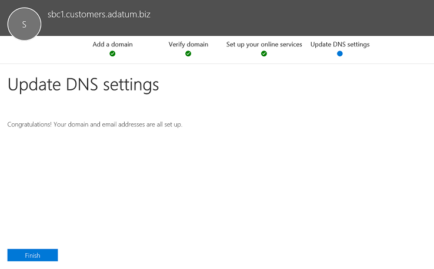

# Configurer un contrôleur de frontière de session pour plusieurs clientsConfigure a Session Border Controller for multiple tenants

Le routage direct prend en charge la configuration d’un contrôleur de bordure de session (SBC) pour servir plusieurs clients.Direct Routing supports configuring one Session Border Controller (SBC) to serve multiple tenants.

> [!NOTE]
> Ce scénario est destiné aux partenaires Microsoft et/ou aux opérateurs RTC, désignés sous le nom de opérateurs plus loin dans ce document.This scenario is designed for Microsoft partners and/or PSTN carriers, referred to as carriers later in this document. Un opérateur vend aux utilisateurs de services de téléphonie remis à Microsoft Teams.A carrier sells telephony services delivered to Microsoft Teams to their customers. 

Opérateur :A carrier:
- Déploie et gère une SBC sur son centre de donnes (les clients n’ont pas besoin d’implémenter de SBC et ils reçoivent les services de téléphonie de l’opérateur dans le client Teams).Deploys and manages an SBC in their datacenter (customers do not need to implement an SBC, and they receive telephony services from the carrier in the Teams client).
- Interconnecte l’SBC à plusieurs clients.Interconnects the SBC to multiple tenants.
- Fournit des services RTC aux clients.Provides PSTN services to customers.
- Gère la fin de la qualité des appels.Manages call quality end to end.
- Frais pour les services RTC séparément.Charges separately for PSTN services.

Microsoft ne gère pas les opérateurs.Microsoft does not manage carriers. Microsoft propose une offre PBX (système Microsoft Phone) et un client Teams.Microsoft offers a PBX (Microsoft Phone System) and a Teams client. Microsoft certifie également des téléphones et certifie les SBCs qui peuvent être utilisés avec le système Microsoft Phone.Microsoft also certifies phones, and certifies SBCs that can be used with the Microsoft Phone System. Avant de choisir un opérateur, assurez-vous que votre choix dispose d’une SBC certifié et peut gérer la fin de la qualité de la voix.Before choosing a carrier, please ensure that your choice has a certified SBC and can manage voice quality end to end.

Vous trouverez ci-après les étapes d’implémentation techniques de la configuration du scénario.The following are the technical implementation steps to configure the scenario.

**Opérateur uniquement :****Carrier only:**
1. Déployez le SBC et configurez-le pour le scénario d’hébergement conformément aux [instructions des fournisseurs de SBC certifiés](#deploy-and-configure-the-sbc).Deploy the SBC and configure it for the hosting scenario according to the [instructions from the certified SBC vendors](#deploy-and-configure-the-sbc).
2. Enregistrez un nom de domaine de base dans le client de l’opérateur et demandez un certificat générique.Register a base domain name in the carrier tenant and request a wildcard certificate.
3. Enregistrez un sous-domaine pour chaque client, qui fait partie du domaine de base.Register a subdomain for every customer, which is part of the base domain.

**Opérateur avec un administrateur global du client :****Carrier with a Customer Global Administrator:**
1. Ajoutez le nom de sous-domaine au locataire du client.Add the subdomain name to the customer tenant.
2. Activez le nom de sous-domaine.Activate the subdomain name.
3. Configurez le Trunk du transporteur sur le locataire du client et approvisionnez les utilisateurs.Configure the trunk from the carrier to the customer tenant and provision users.

*Veuillez vous assurer que vous comprenez les concepts de base de l’utilisation de la gestion des enregistrements DNS et comment le nom de domaine est géré dans Microsoft 365 ou Office 365. Pour plus d’informations, voir [obtenir de l’aide sur les domaines Microsoft 365 ou Office 365](https://support.office.com/article/Get-help-with-Office-365-domains-28343f3a-dcee-41b6-9b97-5b0f4999b7ef) .**Please make sure you understand DNS basics and how the domain name is managed in Microsoft 365 or Office 365. Review [Get help with Microsoft 365 or Office 365 domains](https://support.office.com/article/Get-help-with-Office-365-domains-28343f3a-dcee-41b6-9b97-5b0f4999b7ef) before proceeding further.*

## Déploiement et configuration de l’SBCDeploy and configure the SBC

Pour plus d’informations sur le déploiement et la configuration de SBCs pour un scénario d’hébergement SBC, consultez la documentation du fournisseur de SBC.For the detailed steps on how to deploy and configure SBCs for an SBC hosting scenario, please refer to the SBC vendor's documentation.

- **AudioCodes :** [notes de configuration de routage direct](https://www.audiocodes.com/solutions-products/products/products-for-microsoft-365/direct-routing-for-Microsoft-Teams), la configuration du scénario d’hébergement SBC décrite dans «connexion de AudioCodes SBC à la configuration de modèle d’hébergement de Microsoft teams**AudioCodes:** [Direct Routing Configuration notes](https://www.audiocodes.com/solutions-products/products/products-for-microsoft-365/direct-routing-for-Microsoft-Teams), the configuration of the SBC hosting scenario described in "Connecting AudioCodes SBC to Microsoft Teams Direct Routing Hosting Model Configuration Note." 
- **Oracle :** [notes de configuration de routage direct](https://www.oracle.com/technetwork/indexes/documentation/acme-packet-2228107.html), la configuration du scénario d’hébergement SBC est décrite dans la section « Microsoft ».**Oracle:** [Direct Routing Configuration notes](https://www.oracle.com/technetwork/indexes/documentation/acme-packet-2228107.html), the configuration of the SBC hosting scenario is described in the "Microsoft" section. 
- **Communications du ruban :**  Pour plus d’informations sur la configuration du ruban de base du ruban, voir le [Guide de configuration de Microsoft teams](https://support.sonus.net/display/IOT/PBXs+-+SBC+5k7kSWe) (en anglais [)](https://support.sonus.net/display/UXDOC70/Best+Practice+-+Configuring+Carriers+for+Microsoft+Teams+Direct+Routing) sur la configuration de l’interface du ruban de Microsoft Teams, reportez-vous à la rubrique recommandations pour le routage**Ribbon Communications:**  Please refer to the [Ribbon Communications SBC Core Microsoft Teams Configuration Guide](https://support.sonus.net/display/IOT/PBXs+-+SBC+5k7kSWe) for documentation on how to configure Ribbon Core Series SBCs and to this page [Ribbon Best Practice - Configuring Carriers for Microsoft Teams Direct Routing SBC Edge](https://support.sonus.net/display/UXDOC70/Best+Practice+-+Configuring+Carriers+for+Microsoft+Teams+Direct+Routing)
- **Te-systèmes (anynode) :**  Inscrivez-vous sur la page de la [communauté te-systèmes](https://community.te-systems.de/) pour obtenir de la documentation et des exemples sur la configuration de anynode SBC pour plusieurs clients.**TE-Systems (anynode):**  Please register on the [TE-Systems Community page](https://community.te-systems.de/) for documentation and examples on how to configure anynode SBC for multiple tenants.
- **Basculer entre :**  Inscrivez-vous sur la page de la communauté sur le [switch](https://sso.metaswitch.com/UI/Login) pour savoir comment activer Perimeta SBC pour plusieurs clients.**Metaswitch:**  Please register on the [Metaswitch Community page](https://sso.metaswitch.com/UI/Login) for documentation on how to enable Perimeta SBC for multiple tenants.

> [!NOTE]
> Veuillez nous concentrer sur la configuration de l’en-tête « contact ».Please pay attention to how to configure the "Contact" header. L’en-tête contact permet de rechercher le locataire du client dans le message d’invitation entrant.The Contact header is used to find the customer tenant on the incoming invite message. 

## Inscrire un domaine de base et des sous-domainesRegister a base domain and subdomains

Pour le scénario d’hébergement, vous devez créer :For the hosting scenario, you need to create:
- Un nom de domaine de base possédé par l’opérateur.One base domain name owned by the carrier.
- Sous-domaine qui fait partie du nom de domaine de base dans chaque client de client.A subdomain that is part of the base domain name in every customer tenant.

Dans l’exemple suivant :In the following example:
- Adatum est un opérateur qui dessert plusieurs clients en fournissant des services Internet et de téléphonie.Adatum is a carrier that serves several customers by providing Internet and telephony services.
- Woodgrove Bank, contoso et Adventure Works sont trois clients qui ont des domaines Microsoft 365 ou Office 365 et qui reçoivent les services de téléphonie de adatum.Woodgrove Bank, Contoso, and Adventure Works are three customers that have Microsoft 365 or Office 365 domains but receive the telephony services from Adatum.

Les sous-domaines **doivent** correspondre au nom de domaine complet (FQDN) du Trunk qui sera configuré pour le client et du nom de domaine complet (FQDN) dans l’en-tête de contact lors de l’envoi de l’invitation à Microsoft 365 ou Office 365.Subdomains **MUST** match the FQDN name of the trunk that will be configured for the customer and the FQDN in the Contact header when sending the Invite to Microsoft 365 or Office 365. 

Lorsqu’un appel arrive sur l’interface de routage direct de Microsoft 365 ou d’Office 365, l’interface utilise l’en-tête de contact pour trouver le client dans lequel l’utilisateur doit être recherché.When a call arrives at the Microsoft 365 or Office 365 Direct Routing interface, the interface uses the Contact header to find the tenant where the user should be looked up. Le routage direct n’utilise pas la recherche de numéros de téléphone dans l’invitation, car certains clients peuvent avoir des numéros qui peuvent se chevaucher dans plusieurs clients.Direct Routing does not use phone number lookup on the Invite, as some customers might have non-DID numbers that can overlap in several tenants. Par conséquent, le nom de domaine complet dans l’en-tête de contact est requis pour identifier le client exact pour trouver le numéro de téléphone de l’utilisateur.Therefore, the FQDN name in the Contact header is required to identify the exact tenant to look up the user by the phone number.

*Pour plus d’informations sur la création de noms de domaine dans Microsoft 365 ou les organisations Office 365, voir [obtenir de l’aide sur les domaines office 365](https://support.office.com/article/Get-help-with-Office-365-domains-28343f3a-dcee-41b6-9b97-5b0f4999b7ef) .**Please review  [Get help with Office 365 domains](https://support.office.com/article/Get-help-with-Office-365-domains-28343f3a-dcee-41b6-9b97-5b0f4999b7ef) for more information about creating domain names in Microsoft 365 or Office 365 organizations.*

Le diagramme suivant récapitule les exigences relatives aux domaines de base, sous-domaines et en-tête de contact.The following diagram summarizes the requirements to base domain, subdomains, and Contact header.

L’SBC nécessite un certificat pour authentifier les connexions.The SBC requires a certificate to authenticate the connections. Pour le scénario d’hébergement SBC, l’opérateur doit demander un certificat avec le SAN \* \* . base_domain (par exemple, \* . Customers.adatum.biz)\*.For the SBC hosting scenario, the carrier needs to request a certificate with SAN *\*.base_domain (for example, \*.customers.adatum.biz)*. Ce certificat peut être utilisé pour authentifier les connexions à plusieurs clients desservis à partir d’un SBC unique.This certificate can be used to authenticate connections to multiple tenants served from a single SBC.

Le tableau suivant illustre une configuration.The following table is an example of one configuration.

|Nouveau nom de domaineNew domain name |TypeType|EnregistrementRegistered  |Certificat SAN pour SBCCertificate SAN for SBC  |Domaine par défaut du client dans l’exempleTenant default domain in the example  |Nom de domaine complet que SBC doit présenter dans l’en-tête de contact lors de l’envoi d’appels aux utilisateursFQDN name that SBC must present in the Contact header when sending calls to users|
|---------|---------|---------|---------|---------|---------|
|customers.adatum.bizcustomers.adatum.biz|    AssietteBase     |     Client du transporteurIn carrier tenant  |    \*. customers.adatum.biz\*.customers.adatum.biz  |   adatum.bizadatum.biz      |NA, il s’agit d’un client de service, sans utilisateurs.NA, this is a service tenant, no users |
|sbc1.customers.adatum.bizsbc1.customers.adatum.biz|    Sous-domaineSubdomain  |    Dans un client clientIn a customer tenant  |    \*. customers.adatum.biz\*.customers.adatum.biz  | woodgrovebank.uswoodgrovebank.us  |  sbc1.customers.adatum.bizsbc1.customers.adatum.biz|
|sbc2.customers.adatum.bizsbc2.customers.adatum.biz  |   Sous-domaineSubdomain | Dans un client clientIn a customer tenant   |   \*. customers.adatum.biz\*.customers.adatum.biz   |contoso.comcontoso.com   |sbc2.customers.adatum.bizsbc2.customers.adatum.biz |
|sbc3.customers.adatum.bizsbc3.customers.adatum.biz |   Sous-domaineSubdomain | Dans un client clientIn a customer tenant |   \*. customers.adatum.biz\*.customers.adatum.biz  |  adventureworks.comadventureworks.com | sbc3.customers.adatum.bizsbc3.customers.adatum.biz |
||         |         |         |         |         |

Pour configurer la base et les sous-domaines, suivez les étapes décrites ci-dessous.To configure the base and subdomains, please follow the steps described below. Dans l’exemple, nous allons configurer un nom de domaine de base (customers.adatum.biz) et un sous-domaine pour un client (sbc1.customers.adatum.biz dans le client Woodgrove Bank).In the example, we will configure a base domain name (customers.adatum.biz) and a subdomain for one customer (sbc1.customers.adatum.biz in Woodgrove Bank tenant).

> [!NOTE]
> Utilisez sbcX.customers.adatum.biz pour activer la voix dans le locataire du transporteur.Use sbcX.customers.adatum.biz to enable voice in the carrier tenant. sbcX peut être un nom d’hôte alphanumérique unique et valide.sbcX can be any unique and valid alphanumeric hostname.

## Inscrire un nom de domaine de base dans le client de l’opérateurRegister a base domain name in the carrier tenant

**Ces actions sont exécutées dans le locataire du transporteur.****These actions are performed in the carrier tenant.**

### Vérifiez que vous disposez des droits appropriés pour le locataire du transporteurEnsure that you have appropriate rights in the carrier tenant

Vous pouvez ajouter de nouveaux domaines uniquement si vous vous êtes connecté au centre d’administration Microsoft 365 en tant qu’administrateur général.You can only add new domains if you signed in to the Microsoft 365 admin center as a Global Administrator. 

Pour valider le rôle dont vous disposez, connectez-vous au centre d’administration 365 Microsoft ( https://portal.office.com) , accédez à **utilisateurs**  >  **actifs**, puis vérifiez que vous avez le rôle d’administrateur général.To validate the role you have, please sign in to the Microsoft 365 admin center (https://portal.office.com), go to **Users** > **Active Users**, and then verify that you have a Global Administrator role. 

Pour plus d’informations sur les rôles d’administrateur et comment attribuer un rôle dans Microsoft 365 ou Office 365, voir [à propos des rôles d’administrateur](https://support.office.com/article/About-Office-365-admin-roles-da585eea-f576-4f55-a1e0-87090b6aaa9d).For more information about admin roles and how to assign a role in Microsoft 365 or Office 365, see [About admin roles](https://support.office.com/article/About-Office-365-admin-roles-da585eea-f576-4f55-a1e0-87090b6aaa9d).

### Ajouter un domaine de base au client et le vérifierAdd a base domain to the tenant and verify it

1. Dans le centre d’administration Microsoft 365, accédez à **configuration**des  >  **domaines**  >  **Ajouter un domaine**.In the Microsoft 365 admin center, go to **Setup** > **Domains** > **Add domain**.
2. Dans la zone **Entrez un domaine que vous possédez** , tapez le nom de domaine complet (FQDN) du domaine de base.In the **Enter a domain you own** box, type the FQDN of the base domain. Dans l’exemple suivant, le domaine de base est *Customers.adatum.biz*.In the following example, the base domain is *customers.adatum.biz*.

    

3. Cliquez sur **Suivant**.Click **Next**.
4. Dans l’exemple, le locataire a déjà adatum.biz comme nom de domaine vérifié.In the example, the tenant already has adatum.biz as a verified domain name. L’Assistant ne demande pas de vérification supplémentaire, car customers.adatum.biz est un sous-domaine du nom déjà enregistré.The wizard will not ask for additional verification because customers.adatum.biz is a subdomain for the already registered name. Toutefois, si vous ajoutez un nom de domaine complet (FQDN) qui n’a pas été vérifié auparavant, vous devez suivre le processus de vérification.However, if you add an FQDN that has not been verified before, you will need to go through the process of verification. Le processus de vérification est [décrit ci-dessous](#add-a-subdomain-to-the-customer-tenant-and-verify-it).The process of verification is [described below](#add-a-subdomain-to-the-customer-tenant-and-verify-it).

    

5. Cliquez sur **suivant**, puis, dans la page **mettre à jour les paramètres DNS** , sélectionnez **Ajouter les enregistrements DNS moi-même** , puis cliquez sur **suivant**.Click **Next**, and on the **Update DNS Settings** page, select **I'll add the DNS records myself** and click **Next**.
6. Sur la page suivante, effacez toutes les valeurs (sauf si vous souhaitez utiliser le nom de domaine pour Exchange, SharePoint ou teams/Skype entreprise), cliquez sur **suivant**, puis sur **Terminer**.On the next page, clear all values (unless you want to use the domain name for Exchange, SharePoint, or Teams/Skype for Business), click **Next**, and then click **Finish**. Assurez-vous que votre nouveau domaine est dans l’État configuration terminée.Make sure your new domain is in the Setup complete status.

    

### Activer le nom de domaineActivate the domain name

Après avoir enregistré un nom de domaine, vous devez l’activer en ajoutant au moins une licence E1, E3 ou E5 et en attribuant une adresse SIP à la partie FQDN de l’adresse SIP correspondant au domaine de base créé.After you have registered a domain name, you need to activate it by adding at least one E1, E3, or E5 licensed user and assigning a SIP address with the FQDN portion of the SIP address matching the created base domain. 

*Pour plus d’informations sur l’ajout d’utilisateurs dans Microsoft 365 ou les organisations d’Office 365, voir [obtenir de l’aide sur les domaines microsoft 365 ou office 365](https://support.office.com/article/Get-help-with-Office-365-domains-28343f3a-dcee-41b6-9b97-5b0f4999b7ef) .**Please review [Get help with Microsoft 365 or Office 365 domains](https://support.office.com/article/Get-help-with-Office-365-domains-28343f3a-dcee-41b6-9b97-5b0f4999b7ef) for more information about adding users in Microsoft 365 or Office 365 organizations.*

Par exemple : test@customers.adatum.bizFor example: test@customers.adatum.biz

## Inscrire un nom de sous-domaine dans un client clientRegister a subdomain name in a customer tenant

Vous devrez créer un nom de sous-domaine unique pour chaque client.You will need to create a unique subdomain name for every customer. Dans cet exemple, nous allons créer un sous-domaine sbc1.customers.adatum.biz dans un client avec le nom de domaine par défaut woodgrovebank.us.In this example, we will create a subdomain sbc1.customers.adatum.biz in a tenant with the default domain name woodgrovebank.us.

**Toutes les actions ci-dessous se trouvent dans le locataire du client.****All actions below are in the customer tenant.**

### Vérifiez que vous disposez des droits appropriés pour le locataire du client.Ensure that you have appropriate rights in the customer tenant

Vous pouvez ajouter de nouveaux domaines uniquement si vous vous êtes connecté au centre d’administration Microsoft 365 en tant qu’administrateur général.You can only add new domains if you signed in to the Microsoft 365 admin center as a Global Administrator. 

Pour valider le rôle dont vous disposez, connectez-vous au centre d’administration 365 Microsoft ( https://portal.office.com) , accédez à **utilisateurs**  >  **actifs**, puis vérifiez que vous avez le rôle d’administrateur général.To validate the role you have, please sign in to the Microsoft 365 admin center (https://portal.office.com), go to **Users** > **Active Users**, and then verify that you have a Global Administrator role. 

Pour plus d’informations sur les rôles d’administrateur et comment attribuer un rôle dans Microsoft 365 ou Office 365, voir [à propos des rôles d’administrateur](https://support.office.com/article/About-Office-365-admin-roles-da585eea-f576-4f55-a1e0-87090b6aaa9d).For more information about admin roles and how to assign a role in Microsoft 365 or Office 365, see [About admin roles](https://support.office.com/article/About-Office-365-admin-roles-da585eea-f576-4f55-a1e0-87090b6aaa9d).

### Ajouter un sous-domaine au locataire du client et le vérifierAdd a subdomain to the customer tenant and verify it
1. Dans le centre d’administration Microsoft 365, accédez à **configuration**des  >  **domaines**  >  **Ajouter un domaine**.In the Microsoft 365 admin center, go to **Setup** > **Domains** > **Add domain**.
2. Dans la zone **Entrez un domaine que vous possédez** , tapez le nom de domaine complet (FQDN) du sous-domaine de ce client.In the **Enter a domain you own** box, type the FQDN of the subdomain for this tenant. Dans l’exemple ci-dessous, le sous-domaine est sbc1.customers.adatum.biz.In the example below, the subdomain is sbc1.customers.adatum.biz.

    

3. Cliquez sur **Suivant**.Click **Next**.
4. Le nom de domaine complet ne s’est jamais inscrit dans le client.The FQDN has never been registered in the tenant. À l’étape suivante, vous devrez vérifier le domaine.In the next step, you will need to verify the domain. À **la place, sélectionnez Ajouter un enregistrement txt**.Select **Add a TXT record instead**. 

    

5. Cliquez sur **suivant**, puis notez la valeur txt générée pour vérifier le nom de domaine.Click **Next**, and note the TXT value generated to verify the domain name.

    

6. Créez l’enregistrement TXT avec la valeur de l’étape précédente du fournisseur d’hébergement DNS de l’opérateur.Create the TXT record with the value from the previous step in carrier's DNS hosting provider.

    

    Pour plus d’informations, voir [créer des enregistrements DNS auprès d’un fournisseur d’hébergement DNS](https://support.office.com/article/create-dns-records-at-any-dns-hosting-provider-for-office-365-7b7b075d-79f9-4e37-8a9e-fb60c1d95166).For more information, refer to [Create DNS records at any DNS hosting provider](https://support.office.com/article/create-dns-records-at-any-dns-hosting-provider-for-office-365-7b7b075d-79f9-4e37-8a9e-fb60c1d95166).

7. Revenez au centre d’administration 365 Microsoft et cliquez sur **vérifier**.Go back to the customer's Microsoft 365 admin center and click **Verify**. 
8. Sur la page suivante, sélectionnez **je vais ajouter les enregistrements DNS moi-même** , puis cliquez sur **suivant**.On the next page, select **I'll add the DNS records myself** and click **Next**.

    

9. Dans la page **choisir vos services en ligne** , désactivez toutes les options, puis cliquez sur **suivant**.On the **Choose your online services** page, clear all options and click **Next**.

    

10. Cliquez sur **Terminer** dans la page **mettre à jour les paramètres DNS** .Click **Finish** on the **Update DNS settings** page.

    

11. Assurez-vous que le paramètre statut est **terminé**.Ensure that the status is **Setup complete**. 
    
    

### Activer le nom de sous-domaineActivate the subdomain name

Après avoir enregistré un nom de domaine, vous devez l’activer en ajoutant au moins un utilisateur et en assignant une adresse SIP avec la partie FQDN de l’adresse SIP correspondant au sous-domaine créé dans le client client.After you register a domain name, you need to activate it by adding at least one user and assign a SIP address with the FQDN portion of the SIP address matching the created subdomain in the customer tenant.

*Pour plus d’informations sur l’ajout d’utilisateurs dans Microsoft 365 ou les organisations d’Office 365, voir [obtenir de l’aide sur les domaines microsoft 365 ou office 365](https://support.office.com/article/Get-help-with-Office-365-domains-28343f3a-dcee-41b6-9b97-5b0f4999b7ef) .**Please review [Get help with Microsoft 365 or Office 365 domains](https://support.office.com/article/Get-help-with-Office-365-domains-28343f3a-dcee-41b6-9b97-5b0f4999b7ef) for more information about adding users in Microsoft 365 or Office 365 organizations.*

Par exemple : test@sbc1.customers.adatum.bizFor example: test@sbc1.customers.adatum.biz

### Créer un Trunking et configurer les utilisateursCreate a trunk and provision users

Avec la version initiale du routage direct, Microsoft a demandé qu’un Trunk soit ajouté à chaque client desservi (client) à l’aide de New-CSOnlinePSTNGateway.With the initial release of Direct Routing, Microsoft required a trunk to be added to each served tenant (customer tenant) using New-CSOnlinePSTNGateway.

Toutefois, cela ne s’est pas avéré optimal pour les deux raisons suivantes :However, this has not proved optimal for two reasons:
 
- **Gestion des frais d’administration**.**Overhead management**. Par exemple, si vous déchargez ou déchargez un SBC, vous modifiez des paramètres, par exemple, en activant ou en désactivant la dérivation multimédia.Offloading or draining an SBC, for example, changes some parameters, like enabling or disabling media bypass. Le changement de port nécessite la modification des paramètres de plusieurs clients (en exécutant Set-CSOnlinePSTNGateway), mais il est en fait le même SBC.Changing the port requires changing parameters in multiple tenants (by running Set-CSOnlinePSTNGateway), but it is in fact the same SBC. 

-  **Traitement**de la surcharge.**Overhead processing**. Collecte et analyse des données d’intégrité de Trunk-les options SIP collectées à partir de plusieurs trunks logiques qui sont en réalité, le même SBC et le même tronc physique, ralentissent le traitement des données de routage.Gathering and monitoring trunk health data - SIP options collected from multiple logical trunks that are, in reality, the same SBC and the same physical trunk, slows down processing of the routing data.
 
En fonction de ces commentaires, Microsoft s’est associé à une nouvelle logique de mise en service des Trunks pour les clients de clients.Based on this feedback, Microsoft is bringing in a new logic to provision the trunks for the customer tenants.

Deux nouvelles entités ont été introduites :Two new entities were introduced:
-    Un Trunk de transporteur enregistré dans le client de l’opérateur à l’aide de la commande New-CSOnlinePSTNGateway, par exemple New-CSOnlinePSTNGateway-FQDN customers.adatum.biz-SIPSignalingport 5068-ForwardPAI $true.A carrier trunk registered in the carrier tenant using the command New-CSOnlinePSTNGateway, for example New-CSOnlinePSTNGateway -FQDN customers.adatum.biz -SIPSignalingport 5068 -ForwardPAI $true.

-    Trunk dérivé, qui ne nécessite pas d’inscription.A derived trunk, that does not require registration. Il s’agit simplement d’un nom d’hôte souhaité ajouté à partir du Trunk du transporteur.It is simply a desired host name added in from of the carrier trunk. Il dérive de tous ses paramètres de configuration du Trunk de l’opérateur.It derives all of its configuration parameters from the carrier trunk. Le Trunk dérivé ne doit pas nécessairement être créé dans PowerShell et l’association avec le Trunk de transporteur est basée sur le nom de domaine complet (voir les détails ci-dessous).The derived trunk doesn't need to be created in PowerShell, and the association with the carrier trunk is based on the FQDN name (see details below).

**Exemple de logique de mise en service et d’exemple****Provisioning logic and example**

-    Les opérateurs doivent uniquement configurer et gérer un seul Trunk (opérateur Trunk dans le domaine de l’opérateur), à l’aide de la commande Set-CSOnlinePSTNGateway.Carriers only need to set up and manage a single trunk  (carrier trunk in the carrier domain), using the Set-CSOnlinePSTNGateway command. Dans l’exemple ci-dessus, il s’agit de adatum.biz.In the example above it is adatum.biz;
-    Dans le client client, l’opérateur doit uniquement ajouter le nom de domaine complet du Trunk dérivé aux stratégies de routage vocal des utilisateurs.In the customer tenant, the carrier need only to add the derived trunk FQDN to the voice routing policies of the users. Il n’est pas nécessaire d’exécuter New-CSOnlinePSTNGateway pour un Trunk.There is no need to run New-CSOnlinePSTNGateway for a trunk.
-    Le Trunk dérivé, tel que le nom l’indique, hérite de tous les paramètres de configuration de l’opérateur Trunk.The derived trunk, as the name suggests, inherits or derives all the configuration parameters from the carrier trunk. DonnésExamples:
-    Customers.adatum.biz : le Trunk du transporteur qui doit être créé dans le client de l’opérateur.Customers.adatum.biz – the carrier trunk which needs to be created in the carrier tenant.
-    Sbc1.customers.adatum.biz : Trunk dérivé dans un client client qui n’a pas besoin d’être créé dans PowerShell.Sbc1.customers.adatum.biz – the derived trunk in a customer tenant that does not need to be created in PowerShell.  Vous pouvez simplement ajouter le nom du Trunk dérivé dans le client de client dans la stratégie de routage de la voix en ligne sans le créer.You can simply add the name of the derived trunk in the customer tenant in the online voice routing policy without creating it.
-   L’opérateur doit configurer l’enregistrement DNS pour la résolution de nom de domaine complet du Trunk dérivé sur l’adresse IP de l’SBC.Carrier will need to setup DNS record resolving derived trunk FQDN to carrier SBC ip address.

-    Les modifications apportées sur un Trunk de transporteur (sur le locataire du transporteur) s’appliquent automatiquement aux troncages dérivés.Any changes made on a carrier trunk (on carrier tenant) is automatically applied to derived trunks. Par exemple, les opérateurs peuvent modifier un port SIP sur le Trunk du transporteur, et cette modification s’applique à tous les Trunks dérivés.For example, carriers can change an SIP port on the carrier trunk, and this change applies to all derived trunks. La nouvelle logique de configuration des Trunks simplifie la gestion, car vous n’avez pas besoin d’accéder à chaque client et de changer le paramètre sur chaque Trunk.New logic to configure the trunks simplifies the management as you don't need to go to every tenant and change the parameter on every trunk.
-    Les options ne sont envoyées qu’au nom de domaine complet du Trunk du transporteur.The options are sent only to the carrier trunk FQDN. L’état d’intégrité du Trunk de transporteur est appliqué à toutes les Trunks dérivées et est utilisé pour les décisions de routage.The health status of the carrier trunk is applied to all derived trunks and is used for routing decisions. En savoir plus sur les [options de routage direct](https://docs.microsoft.com/microsoftteams/direct-routing-monitor-and-troubleshoot).Find out more about [Direct Routing options](https://docs.microsoft.com/microsoftteams/direct-routing-monitor-and-troubleshoot).
-    Le porteur peut décharger le Trunk du porteur, et tous les Trunks dérivés seront également drainés.The carrier can drain the carrier trunk, and all derived trunks will be drained as well. 
 

**Migration du modèle précédent vers le Trunk de l’opérateur****Migration from the previous model to the carrier trunk**
 
Pour effectuer une migration à partir de l’implémentation actuelle du modèle hébergé sur l’opérateur vers le nouveau modèle, les opérateurs doivent reconfigurer les Trunks pour les clients clients.For migration from the current implementation of the carrier hosted model to the new model, the carriers will need to reconfigure the trunks for customer tenants. Supprimez les Trunks des clients de clients à l’aide de Remove-CSOnlinePSTNGateway (en laissant le Trunk dans le client de l’opérateur)-Remove the trunks from the customer tenants using Remove-CSOnlinePSTNGateway (leaving the trunk in the carrier tenant)-

Nous vous encourageons vivement à procéder à une migration vers la nouvelle solution le plus rapidement possible, car nous améliorerons la surveillance et l’approvisionnement en utilisant le porteur et le modèle de Trunk dérivé.We highly encourage migrating to the new solution as soon as possible as we will be enhancing monitoring and provisioning using the carrier and derived trunk model.
 

Pour plus d’informations, reportez-vous à la rubrique [instructions du fournisseur SBC](#deploy-and-configure-the-sbc) sur la configuration de l’envoi du nom FQDN des sous-domaines dans l’en-tête contact.Please refer to the [SBC vendor instructions](#deploy-and-configure-the-sbc) on configuring sending the FQDN name of subdomains in the Contact header.

## Remarques sur la configuration du basculement de Muti-locataireConsiderations for setting up muti-tenant failover 

Pour configurer le basculement dans un environnement multi-locataire, vous devez procéder comme suit :To set up failover for a multi-tenant environment, you'll need to do the following:

- Pour chaque client, ajoutez les noms de domaine complets pour deux SBCs différents.For each tenant, add the FQDNs for two different SBCs.  Par exemple :For example:

   customer1.sbc1.contoso.comcustomer1.sbc1.contoso.com  
   customer1.sbc2.contoso.comcustomer1.sbc2.contoso.com  

- Dans les stratégies de routage de la voix en ligne des utilisateurs, spécifiez SBCs.In the Online Voice Routing policies of the users, specify both SBCs.  En cas d’échec d’un SBC, la stratégie de routage route les appels vers le second SBC.If one SBC fails, the routing policy will route calls to the second SBC.

## Voir aussiSee also

[Planifier le routage directPlan Direct Routing](direct-routing-plan.md)

[Configurer le routage directConfigure Direct Routing](direct-routing-configure.md)

