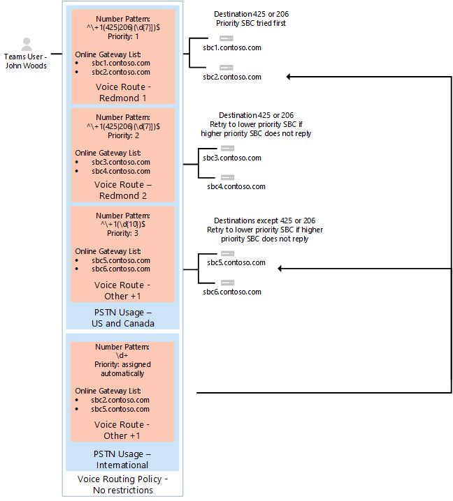

# <a name="configure-call-routing-for-direct-routing"></a>Configurer le routage des appels pour le routage direct

Cet article explique comment configurer le routage des appels pour le routage direct. Voici l’étape 3 des étapes suivantes pour configurer le routage direct :

- Étape 1. [Connecter le SBC à Microsoft Phone System et valider la connexion](direct-routing-connect-the-sbc.md) 
- Étape 2. [Activer les utilisateurs pour le routage direct, la voix et la messagerie vocale](direct-routing-enable-users.md)
- **Étape 3. Configurer le routage des appels** (cet article)
- Étape 4. [Traduire des nombres dans un autre format](direct-routing-translate-numbers.md) 

Pour plus d’informations sur toutes les étapes nécessaires à la configuration du routage direct, consultez [Configurer le routage direct](direct-routing-configure.md).

## <a name="call-routing-overview"></a>Vue d’ensemble du routage des appels

Microsoft Phone System dispose d’un mécanisme de routage qui permet d’envoyer un appel à un contrôleur de frontière de session (SBC) spécifique en fonction des éléments suivants : 

- Modèle de nombre appelé 
- Modèle de nombre appelé plus l’utilisateur spécifique qui effectue l’appel
 
Les SBC peuvent être désignés comme actifs et de sauvegarde. Lorsque le SBC configuré comme actif n’est pas disponible pour un itinéraire d’appel spécifique, l’appel est routée vers un SBC de sauvegarde.
 
Le routage des appels est constitué des éléments suivants : 

- **Stratégie de routage des appels** : également appelée stratégie de routage vocal. Conteneur pour les utilisations RTC, qui peut être attribué à un utilisateur ou à plusieurs utilisateurs. 

- **Utilisations RTC : conteneur pour les itinéraires** vocaux et les utilisations RTC, qui peuvent être partagés dans différentes stratégies de routage vocal. 

- **Itinéraires vocaux** : un modèle de nombre et un ensemble de passerelles RTC en ligne à utiliser pour les appels où le numéro d’appel correspond au modèle.

- **Passerelle RTC en ligne** : pointeur vers un SBC qui stocke également la configuration appliquée lorsqu’un appel est passé par le biais du SBC, par exemple, forward P-Asserted-Identity (PAI) ou Preferred Codecs; peut être ajouté aux itinéraires vocaux.

## <a name="voice-routing-policy-considerations"></a>Considérations relatives à la stratégie de routage vocal

Si un utilisateur dispose d’une licence de plan d’appel, les appels sortants de cet utilisateur sont automatiquement routés via l’infrastructure RTC du plan d’appel Microsoft. Si vous configurez et affectez une stratégie de routage vocal en ligne à un utilisateur du plan d’appel, les appels sortants de cet utilisateur sont vérifiés pour déterminer si le numéro composé correspond à un modèle de nombre défini dans la stratégie de routage vocal en ligne. S’il existe une correspondance, l’appel est routée via la jonction de routage direct. En l’absence de correspondance, l’appel est routé via l’infrastructure RTC du plan d’appel.

> [!CAUTION]
> Si vous configurez et appliquez la stratégie de routage vocal en ligne globale (par défaut à l’échelle de l’organisation), tous les utilisateurs à extension vocale de votre organisation hériteront de cette stratégie, ce qui peut entraîner le routage par inadvertance des appels RTC des utilisateurs du plan d’appel et de l’opérateur Connect vers une jonction de routage direct. Si vous ne souhaitez pas que tous les utilisateurs utilisent la stratégie globale de routage vocal en ligne, configurez une stratégie de routage vocal en ligne personnalisée et affectez-la à des utilisateurs individuels prenant en charge la voix.

## <a name="example-1-voice-routing-with-one-pstn-usage"></a>Exemple 1 : Routage vocal avec une utilisation RTC

Le diagramme suivant montre deux exemples de stratégies de routage vocal dans un flux d’appels.

**Flux d’appel 1 (à gauche) :** Si un utilisateur effectue un appel au +1 425 XXX XX XX XX ou +1 206 XXX XX XX XX, l’appel est routée vers SBC sbc1.contoso.biz ou sbc2.contoso.biz. Si ni sbc1.contoso.biz ni sbc2.contoso.biz ne sont disponibles, l’appel est supprimé. 

**Flux d’appel 2 (à droite) :** Si un utilisateur effectue un appel à +1 425 XXX XX XX ou +1 206 XXX XX XX XX, l’appel est d’abord routée vers SBC sbc1.contoso.biz ou sbc2.contoso.biz. Si aucun SBC n’est disponible, l’itinéraire avec une priorité inférieure est essayé (sbc3.contoso.biz et sbc4.contoso.biz). Si aucun des SBC n’est disponible, l’appel est supprimé. 


Dans les deux exemples, alors que les priorités sont affectées à l’itinéraire vocal, les SBC dans les itinéraires sont essayés dans un ordre aléatoire.

  > [!NOTE]
  > Sauf si l’utilisateur dispose également d’une licence de plan d’appel Microsoft, les appels à n’importe quel nombre, à l’exception des nombres correspondant aux modèles +1 425 XXX XX XX ou +1 206 XXX XX XX XX dans l’exemple de configuration, sont supprimés. Si l’utilisateur dispose d’une licence de plan d’appel, l’appel est automatiquement routée en fonction des stratégies du plan d’appel Microsoft. Le plan d’appel Microsoft s’applique automatiquement en tant que dernier itinéraire à tous les utilisateurs disposant de la licence du plan d’appel Microsoft et ne nécessite pas de configuration supplémentaire du routage des appels.

Dans l’exemple illustré dans le diagramme suivant, un itinéraire vocal est ajouté pour envoyer des appels à tous les autres numéros américains et canadiens (appels qui vont au modèle de numéro +1 XXX XXX XX XX XX).


Pour tous les autres appels, si un utilisateur dispose des deux licences (Microsoft Phone System et Microsoft Calling Plan), l’itinéraire automatique est utilisé. Si rien ne correspond aux modèles de nombre dans les itinéraires vocaux en ligne créés par l’administrateur, l’appel est routée via le plan d’appel Microsoft. Si l’utilisateur dispose uniquement du système téléphonique Microsoft, l’appel est supprimé, car aucune règle de correspondance n’est disponible.

  > [!NOTE]
  > La valeur priority de l’itinéraire « Autre +1 » n’a pas d’importance dans ce cas, car il n’existe qu’un seul itinéraire qui correspond au modèle +1 XXX XXX XX XX. Si un utilisateur effectue un appel au +1 324 567 89 89 et que sbc5.contoso.biz et sbc6.contoso.biz ne sont pas disponibles, l’appel est supprimé.

Le tableau suivant récapitule la configuration à l’aide de trois itinéraires vocaux. Dans cet exemple, les trois itinéraires font partie de la même utilisation rtc, « ÉTATS-UNIS et Canada ».  Tous les itinéraires sont associés à l’utilisation du RTC « ÉTATS-UNIS et canada » et l’utilisation du RTC est associée à la stratégie de routage vocal « ÉTATS-UNIS uniquement ».

|**Utilisation PSTN**|**Itinéraire vocal**|**Schéma de numéro**|**Priorité**|**Sbc**|**Description**|
|:-----|:-----|:-----|:-----|:-----|:-----|
|États-Unis et Canada|« Redmond 1 »|^\\+1(425\|206)(\d{7})$|1|sbc1.contoso.biz<br/>sbc2.contoso.biz|Itinéraire actif pour les numéros appelés +1 425 XXX XX XX OU +1 206 XXX XX XX XX|
|États-Unis et Canada|« Redmond 2 »|^\\+1(425\|206)(\d{7})$|2|sbc3.contoso.biz<br/>sbc4.contoso.biz|Itinéraire de sauvegarde pour les numéros appelés +1 425 XXX XX XX ou +1 206 XXX XX XX|
|États-Unis et Canada|« Autres +1 »|^\\+1(\d{10})$|3|sbc5.contoso.biz<br/>sbc6.contoso.biz|Itinéraire pour les numéros appelés +1 XXX XXX XX XX XX (sauf +1 425 XXX XX XX ou +1 206 XXX XX XX)|
|||||||

## <a name="example-1-configuration-steps"></a>Exemple 1 : Étapes de configuration

L’exemple suivant montre comment :

1. Créez une utilisation PSTN unique.
2. Configurez trois itinéraires vocaux.
3. Créez une stratégie de routage vocal.
4. Affectez la stratégie à un utilisateur nommé Spencer Low.

Vous pouvez utiliser le [Centre d’administration Microsoft Teams](#admincenterexample1) ou [PowerShell](#powershellexample1) pour effectuer ces étapes.

### <a name="using-the-microsoft-teams-admin-center"></a>Utiliser le centre d’administration Microsoft Teams
<a name="admincenterexample1"></a>

#### <a name="step-1-create-the-us-and-canada-pstn-usage"></a>Étape 1 : Créer l’utilisation du RTC « ÉTATS-UNIS et Canada »

1. Dans le volet de navigation gauche du centre d’administration Microsoft Teams, accédez **au** > **routage direct** vocal, puis dans le coin supérieur droit, sélectionnez **Gérer les enregistrements d’utilisation RTC**.
2. Cliquez sur **Ajouter, tapez** **ÉTATS-UNIS et Canada**, puis cliquez sur **Appliquer**.

#### <a name="step-2-create-three-voice-routes-redmond-1-redmond-2-and-other-1"></a>Étape 2 : Créer trois itinéraires vocaux (Redmond 1, Redmond 2 et Autres +1)

Les étapes suivantes décrivent comment créer un itinéraire vocal. Utilisez ces étapes pour créer les trois itinéraires vocaux nommés Redmond 1, Redmond 2 et Autres +1 pour cet exemple en utilisant les paramètres décrits dans le tableau précédent.

1. Dans le volet de navigation gauche du centre d’administration Microsoft Teams, accédez à **Voice** > **Direct Routing**, puis sélectionnez l’onglet **Itinéraires vocaux** .
2. Cliquez sur **Ajouter**, puis entrez un nom et une description pour l’itinéraire vocal.
3. Définissez la priorité et spécifiez le modèle de numérotation.
4. Pour inscrire un SBC avec l’itinéraire vocal, sous **SBC inscrits (facultatif),** cliquez sur **Ajouter des SBC**, sélectionnez les SBC que vous souhaitez inscrire, puis cliquez sur **Appliquer**.
5. Pour ajouter des enregistrements d’utilisation RTC, sous **Enregistrements d’utilisation RTC (facultatif),** cliquez sur **Ajouter une utilisation RTC**, sélectionnez les enregistrements RTC que vous souhaitez ajouter, puis cliquez sur **Appliquer**.
6. Cliquez sur **Enregistrer**.

#### <a name="step-3-create-a-voice-routing-policy-named-us-only-and-add-the-us-and-canada-pstn-usage-to-the-policy"></a>Étape 3 : Créer une stratégie de routage vocal nommée « ÉTATS-UNIS uniquement » et ajouter l’utilisation du RTC « ÉTATS-UNIS et Canada » à la stratégie

1. Dans le volet de navigation gauche du Centre d’administration Microsoft Teams, accédez aux **stratégies de routage Voice** >  Voice, puis cliquez sur **Ajouter**.
2. Tapez **US uniquement** comme nom et ajoutez une description.
3. Sous **Enregistrements d’utilisation RTC**, cliquez sur **Ajouter une utilisation RTC**, sélectionnez l’enregistrement d’utilisation RTC « États-Unis et Canada », puis cliquez sur **Appliquer**.
4. Cliquez sur **Enregistrer**.

Pour plus d’informations, consultez [Gérer les stratégies de routage vocal](manage-voice-routing-policies.md).

#### <a name="step-4-assign-the-voice-routing-policy-to-a-user-named-spencer-low"></a>Étape 4 : Affecter la stratégie de routage vocal à un utilisateur nommé Spencer Low

1. Dans le volet de navigation gauche du centre d’administration Microsoft Teams, et accédez aux **Utilisateurs**, puis cliquez sur l’utilisateur.
2. Cliquez sur **Stratégies**, puis en regard des **stratégies affectées**, cliquez sur **Modifier**.
3. Sous **Stratégie de routage vocal**, sélectionnez la stratégie « ÉTATS-UNIS uniquement », puis cliquez sur **Enregistrer**.

Pour plus d’informations, consultez [Gérer les stratégies de routage vocal](manage-voice-routing-policies.md).

### <a name="using-powershell"></a>Utiliser PowerShell
<a name="powershellexample1"></a>


#### <a name="step-1-create-the-us-and-canada-pstn-usage"></a>Étape 1 : Créer l’utilisation du RTC « ÉTATS-UNIS et Canada »

Dans une session PowerShell distante dans Skype Entreprise Online, tapez :

```PowerShell
Set-CsOnlinePstnUsage -Identity Global -Usage @{Add="US and Canada"}
```

Vérifiez que l’utilisation a été créée en entrant :

```PowerShell
Get-CSOnlinePSTNUsage
``` 

Qui retourne une liste de noms qui peuvent être tronqués :

```console
Identity    : Global
Usage        : {testusage, US and Canada, International, karlUsage. . .}
```

L’exemple suivant montre le résultat de l’exécution de la `(Get-CSOnlinePSTNUsage).usage` commande PowerShell pour afficher des noms complets (non tronqués) :

```console
 testusage
 US and Canada
 International
 karlUsage
 New test env
 Tallinn Lab Sonus
 karlUsage2
 Unrestricted
 Two trunks
```

#### <a name="step-2-create-three-voice-routes-redmond-1-redmond-2-and-other-1"></a>Étape 2 : Créer trois itinéraires vocaux (Redmond 1, Redmond 2 et Autres +1)

Pour créer l’itinéraire « Redmond 1 », dans une session PowerShell dans Skype Entreprise Online, entrez :

```PowerShell
New-CsOnlineVoiceRoute -Identity "Redmond 1" -NumberPattern "^\+1(425|206)
(\d{7})$" -OnlinePstnGatewayList sbc1.contoso.biz, sbc2.contoso.biz -Priority 1 -OnlinePstnUsages "US and Canada"
```

Qui retourne :

```console
Identity                : Redmond 1
Priority                : 1
Description             :
NumberPattern           : ^\+1(425|206) (\d{7})$
OnlinePstnUsages        : {US and Canada}
OnlinePstnGatewayList   : {sbc1.contoso.biz, sbc2.contoso.biz}
Name                    : Redmond 1
```

Pour créer l’itinéraire Redmond 2, entrez :

```PowerShell
New-CsOnlineVoiceRoute -Identity "Redmond 2" -NumberPattern "^\+1(425|206)
(\d{7})$" -OnlinePstnGatewayList sbc3.contoso.biz, sbc4.contoso.biz -Priority 2 -OnlinePstnUsages "US and Canada"
```

Pour créer l’autre itinéraire +1, entrez :

```PowerShell
New-CsOnlineVoiceRoute -Identity "Other +1" -NumberPattern "^\+1(\d{10})$"
-OnlinePstnGatewayList sbc5.contoso.biz, sbc6.contoso.biz -OnlinePstnUsages "US and Canada"
```

  > [!CAUTION]
  > Assurez-vous que votre expression régulière dans l’attribut NumberPattern est une expression valide. Vous pouvez le tester à l’aide de ce site web : [https://www.regexpal.com](https://www.regexpal.com)

Dans certains cas, il est nécessaire d’acheminer tous les appels vers le même SBC ; use -NumberPattern « .* »

Routez tous les appels vers le même SBC.

```PowerShell
Set-CsOnlineVoiceRoute -id "Redmond 1" -NumberPattern ".*" -OnlinePstnGatewayList sbc1.contoso.biz
```

Vérifiez que vous avez correctement configuré l’itinéraire en exécutant la commande PowerShell à l’aide `Get-CSOnlineVoiceRoute` des options indiquées :

```PowerShell
Get-CsOnlineVoiceRoute | Where-Object {($_.priority -eq 1) -or ($_.priority -eq 2) or ($_.priority -eq 4) -Identity "Redmond 1" -NumberPattern "^\+1(425|206) (\d{7})$" -OnlinePstnGatewayList sbc1.contoso.biz, sbc2.contoso.biz -Priority 1 -OnlinePstnUsages "US and Canada"
```
Qui doit retourner :

```console
Identity            : Redmond 1 
Priority               : 1
Description         : 
NumberPattern         : ^\+1(425|206) (\d{7})$
OnlinePstnUsages     : {US and Canada}     
OnlinePstnGatewayList    : {sbc1.contoso.biz, sbc2.contoso.biz}
Name             : Redmond 1
Identity        : Redmond 2 
Priority               : 2
Description         : 
NumberPattern         : ^\+1(425|206) (\d{7})$
OnlinePstnUsages     : {US and Canada}     
OnlinePstnGatewayList    : {sbc3.contoso.biz, sbc4.contoso.biz}
Name             : Redmond 2
    
Identity        : Other +1 
Priority               : 4
Description         : 
NumberPattern         : ^\+1(\d{10})$
OnlinePstnUsages     : {US and Canada}     
OnlinePstnGatewayList    : {sbc5.contoso.biz, sbc6.contoso.biz}
Name             : Other +1
```

Dans l’exemple, la priorité 4 a été automatiquement attribuée à l’itinéraire « Autres +1 ». 

#### <a name="step-3-create-a-voice-routing-policy-named-us-only-and-add-the-us-and-canada-pstn-usage-to-the-policy"></a>Étape 3 : Créer une stratégie de routage vocal nommée « ÉTATS-UNIS uniquement » et ajouter l’utilisation du RTC « ÉTATS-UNIS et Canada » à la stratégie

Dans une session PowerShell dans Skype Entreprise Online, tapez :

```PowerShell
New-CsOnlineVoiceRoutingPolicy "US Only" -OnlinePstnUsages "US and Canada"
```

Le résultat est illustré dans cet exemple :

```console
Identity            : Tag:US only
OnlinePstnUsages    : {US and Canada}
Description         :
RouteType           : BYOT
```

#### <a name="step-4-assign-the-voice-routing-policy-to-a-user-named-spencer-low"></a>Étape 4 : Affecter la stratégie de routage vocal à un utilisateur nommé Spencer Low

Dans une session PowerShell dans Skype Entreprise Online, tapez :

```PowerShell
Grant-CsOnlineVoiceRoutingPolicy -Identity "Spencer Low" -PolicyName "US Only"
```

Validez l’attribution de stratégie en entrant cette commande :

```PowerShell
Get-CsOnlineUser "Spencer Low" | select OnlineVoiceRoutingPolicy
```

La commande retourne les éléments suivants :

```console
OnlineVoiceRoutingPolicy
---------------------
US Only
```

## <a name="example-2-voice-routing-with-multiple-pstn-usages"></a>Exemple 2 : Routage vocal avec plusieurs utilisations RTC

La stratégie de routage vocal créée dans l’exemple 1 autorise uniquement les appels à des numéros de téléphone aux États-Unis et au Canada, sauf si la licence du plan d’appels Microsoft est également attribuée à l’utilisateur.

Dans l’exemple suivant, vous pouvez créer la stratégie de routage vocal « Aucune restriction ». La stratégie réutilise l’utilisation du RTC « États-Unis et canada » créée dans l’exemple 1, ainsi que la nouvelle utilisation « internationale » du RTC. Cette stratégie achemine tous les autres appels vers les sbc2.contoso.biz et les sbc5.contoso.biz SBC.

Les exemples présentés attribuent la stratégie US Only à l’utilisateur Spencer Low et la stratégie Aucune restriction à l’utilisateur John Woods afin que le routage se produise comme suit :

- Spencer Low – Politique américaine uniquement.  Les appels sont autorisés uniquement aux numéros des États-Unis et du Canada. Lors de l’appel à la plage de numéros Redmond, l’ensemble spécifique de SBC doit être utilisé. Les numéros non américains ne seront pas routées, sauf si la licence forfait d’appels est attribuée à l’utilisateur.

- John Woods – Politique internationale.  Les appels sont autorisés à n’importe quel nombre. Lors de l’appel à la plage de numéros Redmond, l’ensemble spécifique de SBC doit être utilisé. Les numéros non américains sont routées à l’aide de sbc2.contoso.biz et de sbc5.contoso.biz.


Pour tous les autres appels, si un utilisateur dispose des deux licences (Microsoft Phone System et Microsoft Calling Plan), l’itinéraire automatique est utilisé. Si rien ne correspond aux modèles de nombre dans les itinéraires vocaux en ligne créés par l’administrateur, l’appel est routée à l’aide du plan d’appel Microsoft.  Si l’utilisateur dispose uniquement de Microsoft Phone System, l’appel est supprimé, car aucune règle de correspondance n’est disponible.



Le tableau suivant récapitule les désignations d’utilisation de la stratégie de routage « Aucune restriction » et les itinéraires vocaux. 

| Utilisation PSTN | Itinéraire vocal | Type de numéro | Priority (Priorité) | Sbc | Description |
|:-----|:-----|:-----|:-----|:-----|:-----|
|États-Unis et Canada|« Redmond 1 »|^\\+1(425\|206)(\d{7})$|1|sbc1.contoso.biz<br/>sbc2.contoso.biz|Itinéraire actif pour les numéros d’appelés +1 425 XXX XX XX ou +1 206 XXX XX XX XX|
|États-Unis et Canada|« Redmond 2 »|^\\+1(425\|206)(\d{7})$|2|sbc3.contoso.biz<br/>sbc4.contoso.biz|Itinéraire de sauvegarde pour les numéros d’appelés +1 425 XXX XX XX ou +1 206 XXX XX XX XX|
|États-Unis et Canada|« Autres +1 »|^\\+1(\d{10})$|3|sbc5.contoso.biz<br/>sbc6.contoso.biz|Itinéraire pour les numéros d’appelé +1 XXX XXX XX XX XX (sauf +1 425 XXX XX XX ou +1 206 XXX XX XX)|
|International|International|\d+|4|sbc2.contoso.biz<br/>sbc5.contoso.biz|Itinéraire pour n’importe quel modèle de nombre |

  > [!NOTE]
  > - L’ordre des utilisations RTC dans les stratégies de routage vocal est critique. Les utilisations sont appliquées dans l’ordre, et si une correspondance est trouvée dans la première utilisation, les autres utilisations ne sont jamais évaluées. L’utilisation du RTC « international » doit être placée après l’utilisation du RTC « états-unis et au Canada ». Pour modifier l’ordre des utilisations PSTN, exécutez la `Set-CSOnlineVoiceRoutingPolicy` commande. <br/>Par exemple, pour changer l’ordre de « États-Unis et du Canada » en premier et « International » en second lieu par l’ordre inverse :<br/> `Set-CsOnlineVoiceRoutingPolicy -id tag:"no Restrictions" -OnlinePstnUsages @{Replace="International", "US and Canada"}`
 > - La priorité pour les itinéraires vocaux « Autres +1 » et « Internationaux » est attribuée automatiquement. Ils n’ont pas d’importance tant qu’ils ont des priorités inférieures à « Redmond 1 » et « Redmond 2 ».

## <a name="example-2-configuration-steps"></a>Exemple 2 : Étapes de configuration

L’exemple suivant montre comment :

1. Créez une utilisation RTC appelée International.
2. Créez un itinéraire vocal appelé International.
3. Créez une stratégie de routage vocal appelée Aucune restriction.
4. Affectez la stratégie à l’utilisateur John Woods.

Vous pouvez utiliser le [Centre d’administration Microsoft Teams](#admincenterexample2) ou [PowerShell](#powershellexample2) pour effectuer ces étapes.

### <a name="using-the-microsoft-teams-admin-center"></a>Utiliser le centre d’administration Microsoft Teams
<a name="admincenterexample2"></a>

#### <a name="step-1-create-the-international-pstn-usage"></a>Étape 1 : Créer l’utilisation PSTN « internationale »

1. Dans le volet de navigation gauche du centre d’administration Microsoft Teams, accédez **au** > **routage direct** vocal, puis dans le coin supérieur droit, sélectionnez **Gérer les enregistrements d’utilisation RTC**.
2. Cliquez sur **Ajouter**, **tapez** **International**, puis cliquez sur Appliquer.

#### <a name="step-2-create-the-international-voice-route"></a>Étape 2 : Créer l’itinéraire vocal « International »

1. Dans le volet de navigation gauche du centre d’administration Microsoft Teams, accédez à **Voice** > **Direct Routing**, puis sélectionnez l’onglet **Itinéraires vocaux** .
2. Cliquez sur **Ajouter**, entrez « International » comme nom, puis ajoutez la description.
3. Définissez la priorité sur 4, puis définissez le modèle de numérotation sur \d+.
4. Sous **SBC inscrits (facultatif),** cliquez sur **Ajouter des SBC**, sélectionnez sbc2.contoso.biz et sbc5.contoso.biz, puis cliquez sur **Appliquer**.
5. Sous **Enregistrements d’utilisation RTC (facultatif),** cliquez sur **Ajouter une utilisation RTC**, sélectionnez l’enregistrement d’utilisation PSTN « International », puis cliquez sur **Appliquer**.
6. Cliquez sur **Enregistrer**.

#### <a name="step-3-create-a-voice-routing-policy-named-no-restrictions-and-add-the-us-and-canada-and-international-pstn-usages-to-the-policy"></a>Étape 3 : Créer une stratégie de routage vocal nommée « Aucune restriction » et ajouter les utilisations « États-Unis et Canada » et « International » pSTN à la stratégie

L’utilisation du RTC « ÉTATS-UNIS et Canada » est réutilisée dans cette politique de routage vocal afin de préserver la gestion spéciale des appels aux numéros « +1 425 XXX XX XX XX » et « +1 206 XXX XX XX » en tant qu’appels locaux ou locaux.

1. Dans le volet de navigation gauche du Centre d’administration Microsoft Teams, accédez aux **stratégies de routage Voice** >  Voice, puis cliquez sur **Ajouter**.
2. Tapez **aucune restriction** comme nom et ajoutez une description.
3. Sous **Enregistrements d’utilisation RTC**, cliquez sur **Ajouter une utilisation RTC**, sélectionnez l’enregistrement d’utilisation RTC « États-Unis et Canada », puis sélectionnez l’enregistrement d’utilisation RTC « International ». Cliquez sur **Appliquer**.

    Notez l’ordre des utilisations RTC :

    - Si un appel effectué au numéro « +1 425 XXX XX XX » avec les utilisations configurées comme dans cet exemple, l’appel suit l’itinéraire défini dans l’utilisation « ÉTATS-UNIS et Canada » et la logique de routage spéciale est appliquée. Autrement dit, l’appel est routée à l’aide de sbc1.contoso.biz et sbc2.contoso.biz d’abord, puis sbc3.contoso.biz et sbc4.contoso.biz comme itinéraires de sauvegarde.

    - Si l’utilisation du RTC « international » est antérieure à « ÉTATS-UNIS et Canada », les appels au +1 425 XXX XX XX sont acheminés vers sbc2.contoso.biz et sbc5.contoso.biz dans le cadre de la logique de routage.

4. Cliquez sur **Enregistrer**.

Pour plus d’informations, consultez [Gérer les stratégies de routage vocal](manage-voice-routing-policies.md).

#### <a name="step-4-assign-the-voice-routing-policy-to-a-user-named-john-woods"></a>Étape 4 : Affecter la stratégie de routage vocal à un utilisateur nommé John Woods

1. Dans le volet de navigation gauche du centre d’administration Microsoft Teams, et accédez aux **Utilisateurs**, puis cliquez sur l’utilisateur.
2. Cliquez sur **Stratégies**, puis en regard des **stratégies affectées**, cliquez sur **Modifier**.
3. Sous **Stratégie de routage vocal**, sélectionnez la stratégie « Aucune restriction », puis cliquez sur **Enregistrer**.

Le résultat est que la politique de voix appliquée aux appels de John Woods est illimitée et suit la logique du routage des appels disponible pour les appels américains, canadiens et internationaux.

### <a name="using-powershell"></a>Utiliser PowerShell
<a name="powershellexample2"></a>

#### <a name="step-1-create-the-international-pstn-usage"></a>Étape 1 : Créer l’utilisation PSTN « internationale »

Dans une session PowerShell distante dans Skype Entreprise Online, entrez :

```PowerShell
Set-CsOnlinePstnUsage -Identity Global -Usage @{Add="International"}
```

#### <a name="step-2--create-a-new-voice-route-named-international"></a>Étape 2 : Créer un itinéraire vocal nommé « International »

```PowerShell
New-CsOnlineVoiceRoute -Identity "International" -NumberPattern ".*" -OnlinePstnGatewayList sbc2.contoso.biz, sbc5.contoso.biz -OnlinePstnUsages "International"
```

Qui retourne :

```console
Identity                  : International
Priority                  : 5
Description               :
NumberPattern             : .*
OnlinePstnUsages          : {International}
OnlinePstnGatewayList     : {sbc2.contoso.biz, sbc5.contoso.biz}
Name                      : International
```

#### <a name="step-3-create-a-voice-routing-policy-named-no-restrictions"></a>Étape 3 : Créer une stratégie de routage vocal nommée « Aucune restriction »

Les utilisations RTC « Redmond 1 » et « Redmond » sont réutilisées dans cette stratégie de routage vocal afin de conserver une gestion spéciale des appels aux numéros « +1 425 XXX XX XX » et « +1 206 XXX XX XX XX » en tant qu’appels locaux ou locaux.

  ```PowerShell
  New-CsOnlineVoiceRoutingPolicy "No Restrictions" -OnlinePstnUsages "US and Canada", "International"
  ```

Notez l’ordre des utilisations RTC :

  - Si un appel effectué au numéro « +1 425 XXX XX XX » avec les utilisations configurées comme dans l’exemple suivant, l’appel suit l’itinéraire défini dans l’utilisation « ÉTATS-UNIS et Canada » et la logique de routage spéciale est appliquée. Autrement dit, l’appel est routée à l’aide de sbc1.contoso.biz et sbc2.contoso.biz d’abord, puis sbc3.contoso.biz et sbc4.contoso.biz comme itinéraires de sauvegarde.

  - Si l’utilisation du RTC « international » est antérieure à « ÉTATS-UNIS et Canada », les appels au +1 425 XXX XX XX sont acheminés vers sbc2.contoso.biz et sbc5.contoso.biz dans le cadre de la logique de routage. Entrez la commande :

  ```PowerShell
  New-CsOnlineVoiceRoutingPolicy "No Restrictions" -OnlinePstnUsages "US and Canada", "International"
  ```

Qui retourne :

```console
    Identity              : International 
    OnlinePstnUsages : {US and Canada, International}     
    Description         :  
    RouteType               : BYOT
```

#### <a name="step-4-assign-the-voice-routing-policy-to-the-user-named-john-woods"></a>Étape 4 : Affecter la stratégie de routage vocal à l’utilisateur nommé John Woods

```PowerShell
Grant-CsOnlineVoiceRoutingPolicy -Identity "John Woods" -PolicyName "No Restrictions"
```

Vérifiez ensuite l’affectation à l’aide de la commande : 

```PowerShell
Get-CsOnlineUser "John Woods" | Select OnlineVoiceRoutingPolicy
```

Qui retourne :

```console
OnlineVoiceRoutingPolicy
------------------------
No Restrictions
```

Le résultat est que la politique de voix appliquée aux appels de John Woods est illimitée et suit la logique du routage des appels disponible pour les appels américains, canadiens et internationaux.

## <a name="run-a-self-diagnostics-tool"></a>Exécuter un outil auto-diagnostics

Les utilisateurs administrateurs microsoft 365 ont accès aux diagnostics qui peuvent être exécutés dans le locataire pour vérifier qu’un utilisateur est correctement configuré pour le routage direct. 

> [!NOTE]
>Cette fonctionnalité n’est pas disponible pour Microsoft 365 Government, Microsoft 365 géré par 21Vianet ou Microsoft 365 Germany.

Sélectionnez Exécuter les tests, comme suit. Le diagnostic est alors renseigné dans le centre de Administration Microsoft 365.
>> [!div class="nextstepaction"]
>> [Exécuter des tests : Routage direct Teams](https://aka.ms/TeamsDirectRoutingDiag)

Le diagnostic effectue un large éventail de vérifications.

## <a name="see-also"></a>Voir aussi

[Planifier le routage direct](direct-routing-plan.md)

[Configurer le routage direct](direct-routing-configure.md)
