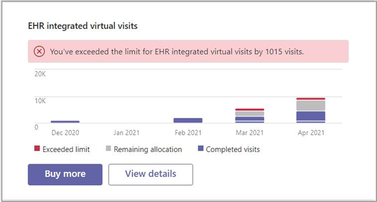

# Microsoft Teams Rapports d’administration du connecteur EHR

La Microsoft Teams rapports d’administration du connecteur dossier d’état d’état électronique (EHR) fournit un affichage rapide et facile d’affichage des données d’utilisation.

Vous pouvez afficher le rapport d’Microsoft Teams d’administration du connecteur EHR en vous connectant au tableau de bord Microsoft Teams Centre d’administration et en visualiste dans la boîte de dialogue.

Accédez au rapport à partir du tableau Microsoft Teams tableau de bord du Centre d’administration.

 

La boîte de dialogue fournit les données suivantes :

- Exceeded limit (Limite dépassée)
- Allocation restante
- Visites terminées

Vous pouvez utiliser la boîte de dialogue de rapport pour acheter d’autres visites virtuelles.

## Voir aussi

[Teams pour les visites virtuelles](ehr-admin.md)
