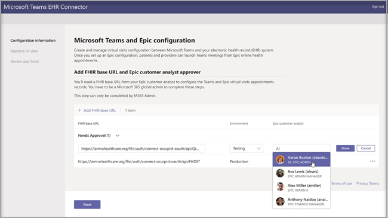
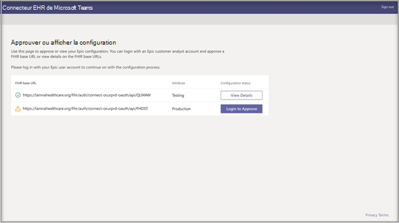

# Visites virtuelles avec Teams – Intégration dans le dossier médical informatisé (DMI)

Microsoft Teams Le connecteur de dossier d’état d’santé électronique (EHR) permet aux responsables de lancer facilement une visite de patient virtuel ou une consultation avec un autre fournisseur dans Teams directement à partir du système EHR. Conçus sur le cloud Microsoft 365, Microsoft Teams permet une collaboration et une communication simples et sécurisées grâce à des outils de conversation, vidéo, vocal et de santé au même endroit qui prend en charge la conformité avec les lois HIPAA, la certification HITECH, etc.
La plateforme de communication et de collaboration de Teams permet aux membres de l’équipe de réduire l’encombrement des systèmes fragmentés, de sorte qu’ils peuvent consacrer du temps à fournir les meilleurs soins possibles. Microsoft Teams Le connecteur ehr (Electronic Health Record) peut :

- Lancez Teams visites virtuelles à partir du système EHR du fournisseur avec un flux de travail clinique intégré.
- Permet aux patients de participer Teams visites virtuelles à partir du portail dédié aux patients.
- Écrivez les métadonnées au système EHR concernant les Teams virtuelles à enregistrer lorsque les participants se connectent et se déconnectent, et activent l’audit automatique et la conservation d’enregistrement.

  Regarder la vidéo sur la gestion des visites virtuelles à partir du portail DMI.

> [!VIDEO https://www.microsoft.com/videoplayer/embed/RE4HAtn]

## Avant de commencer

Avant d’intégrer le connecteur DMI, vous devez vous assurer que vous disposez des conditions préalables suivantes :

- Accès à l’utilisation de l’application Microsoft Teams dans [Marketplace de l’application Orchard Epic](https://apporchard.epic.com/Gallery?id=6153).

- Abonnement actif à Microsoft Cloud pour les soins de santé ou abonnement à Microsoft Teams’offre autonome de connecteur EHR (appliquée uniquement lors des tests de production).

- Les utilisateurs doivent avoir une licence Microsoft 365 ou Office 365 appropriée qui inclut les réunions Microsoft Teams.

- Microsoft Teams doit être adopté et utilisé au sein de l’organisation.

- Les organisations doivent avoir la version Epic de Novembre 2018 ou une version ultérieure.

- Vos systèmes doivent respecter toutes les [conditions préalables navigateur et logiciels](../../hardware-requirements-for-the-teams-app.md).

Vous aurez également besoin des informations des membres suivants de votre organisation :

- Administrateur Microsoft 365

- Analyse des clients

> [!Note]
> Examinez le [Guide d’intégration de Microsoft Teams télémédecine](https://galaxy.epic.com/Search/GetFile?Url=1!68!100!100100357) avec votre spécialiste technique Epic. Assurez-vous que toutes les conditions préalables sont terminées. 

## Configuration des connecteurs

La configuration du connecteur nécessite que vous :

- [Lancer le portail de configuration du connecteur EHR](ehr-admin.md#launch-the-ehr-connector-configuration-portal)
- [Configuration information](ehr-admin.md#configuration-information)
- [Approuver ou afficher la configuration](ehr-admin.md#approve-or-view-configuration)
- [Passer en revue et terminer la configuration](ehr-admin.md#review-and-finish-the-configuration)

### [Lancer le portail de configuration du connecteur EHR](#launch-the-ehr-connector-configuration-portal)

La configuration de votre organisation médicale pour lancer des visites virtuelles à l’Microsoft Teams démarre en lançant le portail de configuration du connecteur EHR. Vous configurez une ou plusieurs organisations pour tester l’intégration. Configurez l’URL de test et de production dans le portail de configuration. Testez l'intégration à partir de l'environnement de test d'Epic avant de passer en production.
  
- URL de configuration du connecteur DMI : [https://ehrconnector.teams.microsoft.com](https://ehrconnector.teams.microsoft.com)

L'administrateur Microsoft 365 et l'analyste client Epic de votre organisation doivent effectuer les étapes d'information et d'intégration dans le portail de configuration. Pour les étapes de configuration d'Epic, contactez la ressource spécialiste technique Epic affectée à votre organisation.

### [Configuration information](#configuration-information)

Cette étape doit être effectuée par l’**administrateur Microsoft 365**. L’administrateur Microsoft 365 doit lancer le portail de configuration des connecteurs et se connecter avec des informations d’identification Microsoft pour démarrer le processus de configuration.

Pour effectuer cette étape, l'administrateur Microsoft 365 doit recevoir une URL de base Fast Health Interoperability Resources (FHIR) valide de la part de votre spécialiste technique Epic et le nom d'utilisateur de l'analyste client Epic qui approuvera la configuration. L’administrateur Microsoft 365 doit lancer la page de configuration des connecteurs et se connecter avec des informations d’identification Microsoft pour démarrer le processus de configuration.

- L'URL de base FHIR est une adresse statique correspondant au point de terminaison de l'API FHIR de votre serveur. Exemple d’URL est `https://lamnahealthcare.org/fihr/auth/connect-ocurprd-oauth/api/FHDST`.

- Le nom de l'approbateur de la configuration est le nom de l'analyste client Epic qui sera chargé d'approuver la configuration à l'étape suivante. L'analyste client d'Epic est une personne de votre organisation ayant un accès à Epic.

  

### [Approuver ou afficher la configuration](#approve-or-view-configuration)

L’analyste client de votre organisation médicale qui a été ajoutée en tant qu’approbation doit maintenant utiliser la même URL de connecteur EHR que lors de l’étape précédente pour se connecter à l’aide de ses informations d Microsoft 365 de connexion. Après une validation réussie, l'approbateur sera invité à se connecter à l'aide de ses informations d'identification Epic pour valider l'organisation Epic.

> [!Note]
> L'administrateur Microsoft 365 et l'analyste client Epic de votre organisation peuvent être la même personne. Dans ce cas, ajoutez votre propre nom d'utilisateur en tant qu’approbateur. Vous devrez toujours vous connecter à Epic pour valider votre accès. La connexion Epic est uniquement utilisée pour valider votre URL de base FHIR. Microsoft ne stocke pas les informations d’identification et n’accède pas aux données DMI avec cette connexion.

  

Une fois la connexion Epic réussie, l'analyste client Epic **doit** approuver la configuration. Si la configuration n'est pas correcte, l'administrateur Microsoft 365 peut modifier les configurations d'origine en se connectant à nouveau au portail du connecteur Microsoft DMI. 

### [Passer en revue et terminer la configuration](#review-and-finish-the-configuration)

Lorsque les informations de configuration sont approuvées par l'administrateur Epic, les enregistrements d'intégration pour le lancement du patient et du fournisseur vous sont présentés. Ces enregistrements sont nécessaires pour terminer la configuration de la visite virtuelle dans Epic. Pour plus d’informations, reportez-vous au guide sur l’intégration de la téléconsultation à Epic-Microsoft Teams.

> [!Note]  
> À tout moment, l'analyste client Microsoft 365 ou Epic peut se connecter au portail de configuration pour consulter les enregistrements d'intégration et modifier la configuration de l'organisation, si nécessaire.

> [!Note]
> Le processus d’approbation doit être effectué par l’analyste client Epic pour chaque URL FHIR configurée par l’administrateur Microsoft auparavant.

## Lancer les visites virtuelles Teams

Une fois que vous avez terminé les étapes du connecteur EHR et que vous avez effectué la configuration d’Andy, votre organisation est prête à prendre en charge les visites vidéo avec Microsoft Teams.

### Conditions préalables pour la visite virtuelle

- Vos systèmes doivent respecter toutes les [conditions préalables navigateur et logiciels](../../hardware-requirements-for-the-teams-app.md).

- L'organisme de santé doit avoir terminé la configuration entre l'organisme Epic et l'organisme Microsoft 365.

### Expérience fournisseur

Les fournisseurs de soins de santé de votre organisation peuvent également participer à des visites virtuelles avec Microsoft Teams à partir de leurs applications Epic pour fournisseurs (Hyperspace, Haiku, Canto). Le bouton **Commencer la visite virtuelle** est incorporé dans le flux du fournisseur.

Principales fonctionnalités de l’expérience fournisseur :

- Les fournisseurs peuvent rejoindre les visites virtuelles à l’aide de navigateurs pris en charge ou l’application Microsoft Teams.

- Les fournisseurs doivent se connectent une fois avec leur compte Microsoft 365 lorsqu’ils rejoignent une visite virtuelle pour la première fois.

- Après la connexion unique, le fournisseur sera directement dirigé vers le rendez-vous virtuel dans Microsoft Teams. Le fournisseur doit être connecté à Microsoft Teams.

- Le fournisseur peut consulter en temps réel les mises à jour des connexions et déconnexions des participants pour un rendez-vous donné. Le fournisseur peut voir quand le patient est connecté à une visite virtuelle.

  

### Expérience patient

Le connecteur prend en charge les patients qui rejoignent des visites virtuelles via les applications web et mobiles MyChart. Au moment du rendez-vous, les patients peuvent démarrer une visite virtuelle à partir de MyChart à l’aide du bouton **Commencer la visite virtuelle**.

Principales fonctionnalités de l’expérience du patient :

- Les patients peuvent rejoindre les visites virtuelles à partir de navigateurs web modernes sur ordinateurs de bureau et mobiles sans installation de l’application.

- Les patients peuvent rejoindre les visites virtuelles d'un simple clic et aucun autre compte ou connexion n'est nécessaire.

- Les patients n'ont pas besoin de créer un compte Microsoft ou de se connecter pour lancer une visite virtuelle.

- Les patients sont placés dans une salle d’accueil jusqu’à ce que le fournisseur de soins de santé rejoigne le rendez-vous et les admette dans la visite virtuelle.

- Un test de la vidéo et du microphone est disponible dans la salle d'accueil avant de rejoindre la visite virtuelle.

  

> [!Note]
> Epic, MyChart, Haiku et Canto sont des marques déposées d'Epic Systems Corporation.

### Confidentialité et emplacement des données

L'intégration Teams dans les systèmes de DMI optimise la quantité de données utilisées et stockées pendant l'intégration et les flux de visites virtuelles. La solution respecte les principes et les directives générales de Teams en matière de confidentialité et de gestion des données, décrits dans Confidentialité Teams.

Le connecteur DMI de Microsoft Teams ne stocke ni ne transfère les données personnelles identifiables ou les dossiers médicaux des patients ou fournisseurs de santé à partir du système de gestion des dossiers médicaux. Les seules données stockées par le connecteur DMI sont l’ID unique de l’utilisateur DMI (utilisé lors de l’installation d’une réunion Teams). L’ID unique de l’utilisateur DMI est stocké dans l’une des trois zones géographiques décrites dans [Emplacement de stockage des données client Microsoft 365](/microsoft-365/enterprise/o365-data-locations). Toutes les discussions, enregistrements et autres données entrés dans Teams par les participants à la réunion sont stockés conformément aux stratégies de stockage existantes. Pour plus d’informations sur l’emplacement des données dans Microsoft Teams, consultez [Emplacements des données dans Teams](../../location-of-data-in-teams.md).

## Sujets associés

[Teams visites virtuelles](ehr-admin-reports.md)