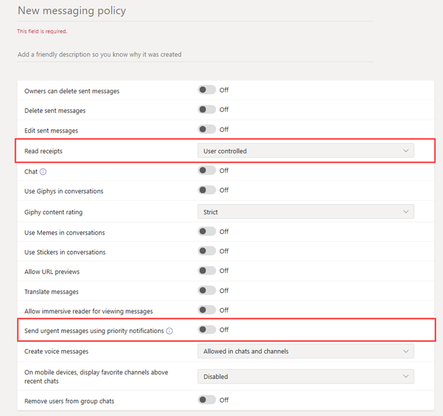

# Messagerie sécurisée pour les organismes de santé

Les stratégies de messagerie sont utilisées pour contrôler les fonctions de chat et de canal de messagerie disponibles pour les utilisateurs de Microsoft Teams. Elles s'inscrivent dans le cadre du déploiement global de la messagerie sécurisée pour les organisations de soins de santé, telles que les hôpitaux, les cliniques ou les cabinets médicaux, où il est crucial de prendre un message et d'y donner suite en temps voulu, ainsi que de savoir quand les messages cruciaux sont lus.

Vous pouvez utiliser la stratégie globale (par défaut à l’échelle de l’organisation) ou créer une ou plusieurs stratégies de réunion personnalisées pour certaines personnes qui hébergent des réunions dans votre organisation. Les utilisateurs de votre organisation recevront automatiquement la stratégie globale, sauf si vous créez et leur attribuez une stratégie personnalisée. Une fois que vous avez créé une stratégie personnalisée, attribuez-la à un utilisateur ou à des groupes d’utilisateurs au sein de votre organisation. Par exemple, vous pouvez choisir d'autoriser l'utilisation de ces fonctions à certaines catégories professionnelles seulement (par exemple, les médecins et les infirmières uniquement) et d'autres travailleurs (comme le personnel d'entretien ou de cuisine) à bénéficier d'un ensemble plus limité de fonctionnalités. Décidez par vous-même des besoins de votre organisation. Les conseils ci-après sont tout au plus une suggestion.

Les stratégies peuvent être facilement gérées dans le [Centre d’administration Microsoft Teams](https://admin.teams.microsoft.com) en vous connectant avec des informations d’identification d’administrateur et en choisissant **Stratégies de messagerie** dans le volet de navigation gauche.

 

Pour modifier la stratégie de messagerie par défaut existante pour votre organisation, cliquez sur **Globale (à l’échelle de l’organisation)**, puis apportez vos modifications. Pour créer une stratégie de messagerie personnalisée, cliquez sur **Ajouter** puis sélectionnez vos paramètres. Sélectionnez **Enregistrer** lorsque vous avez terminé.

Les paramètres suivants sont particulièrement spécifiques aux applications du secteur de la santé et doivent être pris en considération lors de la conception d’une stratégie personnalisée utilisée dans le champ Soins de santé :

## Confirmations de lecture

Les accusés de lecture permettent à l’expéditeur d’un message de conversation de savoir quand son message a été lu par le destinataire dans des conversations en tête à tête ou de groupe de 20 personnes ou moins. Utilisez ce paramètre pour spécifier si les tickets de lecture sont contrôlés par l’utilisateur, pour tout le monde ou non. Les accusés de réception de lecture de message sont importants dans les organisations de soins de santé car ils permettent de lever l'incertitude quant à la lecture d'un message.

Pour les applications de santé, sélectionnez l **Contrôle par l’utilisateur** ou l' **Activé pour tout le monde**. Lors de l’utilisation du paramètre **Activé pour tout le monde**, la seule façon de définir les accusés de réception pour l'ensemble du client est soit d'avoir une seule stratégie de messagerie pour l'ensemble du client (la stratégie par défaut nommée « Par défaut à l’échelle de l’organisation ») ou que toutes les stratégies de messagerie du client utilisent les mêmes paramètres pour les accusés de lecture. La fonctionnalité d’accusés de lecture est plus efficace lorsque la fonctionnalité est activée **Activé pour tout le monde**.

*Exemple d’utilisation sans accusé de lecture :* Jakob Roth, un patient à risque élevé, est admis à l’hôpital.  Sofia Krause est une infirmière qui fait partie de l'équipe interdisciplinaire (IDT) composée de travailleurs médicaux, y compris de différents spécialistes, et qui est désignée comme coordinatrice des soins primaires en charge de ce patient.  Sofia envoie des courriels et d'autres messages instantanés à un groupe d'infirmières et de médecins qui utilisent divers clients et applications de messagerie, et souvent elle n'obtient aucune réponse ou indication si un message a été lu par les membres de l'équipe. En raison de l'enchevêtrement des processus de communication, les médicaments de Jakob sont mal administrés et son séjour à l'hôpital est prolongé.

*Exemple d’utilisation avec accusé de lecture :* Jakob Roth, un patient à risque élevé, est admis à l’hôpital.  Sofia Krause est une infirmière qui fait partie de l'équipe interdisciplinaire (IDT) composée de travailleurs médicaux, y compris de différents spécialistes, et qui est désignée comme coordinatrice des soins primaires en charge de ce patient.  Sofia lance une discussion de groupe avec un ensemble de médecins et d'autres infirmières qui travailleront avec le patient afin de coordonner les soins et de commencer un tri d'urgence.  Les infirmières et les médecins communiquent et collaborent sur le plan de soins du patient tout au long du processus de coordination des soins.  Les messages importants et urgents sont envoyés par le biais de conversations en tête-à-tête ou de groupe. Sofia utilise la fonctionnalité d'accusé de lecture pour déterminer si les messages envoyés pour demander du soutien sont remis et lus par les médecins ou infirmiers ciblés. Les résultats obtenus par Jakob sont quasiment optimaux et il rentre chez lui plus rapidement grâce à la bonne communication de son équipe médicale.

## Envoyer des messages urgents à l’aide de notifications de priorité

Un utilisateur peut marquer un message comme *urgent* lors de l’envoi de messages de conversation à d’autres utilisateurs. Cette fonction permet au personnel hospitalier de s'alerter mutuellement lorsqu'un incident critique requiert leur attention. Contrairement aux messages *importants*, les [notifications de priorité](https://support.microsoft.com/article/mark-a-message-as-important-or-urgent-in-teams-ea99d5b6-1317-4550-8d75-86ff14cd4462) avertissent les utilisateurs toutes les deux minutes pendant 20 minutes ou jusqu’à ce que le message soit choisi et lu par le destinataire, ce qui permet de maximiser la probabilité que le message soit lu dans un délai raisonnable.

Un administrateur peut activer ou désactiver la possibilité pour les utilisateurs affectés à cette stratégie d’envoyer des notifications de priorité. Cette fonctionnalité est activée par défaut. Il est possible que le destinataire du message de priorité n’a pas la même stratégie de messagerie et qu’il n’a pas la possibilité de désactiver la réception des messages prioritaires. Pour les applications pour la santé, nous vous recommandons d’activer cette fonctionnalité pour au moins certains utilisateurs, mais vous devez déterminer lesquelles.

*Exemple d’utilisation :* Sofia Krause réadmet un patient à haut risque, Jakob Roth. Manuela Carstens, médecin, est le médecin traitant de ce patient.  Sofia envoie un message à Manuela à l’aide d’une notification de priorité demandant une aide immédiate pour le tri de Jakob.  Le téléphone de Manuela reçoit le message, mais Manuela n’a pas reçu le numéro de téléphone et ne répond pas. Teams en informe de manière permanente Manuela et continuera à informer le personnel jusqu’à ce qu’elle lise le message. Si les accusés de lecture sont également activés, Sofia peut savoir que Manuela a lu le message, avant même que Manuela ne décide comment répondre.

## Rubriques connexes

- [Gérer les stratégies de messagerie dans Teams](../../messaging-policies-in-teams.md)
- [Prise en main de Teams pour les organismes de santé](teams-in-hc.md)
