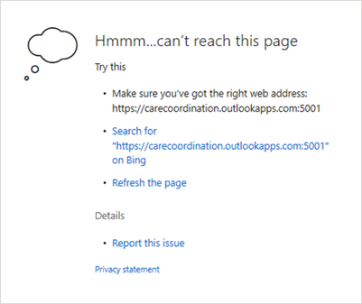
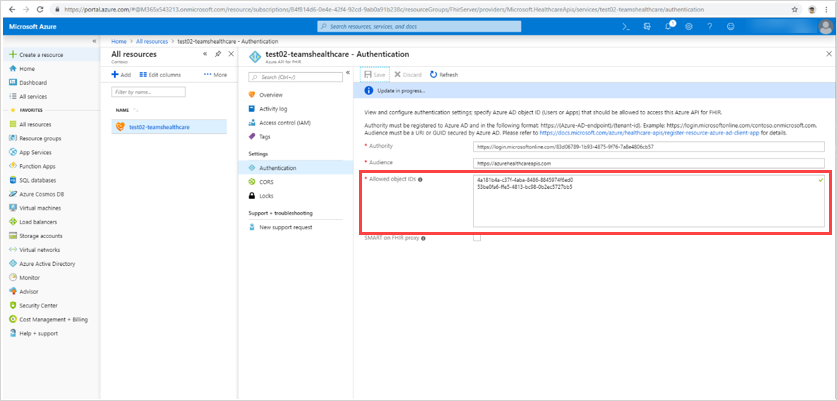

# Connecter l’application coordination des soins à l’API Azure pour FHIR

> [!NOTE]
> À compter du 30 octobre 2020, l’application Patients a été retirée et remplacée par l’[application Listes](https://support.microsoft.com/office/get-started-with-lists-in-teams-c971e46b-b36c-491b-9c35-efeddd0297db) dans Teams. Les données de l’application Patients sont stockées dans la boîte aux lettres de groupe du groupe Office 365 qui soutien l’équipe. Toutes les données associées à l’application Patients sont conservées dans ce groupe mais ne sont plus accessibles via l’interface utilisateur. Les utilisateurs peuvent re-créer leurs listes à l’aide de l’[application Listes](https://support.microsoft.com/office/get-started-with-lists-in-teams-c971e46b-b36c-491b-9c35-efeddd0297db).
>
>Les listes permet aux équipes de soins de votre organisation de santé de créer des listes de patients pour différents scénarios (arrondis, réunions d’équipe de formation, surveillance générale des patients, etc.). Pour commencer, consultez le modèle Patients dans listes. Pour en savoir plus sur la gestion de l’application Listes dans votre organisation, consultez [Gérer l’application Listes](../../manage-lists-app.md).

Suivez ces étapes pour autoriser l’application Patients dans Microsoft Teams à accéder à une API Azure pour une instance FEMBA. Cet article part du principe qu’une api Azure pour [une instance FEMBA](https://azure.microsoft.com/services/azure-api-for-fhir/) est configurée et configurée dans votre client.  Si vous n’avez pas encore créé d’instance d’API Azure pour FEMBA dans votre client, voir Démarrage rapide : Déployer [l’API Azure](/azure/healthcare-apis/fhir-paas-portal-quickstart)pour FEMBA à l’aide du portail Azure.

1. Cliquez [ici pour](https://login.microsoftonline.com/common/adminConsent?client_id=4aee3506-b263-43e0-ba31-1468fa7b2806) accorder le consentement de l’administrateur à l’application Patients. À l’invite, connectez-vous à l’aide de  vos informations d’identification d’administrateur client ou d’administrateur global, puis cliquez sur Accepter pour accorder les autorisations requises.

    

    Une fois l’acceptation acceptée, fermez la fenêtre. Vous verrez une page qui peut ressembler à ceci. Vous pouvez ignorer le message d’erreur sur la page. Il n’est pas dangereux et indique que le consentement est accordé. (Nous travaillons à une page plus conviviale pour cette URL. Restez connecté !)

    

2. Connectez-vous au [portail Azure avec](https://portal.azure.com) vos informations d’identification d’administrateur.

3. Dans le dossier de navigation de gauche, **sélectionnez Azure Active Directory,** puis **Applications d’entreprise.**

    Recherchez une ligne nommée **Patients (dev),** puis copiez la valeur de la colonne **ID** d’objet dans votre Presse-papiers.

    

4. Allez à l’instance de ressource Api Azure pour FEMBA à laquelle vous voulez connecter l’application Patients (en la recherchant ou en parcourant vos ressources), puis ouvrez les paramètres pour cette instance.

    

5. Cliquez **sur** Authentification, puis collez l’ID d’objet copié à l’étape 3 dans la zone **ID d’objet** autorisé. Cela permet à l’application Patients d’accéder au serveur FEMBA. Une fois que vous avez collé l’ID d’objet, Azure Active Directory la valide et une coche verte apparaît en regard de celui-ci.

    

6. Cliquez sur **Enregistrer**. Cela redéployer l’instance, ce qui peut prendre quelques minutes.

7. Cliquez sur **Vue d’ensemble,** puis copiez l’URL à partir du point de terminaison des **métadonnées FEMBA.** Supprimez la balise de métadonnées pour obtenir l’URL du serveur FEMBA. Par exemple, `https://test02-teamshealth.azurehealthcareapis.com/` .

    

8. Dans Teams, allez à l’instance de l’application Patients chargée dans  votre équipe, cliquez sur **Paramètres,** puis dans la zone Lien, entrez l’URL du point de terminaison du serveur FEMBA. Cliquez ensuite sur **Connexion pour** établir une connexion et rechercher et ajouter des patients à votre liste.  

    

    Si vous obtenez une erreur lors de la connexion à Teams au cours de cette étape, envoyez une capture d’écran détaillée de l’erreur, les journaux de [Fiddler](https://www.telerik.com/download/fiddler) et toute autre étape de reprotégation dans un e-mail avec la ligne d’objet « Application Patients - Résolution des problèmes du mode EMR » à [teamsforhealthcare@service.microsoft.com.](mailto:teamsforhealthcare@service.microsoft.com)

## Rubriques connexes

- [Présentation de l’application Patients](patients-app-overview.md)
- [Intégration des dossiers médicaux électroniques dans Microsoft Teams](patients-app.md)