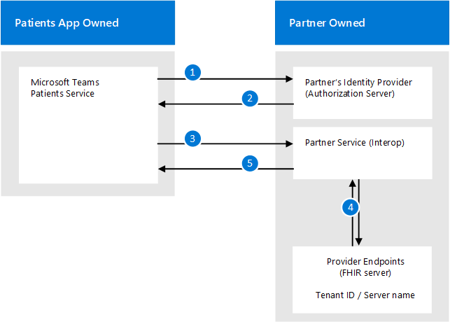

# Intégration des dossiers médicaux électroniques dans Microsoft Teams

[!INCLUDE [preview-feature](../../includes/preview-feature.md)]

Cet article s’adresse aux développeurs de systèmes d’information aux soins généraux désireux d’utiliser des API FHIR sur un système d’informations médicales pour se connecter à Microsoft Teams. Cela permettrait aux scénarios de coordination de soins qui répondent aux besoins d’un organisme de santé.

Les Articles liés documentent les spécifications de l’interface FHIR pour l’application Microsoft teams patients et indiquent ce qui est requis pour la configuration d’un serveur FHIR et la connexion à l’application patients dans votre environnement de développement ou client. Vous devrez également connaître la documentation du serveur FHIR que vous avez choisi, qui doit être l’une des options prises en charge :
- Datica (par le biais de leur offre [CMI](https://datica.com/compliant-managed-integration/) )
- Infor Cloverleaf (via [infor FHIR Bridge](https://pages.infor.com/hcl-infor-fhir-bridge-brochure.html))
- Redox (par le biais du [serveur R ^ FHIR](https://www.redoxengine.com/fhir/))
- DapaSoft (via [Corolar sur FHIR](https://www.dapasoft.com/corolar-fhir-server-for-microsoft-teams/))

> [!NOTE]
> Ce processus n’inclut pas les étapes qui utilisent le centre d’administration Microsoft teams ou les cmdlets PowerShell pour activer des fonctionnalités. La configuration est entièrement réalisée sur le côté du serveur/Service FHIR et dans le client de l’application patients.

Voici l’architecture de l’application patients :

Les sections suivantes décrivent les exigences de la couche d’accès aux données FHIR-only pour l’application patients qu’une API FHIR Server (ou DMI FHIR) doit respecter pour s’intégrer à l’application patients, comme suit :

- Attentes concernant l’authentification des utilisateurs
- Exigences fonctionnelles et techniques de l’interface d’intégration
- Attentes en matière de performances et de fiabilité
- Attentes concernant les ressources FHIR devant être prises en charge pour l’application patients
- Processus d’intégration et modèle d’engagement ATTENDU
- Commencer à utiliser FHIR et résoudre certains problèmes courants rencontrés avec l’application patients
- Exigences futures pour l’itération suivante de l’application patients

> [!NOTE]
> Dans les sections suivantes, le mot « partenaire » ou « partenaire d’interopérabilité » est utilisé pour faire référence à toute organisation tierce qui permet l’intégration aux systèmes DMI pour l’application patients via FHIR et implémente un serveur FHIR correspondant aux spécifications indiquées.

## Exigences fonctionnelles et techniques  

### Authentification  

L’autorisation au niveau *de l’application sans support pour l’autorisation au niveau de l’utilisateur* est la façon la plus courante de procéder à des transformations de données et d’exposer les connexions aux données DMI via FHIR, même si le système DMI peut implémenter une autorisation au niveau de l’utilisateur. Le service d’interopérabilité (partenaire) accède aux données DMI, et lorsqu’il expose les mêmes données que les ressources FHIR appropriées, il n’y a aucun contexte d’autorisation transmis au consommateur de services d’interopérabilité (l’application patients) intégré au service d’interopérabilité ou à la plate-forme. L’application patients ne sera pas en mesure de mettre en œuvre l’autorisation de niveau utilisateur, mais elle prend en charge l’authentification des applications entre l’application patients et le service du partenaire d’interopérabilité.

Le modèle d’authentification des applications est décrit ci-dessous :

L’authentification du service au service doit être réalisée par le biais du [flux d’informations d’identification du Client](https://www.oauth.com/oauth2-servers/access-tokens/client-credentials/)2,0 OAuth. Le service partenaire doit fournir ce qui suit :

1. Le service partenaire permet à l’application patients de créer un compte auprès du partenaire, qui permet à l’application patients de générer client_id et de client_secret, gérée par le biais d’un portail d’inscription d’auth sur le serveur d’authentification du partenaire.
2. Le service partenaire possède le système d’authentification/d’autorisation qui accepte et vérifie (authentifie) les informations d’identification du client fournies et renvoie un jeton d’accès avec l’indicateur de client dans l’étendue, comme décrit ci-dessous.
3. Pour des raisons de sécurité, ou en cas de violation secrète, l’application patients peut régénérer le secret et invalider ou supprimer l’ancien secret (par exemple, il est disponible dans Azure Portal-inscription des applications AAD).
4. Le point de terminaison de métadonnées qui héberge la déclaration de conformité doit être non authentifié, il doit être accessible sans jeton d’authentification.
5. Le service partenaire fournit le point de terminaison jeton de l’application patients pour demander un jeton d’accès à l’aide d’un flux d’informations d’identification du client. L’URL du jeton en tant que serveur d’autorisation doit faire partie intégrante de l’instruction de compatibilité FHIR (Capability) récupérée à partir des métadonnées du serveur FHIR, comme dans cet exemple :

* * *
    {"resourceType" : "CapabilityStatement",.
        .
        .
        "Rest" : [{"mode" : "serveur", "sécurité" : {{"URL" : [{"extension" : [{"URL" : "Token", "valueUri" : ""}, {"URL" : ""} "," URL " :" "}])," https://login.contoso.com/145f4184-1b0b-41c7-ba24-b3c1291bfda1/oauth2/token https://login.contoso.com/145f4184-1b0b-41c7-ba24-b3c1291bfda1/oauth2/authorize http://fhir-registry.smarthealthit.org/StructureDefinition/oauth-uris service " : [{" Coding " : [{" System " :" https://hl7.org/fhir/ValueSet/restful-security-service "," code " :" OAuth "})}]}
                .
                .
            } ] }

* * *

Une demande de jeton d’accès comprend les paramètres suivants :

* * *

    BILLET/Token HTTP/1.1 : authorization-server.com

    Grant-type = client_credentials &client_id = XXXXXXXXXX &client_secret = XXXXXXXXXX

* * *

Le service partenaire fournit les client_id et les client_secret de l’application patients, gérés par le biais d’un portail d’inscription d’authentification du côté du partenaire. Le service partenaire fournit le point de terminaison pour demander un jeton d’accès à l’aide d’un flux d’informations d’identification client. Une réponse réussie doit inclure les paramètres token_type, access_token et expires_in.

### Routage : mappage du client AAD au point de terminaison du fournisseur

L’application patients se connecte à un service partenaire via un point de terminaison unique. Le service partenaire possède et gère un mécanisme pour mapper chaque client Microsoft (ID de client AAD) à un fournisseur de services de santé correspondant (serveur FHIR) sur lequel le service de partenariat travaille.

Le fait de mapper le client AAD à un point de terminaison fournisseur utilise l’ID de locataire AAD (GUID). L’application patients transmet l’ID de locataire dans l’étendue, lors de la demande d’un jeton d’accès pour chaque demande. Le service partenaire conserve le mappage de l’ID de locataire au point de terminaison fournisseur et redirige les demandes vers un point de terminaison fournisseur en fonction de l’ID de locataire. Pour ce faire, le partenaire prend en charge la configuration à la fin (manuellement ou par le biais d’un portail dans le cadre de l’intégration d’organisations de fournisseur à sa plateforme d’interopérabilité).

Le flux de travail d’authentification et de routage est indiqué ci-dessous :

1. Demande d’un jeton d’accès d’application en envoyant :
 
        {   grant_type: client_credentials,
            client_id: xxxxxx, 
            client_secret: xxxxxx,
            scope: {Provider Identifier, Ex: tenant ID}
        }

2. Répondez avec un jeton d’application :

        {  access_token: {JWT, with scope: tenant ID},
           expires_in: 156678,
           token_type: "Bearer",
        }

3. Demander des données protégées avec un jeton d’accès.
4. Message d’autorisation : sélectionnez le serveur FHIR approprié pour le routage à partir de l’ID de locataire dans l’étendue.
5. Envoie les données protégées de l’application à partir du serveur FHIR autorisé après authentification auprès du jeton de l’application.

## Implément

Les appels et champs spécifiques utilisés par l’application patients sont décrits dans les articles suivants. Sélectionnez l’interface applicable aux API Server/FHIR de votre FHIR.

- [Spécification de l’interface DSTU2](dstu2-interface.md)
- [Spécification de l’interface STU3](stu3-interface.md)

## Performances et fiabilité

Même si l’application patients est en préversion privée, il n’existe aucune garantie quant aux performances de bout en bout. Les facteurs de performance incluent les latences relatives de tous les tronçons impliqués dans le flux de travail, en partant du DMI dans l’environnement du système d’intégrité, vers le partenaire d’interopérabilité et leur infra, y compris le serveur FHIR et vers l’application Office 365 écosystème et patients.

## Commencer à utiliser FHIR  

Si vous débutez sur FHIR et que vous avez besoin d’accéder facilement à un serveur FHIR que vous pouvez exposer à l’interface d’intégration DMI de Microsoft Teams, Microsoft dispose d’un serveur FHIR Open-source disponible pour tous les développeurs. Reportez-vous à l’article [qu’est-ce que FHIR Server pour Azure](https://docs.microsoft.com/azure/healthcare-apis/overview-open-source-server) pour en savoir plus sur le serveur Open source FHIR fourni par Microsoft et le déploiement pour votre organisation.

Vous pouvez également utiliser l’environnement de bac à sable (sandbox) HSPC ouvert pour créer un DMI qui prend également en charge un serveur Open FHIR Nous vous recommandons de lire la [documentation de bac à sable (sandbox) hspc](https://healthservices.atlassian.net/wiki/spaces/HSPC/pages/64585866/HSPC+Sandbox). Non seulement le bac à sable (sandbox) offre une méthode simple, orientée interface utilisateur et conviviale pour la création, l’ajout et la modification de patients. 