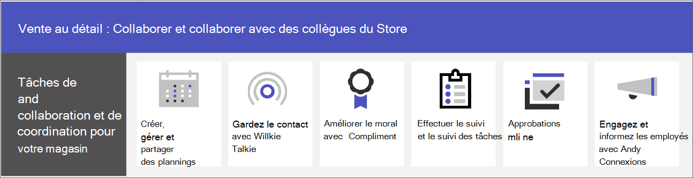

# Collaboration entre équipes commerciales

Rassemblez des employés de magasins et les responsables pour communiquer, collaborer et simplifier les opérations à l’aide de Microsoft Teams. Aidez vos employés à [se connecter à votre organisation à l’aide de Viva Connections](#connect-information-from-across-the-organization-with-viva-connections), et à communiquer entre les magasins et le siège social avec les [communautés Yammer](#connect-across-your-organization-with-yammer-and-teams).

> [!VIDEO https://www.microsoft.com/videoplayer/embed/RWRJVw]

> [!NOTE]
> Ces scénarios font également partie de Microsoft Cloud pour la distribution. Ces scénarios vous offrent davantage de possibilités si vous utilisez également d’autres fonctionnalités de Microsoft Cloud pour la distribution, telles que Microsoft Dynamics 365. En savoir plus sur l’utilisation de cette solution qui regroupe les fonctionnalités Azure, Dynamics 365 et Microsoft 365 sur [Cloud Microsoft pour la distribution](/industry/retail).

## Communications et collaboration quotidiennes dans Teams

Microsoft Teams permet aux employés de la distribution en magasin, aux responsables et aux autres membres du personnel de collaborer efficacement grâce aux fonctionnalités et applications de collaboration incluses. Votre personnel de première ligne peut utiliser Teams sur des appareils personnels ou partagés en fonction des besoins de votre organisation.

Teams inclut les méthodes suivantes pour communiquer et partager des informations :

| Tâche | Description | Gérer cette fonctionnalité | Formation des utilisateurs finaux |
| ---- | ---- | ---- | ---- |
| Converser, publier des messages et communiquer | Vos employés en magasin peuvent communiquer facilement entre différents services pour traiter des commandes, obtenir de l’aide pour les clients et gérer les besoins en stock.   Teams offre une expérience de collaboration prête à l’utilisation pour votre organisation, et la plupart des organisations trouvent que les paramètres par défaut leur conviennent. | [Chat, équipes, canaux et applications dans Microsoft Teams](../deploy-chat-teams-channels-microsoft-teams-landing-page.md) | [Démarrer des conversations](https://support.microsoft.com/office/start-and-pin-chats-a864b052-5e4b-4ccf-b046-2e26f40e21b5) et [Travailler avec les billets et les messages](https://support.microsoft.com/office/create-and-format-a-post-e66777da-636b-49eb-9408-b0d88b212885) |
|Appeler et rencontrer des membres de l’équipe | Les responsables peuvent configurer des réunions individuelles ou utiliser les réunions de canal pour gérer les réunions quotidiennes, à l’aide de la puissance des fonctionnalités audio, vidéo, de partage d’écran, d’enregistrement et de transcription de Teams. Par exemple, un responsable peut configurer une réunion vidéo le matin avec des employés de magasin de différents services pour vérifier leur statut avant d’ouvrir le magasin.   Vous devez configurer les paramètres des réunions et des conférences, ainsi qu’activer une solution vocale pour utiliser les appels. | [Réunions et conférences dans Microsoft Teams](../deploy-meetings-microsoft-teams-landing-page.md) et [Planifier votre solution vocale Teams](../cloud-voice-landing-page.md) | [Passer des appels](https://support.microsoft.com/office/overview-of-teams-calls-425d6970-6e27-47b6-bc61-4c38fff51c4f) et [Participer à une réunion](https://support.microsoft.com/office/join-a-teams-meeting-078e9868-f1aa-4414-8bb9-ee88e9236ee4) |
|Stocker et partager des fichiers et des documents | Le partage de fichiers permet au personnel de magasin d’accéder facilement à des informations telles que les diagrammes du commerce sans avoir à quitter la surface de vente ou obtenir l’aide d’un responsable. Chaque équipe inclut automatiquement un onglet Fichiers que vous pouvez utiliser pour stocker et partager des documents. Cet onglet représente en fait un dossier au sein de la bibliothèque de documents du site d’équipe par défaut dans SharePoint qui est créé automatiquement lors de la création de l’équipe. | [Interaction de SharePoint et OneDrive avec Microsoft Teams](../sharepoint-onedrive-interact.md) | [Chargement et partage de fichiers](https://support.microsoft.com/office/upload-and-share-files-57b669db-678e-424e-b0a0-15d19215cb12) |

Votre équipe peut utiliser des applications dans Teams pour coordonner et collaborer sur des tâches quotidiennes telles que ce qui suit :

| Tâche | Application | Description | Gérer cette application | Formation des utilisateurs finaux |
| ---- | ---- | ---- | ---- | ---- |
| Créer, gérer et partager des plannings| Shifts | Utilisez les Plannings pour gérer et partager des plannings en toute transparence. Les responsables peuvent créer des groupes personnalisés tels que les caissiers ou les préposés à l’accueil, ajouter des pauses et un étiquetage personnalisés et ajouter des plannings ouverts que les employés peuvent demander. Les employés peuvent utiliser Plannings pour définir leur disponibilité, afficher leurs plannings, échanger des plannings avec des collègues et pointer à l’entrée et à la sortie. | [Gérer les Plannings](/microsoftteams/expand-teams-across-your-org/shifts/manage-the-shifts-app-for-your-organization-in-teams)|[Formation vidéo sur Plannings](https://support.microsoft.com/office/what-is-shifts-f8efe6e4-ddb3-4d23-b81b-bb812296b821)|
| Rester en contact | Talkie-walkie | L’application Talkie-walkie fournit une communication « Appuyer-pour-parler » instantanée. Le Talkie-walkie permet aux employés et responsables de communiquer en tout lieu dans le magasin. Par exemple, si un client situé d’un côté du magasin demande à un employé si un article est en stock de l’autre côté du magasin, il peut utiliser le Talkie-walkie pour contacter une personne travaillant à proximité de l’article. Le Talkie-walkie n’ayant pas une portée limitée, les employés peuvent également facilement consulter des experts situés dans d’autres magasins ou des bureaux de l’entreprise. | [Gérer le Talkie-walkie](../walkie-talkie.md)  | [Formation vidéo sur Talkie-walkie](https://support.microsoft.com/office/use-walkie-talkie-in-teams-884a008a-761e-4b62-99f8-15671d9a2f69) |
| Améliorer le moral | Compliment | L’application Compliment permet aux responsables et aux employés en magasin de se féliciter et de partager leur appréciation en envoyant des badges préconçus ou personnalisés. Compliment permet aux employés de se sentir comme étant reconnus pour leur réussite, par exemple, en atteignant des objectifs de vente et en allant au-delà de ce que l’on attend pour aider les clients. | [Gérer l’application Compliment](../manage-praise-app.md) |[Vidéo de formation sur Compliment](https://support.microsoft.com/office/communication-and-praise-7d37ef80-542b-42e5-aa01-0fabbaa634b6) |
| Effectuer et suivre des tâches | Tâches | Utilisez Tasks dans Teams pour effectuer le suivi des tâches pour l’ensemble de votre équipe de vente au détail. Les responsables et employés de magasin peuvent créer, attribuer et planifier des tâches, classer des tâches et mettre à jour l’état à tout moment à partir de n’importe quel appareil exécutant Teams. Les professionnels de l’informatique et les administrateurs peuvent également publier des tâches pour des équipes spécifiques de votre organisation. Par exemple, vous pouvez publier un ensemble de tâches pour le nettoyage quotidien ou une procédure pour configurer un nouvel affichage.| [Gérer l’application Tasks](/microsoftteams/manage-tasks-app) |[Vidéo de formation sur Tasks](https://support.microsoft.com/office/use-the-tasks-app-in-teams-e32639f3-2e07-4b62-9a8c-fd706c12c070) |
| Simplifier les approbations | Approbations | Utilisez Approbations pour simplifier les demandes et les processus avec votre équipe. Créez, gérez et partagez des approbations directement à partir de votre hub pour le travail d’équipe. Démarrez un flux d’approbation à partir de l’endroit où vous envoyez une conversation, dans une conversation de canal, ou à partir de l’application Approbations elle-même. Il vous suffit de sélectionner un type d’approbation, d’ajouter des détails, de joindre des fichiers et de choisir les approbations. Une fois envoyés, les approbations sont averties et peuvent examiner la demande et y agir. Vous pouvez autoriser l’application Approbations pour votre organisation et l’ajouter à Teams. | [Disponibilité de l’application Approbations Teams](/microsoftteams/approval-admin) | [Vidéo de formation sur Approbations](https://support.microsoft.com/office/what-is-approvals-a9a01c95-e0bf-4d20-9ada-f7be3fc283d3?wt.mc_id=otc_microsoft_teams)|

### Configurer vos équipes, canaux et applications

Lorsque vous êtes prêt à connecter vos employés de la distribution dans Teams, vous pouvez configurer des équipes et des canaux pour vos équipes en magasin et responsables grâce à des modèles préconçus ou personnalisés. La manière la plus simple consiste à utiliser un modèle. Les [modèles](/microsoftteams/get-started-with-retail-teams-templates) **Organiser un magasin** et **Distribution pour les responsables** sont des modèles préconçus qui incluent des canaux et des applications conçus pour la distribution. Vous pouvez également créer un modèle basé sur une équipe existante. Même lorsque vous utilisez un modèle, vous pouvez personnaliser l’équipe et les canaux, et ajouter des applications pour répondre aux besoins de votre équipe.

- Utilisez des canaux avec des onglets pour partager des actualités, rester en contact avec des employés au sein des plannings et créer une communauté.
- Utilisez des modèles Teams pour configurer les équipes ayant des structures similaires (telles que des canaux et des onglets) dans des magasins ou des régions.

#### Créer une équipe en fonction d’un modèle

1. Dans Microsoft Teams, sélectionnez **Rejoindre ou créer une équipe**.

2. Sélectionnez **Créer une équipe**, puis faites défiler la page vers le bas pour voir les modèles disponibles.

Plus d’informations : [Créer une équipe avec des modèles](https://support.microsoft.com/office/create-a-team-with-team-templates-702a2977-e662-4038-bef5-bdf8ee47b17b)

### Gérer les applications

Affinez ce qui est présent dans votre équipe grâce aux applications. Vous pouvez autoriser ou bloquer des applications pour votre organisation, ou configurer des paramètres pour les applications, dans le Centre d'administration Microsoft Teams. Pour plus d’informations sur la gestion des applications, voir [Gérer vos applications dans le Centre d'administration Microsoft Teams](../manage-apps.md).

Vos utilisateurs peuvent ajouter dans leur équipe les applications que vous avez autorisées. Partagez cette formation avec vos utilisateurs pour leur indiquer comment : [Rechercher et utiliser des applications](https://support.microsoft.com/office/find-and-use-apps-6e22a734-c002-4da0-ba63-681f155b142d).

## Connecter les informations de toute l’organisation avec Viva Connections

Engagez et informez les employés à l’aide de Viva Connections. Viva Connections crée un hub dans Teams où vos employés de la distribution peuvent consulter un flux d’actualités personnalisé pour votre organisation et un tableau de bord personnalisé avec les ressources dont ils ont besoin. Lorsque les employés utilisent Viva Connections, ils sont en mesure d’obtenir plus rapidement des informations importantes, ce qui signifie que les responsables n’ont pas à consacrer un temps précieux au relais d’informations actualisées. Informations clés de surface, actualités personnalisées, tâches, annonces et autres ressources sur le Tableau de bord Viva Connections.

Apprenez-en davantage sur [Viva Connections](/sharepoint/viva-connections-overview) et permettez à vos employés et vendeurs de commencer à l’aide de [Viva Connections dans Microsoft Teams](https://support.microsoft.com/office/your-intranet-is-now-in-microsoft-teams-8b4e7f76-f305-49a9-b6d2-09378476f95b).

Avec Microsoft Teams, Viva Connections et SharePoint, vous pouvez activer les scénarios suivants :

- Intégrer de nouveaux employés [Découvrez la procédure](/sharepoint/onboard-employees)
- Connecter des équipes de direction et des employés de première ligne [Découvrez la procédure](/sharepoint/leadership-connection)
- Diffuser des actualités dans votre organisation [Découvrez la procédure](/sharepoint/distribute-corporate-news-to-your-organization)

[En savoir plus sur la façon d’améliorer la communication dans votre organisation](/sharepoint/corporate-communications-overview)

## Communiquer au sein de votre organisation avec Yammer et Teams

Impliquez-vous avec des communautés Yammer. Les communautés Yammer répondent aux besoins de partage des connaissances, d’expérience des employés, de communications à l’échelle de l’entreprise et d’engagement des dirigeants en fournissant un espace central pour vos conversations, fichiers, événements et mises à jour. Les employés peuvent soulever des questions, donner un avis, poser des questions et y répondre dans les communautés Yammer. Organisez des événements en direct et des assemblées publiques pour que tous les membres de votre organisation restent informés.

Découvrez comment [ajouter une page Yammer à un canal Teams](https://support.microsoft.com/office/add-a-yammer-page-to-a-teams-channel-ca06ec83-f22d-4b76-83a5-c83aa2a33528) et [rejoindre et créer une communauté dans Yammer](https://support.microsoft.com/office/join-and-create-a-community-in-yammer-56aaf591-1fbc-4160-ba26-0c4723c23fd6).

Plus d’informations sur Yammer :

- Pour les administrateurs : [Gérer Yammer](/yammer)
- Pour les utilisateurs : [Utiliser Yammer](https://support.microsoft.com/office/what-is-yammer-1b0f3b3e-89ee-4b66-aac5-30def12f287c)