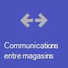
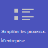
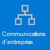
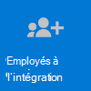

# Commencer à travailler avec Teams vente au détail

Les environnement de vente au détail, avec leur plannings tournants et du personnel à la demande, ont des besoins très différents par rapport à d’autres organisations. Pour tirer le meilleur parti de votre organisation commerciale, vous devez d’abord choisir les scénarios Teams qui peuvent vous aider dans vos opérations quotidiennes, puis vous assurer de préparer votre environnement Teams avec les principes de base, les équipes et les applications qui s’appuient sur ces scénarios.

1. [Choisissez les scénarios](#choose-your-scenarios) que vous voulez implémenter pour votre entreprise.
:::image type="content" source="../media/retail-teams-scenarios.png" alt-text="Diagramme montrant Teams de vente au détail" lightbox="../media/retail-teams-scenarios.png":::
1. [Définissez les principes de base ](#set-up-the-fundamentals): prendre en charge votre personnel sur les principes de base : la gestion des comptes et des appareils et la mise en place Teams stratégies appropriées. :::image type="content" source="../media/retail-teams-fundamentals.png" alt-text="Diagramme illustrant les principes de base, notamment les stratégies, comptes et appareils Teams." lightbox="../media/retail-teams-fundamentals.png":::
1. [Configurer des équipes et des applications](#set-up-teams-and-apps) - Utilisez des modèles d’équipe pour configurer rapidement les équipes dont vous avez besoin, y compris les canaux et applications dont vous avez besoin pour votre entreprise. Ajoutez d’autres applications de Microsoft Corporation si nécessaire pour prendre en charge vos scénarios.
:::image type="content" source="../media/retail-teams-apps.png" alt-text="Diagramme montrant les équipes, les modèles d’équipe et les applications qui peuvent être inclus" lightbox="../media/retail-teams-apps.png":::

<!-- Additional capabilities for retail environments are available with the Microsoft Cloud for Retail, which includes capabilities from Dynamics 365 and Microsoft Azure as well as the Microsoft 365 features. For more information, see [Microsoft Cloud for Retail](/industry/retail/). -->

## Choisir vos scénarios

Microsoft 365 et Microsoft Teams proposent plusieurs fonctionnalités qui peuvent aider les entreprises de vente au détail dans leurs opérations quotidiennes et leur transformation numérique. Nous vous recommandons les scénarios suivants pour les organisations de vente au détail :

     

> [!NOTE]
> Ces scénarios font également partie du cloud Microsoft pour le commerce de détail. Ces scénarios vous offrent davantage de possibilités si vous utilisez également d’autres fonctionnalités de Microsoft Cloud pour la distribution, telles que Microsoft Dynamics 365. En savoir plus sur l’utilisation de cette solution qui regroupe les fonctionnalités Azure, Dynamics 365 et Microsoft 365 dans [Microsoft Cloud for Retail](/industry/retail)

### Communication et collaboration en magasin

Rassemblez les associés et la direction dans le Store pour collaborer et simplifier les opérations avec Teams et les applis Teams.

**Applications clés :** Plannings, talkie-walkie, tâches, approbations, conversation, compliment, listes, fichiers

**Services supplémentaires :** Viva Connections, SharePoint, Power Platform et Power Apps

Informations complémentaires : [Collaboration avec l’équipe de vente au détail](retail-team-collaboration.md)

### Communication et collaboration entre magasins

Les membres du personnel enseignant peuvent communiquer et collaborer entre plusieurs magasins dans une région ou avec leur siège social en utilisant les mêmes outils et applications que vous utilisez dans votre magasin.

**Applications clés :** Plannings, talkie-walkie, tâches, approbations, conversation, compliment, listes, fichiers

**Services supplémentaires :** Viva Connections, Yammer, SharePoint, Power Platform et Power Apps

Informations complémentaires : [Collaboration avec l’équipe de vente au détail](retail-team-collaboration.md)

### Ajustements et consultations virtuels

L’application Bookings dans Microsoft Teams permet aux organisations de planifier et de gérer des rendez-vous virtuels pour les associés et les clients. Utilisez-la pour planifier des rendez-vous virtuels tels que des expériences d’achat virtuel.

**Fonctionnalités et applications clés :** réunions, Bookings

Informations complémentaires : [Visites virtuelles avec Microsoft Teams et l’application Bookings](bookings-virtual-visits.md)

### Simplifier les processus d’entreprise

Vous pouvez utiliser des applications Teams, Power Apps et Power BI pour simplifier les processus d’entreprise. Par exemple, vous pouvez :

- Définissez et maintenez des plannings pour vos employés avec Plannings.
- Effectuez des inventaires et des marche-pied dans le Store avec Power Apps.
- Suivez les indicateurs de performance clés (KPIs) avec lrd rapports Power BI.

**Applications clés :** Plannings, tâches, listes, approbations

**Services supplémentaires :** Power Plaftorm avec Power Apps et Power BI

Informations complémentaires : [simplifier les processus d’entreprise](retail-business-processes.md)

### Communications d’entreprise

L’engagement des employés contribue  beaucoup à la satisfaction de l’entreprise, à la fidélité et à la productivité au niveau de toute organisation. Découvrez comment informer et engager tout le monde à l’aide de connexions SharePoint, Teams, Yammer, Stream et Viva Connections.

**Services supplémentaires :** Viva Connections, SharePoint, Stream, Yammer

Informations complémentaires : [Communications organisationnelles : recommandations, méthodes et produits](/sharepoint/corporate-communications-overview)

### Intégration de nouveaux employés

Faites de l’intégration de nouveaux employés une excellente expérience en favorisez un environnement de travail hybride tout-en-un dans lequel les nouveaux employés peuvent trouver des ressources importantes, rencontrer des personnes au sein de leur organisation et préparer la réussite de leur nouveau rôle.

**Applications clés :** Listes, réunions en direct

**Services supplémentaires :** Viva Learning, SharePoint et Yammer

Informations complémentaires : [Intégrer de nouveaux employés](/sharepoint/onboard-employees)

> [!NOTE]
> Pour toutes ces fonctionnalités, les utilisateurs doivent avoir une licence appropriée. Microsoft 365 pour les employés en ligne F1 et F3 ou Office 365 F3, Office 365 A3, A5, E3 et E5, ainsi que Microsoft 365 Business Standard, Business Premium, A3, A5, E3 et E5 sont tous pris en charge. Si vous souhaitez en savoir plus sur les licences générales de Teams, veuillez consulter la rubrique [Gérer l’accès des utilisateurs à Teams](../user-access.md). Pour plus [d’informations sur l’utilisation](../flw-licensing-options.md) de Microsoft 365 de ligne avec d’autres licences, voir Les options de licence pour les employés en ligne.

## Définir les principes de base

Insérez les fondations appropriées pour vos travailleurs en choisissant les licences appropriées pour eux, en gérant leurs comptes et en gérant leurs appareils afin de fournir un moyen sécurisé et conforme pour l’ensemble de leur travail.

:::image type="content" source="../media/retail-teams-fundamentals.png" alt-text="Diagramme des principes de base qui supportent les scénarios de Teams, tels que les stratégies Teams et les comptes et appareils.":::

### Gestion des licences

Les employés de vente au détail sont généralement des employés mobiles : employés en ligne et responsables qui ne sont pas liés aux ordinateurs toute la journée, contrairement au personnel de l’entreprise. Les outils et applications dont ils ont besoin sont donc différents. Microsoft 365 pour les employés en ligne fournit un ensemble de fonctionnalités adapté à ce public. Pour en savoir plus, [consultez les options de licence pour les employés en ligne](../flw-licensing-options.md).

### Comptes

Avec un taux de renouvellement élevé, il est essentiel de pouvoir ajouter et supprimer des comptes rapidement, et d’obtenir les stratégies qui s’emploient. Obtenez l’Assistant Intégration des travailleurs de première ligne dans le Centre d'administration Microsoft 365. L’Assistant met en place une équipe pour vos employés de première ligne et attribue des licences et des packages de stratégie à chaque membre de l’équipe. Pour plus d’informations, voir Utiliser l’Assistant Intégration des employés de première ligne pour rendre votre personnel en [première ligne opérationnel](../flw-onboarding-wizard.md).

Si vous devez ajouter un grand nombre d’utilisateurs (plus de 100), vous pouvez rapidement mettre en service les utilisateurs et les équipes et affecter toutes les stratégies pertinentes avec un déploiement scripté pour les employés en [première ligne.](../flw-scripted-deployment.md)

La présence des employés en ligne est souvent moins prévisible que les autres employés, car leurs heures de travail ne sont généralement pas les mêmes chaque jour. En tant qu’administrateur, vous pouvez configurer Teams avec l’accès en équipe (prévisualisation) afin d’afficher un ensemble d’états de présence basés sur shift pour les employés de première ligne de votre organisation qui indiquent quand ils sont en déplacement. Vous pouvez également gérer l’accès aux employés Teams employés en dehors de leur bureau. Pour plus d’informations, afficher [Gérer l’accès en équipe pour les employés de première ligne](shifts/manage-shift-based-access-flw.md)

### Appareils

Étant donné que le personnel est largement mobile, la gestion des comptes et des appareils est essentielle pour les environnements de vente au détail. Vous devez définir un point de comparaison sécurisé et conforme avec des appareils gérés que votre personnel peut utiliser, qu’il s’agit d’un appareil partagé ou du propre appareil d’un employé. Pour plus d’informations, voir :

- [Planifier le déploiement Azure Active Directory appareils](/azure/active-directory/devices/plan-device-deployment)
- [Microsoft Intune vue d’ensemble](/mem/intune/fundamentals/what-is-intune#manage-devices)
- [Microsoft Teams pour RealWear](../flw-realwear.md)

### Stratégies

Assurez-vous que vos collaborateurs commerciaux et les autres employés de première ligne ont accès aux fonctionnalités de Teams en configurant les packages de stratégie appropriés. Teams stratégies d’entreprise vous aident à contrôler ce que les utilisateurs à rôles spécifiques peuvent faire. Les [packages de stratégies pour](../manage-policy-packages.md#policy-packages-included-in-teams) les employés de première ligne et les gestionnaires de première ligne sont adaptés aux employés de première ligne, tels que ceux des magasins de détail.

Teams est intégré à l’application Plannings et à l’application Employé de première ligne, qui peuvent être utilisées pour coordonner les fonctionnalités de personnel en équipe, etc. Par exemple, dans Plannings, les gestionnaires de magasin peuvent configurer et coordonner des plannings pour leur personnel, et les employés peuvent vérifier les plannings et échanger les plannings.

## Configurer des équipes et des applications

:::image type="content" source="../media/retail-teams-apps.png" alt-text="Diagramme d’équipes, de modèles d’équipe et d’applications qui peuvent être inclus.":::

### Applications et services pour la vente au détail

Assurez-vous que vos employés peuvent communiquer, collaborer et fournir un service clientèle idéal avec des applications telles que Planning, talkie-walkie, tâches, listes, compliment, etc. Vous pouvez déterminer quelles applications sont disponibles pour vos utilisateurs en les activant dans le Centre d’administration Teams ou en les incluant dans un modèle d’équipe. Informations supplémentaires sur [la gestion des applis Teams](../manage-apps.md)

Pour les environnements de vente au détail, les applis et les services suivants peuvent vous aider à transformer vos processus d’entreprise et à prendre en charge la communication :

| Applications et services Teams | Description | Gestion | Aide |
| ----- | ----- | ----- | ----- |
| Approbations | Les approbations peuvent être intégrées à la conversation pour faciliter la déconnexion. | [Gérer les approbations](../approval-admin.md) | [Utiliser les approbations](https://support.microsoft.com/office/what-is-approvals-a9a01c95-e0bf-4d20-9ada-f7be3fc283d3) |
| Conversation | Activez les conversations rapides et les vérifications entre les membres du personnel à l’aide d’outils de communication sécurisés de niveau entreprise, au lieu d’applications ou de SMS de qualité consommateur. | [Conversation, équipes, canaux et applications dans Microsoft Teams](../deploy-chat-teams-channels-microsoft-teams-landing-page.md) | [Discuter dans Teams](https://support.microsoft.com/office/start-and-pin-chats-a864b052-5e4b-4ccf-b046-2e26f40e21b5?wt.mc_id=otc_microsoft_teams) |
| Documents | Partagez des procédures d’exploitation standard, des stratégies de magasin, des plans, etc. | [Comment SharePoint et OneDrive interagissent entre les Microsoft Teams](../sharepoint-onedrive-interact.md) ? | [Partager des fichiers](https://support.microsoft.com/office/upload-and-share-files-57b669db-678e-424e-b0a0-15d19215cb12) |
| Compliment | Reconnaissez vos collègues pour travailler en équipe avec l’appli Compliment. | [Gérer l’appli Compliment](../manage-praise-app.md) | [Envoyer des Compliments aux personnes](https://support.microsoft.com/office/send-praise-to-people-50f26b47-565f-40fe-8642-5ca2a5ed261e) |
| Appareils Real Agent | Communication mains libres avec les appareils | [Microsoft Teams pour RealWear](../flw-realwear.md) | [Utiliser Microsoft Teams pour Real Grouper](https://support.microsoft.com/office/using-microsoft-teams-for-realwear-af20d232-d18c-476f-8031-843a4edccd5f) |
| Shifts | Gérez les plannings et les heures d’avance ou de fin avec Plannings. | [Gérer les plannings](shifts-for-teams-landing-page.md) | [Utiliser Plannings](https://support.microsoft.com/office/what-is-shifts-f8efe6e4-ddb3-4d23-b81b-bb812296b821) |
| Tâches | Aidez les employés à savoir sur quoi ils doivent se concentrer lorsqu’ils ne sont pas avec des clients en leur attribuant des tâches. Les opérations peuvent utiliser [la publication de tâches](../manage-tasks-app.md#task-publishing) pour envoyer des tâches à des emplacements et effectuer le suivi de leur avancement. | [Gérer l’appli Tâches](../manage-tasks-app.md) | [Utiliser les tâches](https://support.microsoft.com/office/use-the-tasks-app-in-teams-e32639f3-2e07-4b62-9a8c-fd706c12c070) |
| Talkie-walkie | Appuyez pour parler d’une communication rapide qui n’est pas limitée par des zones géographiques telles que les radios 2 sens standard.| [Gérer l’appli Talkie-walkie](../walkie-talkie.md) | [Utiliser le Talkie-walkie](https://support.microsoft.com/office/get-started-with-teams-walkie-talkie-25bdc3d5-bbb2-41b7-89bf-650fae0c8e0c) |

| Autres applications et services de Microsoft | Description | Gestion | Aide |
| ----- | ----- | ----- | ----- |
| Bookings | Activez les ajustements et consultations virtuels. | [Visites virtuelles avec Microsoft Teams et l’application Bookings](bookings-virtual-visits.md) | [Utiliser Bookings](https://support.microsoft.com/en-us/office/what-is-bookings-42d4e852-8e99-4d8f-9b70-d7fc93973cb5) |
| Power Apps et Power Platform | Intégrez les processus d’entreprise et activer les mises à jour rapides des données, telles que le stock, les numéros de vente, les rapports d’incident, etc. | [L’intégration Teams avec Microsoft Power Platform](/microsoftteams/platform/samples/teams-low-code-solutions) et [la gestion des applications Microsoft Power Platform dans le centre d’administration Microsoft Teams](../manage-power-platform-apps.md) | -  |
| Microsoft Office SharePoint Online | Lorsque vous créez une équipe, un nouveau site SharePoint est créé et connecté à l’équipe. Bon nombre des scénarios ci-dessus s’appuient sur SharePoint fonctionnalités déjà incorporées dans Teams, telles que le partage de documents pour la collaboration d’équipe. | [L’intégration Teams et le groupe SharePoint](/sharepoint/teams-connected-sites) | [Ajouter une page SharePoint, une liste ou une bibliothèque de documents sous la Teams](https://support.microsoft.com/office/add-a-sharepoint-page-list-or-document-library-as-a-tab-in-teams-131edef1-455f-4c67-a8ce-efa2ebf25f0b)|
| Viva Connections | Soit Connections crée un hub dans Teams où vos associés au vente au détail peuvent consulter un flux d’actualités personnalisé de votre organisation et un tableau de bord personnalisé avec les ressources dont ils ont besoin. | [Présentation de Viva Connections](/sharepoint/viva-connections-overview) | [Viva Connections dans Microsoft Teams](https://support.microsoft.com/office/your-intranet-is-now-in-microsoft-teams-8b4e7f76-f305-49a9-b6d2-09378476f95b) |
| Viva Learning | Fournissez des formations en cas de besoin, directement dans le flux de leur travail. | [Gérer Viva Learning](/microsoft-365/learning/) | [Utiliser Viva Learning (prévisualisation)](https://support.microsoft.com/office/viva-learning-preview-01bfed12-c327-41e0-a68f-7fa527dcc98a) |
| Yammer | Connecter votre organisation et autoriser les communications entre services et régions avec Yammer | [Gérer Yammer](/yammer) | [Utiliser Yammer](https://support.microsoft.com/office/what-is-yammer-1b0f3b3e-89ee-4b66-aac5-30def12f287c) |

### Utiliser des modèles pour configurer des équipes

Créez des équipes qui incluent un ensemble prédéfini de paramètres, de canaux, d’onglets et d’applications préinstallées pour la communication et la collaboration au sein d’un magasin individuel, avec une région, ou entre le siège social et votre personnel, où qu’ils se trouveront.

- Le modèle Organiser **un magasin de vente au détail** inclut des canaux général, de remise des plannings, de disponibilité du store et de Learning, ainsi que les applis Approbations, Tâches et Wiki.
- Le **modèle Commercial pour les gestionnaires** inclut des canaux général, des opérations et des Learning ainsi qu’un onglet Wiki.

Vous pouvez également [créer un modèle personnalisé pour](../create-a-team-template.md) inclure les applications dont votre Store a besoin. Plus d’informations [: Commencer à utiliser les modèles d’équipe Commercial](../get-started-with-retail-teams-templates.md) ?

Mis à part les modèles d’équipe, vous pouvez également configurer d’autres sites et services pour faciliter la communication : sites SharePoint et Viva Connections.

- Configurez les sites SharePoint pour créer une page d’accueil pour votre organisation, distribuer des actualités au sein de votre entreprise et fournir un emplacement avec des ressources pour l’intégration des utilisateurs. En savoir plus sur l’utilisation SharePoint sites de gestion des scénarios de communications d’entreprise sur les communications de l’organisation [: recommandations, méthodes et produits](/sharepoint/corporate-communications-overview).
- Utilisez Viva connexions afin de tout rassembler. Avec Viva Connections comme accueil de vos employés dans Teams, ils peuvent obtenir des mises à jour sur leurs tâches, des nouvelles de l'organisation, et plus encore. Pour plus d’informations, voir Vue d’ensemble [: Viva Connections (Prévisualisation)](/viva/connections/viva-connections-overview) et ajouter l’appli [Viva Connections dans le centre d’administration Teams (Prévisualisation).](/viva/connections/add-viva-connections-app)

## Préparez-vous à déployer vos scénarios : identifiez les rôles et responsabilités pour les scénarios.

À présent que vous connaissez les scénarios que vous voulez implémenter et ce dont vous avez besoin pour les prendre en charge, vous pouvez réunir votre équipe afin de pouvoir planifier, déployer et contrôler leur fonctionnement au travail dans votre organisation. Par exemple, les rôles suivants seront peut-être nécessaires pour déployer ces scénarios dans votre organisation :

| Image | Rôle | Responsibilities | Service |
| ---- | ---- | ----- | ----- |
| | Administrateur informatique | Travaillez avec les gestionnaires des opérations et de la gestion de la vente au détail pour définir des scénarios et la manière dont ils fonctionneront pour l’organisation.   Configurez les paramètres du centre d’administration Teams, tels que les stratégies et les modèles, et activez les applis.   Définissez les paramètres des applis (par exemple, les paramètres Shifts globaux) pour l’organisation.   Ajoutez et octroyez une licence aux utilisateurs.  | Service informatique |
|| Operations du personnel | Travaillez avec les administrateurs pour définir des scénarios et déterminer les paramètres, stratégies, modèles et applications nécessaires pour Teams.   Créer des équipes régionales ou divisionnelles à partir de modèles   Définissez les tâches, les listes et les flux d’approbation pour une coordination entre les magasins situés à l’intérieur d’une région ou entre les magasins et le siège social.   Configurer une infrastructure d’apprentissage pour le personnel | Opérations centralisées |
| | Gestionnaire du Store | Travaillez avec les administrateurs et le personnel des opérations pour définir des scénarios.   Créez des équipes pour le Store à partir de modèles.   Selon vos besoins, définissez des canaux et des applis pour les équipes. Par exemple : un canal pour les transferts   Configurer des plannings de magasin dans Plannings   Définissez des tâches, des listes et des flux d’approbation spécifiques au magasin.   Configurer des tâches pédagogiques pour le personnel | Gestion du Store |

Pour plus d’informations sur l’implémentation et l’adoption Teams, voir [Adopter Microsoft Teams](../adopt-microsoft-teams-landing-page.md)
