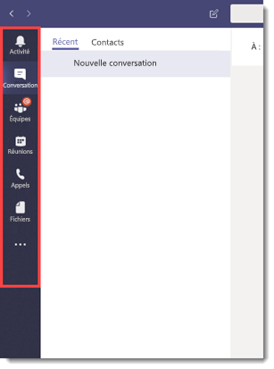
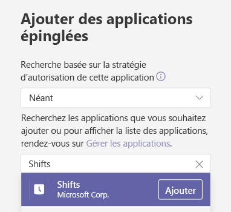
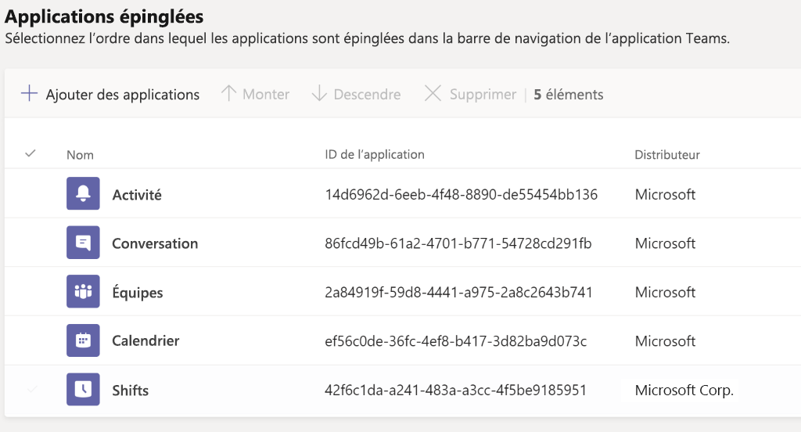
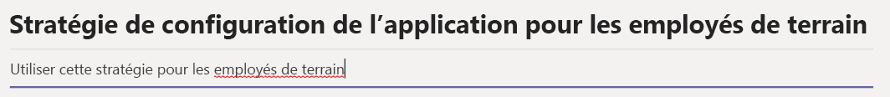
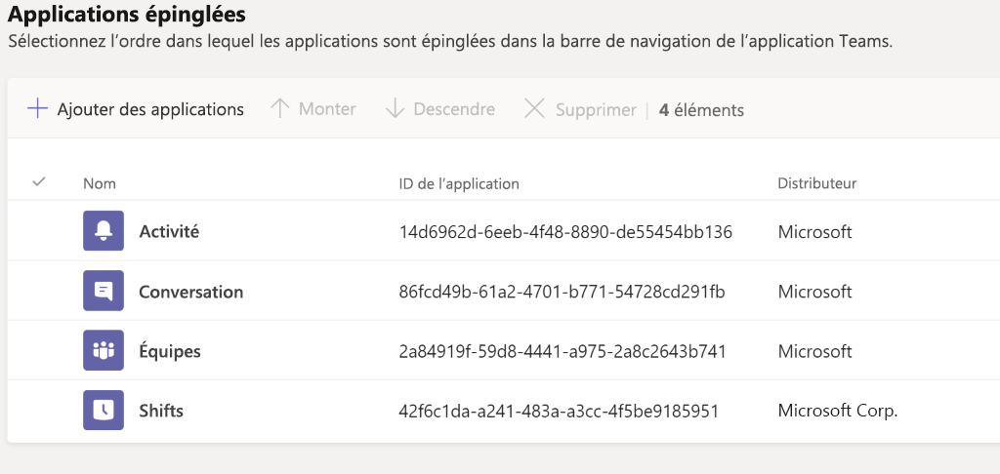
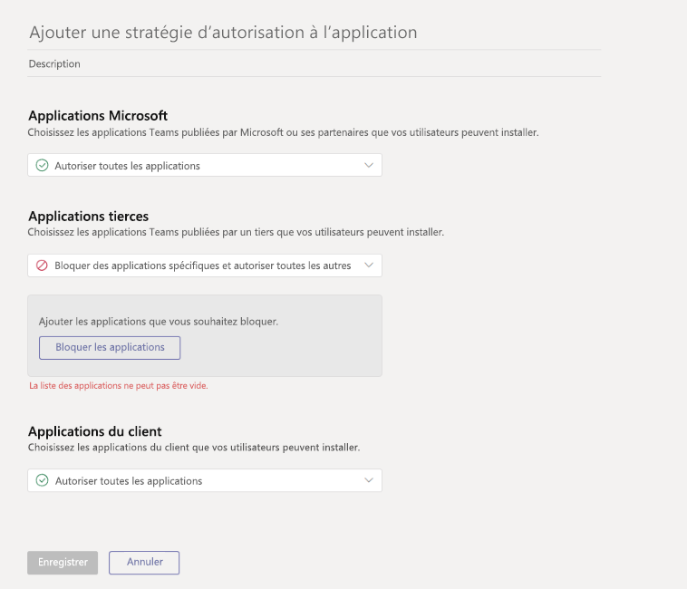

# <a name="how-to-provisions-teams-at-scale-for-firstline-workers"></a><span data-ttu-id="0dc34-103">Mettre en service Microsoft Teams à grande échelle pour les employés de terrain</span><span class="sxs-lookup"><span data-stu-id="0dc34-103">How to provisions Teams at scale for Firstline Workers</span></span>

<span data-ttu-id="0dc34-104">Avez-vous besoin d’intégrer rapidement un grand nombre d’utilisateurs à Microsoft Teams et de configurer une expérience uniformisée pour eux ?</span><span class="sxs-lookup"><span data-stu-id="0dc34-104">Do you need to rapidly onboard a large number of users to Microsoft Teams and configure a streamlined experience for them?</span></span> <span data-ttu-id="0dc34-105">Vous pouvez mettre rapidement en service des identités et des équipes, et attribuer toutes les stratégies appropriées pour contrôler l’expérience des utilisateurs finaux en suivant les instructions suivantes.</span><span class="sxs-lookup"><span data-stu-id="0dc34-105">You can quickly provision identities, provision teams, and assign all relevant policies to control the end user experience by walking through the following instructions.</span></span>

<span data-ttu-id="0dc34-106">Dans cette procédure pas à pas, vous apprendrez à :</span><span class="sxs-lookup"><span data-stu-id="0dc34-106">In this walkthrough, you'll learn how to:</span></span>

- <span data-ttu-id="0dc34-107">Créer un grand nombre d’utilisateurs.</span><span class="sxs-lookup"><span data-stu-id="0dc34-107">Create a large number of users.</span></span>
- <span data-ttu-id="0dc34-108">Créer un grand nombre d’équipes et configurer les canaux appropriés.</span><span class="sxs-lookup"><span data-stu-id="0dc34-108">Create a large number of teams and set up the appropriate channels.</span></span>
- <span data-ttu-id="0dc34-109">Attribuer une licence à grande échelle.</span><span class="sxs-lookup"><span data-stu-id="0dc34-109">Assign licensing at scale.</span></span>
- <span data-ttu-id="0dc34-110">Créer des stratégies de messagerie, de configuration d’application et d’autorisation d’application d’équipes appropriées.</span><span class="sxs-lookup"><span data-stu-id="0dc34-110">Create appropriate Teams Messaging Policies, App Setup Policies, and App Permission Policies.</span></span>
- <span data-ttu-id="0dc34-111">Appliquer ces stratégies à grande échelle à des utilisateurs.</span><span class="sxs-lookup"><span data-stu-id="0dc34-111">Apply those policies to users at scale.</span></span>
- <span data-ttu-id="0dc34-112">Affecter un grand nombre d’utilisateurs à une équipe désignée.</span><span class="sxs-lookup"><span data-stu-id="0dc34-112">Assign a large number of users into a designated team.</span></span>

## <a name="prerequisites"></a><span data-ttu-id="0dc34-113">Conditions préalables</span><span class="sxs-lookup"><span data-stu-id="0dc34-113">Prerequisites</span></span>

<span data-ttu-id="0dc34-114">Téléchargez les actifs à partir de [cet emplacement](https://github.com/MicrosoftDocs/OfficeDocs-SkypeForBusiness/blob/live/Teams/downloads/FLWTeamsScale.zip?raw=true).</span><span class="sxs-lookup"><span data-stu-id="0dc34-114">Download the assets from [this location](https://github.com/MicrosoftDocs/OfficeDocs-SkypeForBusiness/blob/live/Teams/downloads/FLWTeamsScale.zip?raw=true).</span></span>

> [!IMPORTANT]
> <span data-ttu-id="0dc34-115">Les scripts proposés dans le lien fourni ci-dessus sont fournis tels quels par Microsoft et doivent être modifiés en fonction de vos besoins individuels.</span><span class="sxs-lookup"><span data-stu-id="0dc34-115">The scripts in the link provided above are provided as-is by Microsoft, and must be modified for your individual needs.</span></span>

## <a name="technical-requirements"></a><span data-ttu-id="0dc34-116">Exigences techniques</span><span class="sxs-lookup"><span data-stu-id="0dc34-116">Technical requirements</span></span>

- <span data-ttu-id="0dc34-117">Votre client doit disposer du nombre approprié de licences disponibles qui incluent Microsoft Teams.</span><span class="sxs-lookup"><span data-stu-id="0dc34-117">Your tenant must have the appropriate number of licenses available that include Microsoft Teams.</span></span> <span data-ttu-id="0dc34-118">Si vous n’avez pas encore ces licences, suivez les instructions fournies ici pour activer la [version d’évaluation gratuite d’Office 365 E1](e1-trial-license.md).</span><span class="sxs-lookup"><span data-stu-id="0dc34-118">If you do not already have these licenses, follow the instructions here to activate the [Office 365 E1 Free Trial](e1-trial-license.md).</span></span>
- <span data-ttu-id="0dc34-119">L’utilisateur qui effectue ces étapes doit le faire avec le rôle d’administrateur général ou le rôle d’administrateur d’utilisateurs dans Azure AD.</span><span class="sxs-lookup"><span data-stu-id="0dc34-119">The user taking these steps must do so in the role of Global Admin or User Admin in Azure AD.</span></span>
- <span data-ttu-id="0dc34-120">L’utilisateur doit disposer des droits permettant d’installer et de configurer le logiciel sur son ordinateur local.</span><span class="sxs-lookup"><span data-stu-id="0dc34-120">User must have the rights to install and configure software on their local machine.</span></span>

## <a name="step-by-step-process-overview"></a><span data-ttu-id="0dc34-121">Vue d’ensemble du processus étape par étape</span><span class="sxs-lookup"><span data-stu-id="0dc34-121">Step-by-step process overview</span></span>

1. <span data-ttu-id="0dc34-122">**Configuration de votre environnement**</span><span class="sxs-lookup"><span data-stu-id="0dc34-122">**Setup Your Environment**</span></span>
    1. <span data-ttu-id="0dc34-123">Télécharger le fichier ZIP contenant les exemples de scripts PowerShell et la documentation</span><span class="sxs-lookup"><span data-stu-id="0dc34-123">Download the ZIP file containing the sample PowerShell scripts and documentation</span></span>
    1. <span data-ttu-id="0dc34-124">Configurer les informations d’identification</span><span class="sxs-lookup"><span data-stu-id="0dc34-124">Setup credentials</span></span>
    1. <span data-ttu-id="0dc34-125">Configurer l’environnement local</span><span class="sxs-lookup"><span data-stu-id="0dc34-125">Configure local environment</span></span>
    1. <span data-ttu-id="0dc34-126">Configurer les modules PowerShell et les variables d’environnement</span><span class="sxs-lookup"><span data-stu-id="0dc34-126">Configure PowerShell Modules and Environmental Variables</span></span>
    1. <span data-ttu-id="0dc34-127">Créer l’inscription des applications</span><span class="sxs-lookup"><span data-stu-id="0dc34-127">Create App Registration</span></span>
1. <span data-ttu-id="0dc34-128">**Création et configuration d’équipes**</span><span class="sxs-lookup"><span data-stu-id="0dc34-128">**Create and Setup Teams**</span></span>
    1. <span data-ttu-id="0dc34-129">Créer des équipes</span><span class="sxs-lookup"><span data-stu-id="0dc34-129">Create Teams</span></span>
    1. <span data-ttu-id="0dc34-130">Créer des canaux pour les équipes</span><span class="sxs-lookup"><span data-stu-id="0dc34-130">Create Channels for Teams</span></span>
1. <span data-ttu-id="0dc34-131">**Création de stratégies d’équipes**</span><span class="sxs-lookup"><span data-stu-id="0dc34-131">**Create Teams Policies**</span></span>
    1. <span data-ttu-id="0dc34-132">Créer des stratégies de messagerie d’équipes</span><span class="sxs-lookup"><span data-stu-id="0dc34-132">Create Teams Messaging Policies</span></span>
    1. <span data-ttu-id="0dc34-133">Créer des stratégies de configuration d’application d’équipes</span><span class="sxs-lookup"><span data-stu-id="0dc34-133">Create Teams App Setup Policies</span></span>
    1. <span data-ttu-id="0dc34-134">Créer des stratégies d’autorisation d’application d’équipes</span><span class="sxs-lookup"><span data-stu-id="0dc34-134">Create Teams App Permission Policies</span></span>
1. <span data-ttu-id="0dc34-135">**Création et configuration d’utilisateurs**</span><span class="sxs-lookup"><span data-stu-id="0dc34-135">**Create and Setup Users**</span></span>
    1. <span data-ttu-id="0dc34-136">Créer des groupes d’utilisateurs et des groupes de sécurité</span><span class="sxs-lookup"><span data-stu-id="0dc34-136">Create users and security groups</span></span>
    1. <span data-ttu-id="0dc34-137">Attribuer des licences à des utilisateurs au moyen de licences en fonction des groupes</span><span class="sxs-lookup"><span data-stu-id="0dc34-137">Assign licensing to users via group-based licensing</span></span>
1. <span data-ttu-id="0dc34-138">**Attribution d’utilisateurs et de stratégies**</span><span class="sxs-lookup"><span data-stu-id="0dc34-138">**Assign Users and Policies**</span></span>
    1. <span data-ttu-id="0dc34-139">Affecter des utilisateurs à des équipes</span><span class="sxs-lookup"><span data-stu-id="0dc34-139">Assign users to Teams</span></span>
    1. <span data-ttu-id="0dc34-140">Affecter des stratégies à des utilisateurs et à des groupes</span><span class="sxs-lookup"><span data-stu-id="0dc34-140">Assign policies to User and Groups</span></span>
1. <span data-ttu-id="0dc34-141">**Test et validation**</span><span class="sxs-lookup"><span data-stu-id="0dc34-141">**Test and Validate**</span></span>
    1. <span data-ttu-id="0dc34-142">Rechercher des erreurs</span><span class="sxs-lookup"><span data-stu-id="0dc34-142">Check for errors</span></span>
    1. <span data-ttu-id="0dc34-143">Se connecter à Teams à l’aide d’un utilisateur test</span><span class="sxs-lookup"><span data-stu-id="0dc34-143">Login to Teams with a test user</span></span>

## <a name="set-up-your-environment"></a><span data-ttu-id="0dc34-144">Configuration de votre environnement</span><span class="sxs-lookup"><span data-stu-id="0dc34-144">Set up your environment</span></span>

<span data-ttu-id="0dc34-145">Les étapes suivantes vous permettront de configurer votre environnement :</span><span class="sxs-lookup"><span data-stu-id="0dc34-145">The following steps will allow you to set up your environment:</span></span>

### <a name="download-zip-file-containing-sample-powershell-scripts"></a><span data-ttu-id="0dc34-146">Télécharger le fichier. zip contenant des exemples de scripts PowerShell</span><span class="sxs-lookup"><span data-stu-id="0dc34-146">Download .zip file containing sample PowerShell scripts</span></span>

<span data-ttu-id="0dc34-147">Avant de continuer, vous devez télécharger les scripts à [cet emplacement](https://github.com/MicrosoftDocs/OfficeDocs-SkypeForBusiness/blob/live/Teams/downloads/FLWTeamsScale.zip?raw=true).</span><span class="sxs-lookup"><span data-stu-id="0dc34-147">Before you can proceed, you'll need to download the scripts at [this location](https://github.com/MicrosoftDocs/OfficeDocs-SkypeForBusiness/blob/live/Teams/downloads/FLWTeamsScale.zip?raw=true).</span></span>

### <a name="setup-credentials"></a><span data-ttu-id="0dc34-148">Configurer les informations d’identification</span><span class="sxs-lookup"><span data-stu-id="0dc34-148">Setup Credentials</span></span>

<span data-ttu-id="0dc34-149">Pour simplifier les choses, nous avons choisi de créer un fichier de référence contenant vos informations d’identification dans ce document et dans les exemples de scripts.</span><span class="sxs-lookup"><span data-stu-id="0dc34-149">In this document and the sample scripts we've chosen to create a reference file that contains your credentials in order to make things easier.</span></span> <span data-ttu-id="0dc34-150">Cette technique permet de supprimer la nécessité d’authentifier tous les points de terminaison de service tout en conservant les informations d’identification dans un magasin local.</span><span class="sxs-lookup"><span data-stu-id="0dc34-150">This technique removes the need for you to authenticate to all the various service endpoints while maintaining the credentials in a local store.</span></span> <span data-ttu-id="0dc34-151">Pour exécuter les scripts suivants, vous devez mettre à jour ce fichier de référence avec les informations d’identification propres à vous et à votre environnement.</span><span class="sxs-lookup"><span data-stu-id="0dc34-151">In order to run the subsequent scripts, you'll need to update that reference file with the credentials that are unique to you and your environment.</span></span> <span data-ttu-id="0dc34-152">À partir de chaque script suivant, les informations d’identification appropriées sont lues à l’aide de la fonction d’assistance que nous avons appelée **GetCreds**. Ces informations d’identification sont utilisées pour se connecter aux différents services.</span><span class="sxs-lookup"><span data-stu-id="0dc34-152">From within each subsequent script, the appropriate credentials are read with the helper function  we've called **GetCreds**, and those credentials are used to connect to the various services.</span></span>

<span data-ttu-id="0dc34-153">Il n’est pas rare que différents services nécessitent des informations d’identification différentes.</span><span class="sxs-lookup"><span data-stu-id="0dc34-153">It's not uncommon for different services to require different credentials.</span></span> <span data-ttu-id="0dc34-154">Par exemple, vous pouvez avoir des informations d’identification différentes pour MicrosoftTeams, AzureAD et MSonline. Dans ce cas, vous pouvez exécuter la fonction SetCred et enregistrer chaque fichier d’informations d’identification avec un nom approprié.</span><span class="sxs-lookup"><span data-stu-id="0dc34-154">For example you might have different credentials for MicrosoftTeams, AzureAD, and MSonline, in which case you can run SetCred saving each credential file with its own meaningful name.</span></span>

<span data-ttu-id="0dc34-155">Exemples : SetCreds msol-cred.xml SetCreds azuread-cred.xml SetCreds teams-cred.xml</span><span class="sxs-lookup"><span data-stu-id="0dc34-155">Examples: SetCreds msol-cred.xml SetCreds azuread-cred.xml SetCreds teams-cred.xml</span></span>

> [!NOTE]
> <span data-ttu-id="0dc34-156">Le compte utilisé pour les informations d’identification ne peut pas nécessiter d’authentification multifacteur.</span><span class="sxs-lookup"><span data-stu-id="0dc34-156">The account used for the credentials cannot require MFA.</span></span>

<span data-ttu-id="0dc34-157">Voici un exemple de la façon dont les différents scripts utilisent les informations d’identification enregistrées pour s’authentifier par la suite :</span><span class="sxs-lookup"><span data-stu-id="0dc34-157">Here is an example of how the various scripts then use the saved credentials to authenticate:</span></span>

```azurepowershell
# Connect to MicrosoftTeams
$teams_cred = GetCreds teams-cred.xml
Connect-MicrosoftTeams -Credential $teams_cred
```

<span data-ttu-id="0dc34-158">Pour pouvoir déterminer vos informations d’identification, procédez comme suit :</span><span class="sxs-lookup"><span data-stu-id="0dc34-158">In order to set your credentials, complete the following:</span></span>

1. <span data-ttu-id="0dc34-159">Recherchez le script **SetCreds.ps1** dans les actifs du fichier .zip.</span><span class="sxs-lookup"><span data-stu-id="0dc34-159">Find the **SetCreds.ps1** in the .zip file assets.</span></span>
1. <span data-ttu-id="0dc34-160">À partir de PowerShell, exécutez le script **SetCreds.ps1** pour enregistrer vos informations d’identification.</span><span class="sxs-lookup"><span data-stu-id="0dc34-160">From PowerShell run the **SetCreds.ps1** script to save your credentials.</span></span>
    1. <span data-ttu-id="0dc34-161">La fenêtre « Exécution de l’opération "Export-Clixml"…» s’affiche et vous devez entrer « O » pour approuver.</span><span class="sxs-lookup"><span data-stu-id="0dc34-161">You'll be prompted with "Performing the operation "Export-Clixml"..." and you'll need to enter 'Y' to approve.</span></span>

### <a name="configure-the-local-environment"></a><span data-ttu-id="0dc34-162">Configurer l’environnement local</span><span class="sxs-lookup"><span data-stu-id="0dc34-162">Configure the local environment</span></span>

1. <span data-ttu-id="0dc34-163">Recherchez le script **SetConfig.ps1** dans les actifs du fichier .zip.</span><span class="sxs-lookup"><span data-stu-id="0dc34-163">Find the **SetConfig.ps1** in the .zip file assets.</span></span>
1. <span data-ttu-id="0dc34-164">À partir de PowerShell, exécutez la commande suivante en remplaçant les entrées entre crochets par vos propres informations.</span><span class="sxs-lookup"><span data-stu-id="0dc34-164">From PowerShell run the following command, replacing the bracketed entries with your specific information.</span></span>
    1. <span data-ttu-id="0dc34-165">**SetConfig.ps1** -tenantName [nom de votre client] -rootPath "[chemin d’accès complet à la racine du référentiel Git]"</span><span class="sxs-lookup"><span data-stu-id="0dc34-165">**SetConfig.ps1** -tenantName [your tenant name] -rootPath "[full path to the root of the git repo]"</span></span>

<span data-ttu-id="0dc34-166">Par exemple : `.\SetConfig.ps1 -tenantName contoso.onmicrosoft.com -rootPath "C:\data\source\FLWTeamsScale"`</span><span class="sxs-lookup"><span data-stu-id="0dc34-166">For example: `.\SetConfig.ps1 -tenantName contoso.onmicrosoft.com -rootPath "C:\data\source\FLWTeamsScale"`</span></span>

### <a name="configure-powershell-modules-and-environmental-variables"></a><span data-ttu-id="0dc34-167">Configurer les modules PowerShell et les variables d’environnement</span><span class="sxs-lookup"><span data-stu-id="0dc34-167">Configure PowerShell modules and environmental variables</span></span>

<span data-ttu-id="0dc34-168">Avant de continuer, vous devez installer plusieurs modules PowerShell et vous y connecter, y compris Azure AD, MSAL, MSCloudUtils et MicrosoftTeams.</span><span class="sxs-lookup"><span data-stu-id="0dc34-168">Before you go further, you'll need to install and connect to several PowerShell modules, including Azure AD, MSAL, MSCloudUtils, and MicrosoftTeams.</span></span>

1. <span data-ttu-id="0dc34-169">Recherchez le script **ConfigurePowerShellModules.ps1** dans les actifs du fichier .zip.</span><span class="sxs-lookup"><span data-stu-id="0dc34-169">Find the **ConfigurePowerShellModules.ps1** in the .zip file assets.</span></span>
1. <span data-ttu-id="0dc34-170">Modifiez les variables d’environnement suivantes et remplacez-les par vos variables :</span><span class="sxs-lookup"><span data-stu-id="0dc34-170">Edit and replace the following environmental variables with your variables:</span></span>
1. <span data-ttu-id="0dc34-171">À partir de PowerShell, exécutez le script **ConfigurePowerShellModules.ps1**.</span><span class="sxs-lookup"><span data-stu-id="0dc34-171">From PowerShell, run the **ConfigurePowerShellModules.ps1** script.</span></span>

## <a name="create-and-set-up-teams"></a><span data-ttu-id="0dc34-172">Créer et configurer des équipes</span><span class="sxs-lookup"><span data-stu-id="0dc34-172">Create and set up Teams</span></span>

<span data-ttu-id="0dc34-173">Pour communiquer et collaborer avec vos employés de terrain, vous devez tout d’abord établir une série d’équipes et ajouter des canaux standard à celles-ci. C’est ce que nous aborderons par la suite.</span><span class="sxs-lookup"><span data-stu-id="0dc34-173">In order to communicate and collaborate with your Firstline Workers, you will first need to establish a series of Teams and add standard Channels to those teams, which we'll walk through next.</span></span>

### <a name="create-teams"></a><span data-ttu-id="0dc34-174">Créer des équipes</span><span class="sxs-lookup"><span data-stu-id="0dc34-174">Create teams</span></span>

<span data-ttu-id="0dc34-175">Les équipes sont un ensemble de personnes, de contenu et d’outils au sein de votre organisation.</span><span class="sxs-lookup"><span data-stu-id="0dc34-175">Teams are a collection of people, content, and tools within your organization.</span></span> <span data-ttu-id="0dc34-176">Pour la plupart des organisations axées sur les employés de terrain, nous vous conseillons d’implanter une équipe dans un emplacement physique.</span><span class="sxs-lookup"><span data-stu-id="0dc34-176">For most Firstline Worker-centric organizations, it is best practice to anchor a Team around a physical location.</span></span> <span data-ttu-id="0dc34-177">Par exemple, une équipe pour chacun des éléments suivants :</span><span class="sxs-lookup"><span data-stu-id="0dc34-177">For example, a Team for each of the following:</span></span>

- <span data-ttu-id="0dc34-178">Magasin</span><span class="sxs-lookup"><span data-stu-id="0dc34-178">Store</span></span>
- <span data-ttu-id="0dc34-179">Centre de distribution</span><span class="sxs-lookup"><span data-stu-id="0dc34-179">Distribution Center</span></span>
- <span data-ttu-id="0dc34-180">Usine de fabrication</span><span class="sxs-lookup"><span data-stu-id="0dc34-180">Manufacturing Plant</span></span>
- <span data-ttu-id="0dc34-181">Hôpital</span><span class="sxs-lookup"><span data-stu-id="0dc34-181">Hospital</span></span>
- <span data-ttu-id="0dc34-182">Épicerie</span><span class="sxs-lookup"><span data-stu-id="0dc34-182">Grocery Store</span></span>

<span data-ttu-id="0dc34-183">*Discussion sur les meilleures pratiques* : lorsque vous concevez vos équipes, il est important de garder à l’esprit [les spécifications et les limites de Teams](limits-specifications-teams.md).</span><span class="sxs-lookup"><span data-stu-id="0dc34-183">*Best Practice Discussion*: When designing your teams, it's important to keep in mind [Teams limits and specifications](limits-specifications-teams.md).</span></span> <span data-ttu-id="0dc34-184">Pour les organisations de plus petite taille, une équipe à l’échelle de l’organisation peut être utilisée pour simplifier la communication et complémenter une structure dans un emplacement physique.</span><span class="sxs-lookup"><span data-stu-id="0dc34-184">For smaller organizations, an org-wide team can be used to streamline communication and complement a physical location structure.</span></span> <span data-ttu-id="0dc34-185">Pour d’autres, une convention d’affectation de noms d’équipe dans un emplacement physique structuré facilite les communications d’entreprise, car elle permet d’envoyer des messages croisés à plusieurs équipes simultanément et en toute simplicité.</span><span class="sxs-lookup"><span data-stu-id="0dc34-185">For others, a structured physical location Team naming convention helps assist Corporate Communications with Cross Posting to multiple teams simultaneously with ease.</span></span> <span data-ttu-id="0dc34-186">Par exemple, vous pouvez rechercher les équipes dont le nom contient le mot États-Unis et envoyer des messages croisés ciblés aux équipes situées aux États-Unis.</span><span class="sxs-lookup"><span data-stu-id="0dc34-186">For example, you can search and cross-post to all Teams with US in the name to target all US locations.</span></span> <span data-ttu-id="0dc34-187">Pour plus d’informations sur l’envoi de messages croisés, cliquez [ici](https://support.office.com/article/cross-post-a-channel-conversation-in-teams-9c1252a3-67ef-498e-a7c1-dd7147b3d295).</span><span class="sxs-lookup"><span data-stu-id="0dc34-187">More information on cross-posting can be found [here](https://support.office.com/article/cross-post-a-channel-conversation-in-teams-9c1252a3-67ef-498e-a7c1-dd7147b3d295).</span></span>

#### <a name="steps-to-create-teams"></a><span data-ttu-id="0dc34-188">Étapes de création d’équipes</span><span class="sxs-lookup"><span data-stu-id="0dc34-188">Steps to create teams</span></span>

1. <span data-ttu-id="0dc34-189">Recherchez le fichier **Teams Information.csv** dans les actifs.</span><span class="sxs-lookup"><span data-stu-id="0dc34-189">Find the **Teams Information.csv** file in the assets.</span></span>
1. <span data-ttu-id="0dc34-190">Mettez à jour les informations contenues dans le fichier **Teams Information.csv** avec les informations propres à votre organisation.</span><span class="sxs-lookup"><span data-stu-id="0dc34-190">Update the information in the **Teams Information.csv** file with your organization's specific information.</span></span> <span data-ttu-id="0dc34-191">Gardez à l’esprit nos meilleures pratiques mentionnées ci-dessus.</span><span class="sxs-lookup"><span data-stu-id="0dc34-191">Keep in mind our best practices above.</span></span>
1. <span data-ttu-id="0dc34-192">Recherchez le script **CreateTeams.ps1**.</span><span class="sxs-lookup"><span data-stu-id="0dc34-192">Find the **CreateTeams.ps1** script.</span></span>
1. <span data-ttu-id="0dc34-193">À partir de PowerShell, exécutez le script **CreateTeams.ps1**.</span><span class="sxs-lookup"><span data-stu-id="0dc34-193">From PowerShell, run the **CreateTeams.ps1** script.</span></span>

### <a name="create-channels-for-teams"></a><span data-ttu-id="0dc34-194">Créer des canaux pour les équipes</span><span class="sxs-lookup"><span data-stu-id="0dc34-194">Create channels for teams</span></span>

<span data-ttu-id="0dc34-195">Les canaux sont des sections dédiées dans une équipe pour organiser les conversations par sujet, projet, discipline spécifique, et plus.</span><span class="sxs-lookup"><span data-stu-id="0dc34-195">Channels are dedicated sections within a team to keep conversations organized by specific topic, project, discipline, and more.</span></span> <span data-ttu-id="0dc34-196">Un canal général est automatiquement attribué à chaque équipe, mais vous pouvez personnaliser votre structure en fonction des besoins de votre entreprise.</span><span class="sxs-lookup"><span data-stu-id="0dc34-196">Every Team automatically gets a General channel, but from there you can customize your structure according to the needs of your business.</span></span> <span data-ttu-id="0dc34-197">Par exemple, la structure de votre canal supplémentaire peut inclure les éléments suivants :</span><span class="sxs-lookup"><span data-stu-id="0dc34-197">For example, your additional channel structure could include:</span></span>

- <span data-ttu-id="0dc34-198">**Fabrication** : sécurité, ligne 1, ligne 2, communications d’entreprise, formation</span><span class="sxs-lookup"><span data-stu-id="0dc34-198">**Manufacturing** - Safety, Line 1, Line 2, Corporate Communications, Training</span></span>
- <span data-ttu-id="0dc34-199">**Épicerie** : boulangerie, production, viande, communications d’entreprise, formation</span><span class="sxs-lookup"><span data-stu-id="0dc34-199">**Grocery** - Bakery, Produce, Meat, Corporate Communications, Training</span></span>
- <span data-ttu-id="0dc34-200">**Soins de santé** : infirmières, docteurs, unité de soins intensifs 1, unité de soins intensifs 2</span><span class="sxs-lookup"><span data-stu-id="0dc34-200">**Healthcare** - Nurses, Doctors, Critical Care Unit 1, Critical Care Unit 2</span></span>
- <span data-ttu-id="0dc34-201">**Hôtellerie** : réception, maintenance, maintenance, entretien ménager, voiturier et bagages, communications d’entreprise, formation</span><span class="sxs-lookup"><span data-stu-id="0dc34-201">**Hospitality** - Front Desk, Maintenance, Housekeeping, Valet and Baggage, Corporate Communications, Training</span></span>
- <span data-ttu-id="0dc34-202">**Commerce** : avant et arrière du magasin, communications d’entreprise, formation</span><span class="sxs-lookup"><span data-stu-id="0dc34-202">**Retail** - Front of Store, Back of Store, Corporate Communications, Training</span></span>

> [!NOTE]
> <span data-ttu-id="0dc34-203">Les canaux ne devraient pas être considérés comme une frontière de sécurité.</span><span class="sxs-lookup"><span data-stu-id="0dc34-203">Channels should not be thought of as a security boundary.</span></span> <span data-ttu-id="0dc34-204">Il s’agit d’un moyen d’organiser vos employés à des fins de collaboration.</span><span class="sxs-lookup"><span data-stu-id="0dc34-204">They are a means of organizing your workers for the purposes of collaboration.</span></span>

<span data-ttu-id="0dc34-205">*Discussion sur les meilleures pratiques* : lorsque vous concevez votre structure de canaux, il est important de simplifier les choses, notamment lorsque vous cherchez à intégrer un grand nombre d’utilisateurs.</span><span class="sxs-lookup"><span data-stu-id="0dc34-205">*Best Practice Discussion*: When designing your channel structure, it's important to keep things simple, especially when you're looking to onboard a lot of users.</span></span> <span data-ttu-id="0dc34-206">Résistez à l’envie de créer des canaux pour chaque situation, rôle ou rubrique afin de réduire le besoin de formation.</span><span class="sxs-lookup"><span data-stu-id="0dc34-206">Resist the urge to create channels for every situation, role, or topic in order to minimize the need for training.</span></span> <span data-ttu-id="0dc34-207">Sélectionnez 3 à 5 canaux au maximum pour commencer.</span><span class="sxs-lookup"><span data-stu-id="0dc34-207">Pick 3-5 channels at most to get started.</span></span> <span data-ttu-id="0dc34-208">Il est possible de créer facilement des canaux supplémentaires en cas de besoin.</span><span class="sxs-lookup"><span data-stu-id="0dc34-208">Additional channels can easily be created as the need arises.</span></span> <span data-ttu-id="0dc34-209">En fait, le canal Général est tout à fait suffisant pour l’instant !</span><span class="sxs-lookup"><span data-stu-id="0dc34-209">In fact, it's okay to just use the General channel alone for now!</span></span>

#### <a name="steps-to-create-channels-for-teams"></a><span data-ttu-id="0dc34-210">Étapes de création de canaux pour les équipes</span><span class="sxs-lookup"><span data-stu-id="0dc34-210">Steps to Create Channels for Teams</span></span>

1. <span data-ttu-id="0dc34-211">Recherchez le fichier **TeamsChannels.csv** dans les actifs du fichier .zip.</span><span class="sxs-lookup"><span data-stu-id="0dc34-211">Find the **TeamsChannels.csv** file in the .zip file assets.</span></span>
1. <span data-ttu-id="0dc34-212">Mettez à jour le fichier **TeamsChannels.csv** avec les informations propres à votre organisation.</span><span class="sxs-lookup"><span data-stu-id="0dc34-212">Update the **TeamsChannels.csv** file with your organization's specific information.</span></span> <span data-ttu-id="0dc34-213">Gardez à l’esprit nos meilleures pratiques mentionnées ci-dessus.</span><span class="sxs-lookup"><span data-stu-id="0dc34-213">Keep in mind our best practices above.</span></span>
1. <span data-ttu-id="0dc34-214">Recherchez le script **CreateTeamsChannels.ps1** dans les actifs du fichier .zip.</span><span class="sxs-lookup"><span data-stu-id="0dc34-214">Find the **CreateTeamsChannels.ps1** script in the .zip file assets.</span></span>
1. <span data-ttu-id="0dc34-215">À partir de PowerShell, exécutez le script **TeamsChannels.ps1**.</span><span class="sxs-lookup"><span data-stu-id="0dc34-215">From PowerShell, run the **TeamsChannels.ps1** script.</span></span>

## <a name="create-teams-policies"></a><span data-ttu-id="0dc34-216">Créer des stratégies d’équipes</span><span class="sxs-lookup"><span data-stu-id="0dc34-216">Create Teams policies</span></span>

<span data-ttu-id="0dc34-217">En tant qu’administrateur, vous pouvez utiliser les stratégies d’équipes dans Microsoft Teams pour contrôler ce que les utilisateurs peuvent voir et peuvent faire au sein de votre organisation.</span><span class="sxs-lookup"><span data-stu-id="0dc34-217">As an admin, you can use teams policies in Microsoft Teams to control what users in your organization see and can.</span></span> <span data-ttu-id="0dc34-218">Par exemple, vous pouvez contrôler les applications qui sont épinglées dans la partie gauche de votre navigateur de bureau ou de votre navigateur Web, ou dans la barre inférieure sur les appareils mobiles, afin de simplifier l’expérience des utilisateurs finaux lors de l’intégration d’un grand nombre d’utilisateurs.</span><span class="sxs-lookup"><span data-stu-id="0dc34-218">For example, you can control which applications are pinned to the left rail on your Desktop or Web browser, or the bottom bar on mobile devices, in order to simplify the end user experience when onboarding a large amount of users.</span></span> <span data-ttu-id="0dc34-219">Certaines de ces stratégies peuvent être créées à l’aide de PowerShell, tandis que d’autres doivent être créées manuellement dans la console d’administration de Teams.</span><span class="sxs-lookup"><span data-stu-id="0dc34-219">Some of these policies can be created with PowerShell, and others have to be manually created in the Teams Admin Console.</span></span>

<span data-ttu-id="0dc34-220">*Discussion sur les meilleures pratiques* : pour chacune des stratégies suivantes, nous cherchons à créer deux stratégies : une pour les employés de terrain et une pour les responsables de terrain.</span><span class="sxs-lookup"><span data-stu-id="0dc34-220">*Best Practice Discussion*: For each of the following policies, we're choosing to actually create two policies: one for Firstline Workers and one for Firstline Managers.</span></span> <span data-ttu-id="0dc34-221">Vous pouvez décider d’en créer autant que vous le souhaitez.</span><span class="sxs-lookup"><span data-stu-id="0dc34-221">You can choose to create as many or as few as you like.</span></span> <span data-ttu-id="0dc34-222">Pour la plupart des clients, deux stratégies constituent un bon point de départ, même si, au début, vous attribuez les mêmes paramètres à chaque groupe.</span><span class="sxs-lookup"><span data-stu-id="0dc34-222">For most customers, two is a good place to start, even if you give the same settings to each group initially.</span></span> <span data-ttu-id="0dc34-223">Au fur et à mesure que vous acquerrez de l’expérience avec Teams, vous pourrez choisir de différencier davantage l’expérience des utilisateurs et le fait d’avoir déjà créé deux stratégies distinctes peut simplifier les choses.</span><span class="sxs-lookup"><span data-stu-id="0dc34-223">As your experience with Teams grows, you may choose to differentiate their experience further and having the two separate policies already created can make that simpler.</span></span>

### <a name="create-teams-message-policies"></a><span data-ttu-id="0dc34-224">Créer des stratégies de message d’équipes</span><span class="sxs-lookup"><span data-stu-id="0dc34-224">Create Teams message policies</span></span>

<span data-ttu-id="0dc34-225">Les stratégies de messagerie permettent de contrôler la disponibilité des fonctionnalités de conversation et de messagerie de canal pour les utilisateurs de Microsoft Teams.</span><span class="sxs-lookup"><span data-stu-id="0dc34-225">Messaging policies are used to control which chat and channel messaging features are available to users in Microsoft Teams.</span></span>

<span data-ttu-id="0dc34-226">*Discussion sur les meilleures pratiques* : bien que vous puissiez utiliser la stratégie globale par défaut créée automatiquement, nous avons choisi de créer une stratégie personnalisée à l’aide des étapes ci-dessous pour offrir une expérience plus sécurisée, simple et diversifiée pour les responsables et les employés de terrain.</span><span class="sxs-lookup"><span data-stu-id="0dc34-226">*Best Practice Discussion*: While you can use the default Global policy that is created automatically, we have opted to create a custom policy using the steps below to provide a more locked down, simple, and differentiated experience for Firstline Managers and Firstline Workers.</span></span>

#### <a name="steps-to-create-teams-message-policies"></a><span data-ttu-id="0dc34-227">Étapes de création de stratégies de message d’équipes</span><span class="sxs-lookup"><span data-stu-id="0dc34-227">Steps to Create Teams Message Policies</span></span>

1. <span data-ttu-id="0dc34-228">Recherchez le fichier **TeamsMessagingPolicies.csv** dans les actifs du fichier .zip.</span><span class="sxs-lookup"><span data-stu-id="0dc34-228">Find the **TeamsMessagingPolicies.csv** file in the .zip file assets.</span></span>
1. <span data-ttu-id="0dc34-229">Mettez à jour le fichier **TeamsMessagingPolicies.csv** avec les informations propres à votre organisation.</span><span class="sxs-lookup"><span data-stu-id="0dc34-229">Update the **TeamsMessagingPolicies.csv** file with your organization's specific information.</span></span> <span data-ttu-id="0dc34-230">Pour plus d’informations sur les différentes options, cliquez [ici](https://docs.microsoft.com/microsoftteams/messaging-policies-in-teams#messaging-policy-settings).</span><span class="sxs-lookup"><span data-stu-id="0dc34-230">Additional information on some of the various options can be found [here](https://docs.microsoft.com/microsoftteams/messaging-policies-in-teams#messaging-policy-settings).</span></span>
1. <span data-ttu-id="0dc34-231">Recherchez le script **CreateTeamsMessagePolicies.ps1** dans les actifs.</span><span class="sxs-lookup"><span data-stu-id="0dc34-231">Find the **CreateTeamsMessagePolicies.ps1** script in the assets.</span></span>
1. <span data-ttu-id="0dc34-232">À partir de PowerShell, exécutez le script **TeamsMessagePolicies.ps1**.</span><span class="sxs-lookup"><span data-stu-id="0dc34-232">From PowerShell, run the **TeamsMessagePolicies.ps1** script.</span></span>

### <a name="create-teams-app-setup-policies"></a><span data-ttu-id="0dc34-233">Créer des stratégies de configuration d’application d’équipes</span><span class="sxs-lookup"><span data-stu-id="0dc34-233">Create Teams app setup policies</span></span>

<span data-ttu-id="0dc34-234">En tant qu’administrateur, vous pouvez utiliser les stratégies de configuration d’application pour effectuer les opérations suivantes :</span><span class="sxs-lookup"><span data-stu-id="0dc34-234">As an admin, you can use app setup policies to do the following:</span></span>

- <span data-ttu-id="0dc34-235">Personnaliser Teams afin de mettre en évidence les applications les plus importantes pour vos utilisateurs.</span><span class="sxs-lookup"><span data-stu-id="0dc34-235">Customize Teams to highlight the apps that are most important for your users.</span></span> <span data-ttu-id="0dc34-236">Vous choisissez les applications à épingler et définissez l’ordre dans lequel elles s’affichent.</span><span class="sxs-lookup"><span data-stu-id="0dc34-236">You choose the apps to pin and set the order in which they appear.</span></span> <span data-ttu-id="0dc34-237">L’épinglage d’applications vous permet de présenter les applications dont les utilisateurs de votre organisation ont besoin, y compris celles créées par des tiers ou par des développeurs de votre organisation.</span><span class="sxs-lookup"><span data-stu-id="0dc34-237">Pinning apps lets you showcase apps that users in your organization need, including those built by third parties or by developers in your organization.</span></span>
- <span data-ttu-id="0dc34-238">Déterminer si les utilisateurs peuvent épingler des applications à Teams.</span><span class="sxs-lookup"><span data-stu-id="0dc34-238">Control whether users can pin apps to Teams.</span></span>

<span data-ttu-id="0dc34-239">Les applications sont épinglées à la barre de l’application.</span><span class="sxs-lookup"><span data-stu-id="0dc34-239">Apps are pinned to the app bar.</span></span> <span data-ttu-id="0dc34-240">Il s’agit de la barre située sur le côté du client de bureau Teams et au bas des clients mobiles Teams (iOS et Android).</span><span class="sxs-lookup"><span data-stu-id="0dc34-240">This is the bar on the side of the Teams desktop client and at the bottom of the Teams mobile clients (iOS and Android).</span></span>

|<span data-ttu-id="0dc34-241">Client de bureau Teams</span><span class="sxs-lookup"><span data-stu-id="0dc34-241">Teams Desktop Client</span></span>  |         |<span data-ttu-id="0dc34-242">Client mobile Teams</span><span class="sxs-lookup"><span data-stu-id="0dc34-242">Teams Mobile Client</span></span>  |
|---------|---------|---------|
|         |         | |

<span data-ttu-id="0dc34-245">*Discussion sur les meilleures pratiques* : vous gérez les stratégies de configuration d’application dans le Centre d’administration Microsoft Teams.</span><span class="sxs-lookup"><span data-stu-id="0dc34-245">*Best Practice Discussion*: You manage app setup policies in the Microsoft Teams admin center.</span></span> <span data-ttu-id="0dc34-246">Elles ne peuvent pas être créées à l’aide de PowerShell.</span><span class="sxs-lookup"><span data-stu-id="0dc34-246">They aren't able to be created with PowerShell.</span></span> <span data-ttu-id="0dc34-247">Vous pouvez utiliser la stratégie globale (par défaut à l’échelle de l’organisation) ou créer des stratégies personnalisées et les attribuer à des utilisateurs.</span><span class="sxs-lookup"><span data-stu-id="0dc34-247">You can use the global (Org-wide default) policy or create custom policies and assign them to users.</span></span> <span data-ttu-id="0dc34-248">La stratégie globale sera automatiquement attribuée aux utilisateurs de votre organisation, sauf si vous créez et leur attribuez une stratégie personnalisée.</span><span class="sxs-lookup"><span data-stu-id="0dc34-248">Users in your organization will automatically be assigned to the global policy unless you create and assign a custom policy.</span></span> <span data-ttu-id="0dc34-249">Dans notre cas, nous créons deux nouvelles stratégies pour les employés et les responsables de terrain afin de leur offrir une expérience plus simple et plus uniformisée qui facilite l’intégration simultanée d’un grand nombre d’utilisateurs.</span><span class="sxs-lookup"><span data-stu-id="0dc34-249">For our purposes, we are creating two new policies for Firstline Workers and Firstline Managers, in order to provide them a simpler and more streamlined experience to ease onboarding a large number of users simultaneously.</span></span> <span data-ttu-id="0dc34-250">Vous pouvez choisir de personnaliser l’expérience en fonction des besoins de votre entreprise.</span><span class="sxs-lookup"><span data-stu-id="0dc34-250">You can choose to customize the experience as your business needs.</span></span>

#### <a name="create-the-firstline-manager-app-setup-policy"></a><span data-ttu-id="0dc34-251">Créer la stratégie de configuration de l’application du responsable de terrain</span><span class="sxs-lookup"><span data-stu-id="0dc34-251">Create the Firstline Manager app setup policy</span></span>

<span data-ttu-id="0dc34-252">Les paramètres suivants peuvent être personnalisés en fonction des besoins de votre entreprise.</span><span class="sxs-lookup"><span data-stu-id="0dc34-252">The following settings can be customized to meet your business needs.</span></span> <span data-ttu-id="0dc34-253">Nous avons choisi quelques options recommandées en fonction des meilleures pratiques pour améliorer la facilité d’intégration de nouveaux utilisateurs à grande échelle.</span><span class="sxs-lookup"><span data-stu-id="0dc34-253">We have chosen some recommended options based on best practices and to improve the ease of onboarding new users at scale.</span></span> <span data-ttu-id="0dc34-254">Pour plus d’informations, cliquez [ici](https://docs.microsoft.com/MicrosoftTeams/teams-app-setup-policies#create-a-custom-app-setup-policy).</span><span class="sxs-lookup"><span data-stu-id="0dc34-254">For more information, click [here](https://docs.microsoft.com/MicrosoftTeams/teams-app-setup-policies#create-a-custom-app-setup-policy).</span></span>

1. <span data-ttu-id="0dc34-255">Dans le volet de navigation gauche du Centre d’administration Microsoft Teams, accédez aux  **applications Teams** > **Stratégies de configuration**.</span><span class="sxs-lookup"><span data-stu-id="0dc34-255">In the left navigation of the Microsoft Teams admin center, go to **Teams apps** > **Setup policies**.</span></span>
2. <span data-ttu-id="0dc34-256">Cliquez sur  **Ajouter**.</span><span class="sxs-lookup"><span data-stu-id="0dc34-256">Click **Add**.</span></span>  
3. <span data-ttu-id="0dc34-257">Entrez un nom pour votre stratégie, ainsi qu’une description.</span><span class="sxs-lookup"><span data-stu-id="0dc34-257">Enter a name and description for the policy.</span></span> <span data-ttu-id="0dc34-258">Par exemple : **la stratégie de configuration de l’application du responsable de terrain**.</span><span class="sxs-lookup"><span data-stu-id="0dc34-258">As an example: **Firstline Manager App Setup Policy**.</span></span>
<span data-ttu-id="0dc34-259"></span><span class="sxs-lookup"><span data-stu-id="0dc34-259"></span></span>

4. <span data-ttu-id="0dc34-260">Désactivez l’option **Charger des applications personnalisées**.</span><span class="sxs-lookup"><span data-stu-id="0dc34-260">Turn off **Upload custom apps**.</span></span>
5. <span data-ttu-id="0dc34-261">Désactivez l’option **Autoriser l’épinglage de l’utilisateur**.</span><span class="sxs-lookup"><span data-stu-id="0dc34-261">Turn off **Allow user pinning**.</span></span>
<span data-ttu-id="0dc34-262"></span><span class="sxs-lookup"><span data-stu-id="0dc34-262"></span></span>

6. <span data-ttu-id="0dc34-263">Si ce n’est pas déjà fait, ajoutez l’application **Shifts**.</span><span class="sxs-lookup"><span data-stu-id="0dc34-263">If it's not already listed, add the **Shifts** app.</span></span> <span data-ttu-id="0dc34-264">Pour plus d’informations sur **Shifts**, cliquez [ici](expand-teams-across-your-org/shifts/manage-the-shifts-app-for-your-organization-in-teams.md).</span><span class="sxs-lookup"><span data-stu-id="0dc34-264">For more information about **Shifts**, click [here](expand-teams-across-your-org/shifts/manage-the-shifts-app-for-your-organization-in-teams.md).</span></span>
<span data-ttu-id="0dc34-265"></span><span class="sxs-lookup"><span data-stu-id="0dc34-265"></span></span>

7. <span data-ttu-id="0dc34-266">Supprimez la fonctionnalité Appel si celle-ci s’affiche.</span><span class="sxs-lookup"><span data-stu-id="0dc34-266">Remove Calling, if it appears.</span></span> <span data-ttu-id="0dc34-267">Remarque : La suppression de cette fonctionnalité ne la désactive pas pour les utilisateurs, mais l’empêche de s’afficher sur la barre de l’application dans le but de simplifier l’expérience des utilisateurs finaux.</span><span class="sxs-lookup"><span data-stu-id="0dc34-267">Note: removing this feature will not disable it for the user, but will prevent it from appearing on the app bar to simplify the end user experience.</span></span>
8. <span data-ttu-id="0dc34-268">Disposez les applications dans l’ordre suivant pour déterminer leur ordre dans la barre de l’application Teams, puis cliquez sur  **Enregistrer**.</span><span class="sxs-lookup"><span data-stu-id="0dc34-268">Arrange the apps in the following order to dictate their order in the Teams App Bar, and then click **Save**.</span></span>
    1. <span data-ttu-id="0dc34-269">Activité</span><span class="sxs-lookup"><span data-stu-id="0dc34-269">Activity</span></span>
    1. <span data-ttu-id="0dc34-270">Conversation</span><span class="sxs-lookup"><span data-stu-id="0dc34-270">Chat</span></span>
    1. <span data-ttu-id="0dc34-271">Équipes</span><span class="sxs-lookup"><span data-stu-id="0dc34-271">Teams</span></span>
    1. <span data-ttu-id="0dc34-272">Calendrier</span><span class="sxs-lookup"><span data-stu-id="0dc34-272">Calendar</span></span>
    1. <span data-ttu-id="0dc34-273">Shifts </span><span class="sxs-lookup"><span data-stu-id="0dc34-273">Shifts </span></span>

#### <a name="create-the-firstline-worker-app-setup-policy"></a><span data-ttu-id="0dc34-274">Créer la stratégie de configuration de l’application de l’employé de terrain</span><span class="sxs-lookup"><span data-stu-id="0dc34-274">Create the Firstline Worker app setup policy</span></span>

<span data-ttu-id="0dc34-275">Les paramètres suivants peuvent être personnalisés en fonction des besoins de votre entreprise.</span><span class="sxs-lookup"><span data-stu-id="0dc34-275">The following settings can be customized to meet your business needs.</span></span> <span data-ttu-id="0dc34-276">Nous avons choisi quelques options recommandées en fonction des meilleures pratiques pour améliorer la facilité d’intégration de nouveaux utilisateurs à grande échelle.</span><span class="sxs-lookup"><span data-stu-id="0dc34-276">We have chosen some recommended options based on best practices and to improve the ease of onboarding new users at scale.</span></span> <span data-ttu-id="0dc34-277">Pour plus d’informations, cliquez [ici](https://docs.microsoft.com/MicrosoftTeams/teams-app-setup-policies#create-a-custom-app-setup-policy).</span><span class="sxs-lookup"><span data-stu-id="0dc34-277">For more information, click [here](https://docs.microsoft.com/MicrosoftTeams/teams-app-setup-policies#create-a-custom-app-setup-policy).</span></span>

1. <span data-ttu-id="0dc34-278">Dans le volet de navigation gauche du Centre d’administration Microsoft Teams, accédez aux  **applications Teams** > **Stratégies de configuration**.</span><span class="sxs-lookup"><span data-stu-id="0dc34-278">In the left navigation of the Microsoft Teams admin center, go to **Teams apps** > **Setup policies**.</span></span>
2. <span data-ttu-id="0dc34-279">Cliquez sur  **Ajouter**.</span><span class="sxs-lookup"><span data-stu-id="0dc34-279">Click **Add**.</span></span>
3. <span data-ttu-id="0dc34-280">Entrez un nom pour votre stratégie, ainsi qu’une description.</span><span class="sxs-lookup"><span data-stu-id="0dc34-280">Enter a name and description for the policy.</span></span> <span data-ttu-id="0dc34-281">Par exemple : **la stratégie de configuration de l’application de l’employé de terrain**.</span><span class="sxs-lookup"><span data-stu-id="0dc34-281">As an example: **Firstline Worker App Setup Policy**.</span></span>
<span data-ttu-id="0dc34-282"></span><span class="sxs-lookup"><span data-stu-id="0dc34-282"></span></span>

4. <span data-ttu-id="0dc34-283">Désactivez l’option **Charger des applications personnalisées**.</span><span class="sxs-lookup"><span data-stu-id="0dc34-283">Turn off **Upload custom apps**.</span></span>
5. <span data-ttu-id="0dc34-284">Désactivez l’option **Autoriser l’épinglage de l’utilisateur**.</span><span class="sxs-lookup"><span data-stu-id="0dc34-284">Turn off **Allow user pinning**.</span></span>
<span data-ttu-id="0dc34-285"></span><span class="sxs-lookup"><span data-stu-id="0dc34-285"></span></span>

6. <span data-ttu-id="0dc34-286">Si ce n’est pas déjà fait, ajoutez l’application **Shifts**.</span><span class="sxs-lookup"><span data-stu-id="0dc34-286">If it's not already listed, add the **Shifts** app.</span></span> <span data-ttu-id="0dc34-287">Pour plus d’informations sur **Shifts**, cliquez ici.</span><span class="sxs-lookup"><span data-stu-id="0dc34-287">For more information about **Shifts**, click here.</span></span>
<span data-ttu-id="0dc34-288"></span><span class="sxs-lookup"><span data-stu-id="0dc34-288"></span></span>

7. <span data-ttu-id="0dc34-289">Supprimez les fonctionnalités Réunions et Appel si celles-ci s’affichent.</span><span class="sxs-lookup"><span data-stu-id="0dc34-289">Remove Meetings and Calling, if they appear.</span></span> <span data-ttu-id="0dc34-290">Remarque : La suppression de ces fonctionnalités ne les désactive pas pour les utilisateurs, mais les empêche de s’afficher sur la barre de l’application dans le but de simplifier l’expérience des utilisateurs finaux.</span><span class="sxs-lookup"><span data-stu-id="0dc34-290">Note: removing these features will not disable them for the user, but will prevent them from appearing on the app bar to simplify the end user experience.</span></span>
8. <span data-ttu-id="0dc34-291">Disposez les applications dans l’ordre suivant pour déterminer leur ordre dans la barre de l’application Teams, puis cliquez sur  **Enregistrer**.</span><span class="sxs-lookup"><span data-stu-id="0dc34-291">Arrange the apps in the following order to dictate their order in the Teams App Bar, and then click **Save**.</span></span>
    1. <span data-ttu-id="0dc34-292">Activité</span><span class="sxs-lookup"><span data-stu-id="0dc34-292">Activity</span></span>
    1. <span data-ttu-id="0dc34-293">Conversation</span><span class="sxs-lookup"><span data-stu-id="0dc34-293">Chat</span></span>
    1. <span data-ttu-id="0dc34-294">Équipes</span><span class="sxs-lookup"><span data-stu-id="0dc34-294">Teams</span></span>
    1. <span data-ttu-id="0dc34-295">Shifts </span><span class="sxs-lookup"><span data-stu-id="0dc34-295">Shifts </span></span>

### <a name="create-app-permission-policies"></a><span data-ttu-id="0dc34-296">Créer des stratégies d’autorisation d’application</span><span class="sxs-lookup"><span data-stu-id="0dc34-296">Create app permission policies</span></span>

<span data-ttu-id="0dc34-297">En tant qu’administrateur, vous pouvez utiliser des stratégies d’autorisation d’application pour contrôler les applications auxquelles les utilisateurs de Microsoft Teams peuvent accéder au sein de votre organisation.</span><span class="sxs-lookup"><span data-stu-id="0dc34-297">As an admin, you can use app permission policies to control what apps are available to Microsoft Teams users in your organization.</span></span> <span data-ttu-id="0dc34-298">Vous pouvez autoriser ou bloquer toutes les applications ou des applications spécifiques publiées par Microsoft, par des tiers et par votre organisation.</span><span class="sxs-lookup"><span data-stu-id="0dc34-298">You can allow or block all apps, or specific apps published by Microsoft, third-parties, and your organization.</span></span> <span data-ttu-id="0dc34-299">Lorsque vous bloquez une application, les utilisateurs qui disposent de la stratégie ne peuvent pas l’installer à partir de la boutique d’applications Teams.</span><span class="sxs-lookup"><span data-stu-id="0dc34-299">When you block an app, users who have the policy are unable to install it from the Teams app store.</span></span> <span data-ttu-id="0dc34-300">Vous devez être un administrateur général ou un administrateur du service Teams pour gérer ces stratégies.</span><span class="sxs-lookup"><span data-stu-id="0dc34-300">You must be a global admin or Teams service admin to manage these policies.</span></span>

<span data-ttu-id="0dc34-301">*Discussion sur les meilleures pratiques* : vous gérez les stratégies de configuration d’application dans le Centre d’administration Microsoft Teams.</span><span class="sxs-lookup"><span data-stu-id="0dc34-301">*Best Practice Discussion*: You manage app setup policies in the Microsoft Teams admin center.</span></span> <span data-ttu-id="0dc34-302">Elles ne peuvent pas être créées à l’aide de PowerShell.</span><span class="sxs-lookup"><span data-stu-id="0dc34-302">They aren't able to be created with PowerShell.</span></span> <span data-ttu-id="0dc34-303">Vous pouvez utiliser la stratégie globale (par défaut à l’échelle de l’organisation) ou créer des stratégies personnalisées et les attribuer à des utilisateurs.</span><span class="sxs-lookup"><span data-stu-id="0dc34-303">You can use the global (Org-wide default) policy or create custom policies and assign them to users.</span></span> <span data-ttu-id="0dc34-304">Les utilisateurs de votre organisation recevront automatiquement la stratégie globale, sauf si vous créez et leur attribuez une stratégie personnalisée.</span><span class="sxs-lookup"><span data-stu-id="0dc34-304">Users in your organization will automatically get the global policy unless you create and assign a custom policy.</span></span> <span data-ttu-id="0dc34-305">Dans notre cas, nous créons deux nouvelles stratégies pour les employés et les responsables de terrain afin de leur offrir une expérience sécurisée et plus uniformisée qui facilite l’intégration simultanée d’un grand nombre d’utilisateurs.</span><span class="sxs-lookup"><span data-stu-id="0dc34-305">For our purposes, we are creating two new policies for Firstline Workers and Firstline Managers in order to provide a secure and more streamlined experience to ease onboarding a large number of users simultaneously.</span></span> <span data-ttu-id="0dc34-306">Bien évidemment, vous pouvez choisir de personnaliser l’expérience en fonction des besoins de votre entreprise.</span><span class="sxs-lookup"><span data-stu-id="0dc34-306">You can of course choose to customize the experience as your business needs.</span></span>

#### <a name="create-the-firstline-manager-app-permission-policy"></a><span data-ttu-id="0dc34-307">Créer la stratégie d’autorisation de l’application du responsable de terrain</span><span class="sxs-lookup"><span data-stu-id="0dc34-307">Create the Firstline Manager app permission policy</span></span>

<span data-ttu-id="0dc34-308">Les paramètres suivants peuvent être personnalisés en fonction des besoins de votre entreprise.</span><span class="sxs-lookup"><span data-stu-id="0dc34-308">The following settings can be customized to meet your business needs.</span></span> <span data-ttu-id="0dc34-309">Voici quelques options recommandées en fonction des meilleures pratiques qui peuvent améliorer la facilité d’intégration de nouveaux utilisateurs à grande échelle.</span><span class="sxs-lookup"><span data-stu-id="0dc34-309">These are some recommended options based on best practices that can improve the ease of onboarding new users at scale.</span></span> <span data-ttu-id="0dc34-310">Pour plus d’informations, cliquez [ici](teams-app-permission-policies.md).</span><span class="sxs-lookup"><span data-stu-id="0dc34-310">For more information, click [here](teams-app-permission-policies.md).</span></span>

1. <span data-ttu-id="0dc34-311">Dans le volet de navigation gauche du Centre d’administration Microsoft Teams, accédez aux  **applications Teams** > **Stratégies d’autorisation**.</span><span class="sxs-lookup"><span data-stu-id="0dc34-311">In the left navigation of the Microsoft Teams admin center, go to **Teams apps** > **Permission policies**.</span></span>
2. <span data-ttu-id="0dc34-312">Cliquez sur  **Ajouter**.</span><span class="sxs-lookup"><span data-stu-id="0dc34-312">Click **Add**.</span></span>
<span data-ttu-id="0dc34-313"></span><span class="sxs-lookup"><span data-stu-id="0dc34-313"></span></span>

3. <span data-ttu-id="0dc34-314">Entrez un nom pour votre stratégie, ainsi qu’une description.</span><span class="sxs-lookup"><span data-stu-id="0dc34-314">Enter a name and description for the policy.</span></span> <span data-ttu-id="0dc34-315">Par exemple : la stratégie d’autorisation de l’application du responsable de terrain.</span><span class="sxs-lookup"><span data-stu-id="0dc34-315">As an example: Firstline Manager App Permission Policy.</span></span>
4. <span data-ttu-id="0dc34-316">Sous les applications Microsoft, sélectionnez **Autoriser toutes les applications**.</span><span class="sxs-lookup"><span data-stu-id="0dc34-316">Under Microsoft apps, select **Allow all apps**.</span></span>
5. <span data-ttu-id="0dc34-317">Sous les applications tierces, sélectionnez **Autoriser toutes les applications**.</span><span class="sxs-lookup"><span data-stu-id="0dc34-317">Under Third-party apps, select **Allow all apps**.</span></span>
6. <span data-ttu-id="0dc34-318">Sous les applications clientes, sélectionnez **Autoriser toutes les applications**.</span><span class="sxs-lookup"><span data-stu-id="0dc34-318">Under Tenant apps, select **Allow all apps**.</span></span>
7. <span data-ttu-id="0dc34-319">Cliquez sur  **Enregistrer**.</span><span class="sxs-lookup"><span data-stu-id="0dc34-319">Click **Save**.</span></span>

#### <a name="create-the-firstline-worker-app-permission-policy"></a><span data-ttu-id="0dc34-320">Créer la stratégie d’autorisation de l’application de l’employé de terrain</span><span class="sxs-lookup"><span data-stu-id="0dc34-320">Create the Firstline Worker App Permission Policy</span></span>

<span data-ttu-id="0dc34-321">Les paramètres suivants peuvent être personnalisés en fonction des besoins de votre entreprise.</span><span class="sxs-lookup"><span data-stu-id="0dc34-321">The following settings can be customized to meet your business needs.</span></span> <span data-ttu-id="0dc34-322">Voici quelques options recommandées en fonction des meilleures pratiques qui peuvent améliorer la facilité d’intégration de nouveaux utilisateurs à grande échelle.</span><span class="sxs-lookup"><span data-stu-id="0dc34-322">These are some recommended options based on best practices that can improve the ease of onboarding new users at scale.</span></span> <span data-ttu-id="0dc34-323">Pour plus d’informations, cliquez [ici](teams-app-permission-policies.md).</span><span class="sxs-lookup"><span data-stu-id="0dc34-323">For more information, click [here](teams-app-permission-policies.md).</span></span>

1. <span data-ttu-id="0dc34-324">Dans le volet de navigation gauche du Centre d’administration Microsoft Teams, accédez aux  **applications Teams** > **Stratégies d’autorisation**.</span><span class="sxs-lookup"><span data-stu-id="0dc34-324">In the left navigation of the Microsoft Teams admin center, go to **Teams apps** > **Permission policies**.</span></span>
2. <span data-ttu-id="0dc34-325">Cliquez sur  **Ajouter**.</span><span class="sxs-lookup"><span data-stu-id="0dc34-325">Click **Add**.</span></span>
<span data-ttu-id="0dc34-326"></span><span class="sxs-lookup"><span data-stu-id="0dc34-326"></span></span>

3. <span data-ttu-id="0dc34-327">Entrez un nom pour votre stratégie, ainsi qu’une description.</span><span class="sxs-lookup"><span data-stu-id="0dc34-327">Enter a name and description for the policy.</span></span> <span data-ttu-id="0dc34-328">Par exemple : la stratégie d’autorisation de l’application de l’employé de terrain.</span><span class="sxs-lookup"><span data-stu-id="0dc34-328">As an example: Firstline Worker App Permission Policy.</span></span>
4. <span data-ttu-id="0dc34-329">Sous les applications Microsoft, sélectionnez **Autoriser toutes les applications**.</span><span class="sxs-lookup"><span data-stu-id="0dc34-329">Under Microsoft apps, select **Allow all apps**.</span></span>
5. <span data-ttu-id="0dc34-330">Sous les applications tierces, sélectionnez **Bloquer toutes les applications**.</span><span class="sxs-lookup"><span data-stu-id="0dc34-330">Under Third-party apps, select **Block all apps**.</span></span>
6. <span data-ttu-id="0dc34-331">Sous les applications clientes, sélectionnez **Autoriser toutes les applications**.</span><span class="sxs-lookup"><span data-stu-id="0dc34-331">Under Tenant apps, select **Allow all apps**.</span></span>
7. <span data-ttu-id="0dc34-332">Cliquez sur  **Enregistrer**.</span><span class="sxs-lookup"><span data-stu-id="0dc34-332">Click **Save**.</span></span>

## <a name="create-and-set-up-users"></a><span data-ttu-id="0dc34-333">Créer et configurer des utilisateurs</span><span class="sxs-lookup"><span data-stu-id="0dc34-333">Create and set up users</span></span>

### <a name="create-user-and-security-groups"></a><span data-ttu-id="0dc34-334">Créer des groupes d’utilisateurs et des groupes de sécurité</span><span class="sxs-lookup"><span data-stu-id="0dc34-334">Create user and security groups</span></span>

<span data-ttu-id="0dc34-335">Pour utiliser un grand nombre d’utilisateurs dans Teams, vous devez d’abord avoir créé les utilisateurs dans Azure AD.</span><span class="sxs-lookup"><span data-stu-id="0dc34-335">To work with a large amount of users in Teams you first need to have the users created in Azure AD.</span></span> <span data-ttu-id="0dc34-336">Plusieurs méthodes s’offrent à vous pour mettre en service un grand nombre d’utilisateurs, mais nous allons mettre en évidence les éléments suivants :</span><span class="sxs-lookup"><span data-stu-id="0dc34-336">There are many ways to provision a large number of users, but we're going to highlight the following:</span></span>

- <span data-ttu-id="0dc34-337">Si ces utilisateurs existent déjà dans l’un des systèmes de ressources humaines suivants, utilisez les liens suivants pour configurer la mise en service des utilisateurs :</span><span class="sxs-lookup"><span data-stu-id="0dc34-337">If these users already exist in one of the following HR systems, use the following links to set up user provisioning:</span></span>
  - <span data-ttu-id="0dc34-338">Facteurs de réussite SAP – [Didacticiel : configurer les facteurs de réussite SAP pour l’attribution des utilisateurs dans Active Directory](https://docs.microsoft.com/azure/active-directory/saas-apps/sap-successfactors-inbound-provisioning-tutorial).</span><span class="sxs-lookup"><span data-stu-id="0dc34-338">SAP Success Factors - [Tutorial: Configure SAP SuccessFactors to Active Directory user provisioning](https://docs.microsoft.com/azure/active-directory/saas-apps/sap-successfactors-inbound-provisioning-tutorial).</span></span>
  - <span data-ttu-id="0dc34-339">Workday – [Didacticiel : configurer Workday pour attribuer automatiquement des utilisateurs](https://docs.microsoft.com/azure/active-directory/saas-apps/workday-inbound-tutorial).</span><span class="sxs-lookup"><span data-stu-id="0dc34-339">Workday - [Tutorial: Configure Workday for automatic user provisioning](https://docs.microsoft.com/azure/active-directory/saas-apps/workday-inbound-tutorial).</span></span>
- <span data-ttu-id="0dc34-340">Si vos informations utilisateur sont présentes dans d’autres systèmes, procédez comme suit.</span><span class="sxs-lookup"><span data-stu-id="0dc34-340">If you have your user information in other systems, proceed with the following steps.</span></span>

<span data-ttu-id="0dc34-341">Pour gérer ces utilisateurs de façon plus efficace, vous devez créer deux groupes de sécurité pour les employés et les responsables de terrain, et mettre en service ces utilisateurs directement dans les groupes de sécurité en procédant comme suit :</span><span class="sxs-lookup"><span data-stu-id="0dc34-341">In order to manage these users at scale more effectively, you need to create two security groups for Firstline Workers and Firstline Managers, and provision those users into the security groups directly, following these steps:</span></span>

1. <span data-ttu-id="0dc34-342">Recherchez le fichier **SecurityGroups.csv** dans les actifs du fichier .zip.</span><span class="sxs-lookup"><span data-stu-id="0dc34-342">Find the **SecurityGroups.csv** file in the .zip file assets.</span></span>
1. <span data-ttu-id="0dc34-343">Mettez à jour le fichier **SecurityGroups.csv** avec les informations propres à votre organisation.</span><span class="sxs-lookup"><span data-stu-id="0dc34-343">Update the **SecurityGroups.csv** file with your organization's specific information.</span></span>
    1. <span data-ttu-id="0dc34-344">Assurez-vous de mettre à jour les champs **MessagePolicy**, **AppPermissionPolicy** et **AppSetupPolicy** pour mapper les stratégies appropriées que vous avez créées précédemment.</span><span class="sxs-lookup"><span data-stu-id="0dc34-344">Make sure to update the **MessagePolicy**, **AppPermissionPolicy**, and **AppSetupPolicy** fields to map to the appropriate policies you created earlier.</span></span>
    1. <span data-ttu-id="0dc34-345">Assurez-vous de mettre à jour le champ **LicensePlan** pour indiquer la licence que vous avez l’intention d’attribuer à chacun de ces utilisateurs.</span><span class="sxs-lookup"><span data-stu-id="0dc34-345">Make sure to update the **LicensePlan** field to reflect the licensing that you intend to give each of these users.</span></span> <span data-ttu-id="0dc34-346">Pour plus d’informations sur les noms de produits et les identificateurs de plan de service, consultez la documentation [ici](https://docs.microsoft.com/azure/active-directory/users-groups-roles/licensing-service-plan-reference).</span><span class="sxs-lookup"><span data-stu-id="0dc34-346">For more information on product names and service plan identifiers, review the documentation [here](https://docs.microsoft.com/azure/active-directory/users-groups-roles/licensing-service-plan-reference).</span></span>
1. <span data-ttu-id="0dc34-347">Recherchez le fichier **Users.csv** dans les actifs du fichier .zip.</span><span class="sxs-lookup"><span data-stu-id="0dc34-347">Find the **Users.csv** file in the .zip file assets.</span></span>
1. <span data-ttu-id="0dc34-348">Mettez à jour le fichier **Users.csv** avec les informations propres à votre organisation.</span><span class="sxs-lookup"><span data-stu-id="0dc34-348">Update the **Users.csv** file with your organization's specific information.</span></span>
    1. <span data-ttu-id="0dc34-349">Par défaut, le script fourni permet de créer un utilisateur avec un mot de passe temporaire qui doit être modifié lors de la première connexion.</span><span class="sxs-lookup"><span data-stu-id="0dc34-349">By default, the script we've provided will create a user with a temporary password that must be changed on first login.</span></span> <span data-ttu-id="0dc34-350">Si vous ne souhaitez pas utiliser le mot de passe par défaut, modifiez le script **CreateUsers.ps1** en fonction de vos besoins.</span><span class="sxs-lookup"><span data-stu-id="0dc34-350">If you don't want to use the default password, edit the **CreateUsers.ps1** script to meet your requirements.</span></span>
    1. <span data-ttu-id="0dc34-351">Assurez-vous de mettre à jour le champ SecurityGroup pour refléter le nom approprié créé précédemment.</span><span class="sxs-lookup"><span data-stu-id="0dc34-351">Make sure to update the SecurityGroup field to reflect the appropriate name created earlier.</span></span>
1. <span data-ttu-id="0dc34-352">À partir de PowerShell, exécutez le script **CreateUsers.ps1** à partir des actifs.</span><span class="sxs-lookup"><span data-stu-id="0dc34-352">From PowerShell, run the script **CreateUsers.ps1** from assets.</span></span>

### <a name="assign-licensing-to-users-by-group-based-licensing"></a><span data-ttu-id="0dc34-353">Attribuer des licences à des utilisateurs au moyen de licences en fonction des groupes</span><span class="sxs-lookup"><span data-stu-id="0dc34-353">Assign licensing to users by Group-Based licensing</span></span>

<span data-ttu-id="0dc34-354">Les services de cloud computing Microsoft payants, comme Office 365, Enterprise Mobility + Security, Dynamics 365 et d’autres produits similaires, nécessitent des licences.</span><span class="sxs-lookup"><span data-stu-id="0dc34-354">Microsoft paid cloud services, such as Office 365, Enterprise Mobility + Security, Dynamics 365, and other similar products, require licenses.</span></span> <span data-ttu-id="0dc34-355">Ces licences sont attribuées à tous les utilisateurs qui ont besoin d’accéder à ces services.</span><span class="sxs-lookup"><span data-stu-id="0dc34-355">These licenses are assigned to each user who needs access to these services.</span></span> <span data-ttu-id="0dc34-356">Pour gérer les licences, les administrateurs utilisent l’un des portails de gestion (Office ou Azure) et les applets de commande PowerShell.</span><span class="sxs-lookup"><span data-stu-id="0dc34-356">To manage licenses, administrators use one of the management portals (Office or Azure) and PowerShell cmdlets.</span></span> <span data-ttu-id="0dc34-357">Azure Active Directory (Azure AD) est l’infrastructure sous-jacente qui prend en charge la gestion des identités pour tous les services de cloud computing Microsoft.</span><span class="sxs-lookup"><span data-stu-id="0dc34-357">Azure Active Directory (Azure AD) is the underlying infrastructure that supports identity management for all Microsoft cloud services.</span></span> <span data-ttu-id="0dc34-358">Azure AD stocke des informations sur les états d’affectation de licence pour les utilisateurs.</span><span class="sxs-lookup"><span data-stu-id="0dc34-358">Azure AD stores information about license assignment states for users.</span></span>

<span data-ttu-id="0dc34-359">Pour activer la gestion des licences à grande échelle, Azure AD inclut désormais des licences en fonction des groupes. C’est pour cette raison que nous avons créé les groupes de sécurité plus tôt dans cet article.</span><span class="sxs-lookup"><span data-stu-id="0dc34-359">In order to enable licensing at scale, Azure AD now includes group-based licensing, and for this reason we created the security groups earlier in this article.</span></span> <span data-ttu-id="0dc34-360">Vous pouvez attribuer une ou plusieurs licences de produit à un groupe.</span><span class="sxs-lookup"><span data-stu-id="0dc34-360">You can assign one or more product licenses to a group.</span></span> <span data-ttu-id="0dc34-361">Azure AD garantit que les licences sont attribuées à tous les membres du groupe.</span><span class="sxs-lookup"><span data-stu-id="0dc34-361">Azure AD ensures that the licenses are assigned to all members of the group.</span></span> <span data-ttu-id="0dc34-362">Les nouveaux membres qui rejoignent le groupe bénéficient des licences appropriées.</span><span class="sxs-lookup"><span data-stu-id="0dc34-362">Any new members who join the group are assigned the appropriate licenses.</span></span> <span data-ttu-id="0dc34-363">Les licences sont supprimées pour les membres qui quittent le groupe.</span><span class="sxs-lookup"><span data-stu-id="0dc34-363">Licenses are removed from members who leave the group.</span></span> <span data-ttu-id="0dc34-364">Cette gestion des licences élimine la nécessité d’automatiser la gestion des licences à l’aide de PowerShell dans le but de refléter les modifications au niveau de la structure de l’organisation et du département pour chaque utilisateur.</span><span class="sxs-lookup"><span data-stu-id="0dc34-364">This licensing management eliminates the need for automating license management via PowerShell to reflect changes in the organization and departmental structure on a per-user basis.</span></span>

## <a name="assign-users-and-policies"></a><span data-ttu-id="0dc34-365">Attribuer des utilisateurs et des stratégies</span><span class="sxs-lookup"><span data-stu-id="0dc34-365">Assign Users and Policies</span></span>

### <a name="assigning-users-to-teams"></a><span data-ttu-id="0dc34-366">Affecter des utilisateurs à des équipes</span><span class="sxs-lookup"><span data-stu-id="0dc34-366">Assigning users to teams</span></span>

<span data-ttu-id="0dc34-367">Maintenant que vous avez créé les utilisateurs et créé les équipes, il est temps de répartir tous les utilisateurs dans les équipes appropriées.</span><span class="sxs-lookup"><span data-stu-id="0dc34-367">Now that you've created the users and created the Teams, it's time to put all the users in the appropriate Teams.</span></span>

1. <span data-ttu-id="0dc34-368">Recherchez le fichier **Users.csv** dans les actifs du fichier .zip. et vérifiez que le mappage vers Teams a correctement été effectué dans ce fichier.</span><span class="sxs-lookup"><span data-stu-id="0dc34-368">Find the **Users.csv** file in the .zip file assets and make sure you have accurate mapping to Teams in this file.</span></span>
1. <span data-ttu-id="0dc34-369">À partir de PowerShell, exécutez le script **AssignUserstoTeams.ps1** à partir des actifs du fichier .zip.</span><span class="sxs-lookup"><span data-stu-id="0dc34-369">From PowerShell, run the script **AssignUserstoTeams.ps1** from the .zip file assets.</span></span>

### <a name="assign-teams-policies-to-users"></a><span data-ttu-id="0dc34-370">Affecter des stratégies d’équipes à des utilisateurs</span><span class="sxs-lookup"><span data-stu-id="0dc34-370">Assign Teams policies to users</span></span>

<span data-ttu-id="0dc34-371">Maintenant que vous avez créé les stratégies et les utilisateurs pour modifier l’expérience de ces derniers dans Teams, il est temps d’attribuer ces stratégies aux utilisateurs appropriés.</span><span class="sxs-lookup"><span data-stu-id="0dc34-371">Now that you've created the users and the policies to modify their experience in Teams, it's time to assign those policies to the correct users.</span></span>

1. <span data-ttu-id="0dc34-372">Recherchez le fichier **SecurityGroups.csv** dans les actifs du fichier .zip. et vérifiez que le mappage a correctement été effectué des stratégies vers les groupes.</span><span class="sxs-lookup"><span data-stu-id="0dc34-372">Find the **SecurityGroups.csv** file in the .zip file assets and make sure you have accurate mapping of the policies to the groups.</span></span>
1. <span data-ttu-id="0dc34-373">À partir de PowerShell, exécutez le script **AssignPoliciestoUsers.ps1** à partir des actifs du fichier .zip.</span><span class="sxs-lookup"><span data-stu-id="0dc34-373">From PowerShell, run the script **AssignPoliciestoUsers.ps1** from the .zip file assets.</span></span>

## <a name="test-and-validate"></a><span data-ttu-id="0dc34-374">Tester et valider</span><span class="sxs-lookup"><span data-stu-id="0dc34-374">Test and validate</span></span>

### <a name="check-for-errors"></a><span data-ttu-id="0dc34-375">Rechercher des erreurs</span><span class="sxs-lookup"><span data-stu-id="0dc34-375">Check for errors</span></span>

<span data-ttu-id="0dc34-376">Lorsque vous avez exécuté les scripts précédents, des erreurs ou des exceptions ont été écrites dans un fichier .csv situé dans le dossier des journaux des actifs du fichier .zip.</span><span class="sxs-lookup"><span data-stu-id="0dc34-376">As you ran the earlier scripts, errors or exceptions were written to a .csv file located in the logs folder of the .zip file assets.</span></span> <span data-ttu-id="0dc34-377">Ce fichier peut être utilisé pour enquêter sur les problèmes qui ont pu se produire.</span><span class="sxs-lookup"><span data-stu-id="0dc34-377">This file can be used to investigate any issues that may have occurred.</span></span>

<span data-ttu-id="0dc34-378">Exemple d’exception : si vous essayez de créer une équipe qui existe déjà dans votre client.</span><span class="sxs-lookup"><span data-stu-id="0dc34-378">An example of an exception could be if you tried to create a team that already existed in your tenant.</span></span>

1. <span data-ttu-id="0dc34-379">Recherchez le dossier **Logs** et passez en revue tout fichier .csv qu’il pourrait contenir.</span><span class="sxs-lookup"><span data-stu-id="0dc34-379">Find the **Logs** folder and review any .csv file it may contain.</span></span> <span data-ttu-id="0dc34-380">S’il n’y a aucune exception, il se peut que vous ne trouviez pas de fichier d’exception ici.</span><span class="sxs-lookup"><span data-stu-id="0dc34-380">If there are no exceptions, you may not find an exception file here.</span></span>

### <a name="login-to-teams-with-a-test-user"></a><span data-ttu-id="0dc34-381">Se connecter à Teams à l’aide d’un utilisateur test</span><span class="sxs-lookup"><span data-stu-id="0dc34-381">Login to Teams with a test user</span></span>

<span data-ttu-id="0dc34-382">Maintenant que vous avez effectué toutes les étapes, il est temps de vérifier le travail que vous avez accompli.</span><span class="sxs-lookup"><span data-stu-id="0dc34-382">Now that you've completed all the steps, it's time to verify the work you've completed.</span></span>

1. <span data-ttu-id="0dc34-383">Sélectionnez un utilisateur dans la liste antérieure et connectez-vous à Teams avec les informations d’identification de cet utilisateur.</span><span class="sxs-lookup"><span data-stu-id="0dc34-383">Select a user from your earlier list and log into Teams with that user's credentials.</span></span>
1. <span data-ttu-id="0dc34-384">Vérifiez que la présentation de Teams correspond à vos attentes.</span><span class="sxs-lookup"><span data-stu-id="0dc34-384">Verify the look and feel of Teams is what you expected.</span></span> <span data-ttu-id="0dc34-385">Si ce n’est pas le cas, passez en revue les sections **Créer des stratégies d’équipes** et **Affecter des stratégies d’équipes à des utilisateurs**.</span><span class="sxs-lookup"><span data-stu-id="0dc34-385">If not, review the **Create Teams Policies** and the **Assign Teams Policies to Users** sections.</span></span>
1. <span data-ttu-id="0dc34-386">Vérifiez que l’utilisateur est dans la bonne équipe.</span><span class="sxs-lookup"><span data-stu-id="0dc34-386">Verify the user is in the correct team.</span></span> <span data-ttu-id="0dc34-387">Si ce n’est pas le cas, passez en revue les sections **Création et configuration d’utilisateurs** et **Affecter des utilisateurs à des équipes**.</span><span class="sxs-lookup"><span data-stu-id="0dc34-387">If not, review the **Create and Setup Users** and **Assign Users to Teams** sections.</span></span>
