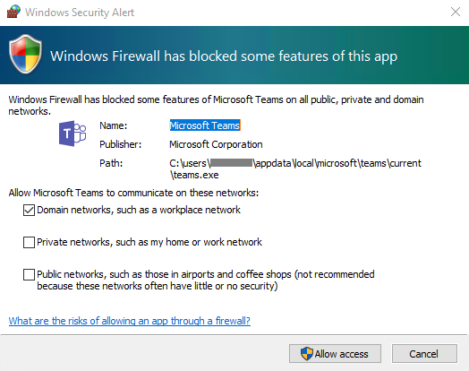

# <a name="get-clients-for-microsoft-teams"></a>Obtenir des clients pour Microsoft Teams

Microsoft Teams dispose de clients Web, de bureau (Windows, Mac et Linux) et mobiles (Android et iOS). Ces clients requièrent une connexion Internet active et ne prennent pas en charge le mode hors connexion.

> [!NOTE]
> Pour plus d’informations sur les fonctionnalités de chaque client sur différentes plateformes, consultez [Fonctionnalités Teams par plateforme](https://support.microsoft.com/office/teams-features-by-platform-debe7ff4-7db4-4138-b7d0-fcc276f392d3).
>
> À compter du 29 novembre 2018, vous ne pourrez plus utiliser l’application Microsoft Teams pour Windows 10 S (Preview) disponible auprès du Microsoft Store. Au lieu de cela, vous pouvez désormais télécharger et installer le client de bureau Teams sur les appareils le Windows 10 en mode S. Pour télécharger le client de bureau, accédez à [ https://teams.microsoft.com/downloads ](https://go.microsoft.com/fwlink/p/?linkid=855754). Les versions MSI du client de bureau Teams ne sont pas encore disponibles pour les appareils exécutant le Windows 10 en mode S.
>
> Pour plus d’informations sur le mode Windows 10 S, consultez[Présentation de Windows 10 en mode S](https://www.microsoft.com/windows/s-mode).

## <a name="desktop-client"></a>Client de bureau 

> [!TIP]
> Regardez la session suivante pour en savoir plus sur les avantages du client bureau Windows, comment il le planifier et comment déployer : [Windows Teams Client de bureau](https://aka.ms/teams-clients)

Le client de bureau Microsoft Teams est une application autonome et est également [disponible dans Microsoft 365 Apps for enterprise](/deployoffice/teams-install). Teams est disponible pour les versions 32 bits et 64 bits de Windows (8.1 ou version ultérieure),ARM64 pour Windows 10 et Windows Server (2012 R2 ou version ultérieure), ainsi que pour macOS et Linux (format `.deb` et `.rpm`). Sous Windows, Teams requiert .NET Framework 4.5 ou version ultérieure ; le programme d’installation Teams propose de l’installer pour vous si vous ne l’avez pas. Sur Linux, les responsables de package tels que `apt` et `yum` tentent d’installer les conditions requises pour vous. Toutefois, si ce n’est pas le cas, vous devez installer les conditions requises avant d’installer Teams sur Linux.

Les clients de bureau fournissent la prise en charge de communications en temps réel (audio, vidéo, et partage de contenu) pour les réunions d'équipe, les appels de groupes et les appels en tête-à-tête.

Les clients de bureau peuvent être téléchargés et installés par les utilisateurs finaux directement à partir de [https://teams.microsoft.com/downloads](https://go.microsoft.com/fwlink/?linkid=855754) s'ils disposent des autorisations locales appropriées (les droits d'administration ne sont pas requis pour installer le client Teams sur un PC, mais le sont pour un Mac).

> [!NOTE]
> Pour plus ’informations sur l’installation de Teams sur un Chromebook, consultez [Installer et exécuter Microsoft Office sur un Chromebook](https://support.office.com/article/how-to-install-and-run-microsoft-office-on-a-chromebook-32f14a23-2c1a-4579-b973-d4b1d78561ad).

Les administrateurs informatiques peuvent utiliser la méthode de leur choix pour distribuer les fichiers d'installation sur les ordinateurs de leur organisation. Certains exemples incluent Microsoft Endpoint Configuration Manager (Windows) ou JAMF Pro (macOS). Pour obtenir le package MSI de distribution Windows, voir [installer Microsoft Teams à l’aide de MSI](msi-deployment.md).

> [!NOTE]
> La distribution du client via ces systèmes sert uniquement à l'installation initiale des clients Microsoft Teams, non pour les mises à jour futures.

### <a name="windows"></a>Windows

L’installation de Microsoft Teams pour Windows fournit des programmes d’installation téléchargeables dans architecture 32 bits et 64 bits.

> [!NOTE]
> L'architecture (32 bits ou 64 bits) de Microsoft Teams est indépendante de Windows et ignore celle d'Office installée. Nous recommandons la version 64 bits de Microsoft Teams sur les systèmes 64 bits.

Le client Windows est déployé dans le dossier AppData situé dans le profil de l’utilisateur. Le déploiement sur le profil local de l’utilisateur permet d’installer le client sans nécessiter de droits élevés. Le client Windows tire parti des emplacements suivants :

- %LocalAppData%\\Microsoft\\Teams

- %LocalAppData%\\Microsoft\\TeamsMeetingAddin

- %AppData%\\Microsoft\\Teams

- % LocalAppData%\\SquirrelTemp

Lorsque les utilisateurs lancent un appel à l'aide du client Microsoft Teams pour la première fois, ils peuvent remarquer un avertissement avec les paramètres du pare-feu Windows qui demande aux utilisateurs d'autoriser la communication. Les utilisateurs peuvent être invités à ignorer ce message car l'appel fonctionnera, même lorsque l'avertissement est ignoré.



> [!NOTE]
> La configuration du pare-feu Windows sera modifiée même lorsque l'invite est supprimée en sélectionnant « Annuler ». Deux règles entrantes pour teams.exe seront créées avec l'action Autoriser pour les protocoles TCP et UDP.

Si vous voulez empêcher Teams d’inviter les utilisateurs à créer des règles de pare-feu lorsque les utilisateurs effectuent un appel Teams pour la première fois, utilisez l’[Exemple de script PowerShell : règle de pare-feu de trafic entrant](#sample-powershell-script---inbound-firewall-rule) ci-dessous.

### <a name="mac"></a>Mac

Les utilisateurs de Mac peuvent installer Teams à l’aide d’un fichier d’installation PKG pour ordinateurs macOS. L’accès administrateur est requis pour installer le client Mac. Le client macOS est installé dans le dossier /Applications.

#### <a name="install-teams-by-using-the-pkg-file"></a>Installer Teams en utilisant le fichier PKG

1. À partir de la [page de téléchargement Teams](https://teams.microsoft.com/downloads), sous **Mac**, cliquez sur **Télécharger**.
2. Double-cliquez sur le fichier PKG.
3. Suivez les indications de l'Assistant Installation pour effectuer l'installation.
4. Teams sera installé dans le dossier /Applications. Il s’agit d’une installation à l’échelle de l’ordinateur.

> [!NOTE]
> Pendant l’installation, le PKG invite à entrer des informations d’identification d’administrateur. L’utilisateur doit entrer les informations d’identification d’administrateur, peu importe si l’utilisateur est un administrateur.

Si un utilisateur a une installation DMG de Teams et souhaite la remplacer par l’installation PKG, l’utilisateur doit :

1. Quitter l’application Teams.
2. Désinstaller l’application Teams.
3. Installez le fichier PKG.

Les administrateurs informatiques peuvent utiliser le déploiement géré de Teams pour distribuer les fichiers d’installation pour tous les Macs dans leur organisation, tels que Jamf Pro.

> [!NOTE]
> Si vous rencontrez des problèmes en installant le PKG, faites-le nous savoir. Dans la section **Commentaires** à la fin de cet article, cliquez sur **Adresser un commentaire**.

### <a name="linux"></a>Linux

Les utilisateurs peuvent installer des packages Linux natifs au format `.deb` et `.rpm`. L’installation du package DEB ou RPM permet d’installer automatiquement le référentiel du package.

- DEB `https://packages.microsoft.com/repos/ms-teams stable main`
- RPM `https://packages.microsoft.com/yumrepos/ms-teams`

La clé de signature permettant d’activer la mise à jour automatique à l’aide du gestionnaire de package du système est installée automatiquement. Toutefois, elle peut également se trouver dans : <https://packages.microsoft.com/keys/microsoft.asc>. Microsoft Teams est inclus une fois par mois. Si le référentiel a été correctement installé, le gestionnaire de package système doit gérer la mise à jour automatique de la même façon que les autres packages sur le système.

> [!NOTE] 
> Si vous trouvez un bogue, envoyez-le à l’aide d' `Report a Problem` à partir du client. Pour voir d’autres problèmes connus, consultez [Support de Teams au sein de votre organisation](/MicrosoftTeams/troubleshoot/teams-welcome).
> Pour la prise en charge de Teams pour Linux, vous pouvez utiliser le [canal de prise en charge du Forum Linux dans Microsoft Q & A](/answers/topics/teams.html). Veillez à utiliser l’indicateur `teams-linux` quand vous publiez des questions. 

#### <a name="install-teams-using-deb-package"></a>Installer Teams avec le package DEB

1. Téléchargez le package à partir de <https://aka.ms/getteams>.
2. Installez à l’aide de l'une des opérations suivantes :
    - Ouvrez l’outil de gestion des packages approprié et suivez le processus d’installation de l’application Linux auto-guidée.
    - Ou, si vous aimez Terminal, tapez : `sudo dpkg -i **teams download file**`

Vous pouvez lancer Teams via les activités ou via un Terminal en tapant `teams`.

#### <a name="install-teams-using-rpm-package"></a>Installer Teams avec le package RPM

1. Téléchargez le package à partir de <https://aka.ms/getteams>.
2. Installez à l’aide de l'une des opérations suivantes :
    - Ouvrez l’outil de gestion des packages approprié et suivez le processus d’installation de l’application Linux auto-guidée.
    - Ou, si vous aimez Terminal, tapez : `sudo yum install **teams download file**`

Vous pouvez lancer Teams via les activités ou via un Terminal en tapant `teams`.

#### <a name="install-manually-from-the-command-line"></a>Installez manuellement à partir de la ligne de commande

Installez manuellement sur des distributions Debian et Ubuntu :

```bash
curl https://packages.microsoft.com/keys/microsoft.asc | sudo apt-key add -

sudo sh -c 'echo "deb [arch=amd64] https://packages.microsoft.com/repos/ms-teams stable main" > /etc/apt/sources.list.d/teams.list'

sudo apt update
sudo apt install teams
```

Installez manuellement sur des distributions basées sur RHEL, Fedora et CentOS :

```bash
sudo rpm --import https://packages.microsoft.com/keys/microsoft.asc

sudo sh -c 'echo -e "[teams]\nname=teams\nbaseurl=https://packages.microsoft.com/yumrepos/ms-teams\nenabled=1\ngpgcheck=1\ngpgkey=https://packages.microsoft.com/keys/microsoft.asc" > /etc/yum.repos.d/teams.repo'

sudo dnf check-update
sudo dnf install teams
```

Vous pouvez également utiliser YUM au lieu de DNF :

```bash
yum check-update
sudo yum install teams
```

Installez manuellement sur des distributions basées sur openSUSE :

```bash
sudo rpm --import https://packages.microsoft.com/keys/microsoft.asc

sudo sh -c 'echo -e "[teams]\nname=teams\nbaseurl=https://packages.microsoft.com/yumrepos/ms-teams\nenabled=1\nautorefresh=1\nkeeppackages=0\ntype=rpm-md\ngpgcheck=1\ngpgkey=https://packages.microsoft.com/keys/microsoft.asc" > /etc/zypp/repos.d/teams.repo'

sudo zypper refresh
sudo zypper install teams
```

## <a name="web-client"></a>Client Web

Le client Web ([https://teams.microsoft.com](https://go.microsoft.com/fwlink/?linkid=855753)) est complet et fonctionnel, et peut être utilisé par divers navigateurs. Le client web prend en charge les Réunions et Appels à l’aide de webRTC, aucun plug-in ou téléchargement n’est donc requis pour exécuter Teams dans un navigateur web. Le navigateur doit également être configuré de manière à autoriser les cookies tiers.

[!INCLUDE [browser-support](includes/browser-support.md)]

Le client web effectue la détection de la version navigateur lors de la connexion à [ https://teams.microsoft.com ](https://go.microsoft.com/fwlink/?linkid=855753). En cas de version non prise en charge, il bloquera l'accès à l'interface Web et recommandera de télécharger le client de bureau ou l'application mobile.

## <a name="mobile-clients"></a>Clients mobiles

Les applications mobiles Microsoft Teams sont disponibles pour Android et iOS, et sont conçues pour les utilisateurs en déplacement participant à des conversations basées sur le chat et permettent des appels audio pair à pair. Pour les applications mobiles, accédez aux magasins mobiles concernés Google Play et Apple App Store. L'application Windows Phone a été retirée le 20 juillet 2018 et pourrait ne plus fonctionner.

En Chine, voici comment [obtenir Teams pour Android](get-teams-android-in-china.md).

Les plateformes mobiles prises en charge pour les applications mobiles Microsoft Teams sont les suivantes :

- **Android** : la prise en charge est limitée aux quatre dernières versions principales d’Android. Lors de la publication d’une nouvelle version majeure d’Android, la nouvelle version et les trois versions précédentes sont officiellement prises en charge.

- **iOS** : la prise en charge est limitée aux deux versions principales d’iOS les plus récentes. Lors de la publication d’une nouvelle version majeure d’iOS, la nouvelle version of iOS et les versions précédentes sont officiellement prises en charge.

> [!NOTE]
> La version mobile doit être disponible au public pour que Teams fonctionne comme prévu.

Les applications mobiles sont distribuées et mises à jour via app store de la plateforme mobile respective uniquement. La distribution des applications mobiles via la gestion des périphériques mobiles ou le chargement de côte n’est pas prise en charge par Microsoft. Une fois l’application mobile installée sur une plateforme mobile prise en charge, l’application mobile Teams elle-même est prise en charge, sous réserve que la version se trouve dans un délai de trois mois après la publication actuelle.

| | | |
|---|---|---|
||Point de décision|Existe-il des restrictions empêchant les utilisateurs d'installer le client Microsoft Teams appropriés sur leur appareil ?|
||Étapes suivantes|Si votre organisation limite l'installation de logiciels, veillez à ce que ce processus soit compatible avec Microsoft Teams. Note : Les droits d'administration ne sont pas requis pour l'installation d'un client sur PC, mais le sont pour un Mac.|
|

## <a name="client-update-management"></a>Gestion des mises à jour du client

Les clients sont actuellement mis à jour automatiquement par le service Microsoft Teams sans qu'aucune intervention de l'administrateur informatique ne soit requise. Si une mise à jour est disponible, le client téléchargera automatiquement la mise à jour et lorsque l'application sera inactive pendant un certain temps, le processus de mise à jour commencera. 

## <a name="client-side-configurations"></a>Configurations côté client

Actuellement, aucune option prise en charge n'est disponible pour configurer le client via l'administration des clients, PowerShell, des objets de stratégie de groupe ou le registre.

## <a name="notification-settings"></a>Paramètres des notifications

Aucune option n'est actuellement disponible pour les administrateurs informatiques pour configurer les paramètres des notifications côté client. Toutes les options de notification sont définies par l'utilisateur. La figure ci-après présente les paramètres client par défaut.


## <a name="sample-powershell-script---inbound-firewall-rule"></a>Exemple de script PowerShell : règle de pare-feu de trafic entrant

Cet exemple de script qui doit s’exécuter sur des ordinateurs clients dans le contexte d’un compte d’administrateur élevé, crée une nouvelle règle de pare-feu entrant pour chaque dossier utilisateur trouvé dans c:\users. Lorsque Teams détecte cette règle, il permet d’empêcher l’application Teams d’inviter les utilisateurs à créer des règles de pare-feu lorsque les utilisateurs passent leur premier appel à partir de Teams.

```powershell
<#
.SYNOPSIS
   Creates firewall rules for Teams.
.DESCRIPTION
   (c) Microsoft Corporation 2018. All rights reserved. Script provided as-is without any warranty of any kind. Use it freely at your own risks.
   Must be run with elevated permissions. Can be run as a GPO Computer Startup script, or as a Scheduled Task with elevated permissions.
   The script will create a new inbound firewall rule for each user folder found in c:\users.
   Requires PowerShell 3.0.
#>

#Requires -Version 3

$users = Get-ChildItem (Join-Path -Path $env:SystemDrive -ChildPath 'Users') -Exclude 'Public', 'ADMINI~*'
if ($null -ne $users) {
    foreach ($user in $users) {
        $progPath = Join-Path -Path $user.FullName -ChildPath "AppData\Local\Microsoft\Teams\Current\Teams.exe"
        if (Test-Path $progPath) {
            if (-not (Get-NetFirewallApplicationFilter -Program $progPath -ErrorAction SilentlyContinue)) {
                $ruleName = "Teams.exe for user $($user.Name)"
                "UDP", "TCP" | ForEach-Object { New-NetFirewallRule -DisplayName $ruleName -Direction Inbound -Profile Domain -Program $progPath -Action Allow -Protocol $_ }
                Clear-Variable ruleName
            }
        }
        Clear-Variable progPath
    }
}
```
