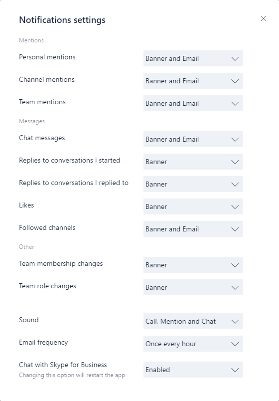

Obtenir des clients pour Microsoft Teams 
===========================
> [!IMPORTANT]
> [!INCLUDE [new-teams-sfb-admin-center-notice](includes/new-teams-sfb-admin-center-notice.md)]

Microsoft Teams dispose de clients Web, de bureau (Windows et Mac) et mobiles (Android, iOS et Windows Phone). Ces clients requièrent une connexion Internet active et ne prennent pas en charge le mode hors connexion.

Client Web 
----------

Le client web ([https://teams.microsoft.com](https://go.microsoft.com/fwlink/?linkid=855753)) est un client complet, fonctionnel qui peut être utilisé à partir d’une gamme de navigateurs. Le client web prend en charge l’appel et des réunions à l’aide de webRTC, de sorte qu’il n’y a pas de plug-in ou téléchargement nécessaire à l’exécution des équipes dans un navigateur web. Le navigateur doit être configuré pour autoriser les cookies tiers. 

[!INCLUDE [browser-support](includes/browser-support.md)]

Le client web exécute la détection de version du navigateur lors de la connexion à [https://teams.microsoft.com](https://go.microsoft.com/fwlink/?linkid=855753) et, si une version de navigateur non prise en charge est détectée, il bloque l’accès à l’interface web et l’utilisateur à télécharger le client ordinateur de bureau ou une application mobile.

Client de bureau
--------------

Le client de bureau Microsoft Teams est une application autonome et actuellement ne fait pas partie d’Office Pro Plus. Équipes est disponible pour Windows (7 +), les versions 32 bits et de 64 bits et MacOS (10.10 +). Sous Windows, les équipes nécessite .NET framework 4.5 ou version ultérieure ; le programme d’installation d’équipes vous permet de l’installer pour vous si vous ne l’avez pas. 

Les postes de travail clients fournissent la prise en charge des communications en temps réel (partage de contenu audio et vidéo) pour les réunions d’équipe, les appels en tête-à-tête groupe appelant et privé.

Clients de bureau peuvent être téléchargés et installés par l’utilisateur final directement à partir de [https://teams.microsoft.com/downloads](https://go.microsoft.com/fwlink/?linkid=855754) s’ils ont les autorisations locales appropriées (droits d’administrateur ne sont pas requis pour installer le client des équipes sur un PC, mais sont nécessaires sur un Mac).

Les administrateurs informatiques peuvent utiliser la méthode de leur choix pour distribuer les fichiers d'installation sur les ordinateurs de leur organisation telle que System Center Configuration Manager (Windows) ou Casper Suite (MacOS). Pour obtenir la distribution du Package MSI pour Windows, consultez [les équipes Microsoft Installer à l’aide de MSI](msi-deployment.md).

> [!NOTE]
> La distribution du client via ces systèmes sert uniquement à l'installation initiale des clients Microsoft Teams, non pour les mises à jour futures.

#### Windows

Les programmes d’installation de Microsoft Teams pour Windows sont téléchargeables en version 32 et 64 bits. L'architecture doit correspondre à celle du système d'exploitation, sur laquelle la version du téléchargement en ligne s'aligne.

> [!NOTE]
> L'architecture (32 bits ou 64 bits) de Microsoft Teams ignore celle d'Office installée.

Le client Windows est déployé dans le dossier AppData situé dans le profil de l'utilisateur. Le déploiement dans le profil local de l'utilisateur permet d'installer le client sans disposer de droits élevés. Le client Windows est installé aux emplacements suivants :

-   %appdata%\\local\\Microsoft\\Teams

-   %appdata%\\roaming\\Microsoft\\Teams

Lorsque les utilisateurs lancent un appel à l'aide du client Microsoft Teams la première fois, un message d'avertissement concernant les paramètres de pare-feu peut s'afficher et requérir l'autorisation de la communication. Les utilisateurs peuvent être invités à ignorer ce message, car l'appel fonctionnera.

> [!NOTE]
> La configuration de pare-feu Windows sera modifiée même si l'invite est ignorée en sélectionnant Annuler. Deux règles de trafic entrant pour teams.exe seront créées avec une action de blocage pour les protocoles TCP et UDP.

#### Mac

Microsoft fournit également un fichier d'installation DMG pour les ordinateurs Mac OSX. L'accès administrateur est obligatoire pour installer le client Mac. Le client Mac OSX est installé dans le dossier /Applications.

Clients mobiles
--------------

Les applications mobiles Microsoft Teams mobile sont disponibles pour Android, iOS et Windows Phone ; elles sont destinées aux utilisateurs en déplacement qui participent à des conversations par messagerie et permettent de passer des appels audio P2P. Pour obtenir les applications mobiles, accédez à la boutique mobile adéquate : Google Play, App Store d’Apple ou Microsoft Store.

Les plateformes mobiles prises en charge pour les applications mobiles Microsoft Teams sont les suivantes :

-   **Android** : 4.4 ou version ultérieure

-   **iOS**:  10.0 ou version ultérieure

-   **Windows Phone**:  Windows 10 Mobile

Les applications mobiles sont distribuées et mises à jour uniquement via la boutique d'applications de la plateforme mobile respective et ne peuvent pas être distribuées via des solutions MDM (gestion des périphériques mobiles) ni utilisées comme version de test.

| | | |
|---------|---------|---------|
|      |Point de décision         |Existe-il des restrictions empêchant les utilisateurs d'installer le client Microsoft Teams appropriés sur leur appareil ?         |
|     |Étapes suivantes         |Si votre organisation limite l'installation de logiciels, veillez à ce que ce processus soit compatible avec Microsoft Teams. Note : Les droits d'administration ne sont pas requis pour l'installation d'un client sur PC, mais le sont pour un Mac.         |

    Point de décision   Existe-il des restrictions empêchant les utilisateurs d'installer le client Microsoft Teams appropriés sur leur appareil ?

Gestion des mises à jour du client
------------------------

Actuellement, les clients sont automatiquement mis à jour par le service de Microsoft Teams ; aucune intervention de l'administrateur informatique n'est requise. Si une mise à jour est disponible, le client la téléchargera automatiquement et lorsque l'application est inactive pendant un certain temps, le processus de mise à jour se lancera.

Configurations côté client
---------------------------

Actuellement, aucune option prise en charge n'est disponible pour configurer le client via l'administration des clients, PowerShell, des objets de stratégie de groupe ou le registre.

Paramètres des notifications
----------------------------

Aucune option n'est actuellement disponible pour les administrateurs informatiques pour configurer les paramètres des notifications côté client. Toutes les options de notification sont définies par l'utilisateur. La figure ci-après présente les paramètres client par défaut.

