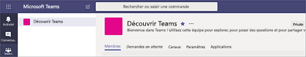
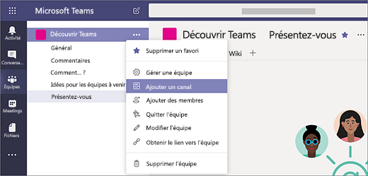
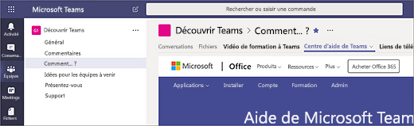

# Créer vos premiers canaux et équipes dans Microsoft Teams

En procédant à la configuration et en utilisant votre première série d’équipes et de canaux, vous améliorez votre expérience avec Teams et identifiez les spécialistes qui peuvent vous aider à la promotion de l’adoption de Teams au sein de votre organisation.
Si vous n’avez pas encore installé Teams, consultez l’article [Obtenir les clients Teams](get-clients.md) et [Se connecter à Teams à l’aide d’une fonctionalité d’authentification moderne](sign-in-teams.md).

## Suggestions pour vos premiers canaux et premières équipes.

 Une équipe est un ensemble de personnes qui travaillent ensemble vers un objectif commun. Les canaux sont des espaces de collaboration au sein desquels les tâches sont effectuées.

Pour plus d’informations, voir [Vue d’ensemble des équipes et canaux dans Teams](teams-channels-overview.md) et [Meilleures pratiques pour organiser des équipes dans Teams](best-practices-organizing.md).

 Nous vous conseillons de commencer avec une équipe « Découvrir Teams » où les premiers utilisateurs peuvent s’entraîner, poser des questions et découvrir les fonctionnalités de Teams. Cette équipe peut se révéler très importante pour la réussite de Teams lorsque vous commencez à effectuer des essais.

### Équipe « Découvrir Teams »

Votre équipe de projet peut utiliser l’équipe « Découvrir Teams » pour s’assurer que les clients Teams sont bien définis, tenir des conversations initiales et explorer les possibilités offertes par Teams. Il existe peut-être déjà un groupe de personnes dans votre organisation qui apprécient d’accéder en avant-première aux nouvelles fonctionnalités. Cela peut être une de leurs équipes initiales lorsque vous les ajoutez à Teams, et ils vous aideront à rassembler des commentaires initiaux.

Voici une structure suggérée pour l’équipe.

| Canal | Description et l’utilisation | Onglets épinglés, robots et applications |
| ------------ | -------------------- | -------------------- |
| Général | Toutes les équipes commencent avec un canal Général. Ce canal permet de publier des annonces quand vous débutez avec Teams. |  |
| Présentez-vous | Présentez-vous à l’équipe et partagez ce que vous attendez de Teams. |  |
| Comment... ? | Un canal pour poser des questions sur les procédures. Étape 1 : installer les clients de bureau et mobiles. Étape 2 : accéder à Teams.| Onglet épinglé avec un lien vers le [Centre d’assistance Teams](https://support.office.com/teams) Onglet épinglé avec un lien vers les [Vidéos de formation Teams](https://support.office.com/article/microsoft-teams-video-training-4f108e54-240b-4351-8084-b1089f0d21d7) Onglet épinglé avec un lien vers [le téléchargement des clients de bureau et mobile de Teams](https://teams.microsoft.com/downloads) |
| Commentaires | Partager vos idées concernant votre utilisation de Teams. | Onglet épinglé vers Polly Poll|
| Idées pour les équipes à venir | Partager vos idées sur comment Teams peut ajouter de la valeur dans votre organisation. Comment peut-on appeler ces équipes ? Qui seraient les membres ? ||
| Support | Si quelque chose ne fonctionne pas comme prévu, utilisez ce canal pour obtenir de l’aide. ||

## Préparez vos premières équipes et mettez-les en route

En tant qu’administrateur, vous pouvez créer et gérer des équipes et des canaux dans le client Teams ou avec le centre d’administration de Microsoft Teams. Vous pouvez créer des équipes publiques ou privées. Vous pouvez également créer une [équipe à l’échelle de l’organisation](create-an-org-wide-team.md). N’importe quel utilisateur de Teams dans votre organisation peut rejoindre une équipe publique. Pour les équipes privés, c’est le propriétaire de l’équipe qui gère les inscriptions à l’équipe. Et pour une équipe à l’échelle de l’organisation, tous les membres de votre organisation sont automatiquement ajoutés à l’équipe.

Pour commencer, nous vous recommandons de créer des équipes privées et d’ajouter un autre propriétaire pour gérer les inscriptions et les paramètres de l’équipe.

> [!NOTE]
> Dans les étapes qui suivent, nous utilisons le client de bureau Teams pour créer des équipes et des canaux. N’oubliez pas qu’en tant qu’administrateur, vous pouvez également effectuer ces tâches dans le centre d’administration de Microsoft Teams.

### Créer une équipe

Sur le côté gauche de l’écran de Teams, cliquez sur **Équipes**, puis, en bas de la liste des équipes, cliquez sur **Rejoindre ou créer une équipe**, puis sur **Créer une équipe**.

Une fois que vous avez créé l’équipe, invitez des personnes à la rejoindre. Vous pouvez ajouter des utilisateurs individuels, des groupes et même des groupes complets de contacts (anciennement appelés des « listes de distribution »).

### Ajouter un propriétaire à l’équipe

Recherchez l’équipe que vous avez créée, cliquez sur **Plus options ...** > **Gérer l’équipe**. Accédez à l’onglet **Membres**. Recherchez les personnes que vous voulez désigner comme propriétaires de l’équipe. Sous **Rôle**, cliquez sur **Propriétaire**.

### Créer un canal dans une équipe

Recherchez l’équipe que vous avez créée, puis cliquez sur **Autres options...** > **Ajouter un canal**. Vous pouvez également cliquer sur **Gérer l’équipe** et ajouter un canal dans l’onglet **Canaux**.

Donnez un nom descriptif au canal pour que les utilisateurs puissent facilement comprendre l’objectif du canal.

En tant qu’un propriétaire d’une équipe, vous pouvez automatiquement nommer comme favoris des canaux pour toute l’équipe : ces canaux deviennent alors plus visibles pour tous les membres de l’équipe. Vous pouvez également épingler des onglets au canal pour ajouter des outils tels que OneNote, des liens vers des pages Web et d’autres contenus pour que les utilisateurs puissent facilement trouver ce dont ils ont besoins et partager leurs idées.

Voici un exemple du canal « Comment...? » dans l’équipe « Découvrir Teams », montrant des onglets épinglés avec des liens vers des pages Web Teams, des&ndash; vidéos de formation Teams, le centre d’assistance Teams et des liens de téléchargement Teams.

## Étapes suivantes

Accédez à [Intégrer les premiers utilisateurs](get-started-with-teams-onboard-early-adopters.md).
