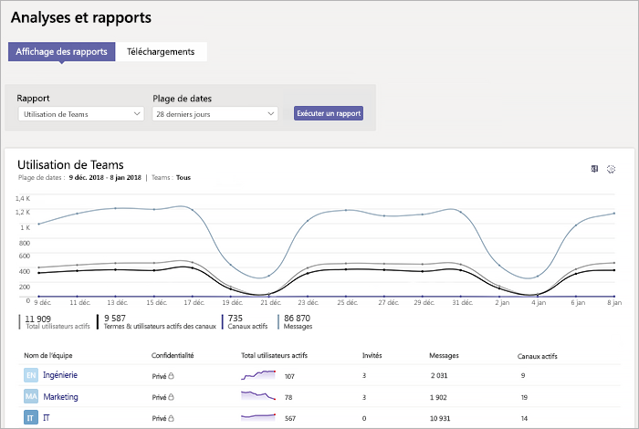
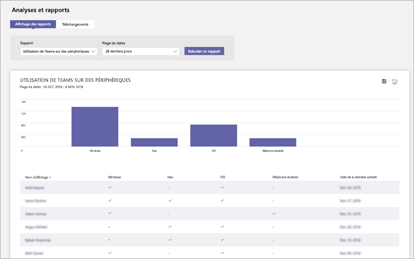

# Surveiller l’utilisation et les commentaires dans Microsoft Teams
Il est important de savoir comment les utilisateurs utilisent Teams et quelle est leur expérience avec Teams. Les rapports d’utilisation peuvent vous aider à mieux comprendre les modèles d’utilisation et, avec les commentaires des utilisateurs, vous donne la perspective nécessaire pour procéder au déploiement à plus large échelle et savoir où hiérarchiser les efforts de formation et de communication.

## Surveiller l’utilisation
Avec première série d’équipes, nous vous recommandons de vérifier les rapports deux fois par semaine pour mieux comprendre les tendances émergentes. 

Par exemple, les rapports d’utilisation démontrent que peu d’utilisateurs utilisent les clients mobiles Teams. Cela peut indiquer que les utilisateurs ne savent pas comment installer les clients. La publication d’instructions d’installation dans un canal peut permettre à plus de clients d’utiliser la fonctionnalité. Autre exemple, les rapports d’utilisation peuvent peut-être montrer que les utilisateurs utilisent principalement Teams pour des conversations privées. Dans cet exemple, vous souhaiterez peut-être passer en revue vos scénarios d’équipe, car les utilisateurs discutent en dehors des équipes et canaux configurés au départ. 

Voici comment obtenir des rapports pour visualiser l’utilisation de Teams. 

### Rapports analytique et rapports (centre d’administration de Microsoft Teams)

Les rapports d’équipe dans le centre d’administration de Microsoft Teams vous donnent des perspectives d’utilisation de Teams dans votre organisation. Utilisez les rapports pour visualiser l’utilisation de Teams, les activités des utilisateurs et l’utilisation de périphériques au sein de votre organisation. 

Pour afficher ces rapports, vous devez être un administrateur général dans Microsoft 365 ou Office 365, un administrateur de service Teams ou un administrateur Skype Entreprise. Accédez au centre d’administration de Microsoft Teams, dans le volet de navigation gauche, sélectionnez **Rapports analytiques et rapports**, puis sous **Rapport**, sélectionnez le rapport que vous souhaitez exécuter.

- **Rapport d’utilisation Teams**: ce rapport vous donne une vue d’ensemble de l’utilisation dans Teams, y compris le nombre total d’utilisateurs actifs et de canaux et le nombre d’utilisateurs actifs, de canaux, d’invités et de messages dans chaque équipe. 

         
- **Rapport d’activité des utilisateurs Teams**: ce rapport montre les types d’activités des utilisateurs, par exemple, combien de personnes communiquent par le biais d’appels personne à personne, de messages de canal et de messages par conversation privée. 

     
`
- **Rapport d’utilisation des appareils Teams**: ce rapport indique comment les utilisateurs se connectent à Teams, y compris combien de personnes utilisent Teams sur leur appareil mobile lorsqu’elles sont en déplacement. 

    

Pour en savoir plus, consultez l’article [Rapports analytiques et création de rapports](teams-analytics-and-reports/teams-reporting-reference.md). 

### Rapports d’activité Teams (centre d’administration Microsoft 365)
Vous pouvez également consulter l’activité des équipes avec des rapports qui sont disponibles dans le centre d’administration Microsoft 365. Ces rapports font partie des rapports Microsoft 365 dans le Centre d’administration Microsoft 365 et fournissent des informations sur l’activité des utilisateurs et l’utilisation des périphériques. 

Pour afficher ces rapports, accédez au centre d’administration Microsoft 365, cliquez sur **Rapports** > **Utilisation**. Sous **Sélectionner un rapport**, cliquez sur **Microsoft Teams**. À partir de là, sélectionnez le rapport que vous voulez afficher.

Pour plus d’informations, voir [Utiliser des rapports d’activité pour Teams](teams-activity-reports.md).

### Analyse de l'utilisation de Microsoft 365

Vous pouvez utiliser les rapports analytiques concernant l’utilisation de Microsoft 365 dans Power BI pour afficher et analyser les données d’utilisation de Teams et les autres produits et services Microsoft 365 ou Office 365. Les rapports analytiques sur l’utilisation de Microsoft 365 est un pack de contenu qui inclut un tableau de bord prédéfini et divers rapports prédéfinis. Chaque rapport vous donne une perspective et des données d’utilisation spécifiques. Pour vous connecter au pack de contenu, vous avez besoin de Power BI et vous devez être un administrateur général dans Microsoft 365, Office 365 ou un lecteur de rapports. Si vous ne disposez pas de Power BI, [vous pouvez vous inscrire au service Power BI gratuitement](https://powerbi.microsoft.com). 

Pour plus d’informations, voir [Rapports analytiques d’utilisation de Microsoft 365](https://support.office.com/article/Microsoft-365-usage-analytics-77ff780d-ab19-4553-adea-09cb65ad0f1f). 

## Recueillir des commentaires
L’adoption d’une nouvelle expérience de collaboration dépend en grande partie de la modification du comportement des utilisateurs. Pour encourager le changement, il faut offrir de la formation, des encouragements et des exemples d’utilisation positifs. Il est important que les utilisateurs puissent s’exprimer lors de la transition vers Teams et puissent ouvertement partager leur expérience. Nous vous recommandons d’utiliser le canal de commentaires dans l’équipe « Découverte de Teams » créée pour collecter et répondre aux commentaires des utilisateurs concernant leur expérience avec Teams. 

## Étapes suivantes
[Obtenir des ressources pour planifier le déploiement à l’échelle de votre organisation de Teams](get-started-with-teams-resources-for-org-wide-rollout.md).
