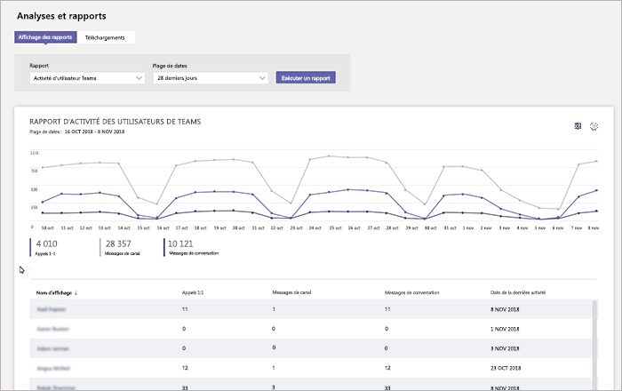

# Surveiller l’utilisation et les commentaires dans Microsoft TeamsMonitor usage and feedback in Microsoft Teams
Il est important de savoir comment les utilisateurs utilisent des équipes et quel est votre expérience avec les équipes.It's important to know how users are using Teams and what their experience is with Teams. Rapports d’utilisation peuvent vous aider à mieux comprendre les modèles d’utilisation et ainsi que les commentaires des utilisateurs, donnez insights pour informer votre déploiement plus large et où les hiérarchiser les efforts de formation et de communication.Usage reports can help you better understand usage patterns, and along with user feedback, give you insights to inform your wider rollout and where to prioritize training and communication efforts.

## Surveiller l’utilisationMonitor usage
Pour votre premier jeu d’équipes, nous vous recommandons de que consulter des rapports de deux fois par semaine pour comprendre les nouvelles tendances.For your first set of teams, we recommend you review reports twice a week to understand emerging trends. 

Par exemple, les rapports d’utilisation montrent que pas de nombreux utilisateurs utilisent les clients mobiles équipes.For example, usage reports show that not many users are using the Teams mobile clients. Cela peut indiquer que les utilisateurs ne savez pas comment installer les clients.This may indicate that users aren't sure how to install the clients. Validation des instructions d’installation dans un canal peut-être aider à l’utilisation du lecteur d’un large éventail de clients.Posting step-by-step installation instructions in a channel may help drive usage of a wider range of clients. Ou bien, les rapports d’utilisation montrent que les utilisateurs utilisent principalement équipes pour une conversation privée.Or, usage reports show that users are primarily using Teams for private chats. Dans cet exemple, vous souhaiterez peut-être consulter vos scénarios d’équipe, car les utilisateurs sont en conversation en dehors des équipes initiales et canaux qui ont été configurés.In this example, you may want to review your team scenarios because users are chatting outside the initial teams and channels that were set up. 

Voici comment obtenir des rapports pour afficher l’utilisation des équipes.Here's how to get reports to view Teams usage. 

### Les équipes analytique & rapports (Microsoft Teams & Skype pour Business Admin Center)Teams analytics & reports (Microsoft Teams & Skype for Business Admin Center)

Rapports d’équipes dans le Microsoft Teams & Skype entreprise centre d’administration vous expliqueront comment les équipes est utilisé dans votre organisation.Teams reports in the Microsoft Teams & Skype for Business Admin Center give you insights into how Teams is used in your organization. Utilisation des rapports pour obtenir une vue d’utilisation, activité de l’utilisateur et utilisation du périphérique équipes au sein de votre organisation.Use the reports to get a view into Teams usage, user activity, and device usage across your organization. 

Pour afficher ces rapports, vous devez être un administrateur global dans Office 365, un administrateur du service équipes ou Skype pour l’administrateur d’entreprise Accédez au portail Microsoft Teams & Skype pour la navigation de gauche, du centre d’administration Business sélectionnez **Analytique et rapports**, puis, sous **état**, sélectionnez le rapport que vous souhaitez exécuter.To view these reports, you must be a global admin in Office 365, Teams service admin, or Skype for Business admin. Go to the Microsoft Teams & Skype for Business Admin Center, in the left navigation, select **Analytics & reports**, and then under **Report**, choose the report you want to run.

- **Rapport d’utilisation des équipes**: ce rapport vous donne une vue d’ensemble de l’activité d’utilisation dans les équipes, y compris le nombre total d’utilisateurs actif et le nombre d’utilisateurs actifs et les canaux des invités, canaux et des messages dans chaque équipe.**Teams usage report**: This report gives you an overview of usage activity in Teams, including the total active users and channels, and the number of active users and channels, guests, and messages in each team. 

    ![Rapport d’utilisation des équipes] (media/teams-reports-teams-usage.png "Capture d’écran de l’état de l’utilisation des équipes dans les équipes Microsoft & Skype entreprise centre d’administration")     
- **Rapport d’activité utilisateur équipes**: ce rapport vous procure les types d’activités des utilisateurs participer, telles que le nombre de personnes communiquer via des appels de 1:1, les messages de canal et les messages de conversation privée.**Teams user activity report**: This report gives you insight into the types of activities users engage in, such as how many people communicate through 1:1 calls, channel messages, and private chat messages. 

    ![Rapport d’activité utilisateur équipes] (media/teams-reports-user-activity.png "Capture d’écran de l’état d’activité utilisateur équipes dans les équipes Microsoft & Skype entreprise centre d’administration") 
\` 
\`
- **Rapport d’utilisation des équipes périphérique**: ce rapport vous montre comment les utilisateurs se connectent aux équipes, notamment comment de nombreuses personnes utilisent les équipes sur leurs appareils mobiles lorsque sur OK.**Teams device usage report**: This report shows you how users connect to Teams, including how many people use Teams on their mobile devices when on-the-go. 

    ![Rapport d’utilisation des équipes périphérique] (media/teams-reports-device-usage.png "Capture d’écran du rapport d’utilisation équipes périphérique dans les équipes Microsoft & Skype entreprise centre d’administration")

Pour plus d’informations, consultez la rubrique [analytique équipes et création de rapports](teams-analytics-and-reports/teams-reporting-reference.md).To learn more, check out [Teams analytics and reporting](teams-analytics-and-reports/teams-reporting-reference.md). 

### Rapports d’activité équipes (centre d’administration Office 365)Teams activity reports (Office 365 admin center)
Vous pouvez également afficher les activités des équipes par le biais de rapports qui sont disponibles dans le centre d’administration Office 365.You can also view Teams activity through reports that are available from the Office 365 admin center. Ces rapports font partie des rapports Office 365 dans le centre d’administration d’Office 365 et fournissent des informations sur l’utilisation de périphériques et de l’activité de l’utilisateur.These reports are part of the Office 365 reports in the Office 365 admin center and provide information about user activity and device usage. 

Pour afficher ces rapports, accédez au centre d’administration Office 365, cliquez sur **rapports** > **l’utilisation**.To view these reports, go to the Office 365 admin center, click **Reports** > **Usage**. Sous **Sélectionnez un rapport**, cliquez sur **Les équipes Microsoft**.Under **Select a report**, click **Microsoft Teams**. À partir de là, sélectionnez le rapport que vous souhaitez afficher.From here, choose the report you want to view.

Pour plus d’informations, accédez à [utiliser des rapports pour les équipes activité](teams-activity-reports.md).To learn more, go to [Use activity reports for Teams](teams-activity-reports.md).

### Analytique de l’utilisation de Microsoft 365Microsoft 365 usage analytics

Vous pouvez utiliser analytique de l’utilisation de Microsoft 365 dans Power BI pour afficher et analyser les données d’utilisation pour les équipes et d’autres produits Office 365 et services.You can use Microsoft 365 usage analytics in Power BI to view and analyze usage data for Teams and other Office 365 products and services. Analytique de l’utilisation de Microsoft 365 est un module de contenu qui inclut un tableau de bord prédéfini et un certain nombre de rapports prédéfinis.Microsoft 365 usage analytics is a content pack that includes a pre-built dashboard and a number of pre-built reports. Chaque rapport vous donne insights et les données d’utilisation spécifique.Each report gives you specific usage data and insights. Pour connecter le pack de contenu, vous avez besoin de Power BI et devez être un administrateur global dans le lecteur du portail Office 365 ou des États.To connect to the content pack, you need Power BI and must be a global admin in Office 365 or reports reader. Si vous ne disposez pas de Power BI, [Inscrivez-vous au service Power BI gratuit](https://powerbi.microsoft.com).If you don't already have Power BI, [sign up for the free Power BI service](https://powerbi.microsoft.com). 

Pour plus d’informations, consultez la rubrique [analytique de l’utilisation de Microsoft 365](https://support.office.com/article/Microsoft-365-usage-analytics-77ff780d-ab19-4553-adea-09cb65ad0f1f).To learn more, see [Microsoft 365 usage analytics](https://support.office.com/article/Microsoft-365-usage-analytics-77ff780d-ab19-4553-adea-09cb65ad0f1f). 

## Recueillir les commentairesGather feedback
L’adoption d’une nouvelle expérience de collaboration consiste à modifier le comportement des utilisateurs.The adoption of a new collaboration experience is about changing the behavior of users. Activation des modifications nécessite la formation, encourager et exemples positifs.Enabling change requires training, encouragement, and positive examples. Il est important pour les utilisateurs d’avoir une voix lors du passage d’équipes et être en mesure de façon ouverte partager leurs expériences.It's important for users to have a voice during the transition to Teams and to be able to openly share their experiences. Nous recommandons d’utiliser le canal de commentaires dans l’équipe de « Découvrir équipes » que vous avez créé pour collecter et répondent aux commentaires des utilisateurs sur leurs expériences avec des équipes.We recommend using the Feedback channel in the "Get to know Teams" team you created to collect and address feedback from users on their experiences with Teams. 

## Étapes suivantesNext steps
Accédez à [accéder à votre déploiement de l’organisation des équipes du plan des ressources](get-started-with-teams-resources-for-org-wide-rollout.md).Go to [Get resources to plan your organization-wide rollout of Teams](get-started-with-teams-resources-for-org-wide-rollout.md).
