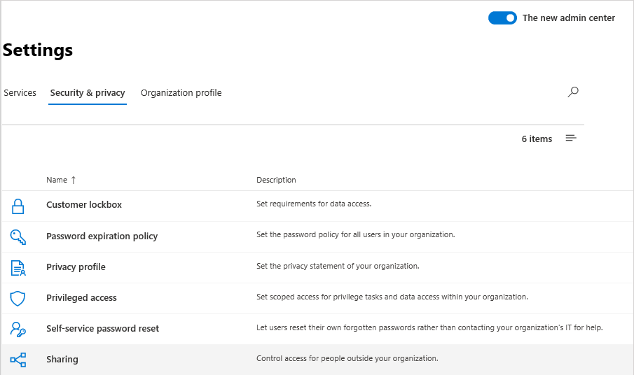
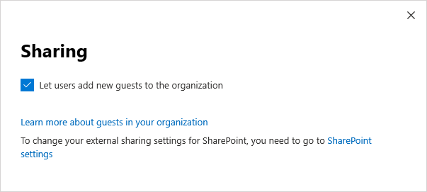

Liste de contrôle de l’accès invité Microsoft Teams
==========================================

Utilisez cette liste de vérification pour activer et configurer l’accès invité dans Microsoft Teams. Pour apporter ces modifications, vous devez être un administrateur général ou un administrateur Teams.

> [!IMPORTANT]
> Il est possible que les modifications ne prennent effet qu'après 24 heures. 

Regardez cette courte vidéo (5:31 minutes) pour découvrir comment activer l’accès invité dans Microsoft 365, y compris les équipes.

> [!VIDEO https://www.microsoft.com/videoplayer/embed/RE44NTr?autoplay=false]

## Étape 1 : activer l’accès invité au niveau de l’organisation à l’échelle de l’organisation

Pour activer l’accès invité, accédez au **Centre d’administration Microsoft Teams**. 

1. Dans le Centre d'administration Teams, sélectionnez **paramètres Org-wide** > **accès invité**.
2. Mettre le bouton bascule**Autoriser l’accès invité dans Microsoft Teams** sur **On**.

    

3. Sur cette même page, activez ou désactivez **Appel**, **Réunion** et **Messagerie** pour les invités.
4. Cliquez sur **Enregistrer**.

> [!TIP]
> Si vous utilisez les paramètres par défaut dans Azure Active Directory, SharePoint Online et Groupes Office 365, vous avez peut-être terminé la configuration de l’accès invité. Dans ce cas, vous pouvez ignorer le reste des étapes. Si vous n'êtes pas certain, ou si vous utilisez des paramètres personnalisés pour AAD, SharePoint Online ou Groupes Office 365, suivez les autres étapes de cette liste de contrôle.

## Étape 2 : configurer les paramètres interentreprises d'Azure AD

Il s’agit des paramètres Azure AD qui prennent en charge l’accès invité dans Teams. Une fois ces paramètres configurés, vous pouvez [ajouter](add-guests.md) et [gérer les invités](manage-guests.md) dans Teams.

1. Connectez-vous au [Portail Azure](https://portal.azure.com) entant qu’administrateur client.
2. Sélectionnez **Azure Active Directory** > **Utilisateurs** > **Paramètres utilisateur**.
3. Sous **Utilisateurs externes**, sélectionnez **Gérer les paramètres de collaboration externe**.
   > [!NOTE]
   > Les **Paramètres de collaboration externe** sont également disponibles dans la page **Relations organisationnelles**. Dans Azure Active Directory, sous **Gérer**, accédez à **Relations organisationnelles** > **Paramètres**.
4. Dans la page **Paramètres de collaboration externe**, sélectionnez les stratégies que vous voulez activer.

    - **Les autorisations des utilisateurs invités sont limitées** : cette stratégie détermine les autorisations des invités de votre annuaire. Sélectionnez **Oui** pour bloquer les invités de certaines tâches d’annuaire, comme l’énumération des utilisateurs, des groupes ou d’autres ressources d’annuaire. Sélectionnez **Non** pour donner aux invités les mêmes accès aux données d’annuaire que les utilisateurs réguliers dans votre annuaire.
     - **Les administrateurs et les utilisateurs membres du rôle Inviteur d’invités peuvent envoyer des invitations** : pour autoriser les administrateurs et les utilisateurs du rôle « Inviteur d’invités » à inviter des invités, attribuez la valeur **Oui**à cette stratégie.
     - **Les membres peuvent envoyer des invitations** : pour autoriser les membres non administrateurs de votre annuaire à convier des invités, attribuez la valeur **Oui** (recommandé) à cette stratégie. Si vous préférez que seuls les administrateurs puissent ajouter des invités, vous pouvez affecter la valeur **Non**à cette stratégie. Ne pas oublier que le paramètre **Non** limite l’expérience invité aux propriétaires d’équipes non administrateurs ; ils ne pourront ajouter des invités dans Teams que si ceux-ci ont déjà été ajoutés par l'administrateur dans Azure Active Directory.
     - **Les invités peuvent inviter** : pour autoriser les invités à inviter d’autres personnes, configurez cette stratégie sur **Oui**.
         > [!IMPORTANT]
         > Actuellement, Teams ne prend pas en charge le rôle d’inviteur invité. Par conséquent, même si vous définissez **Les invités peuvent inviter** sur **Oui**, les invités ne peuvent pas avoir d’autres invités dans Teams.
     - **Activer le code secret à usage unique du courrier pour les invités (préversion)** : pour plus d’informations sur la fonctionnalité code secret unique, consultez[Authentification par code secret unique (préversion)](https://docs.microsoft.com/azure/active-directory/b2b/one-time-passcode).
     - **Restrictions de collaboration** : pour plus d’informations sur l’autorisation ou le blocage d’invitations à des domaines spécifiques, consultez [Autoriser ou bloquer des invitations à des utilisateurs B2B d’organisations spécifiques](https://docs.microsoft.com/azure/active-directory/b2b/allow-deny-list).
        > [!NOTE]
        > Pour plus d’informations sur les restrictions de collaboration, consultez [Activer la collaboration externe B2B et gérer les utilisateurs pouvant inviter des invités](https://docs.microsoft.com/azure/active-directory/b2b/delegate-invitations).
      
    Pour plus d’informations sur le contrôle de qui peut ajouter des invités, voir [Permettre une collaboration B2B externe et gérer qui peut inviter des invités](https://docs.microsoft.com/azure/active-directory/b2b/delegate-invitations).

## Étape 3 : configurer les Groupes Office 365

1. Dans le Centre d’administration Microsoft 365, accédez à **Paramètres** > **Paramètres**, cliquez sur **Services**, puis sélectionnez **Groupes Office 365**.

     
2. Assurez-vous que la case à cocher **Permettre aux membres du groupe extérieurs à l’organisation d’accéder au contenu du groupe** est activée. Si ce paramètre n’est pas sélectionné, les invités ne pourront pas accéder au contenu du groupe.

    
3. Assurez-vous que la case à cocher **Permettre aux propriétaires de groupe d’ajouter des personnes en dehors de l’organisation aux groupes** est activée. Si ce paramètre n’est pas sélectionné, les propriétaires d’équipe ne peuvent pas ajouter de nouveaux invités. Au minimum, ce paramètre doit être activé pour prendre en charge l’accès invité.

Pour obtenir des instructions détaillées sur la configuration de ces paramètres, consultez [Gérer l’accès invité dans les Groupes Office 365](https://support.office.com/article/manage-guest-access-in-office-365-groups-9de497a9-2f5c-43d6-ae18-767f2e6fe6e0?appver=MOE150) et [contrôler l’accès invité dans les Groupes Office 365](Teams-dependencies.md#control-guest-access-in-office-365-groups).

## Étape 4 : configurer le partage dans Office 365 

Assurez-vous que les utilisateurs peuvent ajouter des invités. Voici comment procéder :

1. Dans le Centre d’administration Microsoft 365, accédez à **Paramètres** > **Paramètres**, cliquez sur **Sécurité et confidentialité**, puis sélectionnez **Partage**.

     
 
2. Activez la case à cocher **Permettre aux utilisateurs d’ajouter des invités à cette organisation**, puis cliquez sur **Enregistrer les modifications**.

     
 
    > [!NOTE]
    > Ce paramètre équivaut au paramètre **Les membres peuvent inviter** dans **Paramètres de l’utilisateur** > **Utilisateurs externes** dans Azure AD.  

## Étape 5 : vérifier le paramètre de partage dans SharePoint

1. Connectez-vous au Centre d’administration Microsoft 365.
2. Sous **Centres d’administration**, sélectionnez **SharePoint**.
3. Dans le nouveau Centre d’administration SharePoint, sous**Sites** sélectionnez **sites actifs**.

    

3. Sélectionnez le site, puis cliquez sur **Partage**.
4. Assurez-vous que l’option **Tout le monde** ou **Invités nouveaux et existants** est activée.

     

## Étape 6 : configurer les autorisations d’utilisateur invité

Dans l’application Teams, au niveau de l’équipe, configurez des autorisations invité qui contrôlent la possibilité pour les invités de créer, mettre à jour ou supprimer des canaux. Les administrateurs Teams et les propriétaires d’équipe peuvent configurer ces paramètres.

Pour en savoir plus sur l’accès invité, consultez [l’accès invité dans Teams](guest-access.md) et [Activer ou désactiver l’accès invité à Microsoft Teams](set-up-guests.md).

## Résolution des problèmes

Si vous rencontrez des problèmes lors de la configuration de l’accès invité ou de l’ajout d’invités dans Teams, utilisez ces ressources pour vous aider :

[Résolution des problèmes liés à l’accès invité dans Microsoft Teams](troubleshoot-guest-access.md)

[Résolution des problèmes de Teams](https://docs.microsoft.com/MicrosoftTeams/troubleshoot/)
