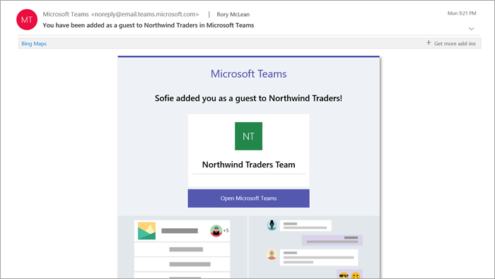

# Expérience de l’invité dans Microsoft Teams

Lorsqu'un invité est convié à rejoindre une équipe, il reçoit un e-mail de bienvenue. Le message inclut des informations sur l'équipe et explique ce à quoi s’attendre maintenant qu'il est membre. L’invité doit accepter l’invitation en sélectionnant **Ouvrir Microsoft Teams** dans l’e-mail avant de pouvoir accéder à l'équipe et à ses canaux.
    

    
Tous les membres de l'équipe voient un message dans le fil des canaux informant que le propriétaire de l'équipe a ajouté un invité et indiquant son nom. Tous les membres de l'équipe peuvent identifier facilement les utilisateurs qui sont invités. Une balise dans le coin supérieur droit du thread de canal indique le nombre d’invités de l’équipe et une étiquette **(Invité)** apparaît près du nom de chaque invité.

Découvrez ces vidéos sur l’expérience de l’invité dans Teams :
- [Participer à Teams réunion en tant qu’invité](https://support.microsoft.com/office/join-a-teams-meeting-078e9868-f1aa-4414-8bb9-ee88e9236ee4)
- [Travailler avec des invités externes dans une Teams réunion](https://support.microsoft.com/office/work-with-external-guests-180ed260-d3ef-4247-9f24-1984fc76d5f0)

## Comparaison des fonctionnalités d’un membre de l’équipe et d’un invité

Le tableau suivant compare la fonctionnalité Teams disponible pour les membres d’une équipe dans une organisation et ses invités. Les administrateurs Teams contrôlent les fonctionnalités disponibles pour les invités.

| Fonctionnalité dans Teams | Utilisateur Teams dans l'organisation | Invité |
|:-----|:-----|:-----|
|Créer un canal     *Les propriétaires d'équipe contrôlent ce paramètre.*    |&#x2713;|&#x2713;|
|Participer à une conversation privée    |&#x2713;|&#x2713;|
|Participer à une conversation dans un canal    |&#x2713;|&#x2713;|
|Publier, supprimer et modifier des messages    |&#x2713;|&#x2713;|
|Partager un fichier du canal    |&#x2713;|&#x2713;|
|Accéder aux fichiers SharePoint  |&#x2713;|&#x2713;|
|Joindre des fichiers  |&#x2713;|Publications de canal uniquement|
|Télécharger des fichiers de conversation privés  |&#x2713;|&#x2713;|
|Effectuer une recherche dans des fichiers  |&#x2713;||
|Partager un fichier de conversation    |&#x2713;||
|Ajouter des applications (onglets, bots ou connecteurs)    |&#x2713;||
|Créer des réunions ou accéder à des plannings    |&#x2713;||
|Accéder au stockage OneDrive Entreprise    |&#x2713;||
|Créer des stratégies d'accès invité aux canaux/équipes et au niveau du client    |&#x2713;||
|Inviter un utilisateur extérieur au domaine Microsoft 365 ou Office 365 de l’organisation    *Les propriétaires d'équipe contrôlent ce paramètre.*      |&#x2713;||
|Créer une équipe    |&#x2713;||
|Découvrir et rejoindre une équipe publique    |&#x2713;||
|Afficher l'organigramme    |&#x2713;||
|Utiliser la traduction associée    |&#x2713;||
|Devenir un propriétaire d’équipe    |&#x2713;||

Le tableau suivant affiche les fonctionnalités d’appel et de réunion disponibles pour les invités par rapport à d’autres types d’utilisateurs.

| Fonctionnalités d'appel | Invité | Utilisateur E1 et E3 | Utilisateur vocal Entreprise et E5 |
| --------------- | ----- | -------------- | -------------- |
| Appel VOIP | Oui | Oui | Oui |
| Appel de groupe | Oui | Oui | Oui |
| Principaux contrôles d’appel pris en charge (mettre en attente, désactiver le son, activer/désactiver la vidéo, partage d’écran) | Oui | Oui | Oui |
| Transférer la cible | Oui | Oui | Oui |
| Peut transférer un appel | Oui | Oui | Oui |
| Peut effectuer un transfert consultatif | Oui | Oui | Oui |
| Peut ajouter d’autres utilisateurs à un appel via VOIP | Oui | Oui | Oui |
| Peut ajouter des utilisateurs à un appel via un numéro de téléphone | Non | Non | Oui |
| Transférer la cible | Non | Oui | Oui |
| Appeler la cible du groupe | Non | Oui | Oui |
| Cible sans réponse | Non | Oui | Oui |
| Peut être la cible d’un appel fédéré | Non | Oui | Oui |
| Peut passer un appel fédéré | Non | Oui | Oui |
| Peut immédiatement transférer ses appels | Non | Non | Oui |
| Peut faire sonner simultanément ses appels | Non | Non | Oui |
| Peut acheminer ses appels sans réponse | Non | Non | Oui |
| Les appels manqués peuvent être redirigés vers la messagerie vocale | Non | Non1 |Oui |
| Dispose d’un numéro de téléphone pouvant recevoir des appels | Non | Non | Oui |
| Peut composer des numéros de téléphone | Non | Non | Oui |
| Peut accéder aux paramètres d’appel | Non | Non | Oui |
| Peut modifier le message d'accueil de la messagerie vocale | Non | Non1 | Oui |
| Peut changer de sonnerie | Non | Non  | Oui |
| Prend en charge le mode téléscripteur | Non | Non | Oui |
| Peut avoir des délégués | Non | Non | Oui |
|  Peut être un délégué | Non | Non | Oui |

1 Cette fonctionnalité sera bientôt disponible.

> [!NOTE]
> **Restrictions de l’accès des utilisateurs invités** : stratégie dans Azure Active Directory qui détermine les autorisations pour les invités de votre annuaire. Trois options de stratégie sont disponibles.
>  - Le paramètre **Les utilisateurs invités ont le même accès que les membres (le plus inclusif)** signifie que les invités disposent du même accès aux données d’annuaires que les utilisateurs réguliers dans votre annuaire.
>  - Le paramètre **Les utilisateurs invités ont un accès limité aux propriétés et à l’appartenance des objets d’annuaire** signifie que les invités n’ont pas d’autorisations pour certaines tâches d’annuaire, telles que l’énumération des utilisateurs, des groupes ou d’autres ressources d’annuaire à l’aide de Microsoft Graph.
>  - Le paramètre **L’accès des utilisateurs invités est limité aux propriétés et aux appartenances de leurs propres objets d’annuaire (le plus restrictif)** signifie que les invités peuvent uniquement accéder à leurs propres objets d’annuaire.
>
>Pour plus d’informations, voir [Quelles sont les autorisations par défaut de l’utilisateur dans Azure Active Directory ?](/azure/active-directory/fundamentals/users-default-permissions)

## Sujets associés

[Quitter une organisation en tant qu’invité](/azure/active-directory/b2b/leave-the-organization)

[Utiliser l’accès invité et l’accès externe pour collaborer avec des personnes extérieures à votre organisation](communicate-with-users-from-other-organizations.md)
